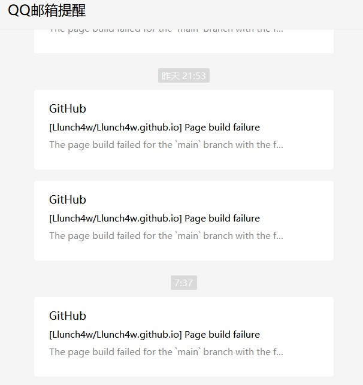

 ^ _ ^ 
<!-- more -->

&nbsp;&nbsp;&nbsp;&nbsp;大概一年以前，我一时兴起部署了这个个人博客，陆陆续续也写了一些文章，虽然看上去（实际也是）质量低劣，写的都是一些拾人牙慧的文章，就连个签都是抄的歌名...不过我并没有在意这一点，因为我的博客别人也无法通过互联网看到，甚至我自己都看不到呢 ^ _ ^ 原因是这样的，我是用 hexo 搭建博客，然后利用 github 进行部署，但是国内访问 github 非常慢，到后期甚至间歇性无法访问，访问自己的博客还要碰运气的情况我可没耐心，就很长一段时间没有把新写的文章同步到 github 上。都是在本地写些无人看到的文章自嗨... 自然就不在意质量了，毕竟是写给自己看的东西，自己能看懂不就好了嘛 ^ _ ^

&nbsp;&nbsp;&nbsp;&nbsp;直到最近，我买了一个服务器，一系列人民币玩家操作后已经可以丝滑访问 github 了，然后我就想着让我的小博客见见光好了，况且我正好想玩玩很久没有打开过的 Github Desktop。可惜，天不遂人愿，奇奇怪怪的 bug 总能找上我。

&nbsp;&nbsp;&nbsp;&nbsp;经过好几次尝试失败仍对解决这个问题毫无思路后，我打算放弃 github 部署，改为把小博客部署到我的服务器上，毕竟我可是有部署博客到阿里云的成功经验，甚至还写了记录博客。那时的心理活动：感谢当时勤劳记录博客的我。按照着我的小博客一路丝滑操作，直到最后，本地hexo文件部署到服务器上时发现竟然部署不上去，但也没什么错误提示。变化后的心理活动：当你觉得写自己能看懂的博客就够了时，最后你就会发现你自己也看不懂。或者你以为你懂了，但现实告诉你“不，你不懂”。

&nbsp;&nbsp;&nbsp;&nbsp;当事态进展到这一步的时候，我想：这是我一个论文还没改完的人应该继续深究的问题吗？但是临走之前仍想再尝试一次 github 部署，竟然玄学的成功了。Really lucky！