 ^ _ ^ 
<!-- more -->

# 环境安装

**CentOS上环境安装的4中方式**
1. rpm安装
2. 解压缩安装
3. yum在线安装
4. 宝塔安装

**实验安装目标**
1. rpm安装jdk
2. 解压缩安装tomcat
3. yum安装docker
4. 宝塔安装mysql


# rpm安装jdk

**1. 去Oracle官网下载jdk8的rpm**

jdk8下载页：[https://www.oracle.com/java/technologies/javase/javase-jdk8-downloads.html](https://www.oracle.com/java/technologies/javase/javase-jdk8-downloads.html)

我下载的是这个Linux64位的rpm

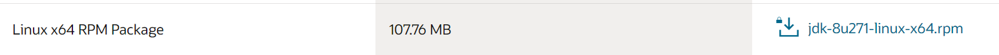


**2. 通过XFtp工具将rpm文件放入当前用户的目录下**

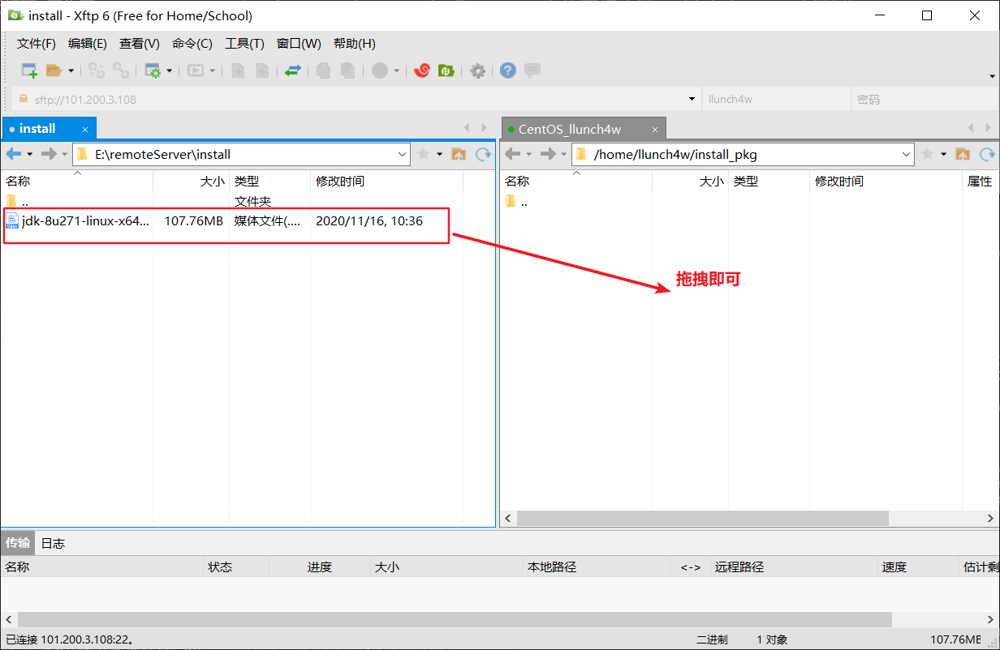

传输成功后如下图所示：
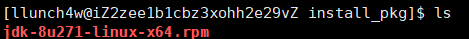


**3. 安装Java环境**

3.1. 查看当前系统是否存在Java环境
```
java -version
```

若已有的话则进行卸载
```
# 检测JDK版本信息
rpm -qa | grep jdk
# -q query
# -a all: query all installed packages
> 得到的结果为一个jdk号

# 卸载jdk
rpm -e --nodeps 上一步查出的jdk号
# -e
# --nodeps：Dont't verify dependencies of packages
```

3.2. 通过rpm命令安装Java环境
```
rpm -ivh rpm文件名

# -i install
# -v print
# -h hash
```

ps：注意要使用root用户才有安装权限
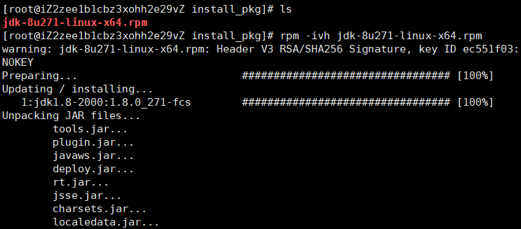


3.3. 配置环境变量

**安装成功的Java文件保存在\usr目录下**
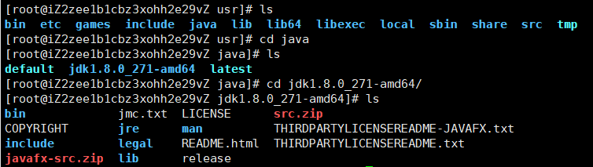

**1. 进入 /etc/profile**
```
vim /etc/profile
```

**2. 在文件末尾添加配置**
```
JAVA_HOME=/usr/java/jdk1.8.0_271-amd64
CLASSPATH=%JAVA_HOME%/lib/tools.jar:%JAVA_HOME%/jre/lib/dt.jar:.
PATH=$PATH:$JAVA_HOME/bin:$JAVA_HOME/jre/bin
export PATH CLASSPATH JAVA_HOME
```

**3. 让配置文件生效**
```
source /etc/profile
```

# 解压缩安装Tomcat

**1. 去官网下载tomcat安装包**

tomcat9.0.39下载页面：[https://tomcat.apache.org/download-90.cgi#9.0.39](https://tomcat.apache.org/download-90.cgi#9.0.39)


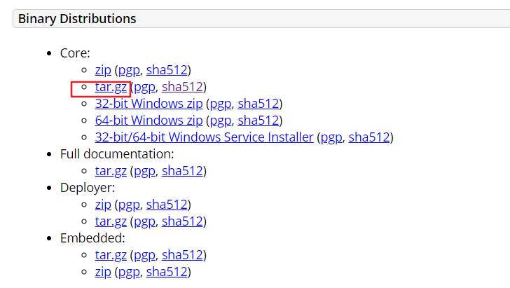


**2. 通过XFtp将安装包传送到服务器**

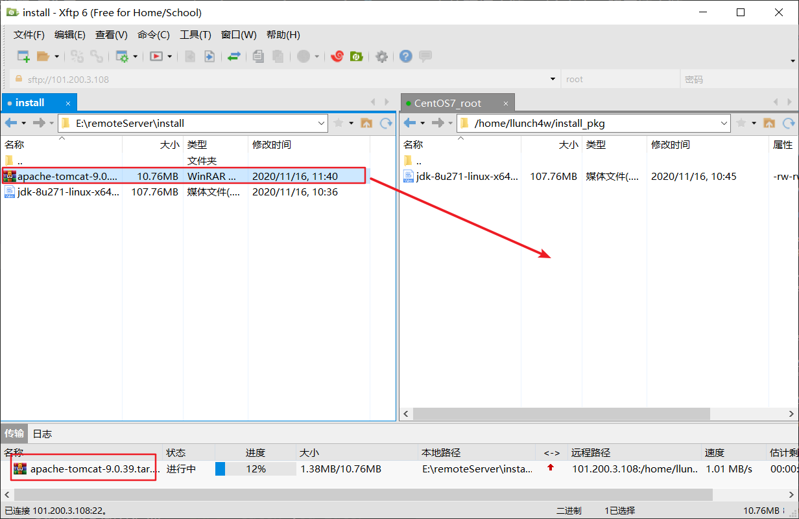

**3. 解压安装包**

```
tar -zxvf 安装包名称
```

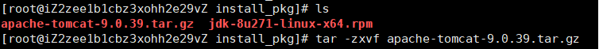

> 我将解压得到的文件夹移到 /etc/opt目录下了

**4. 启动测试**

- Linux中的可执行文件为.sh文件
- tomcat解压后启动文件存放在bin目录中

**启动和关闭脚本**
```
./startup.sh # 启动服务器
./shutdown.sh # 关闭服务器
```

**查看启动日志（可选）**
```
cd logs/
tail -f catalina.out
```

**访问Tomcat需要通过8080端口**
服务器端：
```
# 开启8080端口
firewall-cmd --zone=public --add-port=8080/tcp --permanent

# 重启防火墙
systemctl restart firewalld.service

# 检查是否已开放8080
firewall-cmd --list-ports
```

阿里云端：配置安全组规则，添加8080端口


**5. 成功页面**
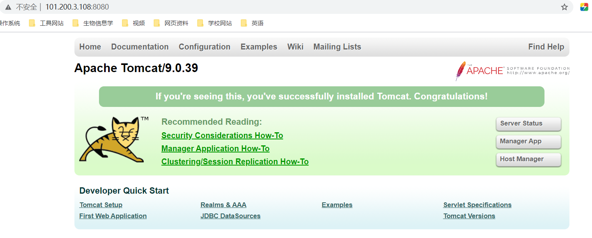


# yum安装docker

**1. 检测当前CentOS版本信息**
```
cat /etc/redhat-release
```

**2. 安装环境**
```
yum -y install 包名
```

安装gcc相关环境
```
yum -y install gcc
yum -y install gcc-c++
```

**3. 根据docker官网文档进行操作**

docket官方文档地址：[https://docs.docker.com/engine/install/centos/](https://docs.docker.com/engine/install/centos/)

3.1. 卸载旧版本
```
yum remove docker \
    docker-client \
    docker-client-latest \
    docker-common \
    docker-latest \
    docker-latest-logrotate \
    docker-logrotate \
    docker-engine
```

3.2. 安装需要的软件包
```
yum install -y yum-utils device-mapper-persistent-data lvm2
```

3.3. 设置stable镜像仓库
```
yum-config-manager \
    --add-repo \
    https://mirrors.aliyun.com/docker-ce/linux/centos/docker-ce.repo
```

3.4. 更新yum软件包索引
```
yum makecache fast
```

3.5. 安装docker ce
```
yum -y install docker-ce docker-ce-cli containerd.io
```

3.6. 启动docker
```
systemctl start docker
```

3.7. 测试
```
docker version
docker run hello-word
docker images
```

关闭docker
```
docker service docker stop
```

# 宝塔安装mysql

**1. 进入宝塔面板的软件商店安装mysql**


我选择的是mysql5.6

**2. 在数据库面板添加一个数据库**

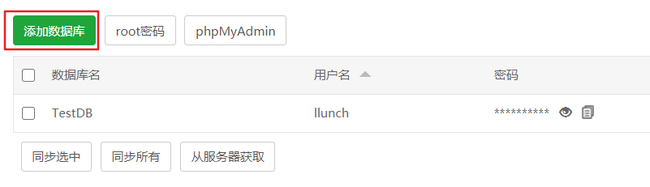

访问权限应该设置为所有人
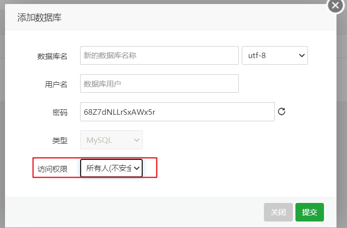


**3. 在本地通过navicat连接服务器数据库**

3.1. 点击新建连接
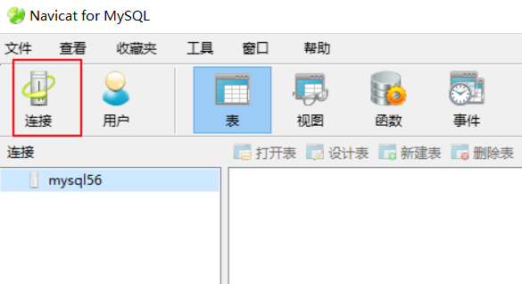

3.2. 连接配置
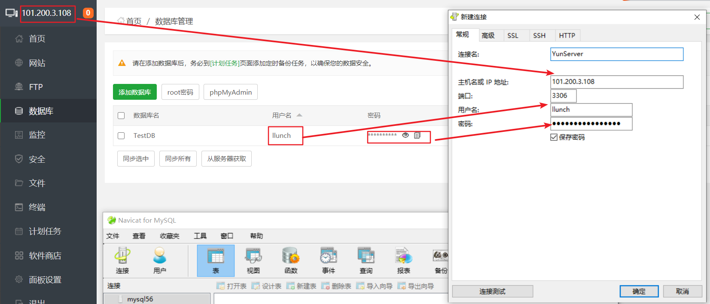

