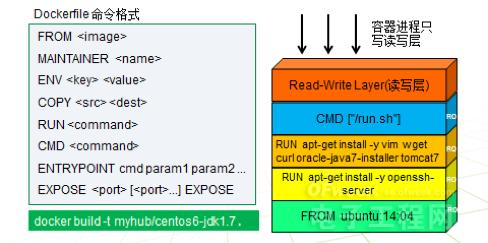

 ^ _ ^ 
<!-- more -->

# Docker简介

- Docker是一个开源的容器引擎，基于GO语言开发
- Docker可以让开发者打包它们的应用及环境到一个轻量级、可移植的容器中，然后发布到任何流行的Linux机器上
- Docker也可实现虚拟化，其相较于传统虚拟机的最大优点是Docker很轻巧，性能开销极低
- 容器是完全使用沙箱机制，相互之间不会有任何借口
- 每个容器可以理解为一个精简的linux系统

## Docker架构


- **镜像（Images）**：用于创建容器的模板
- **容器（Container）**：独立运行的一个或多个应用，通过镜像创建
- **仓库（Registry）**：代码仓库，用于保存镜像
  - Docker Hub 中提供了大量镜像集合
  - 一个Docker Registry中可以包含多个 _Repository_ , 每个 _Repository_ 中包含多个标签（ _Tags_ ），每个标签对应一个镜像（ _images_ ）
- **Docker 客户端（Client）**：Docker客户端通过命令行或其他工具使用 Docker SDK 与 Docker 的守护进程进行通信
- **Docker 主机（HOST）**：一个物理的或虚拟的机器用于执行Docker的守护进程
- **Docker Machine**：简化Docker安装的命令行工具

# Docker资料

Docker 官网：[https://www.docker.com/](https://www.docker.com/)

Docker Doc：[https://docs.docker.com/](https://docs.docker.com/)

Docker Hub：[https://hub.docker.com/](https://hub.docker.com/)

狂神教程：[https://www.bilibili.com/video/BV1og4y1q7M4](https://www.bilibili.com/video/BV1og4y1q7M4)

# Docker安装

**1. 环境查看**
```
# 确保内核版本在3.10以上
uname -r

# 查看操作系统信息
cat /etc/os-release
```

**2. 按照docker doc上的教程安装**

docker安装过程在博文 _CentOS上的环境安装_ 中有写，[去往博文](http://101.200.3.108/2020/11/16/CentOS%E4%B8%8A%E7%9A%84%E7%8E%AF%E5%A2%83%E5%AE%89%E8%A3%85/)


**docker的资源目录**
_/var/lib/docker_


**3. 阿里云镜像加速**

（1）进入阿里云的容器服务


（2）选择镜像加速器，按照CentOS操作文档进行配置


# Docker命令


## 帮助命令

查看docker版本
```
docker version
```

查看docker系统信息
```
docker info
```

命令的帮助文档
```
docker [命令] --help
```

## 镜像命令

查看docker镜像
```
docker images [选项]
```

搜索镜像
```
docker search 镜像名称 [选项]

# 可选项
--filter=过滤条件
```

下载镜像
```
docker pull 镜像名称[:tag]

# 可通过tag实现指定版本下载
```

删除镜像
```
docker rmi 镜像名称
```

查看镜像构建历史
```
docker history 镜像ID
```

## 容器命令

新建容器并启动
```
docker run [选项] image

# 选项
--name=容器名称      设置容器名称
-d                  后台方式运行
-it                 使用交互方式运行，进入容器查看内容
-p                  指定容器端口映射
-P                  随机端口映射
```

退出并停止容器
```
exit
```

退出但不停止容器
```
Ctrl + p + q
```

查看正在运行的容器
```
docker ps
```

删除容器
```
# 删除指定容器
docker rm 容器id [选项]

# 选项
-f # 强制删除

# 删除所有容器
docker rm -f $(docker ps -aq)
```

启动和删除容器
```
docker start 容器id #启动容器
docker restart 容器id #重启容器
docker stop 容器id #停止容器
docker kill 容器id #停止容器
```

查看容器日志
```
docker logs [选项] 容器ID

# 可选项
-tf             #显示日志
--tail number   #指定要显示的条数
```

查看容器中的进程信息
```
docker top 容器id
```

查看镜像的元数据
```
docker inspect 容器ID
```

进入正在运行的容器
```
# 方式一：进入容器后开启一个新的终端（常用）
docker exec -it 容器ID

# 方式二：进入容器当前的终端，不会开启一个新的线程
docker attach 容器ID
```

从容器内拷贝文件到主机
```
docker cp 容器ID:文件路径 主机文件路径
```

查看docker运行状态
```
docker status
```

提交容器称为一个新的镜像
```
docker commit -m "提交的描述信息" -a "作者" 容器ID 目标镜像:TAG
```
实例测试


## 数据卷

**查看volume**
```
docker volume ls
```

**查看vlome配置信息**
```
docker volume inspect 卷名称
# 所有docker容器的卷，没有指定目录的情况下都是在 /var/lib/docker/volumes/xxxx_data
```

**挂载数据卷**
（1）方法1：直接使用命令挂载
```
# 指定路径挂载
docker run -v 主机目录:容器内目录[:读写选项] 容器ID

# 具名挂载（常用）
docker run -v volume名称:容器内目录[:读写选项] 容器ID

# 匿名挂载
docker run -v 容器内目录[:读写选项] 容器ID

# 读写选项
ro : readonly
rw : readwrite
```

（2）方法二：通过DockerFile来构建
```
1. 创建一个放置dockerfile脚本的文件夹并在其中建立一个dockerfile脚本
mkdir /home/docker-test-volume
touch dockerfile01

2. 编写dockerfile脚本
vim dockerfile01

3. 构建dockerfile
docker build -f dockerfile01 -t llunch4w/centos:1.0 .
```

dockerfile01 内容
```
# 文件中的指令都是大写
# 这里的每个命令就是镜像的一层

FROM centos

VOLUME ["volume01","volume02"]

CMD echo "-----end------"
CMD /bin/bash
```


4.通过上文创建的镜像创建一个容器并运行


5.此时采用的是匿名挂载，主机上一定有一个卷与其对应

```
# 查看卷挂载的路径
docker inspect 容器ID
```

查找Mounts内容即可找到对应的卷


**多个容器共享数据**
```
# docker2将复制docker1的挂载数据卷，两个数据卷之间的数据是同步变化的
# 即使之后docker1被删除，docker2挂载的数据卷也不会消失
docker run -it --name docker2 --volumes-from docker1
```


# 实例

## docker运行centos

**1. 下载centos镜像**
```
docker pull centos
```

**2. 创建并运行centos容器**
```
docker run -it centos /bin/bash
```

## docker运行nginx

**1. 查找nginx镜像**

方法一：通过 Docker Hub的搜索框进行查找。包括多个版本可供下载，这里我选择1.18.0


方法二：命令行搜索
```
docker search nginx
```

**2. 拉取镜像**
```
docker pull nginx:1.18.0
```

**3. 启动nginx**
```
docker run -d --name nginx01 -p 3344:80 nginx:1.18.0
# -d：后台运行
# --name：设置docker名称
# -p：指定端口映射，这个docker的80端口映射到主机的3344端口，80端口是nginx的默认访问端口
```

**4. 访问nginx**
```
curl localhost:3344
```

**5. （可选）配置阿里云安全组**
安全组开放端口3344。
配置完成后，就可以通过访问 [https://101.200.3.108:3344](https://101.200.3.108:3344) 来外网访问容器中部署好的nginx了。

**6. （可选）进入docker查看nginx配置信息**
```
docker exec -it nginx01 /bin/bash

# 已进入docker后
whereis nginx
```

## docker运行tomcat

```
1. 拉取镜像
docker pull tomcat

2. 启动容器
docker run -d tomcat --name tomcat01 -p 8001:80

3. 进入容器，为webapp中添加内容
docker exec -it tomcat01 /bin/bash
cd /usr/local/tomcat
cp -r webapps.dist/* webapps/
```

## docker运行mysql
> 重点是使用容器挂载技术解决mysql数据持久化问题
> 不能将数据存储到容器中，因为这样会导致容器消失时数据跟着消失

```
1. 下载mysql镜像
docker pull mysql:5.7

2. 启动MySQL容器
docker run -d -p 8001:3306 -v /home/mysql/conf:/etc/mysql/conf.d -v /home/mysql/data:/var/lib/mysql -e MYSQL_ROOT_PASSWORD=MyNewPass --name mysql01 mysql:5.7
# ps：主机映射端口8001应该已在安全组中添加，否则无法访问

3. 本地使用navicat连接数据库101.200.3.108:8001

4. 本地创建一个数据库，测试文件路径
```

## 构建自己的centos镜像

**1.创建一个dockerfile文件**
```
mkdir /home/dockerfile
cd /home/dockerfile
vim myCentOS_dockerfile
```

**2.编写myCentOS_dockerfile文件**
```
FROM centos
MAINTAINER llunch4w<1220296312@qq.com>

ENV MYPATH /usr/local
WORKDIR $MYPATH

RUN yum install -y vim
RUN yum install -y net-tools

EXPOSE 80

CMD echo $MYPATH
CMD echo "---end---"
CMD /bin/bash
```

**3.构建dockerfile文件**
```
docker build
```

**4.测试运行**
```
docker run -it --name mycentos01 mycentos:1.0 /bin/bash
```

## 构建自己的tomcat镜像

**1. 准备tomcat压缩包和jdk压缩包**
- 分别从tomcat官网和oracle官网上下载tomcat9的安装包和jdk8的安装包
- 通过Xftp工具将下载好的安装包传输到服务器上


**2. 创建readme.txt**
```
touch readme.txt
```

**3. 编写dockerfile文件**
> Dockerfile是官方命令，build会自动寻找这个文件，就不需要 -f 指定了

```
vim Dockerfile

# Dockerfile内容
FROM centos
MAINTAINER llunch4w<1220196312@qq.com>

COPY readme.txt /usr/local/readme.txt

ADD jdk-8u271-linux-x64.tar.gz /usr/local/
ADD apache-tomcat-9.0.39.tar.gz /usr/local/

RUN yum -y install vim

ENV MYPATH /usr/local
WORKDIR $MYPATH

ENV JAVA_HOME /usr/local/jdk1.8.0_271
ENV CLASSPATH $JAVA_HOME/lib/dt.jar:$JAVA_HOME/lib/tools.jar
ENV CATALINA_HOME /usr/local/apache-tomcat-9.0.39
ENV CATALINA_BASH /usr/local/apache-tomcat-9.0.39
ENV PATH $PATH:$JAVA_HOME/bin:$CATALINA_HOME/lib:CATALINA_HOME/bin

EXPOSE 8080

CMD /usr/local/apache-tomcat-9.0.39/bin/startup.sh && tail -F /usr/local/apache-tomcat-9.0.39/bin/logs/catalina.out
```

**4. 通过dockerfile构建镜像**
```
docker build -t mytomcat .
```

**5. 创建并启动容器**
```
docker run -d -p 8001:8080 --name mytomcat01 \
-v /home/dockerfile/tomcat/test:/usr/local/apache-tomcat-9.0.39/webapps/test \
-v /home/dockerfile/tomcat/tomcat.logs:/usr/local/apache-tomcat-9.0.39/logs \
mytomcat
```

**6. 访问测试**

浏览器访问：[https://101.200.3.108:8001](https://101.200.3.108:8001) ，将跳转到tomcat首页


**7. 发布项目**
```
cd /home/dockerfile/tomcat/test

mkdir WEB-INF

cd WEB-INF

vim web.xml

# web.xml中添加如下内容
<?xml version="1.0" encoding="UTF-8"?>
<web-app version="2.4" 
    xmlns="http://java.sun.com/xml/ns/j2ee" 
    xmlns:xsi="http://www.w3.org/2001/XMLSchema-instance"
    xsi:schemaLocation="http://java.sun.com/xml/ns/j2ee 
        http://java.sun.com/xml/ns/j2ee/web-app_2_4.xsd">
</web-app>

cd /home/dockerfile/tomcat/test

vim index.jsp

# index.jsp中添加如下内容
<html>
<head><title>Hello World</title></head>
<body>
Hello World!<br/>
<%
out.println("----my test web logs------");
%>
</body>
</html>
```

## 发布镜像

**方法一：发布镜像到 Docker Hub**

（0）拥有 Docker Hub 账号
Docker Hub网址：[https://hub.docker.com/](https://hub.docker.com/)

（1）登陆 Docker Hub
```
docker login -u llunch
```

（2）上传镜像
```
# 列举所有镜像，以确定要上传的镜像
docker images

REPOSITORY          TAG                 IMAGE ID            CREATED             SIZE
mytomcat            latest              bf0a93c6e548        41 minutes ago      643MB

# 给mytomcat加tag
docker tag mytomcat llunch/mytomcat:1.0 # llunch为登录用户名

# 上传镜像
docker push llunch/mytomcat:1.0
```


_因为Docker Hub是外网，因此上传速度很慢_


**方法二：发布到阿里云容器服务**

（1）登陆到阿里云

（2）找到容器服务


（3）创建命名空间


（4）创建容器镜像

配置仓库信息


设置代码源为本地仓库


根据操作指南进行操作


（5）操作指南
```
1. 登陆阿里云的 Docker Registry
docker login --username=llunch registry.cn-beijing.aliyuncs.com

2. 为镜像添加tag
docker tag [ImageId] registry.cn-beijing.aliyuncs.com/llunch4w/repo_test:[镜像版本号]

3. 将镜像推送到Registry
docker push registry.cn-beijing.aliyuncs.com/llunch4w/repo_test:[镜像版本号]
```


## 部署Redis集群

待补充

## SpringBoot微服务打包成镜像

待补充

# Docker原理

## 镜像加载原理

**UnionFS（联合文件系统）**
- UnionFS是一种分层的、轻量级、高性能的文件系统
- 他支持对文件的修改作为一次提交来一层层叠加，同时可以将不同目录挂载到同一虚拟文件系统下
- UnionFS是docker镜像的基础：镜像可以通过分层来继承，基于基础镜像可以制作各种具体的应用镜像
- 特性：一次同时加载多个文件系统，但从外部看来只能看到一个文件系统。联合加载会将各层文件系统叠加起来，这样最终文件系统会包含所有的底层文件和目录。


- **bootfs**：Boot File System，主要包含bootloader和kernel，bootloader主要是引导加载kernel。当Boot加载完成后，整个内核就在内存中了，此时内存的使用权由bootfs转交给内核，系统会卸载bootfs。
- **rootfs**：Root File System，包含典型Linux系统中的/dev,/proc,/bin,/etc等标准目录和文件。rootfs就是各种不同操作系统的发行版，比如ubuntu,centos等。

**镜像特点**
- Docker镜像都是只读的，当容器启动时，一个新的可写层被加载到镜像的顶部
- 这个新的可写层被称为容器层，容器层之下的都叫镜像层


## 容器数据卷

容器数据卷是一种用于容器之间共享数据的技术，用于持久化保存数据，使得部分容器产生的数据（用户不希望随着容器关闭而随之消失的数据）可以保存下来
- 数据卷可以在容器之间共享数据
- Docker产生的数据，可以同步到本地
- 数据卷中的更改可以直接生效
- 数据卷的更改不会包含在镜像更新中
- 数据卷的生命周期一直持续到没有容器使用它为止


# Dockerfile

**构建步骤**
1. 编写一个dockerfile文件
2. docker build为一个镜像
3. docker run 运行镜像
4. docker push 发布镜像


**查看官方centos的dockerfile文件**

进入 Docker Hub 搜索 CentOS，点击一个具体的版本就可以跳转到官方git下的该版本centos页面


## Dockerfile命令

```
FROM        # 基础镜像，一切从这里开始构建；通常为操作系统
MAINTAINCER # 镜像是谁写的，姓名 + 邮箱
RUN         # 镜像构建时需要运行的命令
ADD         # 添加内容（如压缩包文件）
WORKDIR     # 镜像的工作目录
VOLUME      # 挂载的目录
EXPOSE      # 暴露端口
CMD         # 指定容器启动时要运行的命令，只有最后一个会生效，可被替代
ENTRYPOINT  # 指定容器启动时要运行的命令，可以追加命令
ONBUILD     # 当构建一个被继承的Dockerfile时，就会运行ONBUILD指令，触发指令
COPY        # 类似ADD，将文件拷贝到镜像中
ENV         # 构建的时候，设置环境变量
```




### CMD和ENTRYPOINT

> 编写程序验证CMD和ENTRYPOINT之间的差别

**1.构建cmdtest镜像并创建启动容器**
```
vim centos-cmd-test

# centos-cmd-test 添加如下内容
FROM centos
MAINTAINER llunch4w<1220296312@qq.com>

CMD ["ls","-a"]

# 通过dockerfile文件构建镜像
docker build -f centos-cmd-test -t cmdtest .

# 创建并运行容器
docker run cmdtest
```


**1.1 （扩展）追加一个命令 -l**
```
docker run cmdtest -l
# 本希望效果是执行 ls -al，而实际上会报错
```


**2.构建centos_entrypoint_test镜像并创建启动容器**
```
vim centos-entrypoint-test

# centos-entrypoint-test 添加如下内容
FROM centos
MAINTAINER llunch4w<1220296312@qq.com>

ENTRYPOINT ["ls","-a"]

# 通过dockerfile文件构建镜像
docker build -f centos-entrypoint-test -t entrypoint_test .

# 创建并运行容器
docker run entrypoint_test
```


**2.1 （扩展）追加一个命令 -l**
```
docker run entrypoint_test -l
# 成功执行出 ls -al 的效果
```


# Docker 网络

_清除原有的容器和镜像，保持一个干净的环境学习网络_
```
docker rm -f $(docker ps -aq)
docker rmi -f $(docker images -aq)
```

干净的环境


## 案例初感知

**1. 查看网卡**
```
ip addr
```


**2. 容器外ping容器内测试**

（1）创建并运行一个容器
```
docker run -d -P --name tomcat01 tomcat
```

（2）查看容器内部网络地址
```
docker exec -it tomcat01 ip addr
```


（3）尝试在主机端ping容器内部
```
ping 172.17.0.2
```


_结论：主机和容器之间可以ping通_


**3. 两个容器之间 ping 测试**

（1）创建并运行另一个容器
```
docker run -d -P --name tomcat02 tomcat
```

（2）查看容器内部网络地址
```
docker exec -it tomcat02 ip addr
```


（3）尝试在tomcat01容器里pingtomcat容器内部
```
# 进入tomcat01
docker exec -it tomcat01 /bin/bash
ping 172.17.0.3
```


_结论：同一主机下创建的容器之间可以ping通_

## 原理

### 主机与容器通信原理

1. 每启动一个docker容器，docker就会给docker容器分配一个ip。
2. 只要安装了docker，就会有一个docker0。
3. 使用的技术是 `evth-pair`

**evth-pair**

当创建一个新容器后，主机内就会多一块网卡，这个网卡与docker内部网卡是成对出现的


- evth-pair 就是一对虚拟设备接口，它们都是成对出现的：一段连着协议，一段彼此相连
- evth-pair 充当一个桥梁，连接各种虚拟网络设备


### 容器之间通信原理

- 容器之间通过 evth-pair 技术进行通信
- 容器共用一个路由器 `docker0` ，不过路由过程对于使用者来说是透明的，看起来就像两个容器之间通信一样
- 所有容器在不指定网络的情况下，都是docker0路由的。docker会给容器分配一个默认的可用ip。


### docker0与主机之间通信原理


- Docker使用的是Linux桥接。宿主机中是一个Docker容器的网桥docker0.
- Docker中所有的网络接口都是虚拟的（转发效率高）


## 查看网络信息

```
# 列出所有网络
docker network ls

# 探查特定网络
docker network inspect 网络ID
```


## 容器互联 --link

> 对于这样一个场景：我们编写了一个微服务，database url=ip;假设数据库ip换掉了，如何在项目不重启的前提下使微服务能访问到正确的数据库地址

答：在绑定ip时，不要使用具体的ip地址值，而是使用容器名

**直接使用容器名会报错**
```
docker exec -it tomcat02 ping tomcat01
```

**使用 --link成功**
```
docker run -d -P --name tomcat03 --link tomcat01 tomcat
```


**--link的原理就是更改了某个容器的配置文件**


这也凸显出--link的一个弊端，即它的link不是双向的，在tomcat01的/etc/host中并不存在tomcat03的地址映射。也就是说，tomcat01 ping tomcat03 是无法 ping 通的。


**结论：**
- 现在玩 Docker 已经不建议使用 --link 了
- 因为 docker0 具有不支持容器名连接访问的弊端
- 更优的解决方案是`自定义网络`


## 容器互联 自定义网络

_清理所有容器和镜像，保持干净的测试环境_
```
docker rm -f $(docker ps -aq)
```

**网络模式**

- bridge：桥接，docker默认
- none：不配置网络
- host：和宿主机共享网络
- container：容器连通（用的少，局限很大）

**实例**
```
# 启动一个tomcat容器并设置其网络模式为桥接
docker run -d -P --name tomcat01 --net bridge tomcat
```

### 创建网络

```
docker network create --driver bridge --subnet 192.168.0.0/16 \
--gateway 192.168.0.1 mynet
```

_通过以上自定义网络实现容器互联_

```
1. 创建两个tomcat容器，均加入自定义网络
docker run -d -P --name tomcat-net-01 --net mynet tomcat
docker run -d -P --name tomcat-net-02 --net mynet tomcat

2. 测试连通性
docker exec -it tomcat-net-01 ping tomcat-net-02
docker exec -it tomcat-net-02 ping tomcat-net-01
```


> 不同的集群使用不同的网络，有利于保证集群是安全和健康的

## 网络连通

> 实现不同网段的容器之间通信

```
docker network connect 网络名称 容器名称/ID
```

**实战**
```
目标：使docker0网络下的tomcat01可以与mynet网络下的tomcat-net-01通信

1. 打通 tomcat01 - mynet
docker network connect mynet tomcat01

2. 测试网络连通性
docker exec -it tomcat01 ping tomcat-net-01
docker exec -it tomcat-net-01 ping tomcat01
```


**原理**


- 连通的本质是将 tomcat01 放到了 mynet 网络下
- tomcat01 实际上被分配了两个ip，一个是docker0为其分配的，一个是mynet为其分配的
- 也就是说，通过一个容器多个ip的方式实现了容器与多个网络互连的技术

