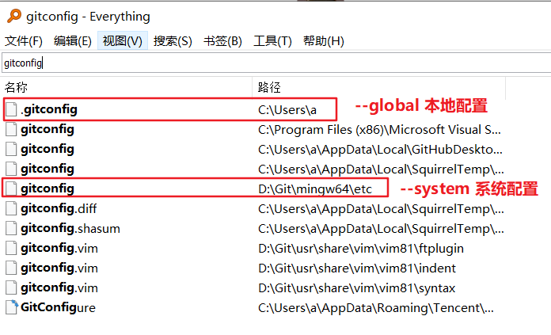
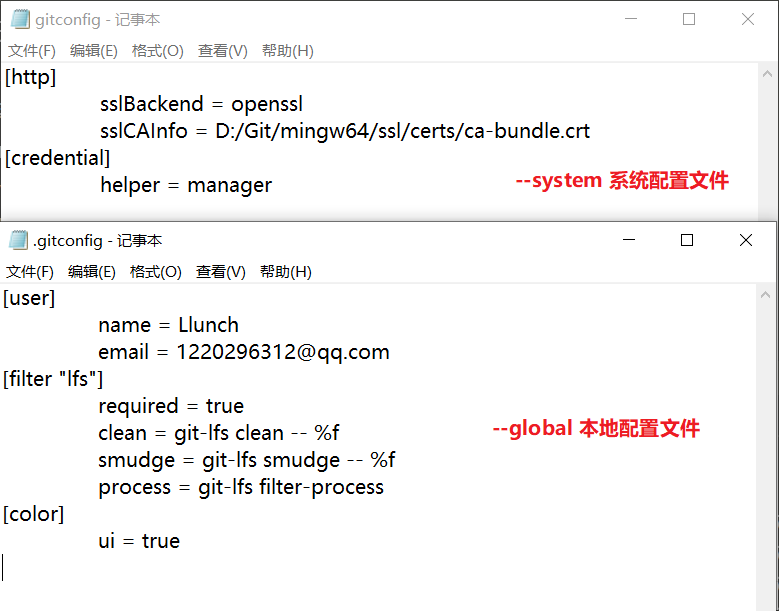
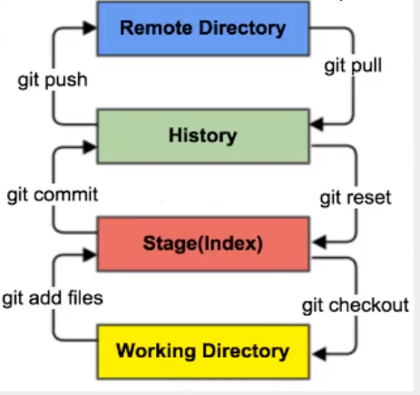
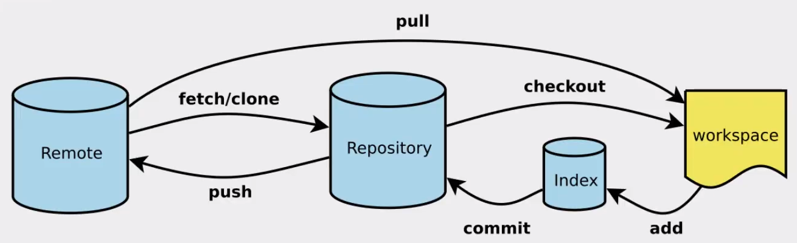
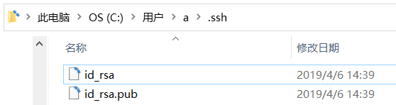

 ^ _ ^ 
<!-- more -->

# Git配置

1. 查看Git配置
```
git config [选项]
```

| 选项 | 功能 |
| --- | --- |
| -l | = --list 列出 |
| --global | 本地设置 |
| --system | 系统设置 |


2. 修改Git配置
```
git config [选项] 属性名 属性值

# 例子：git config user.name "llunch"
```

3. Git配置的本质还是修改配置文件






# Git工作原理

Git可分为四个工作区：
- 工作目录（Working Directory）：存放源代码
- 暂存区（Stage/Index）：临时存放改动信息；本质上是一个文件，保存即将提交到文件列表的信息
- 本地仓库（Repository）：安全存放数据的位置，保存用户提交到所有版本的数据
- 远程git仓库（Remote Directory）：托管代码的服务器





# Git命令

## 创建或克隆仓库

1. 创建本地Git仓库
```
git init
```

2. 克隆远程仓库
```
git clone 远程仓库地址
```

## Git文件操作

**文件的4种状态**
- `Untracked`：未跟踪；文件处于文件夹中，不参与版本控制
  - 通过`git add`状态变为`Staged`
- `Unmodify`：未修改；本库中的文件快照内容与文件夹中一致，不存在改动
  - 若它被修改，则变为`Modified`状态
  - 若使用`git rm`移出版本库，则变为`Untracked`状态
- `Modified`：已修改；仅仅是修改，没有进行其他操作
  - 通过`git add`可以进入`Staged`状态
  - 执行`git checkout`则丢弃修改，返回`Unmodify`状态
- `Staged`：暂存状态；
  - 执行`git commit`后，会将修改同步到库中；这时库中文件又变得和本地文件一致，成为`Unmodify`状态
  - 执行`git reset HEAD filename`取消暂存，文件状态变为`Modified` 




1. 查看文件状态
```
git status [filename]
```

2. 添加文件到暂存区
```
git add . # 添加所有文件到暂存区
```

3. 提交暂存区内容到本地仓库
```
git commit -m 提交信息
```

## 忽略文件

在项目主目录下建立`.gitignore`文件，此文件有如下规则：
- 文件中的空行和以#号开始的行会被忽略
- 可以使用Linux通配符
  - \* : 任意多个字符
  - ?  : 任意一个字符
  - \[abc\] : 可选字符范围
  - {String1,String2} : 可选字符串
- 如果名称最前面有一个!号，表示例外规则，将不被忽略
- 如果名称的最前面是一个路径分隔符 / ，表示要忽略的文件在此目录下，而子目录中的文件不能被忽略
- 如果名称的最后面是一个路径分割符 / ，表示要忽略的是此目录下该名称的子目录，而非文件

```
*.txt       # 忽略所有txt结尾的文件
!lib.txt    # 但lib.txt除外
/temp       # 仅忽略根目录下的TODO文件，不包括其他目录temp
build/      # 忽略build目录下的所有文件
doc/*.txt   # 会忽略doc/notes.txt但不会忽略doc/server/notes.txt
```

# 生成SSH公钥

1. 进入.ssh目录打开git


2. 生成密钥
```
ssh-keygen -t rsa
```

3. 生成成功后目录中添加两个文件




# Git分支

1. 列出所有本地分支
```
git branch
```

2. 列出所有远程分支
```
git branch -r
```

3. 新建分支
```
git branch 分支名称
```

4. 切换分支
```
git checkout -b 分支名称
```

5. 合并分支到当前分支
```
git merge 分支名称
```

6. 删除分支
```
git branch -d 分支名称
```

7. 删除远程分支
```
git push origin --delete 分支名称
git branch -dr 分支名称
```

