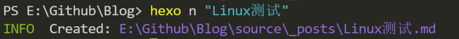
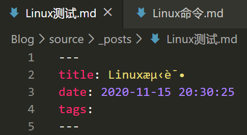
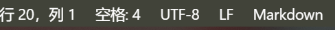
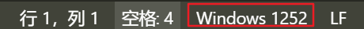
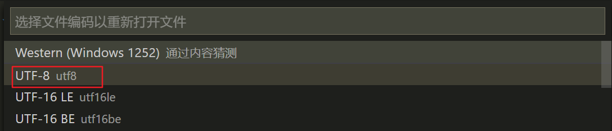
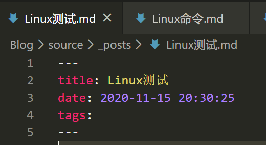

 ^ _ ^ 
<!-- more -->

**问题**：在hexo中新建文章时，如果文章名开头是英文，后面又跟着中文的话，就有可能出现中文乱码

**解决方案**
1. 首先，我的编辑器是VS Code，正确编码时其底部栏如下

正确编码时的底部栏

错误编码时的底部栏

2. 对于错误编码的底部栏，选择其编码项点击

3. 在弹出框中选择【通过编码重新打开】

4. 接着选择【UTF-8】

5. 恢复成功

