 ^ _ ^ 
<!-- more -->

# 安装nginx

**方法一**：通过宝塔面板安装（安装成功，但却不能访问到nginx的welcome页面，遂卸载）
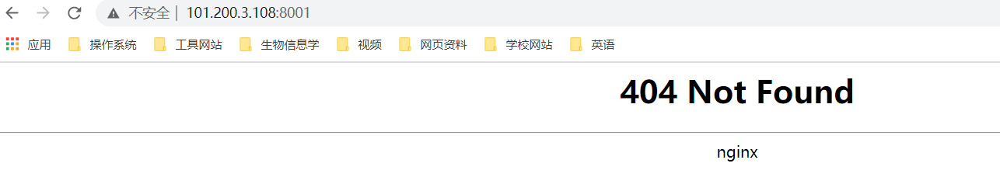

**方法二**：yum安装（仍然出现错误）
```
yum install -y nginx
```
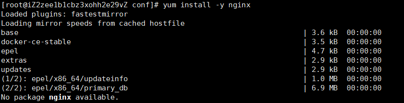


**方法三**： 解压缩安装

**1. 进入官网下载nginx压缩包及相关依赖**

nginx下载页面：[http://nginx.org/en/download.html](http://nginx.org/en/download.html)

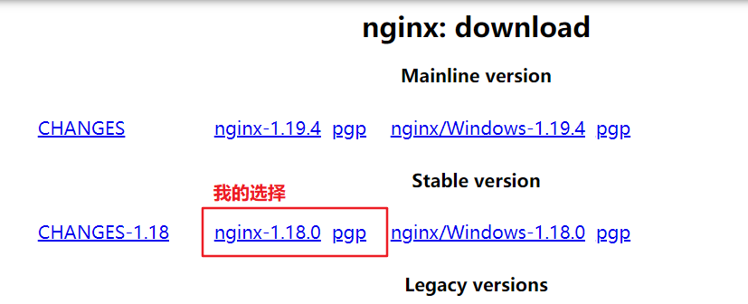

**2. 安装nginx依赖pcre**

pcre下载页面：[https://ftp.pcre.org/pub/pcre/](https://ftp.pcre.org/pub/pcre/)


**3. 将nginx和pcre的压缩包均通过XFtp传输到服务器上**

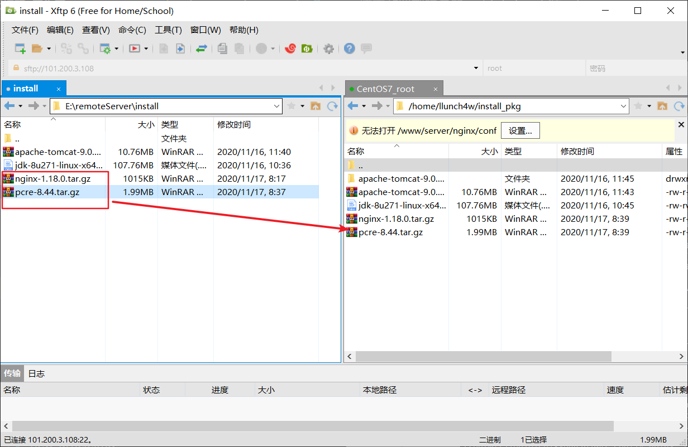

**4. 安装pcre**

（1）解压pcre压缩包
```
tar -zxvf pcre压缩包名称
```

（2）进入pcre目录，执行configure文件
```
./configure
```

（3）在pcre目录下执行以下命令
```
make && make install
```

（4）检查安装是否成功
```
pcre-config --version
```

**5. 通过yum安装openssl和zlib依赖**
```
yum -y install make zlib zlib-devel gcc-c++ libtool openssl openssl-devel
```

**6. 安装nginx**

（1）解压缩nginx
```
tar -zxvf nginx压缩包名称
```

（2）进入nginx目录执行configure文件
```
./configure
```

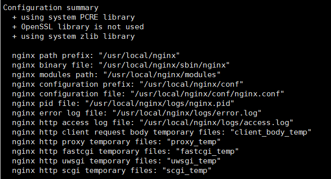

（3）在nginx目录执行命令
```
make && make install
```

**7. nginx安装成功后目录为/usr/local/**

其执行文件路径为/usr/local/sbin

**8. 配置nginx环境变量**

```
1. vim /etc/profile

2. 添加NGINX_HOME
NGINX_HOME=/usr/local/nginx
# PATH中添加 $NGINX_HOME/sbin
export $PATH="$PATH:$NGINX_HOME/sbin"

3. 保存文件并退出

4. source /etc/profile 使文件生效

5. 在非/usr/local/nginx/sbin目录下执行nginx -v验证是否配置环境成功
```

**9. 启动nginx并访问**

```
nginx # 启动
ps -ef | grep nginx # 查看nginx进程证明其确实启动
浏览器中访问：http://101.200.3.108:80
```

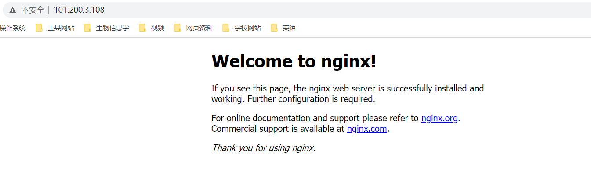


**10. 修改nginx配置文件**
> 这一步在配置完成git仓库后再进行

_配置文件地址：/usr/local/nginx/conf/nginx.conf_

```
vim /usr/local/nginx/conf/nginx.conf

1.将location / 下的root值更换为git工作目录 /home/www/website
2.将location /50x.html下的root值更换为git工作目录 /home/www/website
```

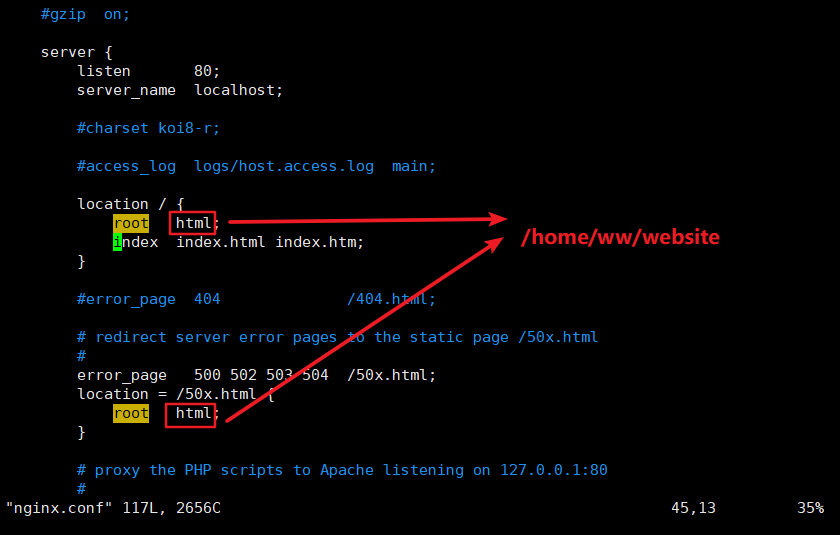


## 常用nginx命令

若是宝塔面板安装，则nginx安装目录为
```
/www/server/nginx
# 配置文件路径为：/www/server/nginx/conf/nginx.conf
```

若是解压缩安装，则nginx安装目录为
```
/usr/local/nginx
# 配置文件路径为：/usr/local/nginx/conf/nginx.conf
```
解压缩安装的nginx必须在其安装目录执行nginx命令才有效，若想在任何地方都有效则需要配置环境变量


1. 启动
```
nginx
```

2. 重启
```
nginx -s reload
```

3. 停止
```
nginx -s stop
```

4. 查看nginx配置
```
nginx -t
```

# 安装nodejs

**安装命令**
```
yum install -y nodejs
```

**检测是否安装成功**
```
node -v
npm -v
```

# 安装Git并配置仓库

**1. 安装git**
```
yum -y install git
```

**2. 新建git用户**
```
adduser git
```

**3. 为git用户添加权限**
```
chmod 740 /etc/sudoers

vim /etc/sudoers

添加 git All=(ALL) ALL  # 为git账户添加权限

chmod 400 /etc/sudoers

passwd git # 为git用户设置密码
```

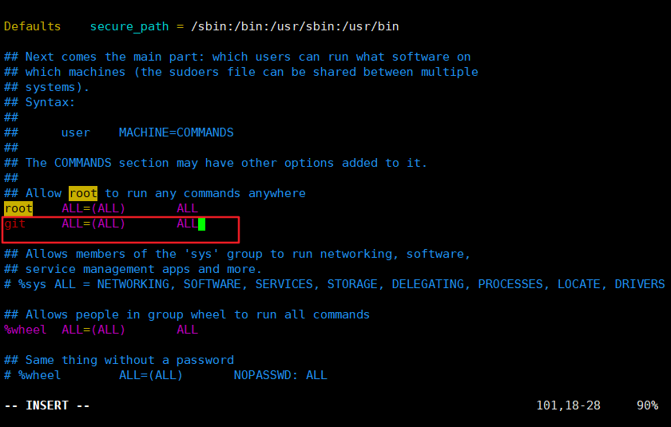

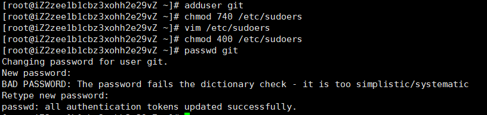


**4. 以git用户身份登录**

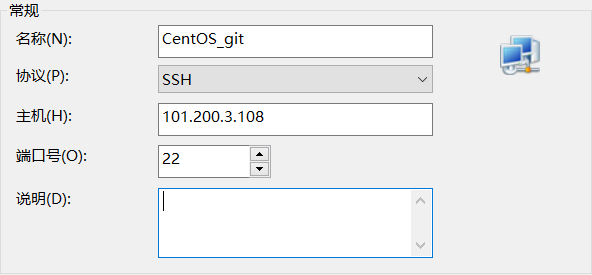

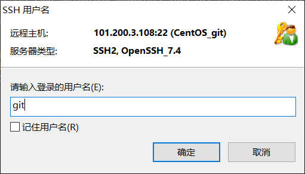


**5. 在git用户目录下创建ssh密钥**

```
cd ~

mkdir .ssh

cd .ssh

vim authorized_keys

添加本地Windows下已生成的密钥：位置如下图

chmod 600 ~/.ssh/authorized_keys

chmod 700 ~/.ssh
```


**6. 创建git仓库**

（1）使用root用户登录，创建git的工作文件夹
```
cd /home
mkdir -p www/website
```

（2）使用git用户登录，初始化仓库设置
```
cd ~

git init --bare blog.git

vim ~/blog.git/hooks/post-receive

添加 git --work-tree=/home/www/website --git-dir=/home/git/blog.git checkout -f

chmod +x ~/blog.git/hooks/post-receive
```

**7. Windows主机ssh连接服务器**

（1）打开命令行
```
ssh -v git@服务器IP地址
```

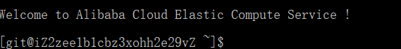


（2）前往nginx步骤第10步配置一下nginx的配置文件


# 将本地hexo博客上传到服务器

**1. 更改本地hexo配置文件**

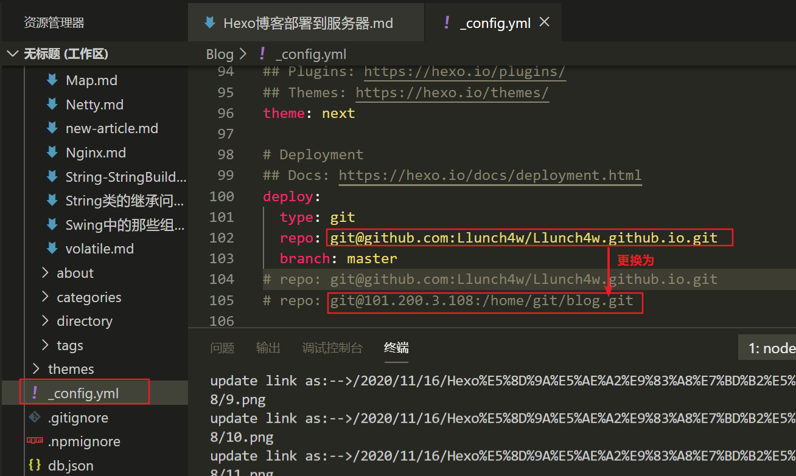


**2. 执行命令重新部署hexo**

```
hexo g -d
```


**3. 服务器重启nginx服务**
```
nginx -s reload
```

**4. 浏览器访问**

输入服务器地址 [http://101.200.3.108](http://101.200.3.108) 即可访问博客
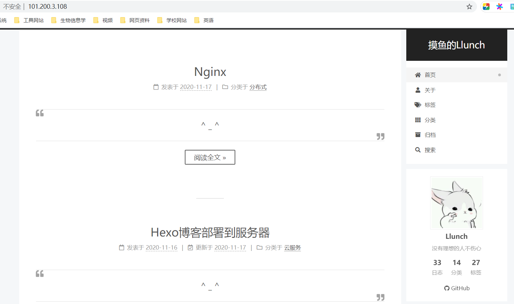