 ^ _ ^ 
<!-- more -->

# 资料
B站狂神【JVM快速入门篇】视频 : [https://www.bilibili.com/video/BV1iJ411d7jS](https://www.bilibili.com/video/BV1iJ411d7jS)


# JVM体系结构
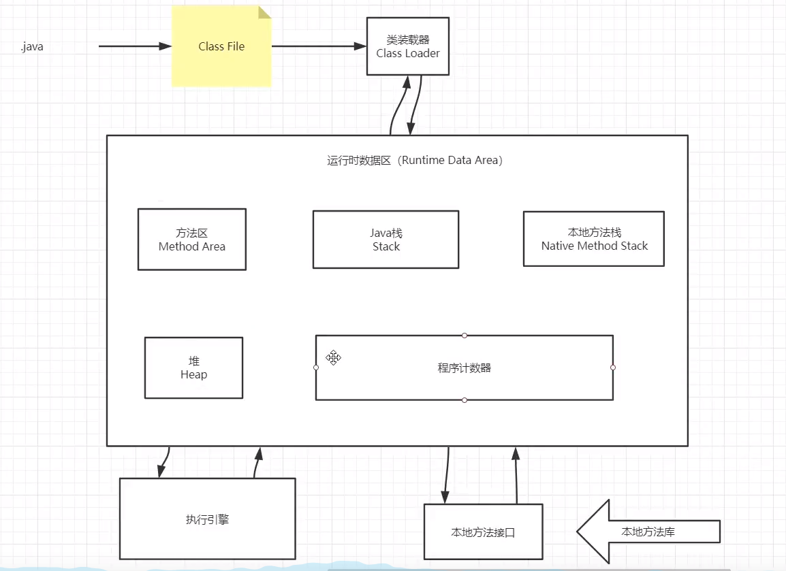

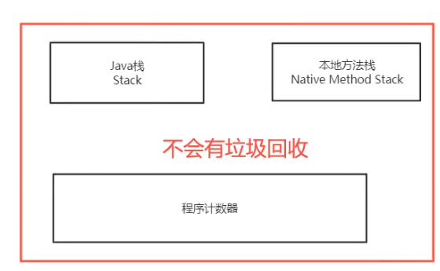


# 类加载器
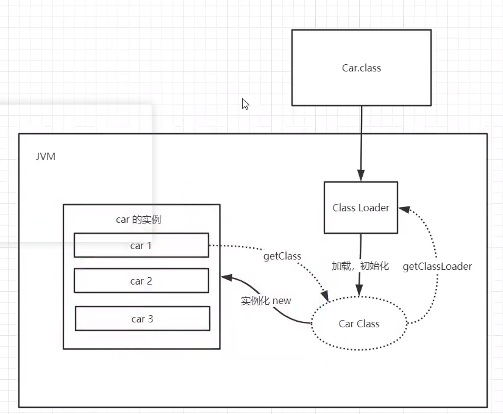

## 类加载器的类型
1. 虚拟机自带加载器
2. 启动类（根）加载器
3. 扩展类加载器
4. 应用程序（系统类）加载器

## 双亲委派机制
1. 类加载器收到类加载请求
2. 将这个请求向上委托给父类加载器去完成（一直向上委托，直到启动类加载器）
3. 父类加载器检查是否能加载当前类
    - 能加载就结束
    - 否则，抛出异常，通知子类加载器进行加载
4. 重复步骤3

## 沙箱安全机制
**组成沙箱的基本组件**
- 字节码校验器(bytecode verifier) : 确保Java类文件遵循Java语言规范。这样可以帮助Java程序实现内存保护。但并不是所有的类文件都会经过字节码校验，比如核心类
- 类加载器(class loader) : 在3个方面对沙箱起作用，采用双亲委派机制
  - 防止恶意代码去干涉善意代码
  - 守护了被信任的类库边界
  - 将代码归于保护域，确定了代码可以进行哪些操作
- 存取控制器(access controller) : 控制核心API对操作系统的存取权限，控制策略可以由用户指定
- 安全管理器(security manager) : 是核心API与操作系统之间的主要接口。实现权限控制，比存取控制器优先级高
- 安全软件包(security pacage) : java.security下的类和扩展包(ext)的类，允许用户为自己的应用增加新的安全特性，包括：安全提供者、消息摘要、数字签名、加密、鉴别

# Native
- 凡是带了native关键字的，说明java作用范围达不到了，会去调用底层c语言的库
- 会进入本地方法栈
- 调用本地方法接口 JNI ： JNI可以扩展Java的使用，融合不同的编程语言为Java所用
- JVM在内存区域中专门开辟了一块标记区域：Native Method Stack，登记native方法
- 在最终执行时，通过JNI加载本地方法库中的方法

**实例**
> Thread类的start0方法
  
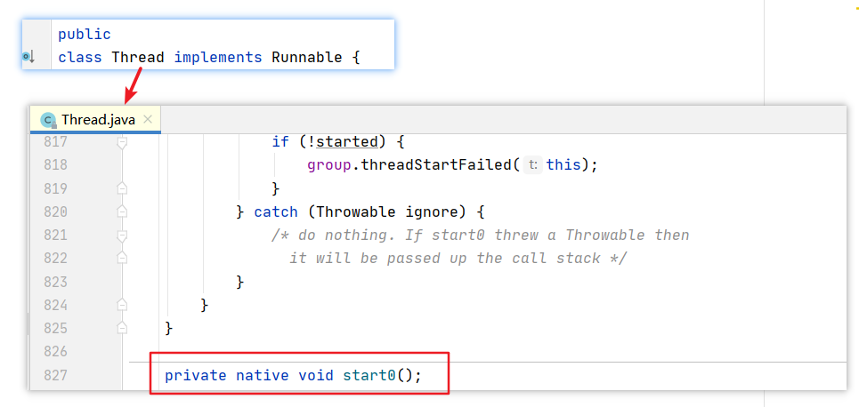

# PC寄存器
> 程序计数器 : Program Counter Register

每个线程都有一个程序计数器，是线程私有的，就是一个指针，指向方法区中的方法字节码（用来存储指向一条指定的地址，该地址内存中存储着将要执行的指令代码），在执行引擎读取下一条指令。是一个非常小的内存空间，几乎可以忽略不计

# 方法区
方法区被所有线程共享，所有字段和方法字节码，以及一些特殊方法（如构造函数、接口代码）也在此定义。简单说，所有定义的方法的信息都保存在该区域，此区域属于共享区间
__静态变量、常量、类信息（构造方法、接口定义）、运行时的常量池存在方法区中，但是实例变量存在堆内存中，与方法区无关__

# 栈
- 栈内存，主管程序的运行，生命周期和线程同步
- 线程结束，栈内存释放，对于栈，不存在垃圾回收问题
- 栈中保存内容：8大基本数据类型 + 对象引用 + 实例的方法

**栈运行原理**
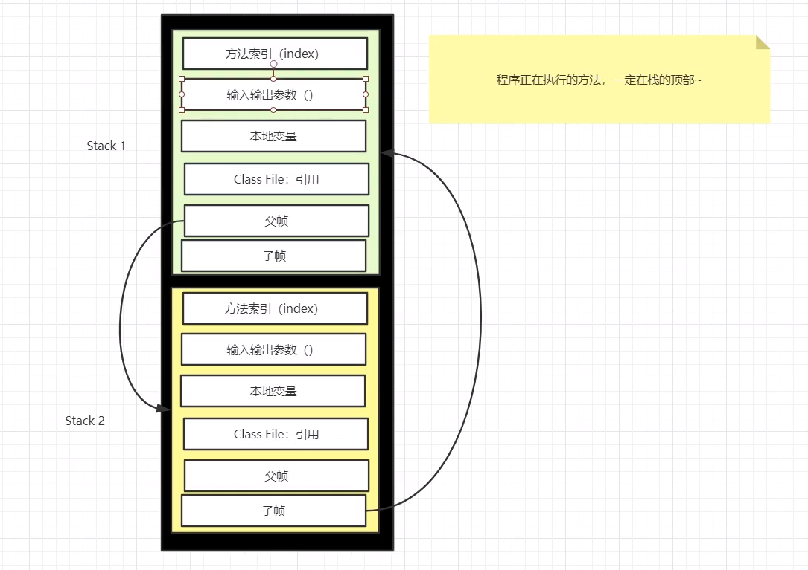

**栈、堆、方法区交互关系**
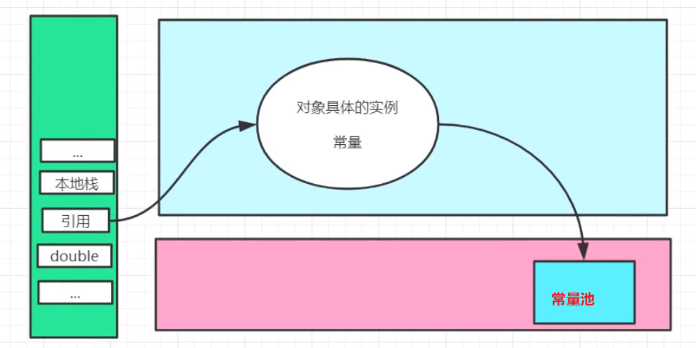

# 三种JVM
- Sun公司 HotSpot
- BEA公司 JRockit 
- IBM公司 J9VM

# 堆
Heap，一个JVM只有一个堆内存，堆内存的大小是可以调节的。

**堆内存的分区**
新生区、老年区、永久区
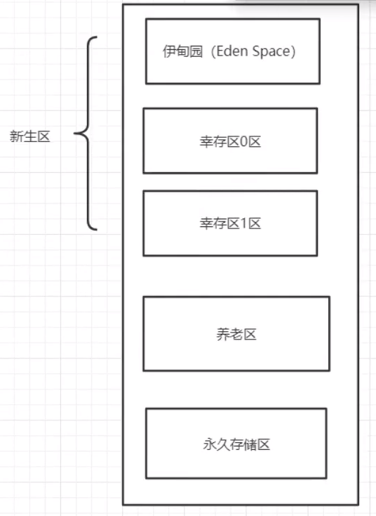

**分区结构**
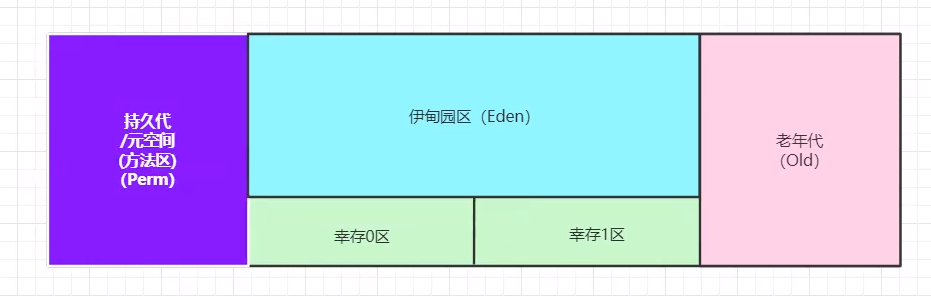

> GC垃圾回收，主要是在伊甸园区和老年区
> 如果出现OOM(Out Of Memeory)异常，表示堆内存已经不够
> JDK8后，永久存储区更名为元空间

## 新生区
> 对象诞生、成长甚至死亡的地方

- 伊甸园(Eden Space)：所有的对象都是在伊甸园区new出来的
- 当Eden Space满了的时候，会触发一次轻GC，将不需要的对象清除，幸存的类放入幸存者区
- 幸存者区（0、1）是两位一体的，每一次轻GC，会清理伊甸园区和不为空的幸存者区，把两个区内的幸存对象放入另一个为空的幸存者区

## 永久区
> 这个区域是常驻内存的，用来存放JDK自身携带的Class对象。Interface元数据，存储的是Java运行时的一些环境或类信息。这个区域不存在垃圾回收，关闭虚拟机时将释放这个区域的内存

- jdk1.6前：常量池在方法区
- jdk1.7：永久代慢慢退化了，去永久代，常量池在堆中
- jdk1.8后：无永久代，常量池在元空间

**永久区出现内存溢出的可能原因**
- 一个启动类，加载了大量的第三方jar包
- tomcat部署了太多的应用
- 大量动态生成的反射类，不断被加载

## 堆内存调优
**查看堆内存**
```java
// 返回虚拟机试图使用的最大内存
long maxMemory = Runtime.getRuntime().maxMemory();
// 返回jvm的初始化总内存
long initMemory = Runtime.getRuntime().totalMemory();

System.out.println("maxMemory = " + maxMemory/(double)(1024*1024) + "(MB);initMemory = " +
        initMemory/(double)(1024*1024) + "(MB)");
```

**调整堆大小**
1. 打开运行时配置窗口
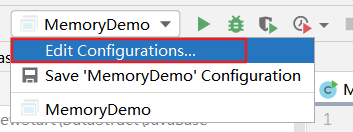
2. 配置虚拟机参数
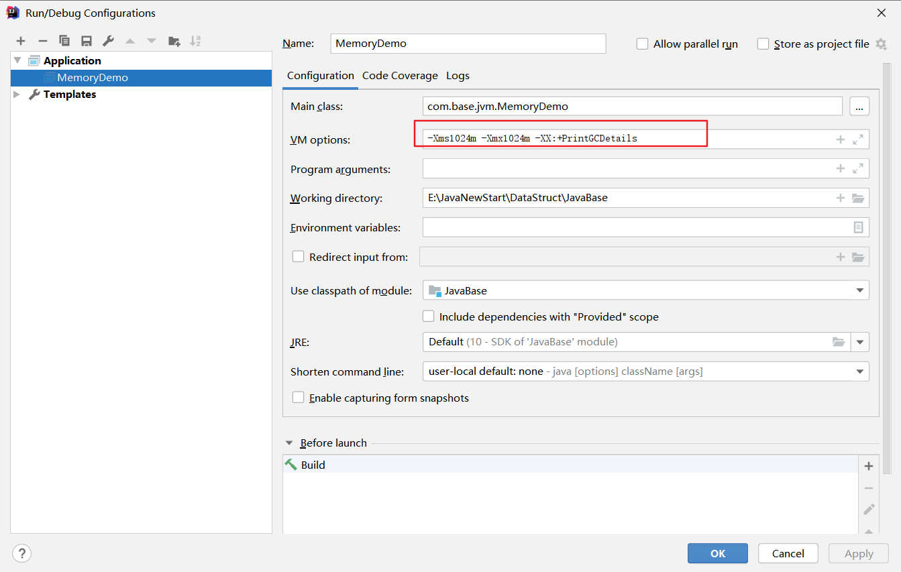
3. 再次运行程序
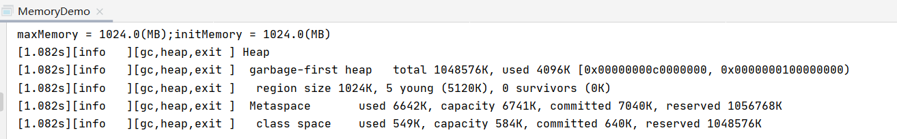

## JProfile
> 用于分析堆内存的插件

**安装方式**
1. IDEA打开 File -> Setting -> Plugins -> 搜索JProfile

2. 下载JProfiler查看工具安装包
    - 下载网址：[https://www.ej-technologies.com/download/jprofiler/files](https://www.ej-technologies.com/download/jprofiler/files)
    - 我的选择
    
3. 安装JProfiler查看工具
    - 安装路径不应该包含中文和空格
4. 填写注册码（这一步未完成，选择了试用10天）
5. 安装成功
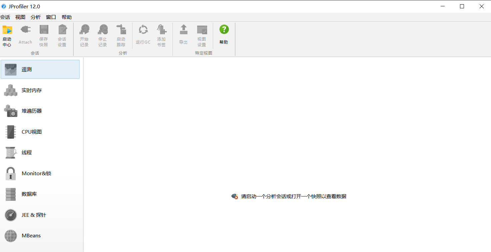


**使用实例**
1. 编写一个会产生OOM错误的程序
```java
public class OomDemo {
    private Byte[] array = new Byte[1024*1024];

    public static void main(String[] args) {
        List<OomDemo> list = new ArrayList<>();
        int count = 0;
        try{
            while(true){
                count += 1;
                list.add(new OomDemo());
            }
        }catch(Error e){
            System.out.println("count = " + count);
            e.printStackTrace();
        }
    }
}
```

2. 配置虚拟机堆内存大小
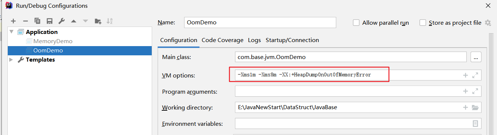

3. 运行结果查看
    - 控制台输出
    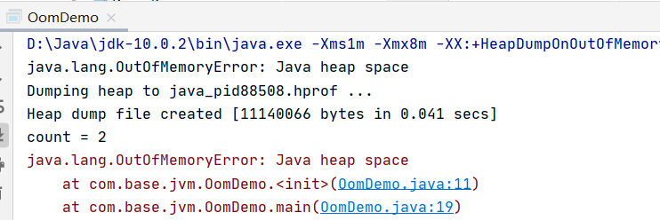
    - hprof文件
    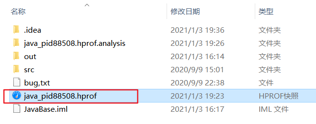

4. JProfiler中hprof文件查看
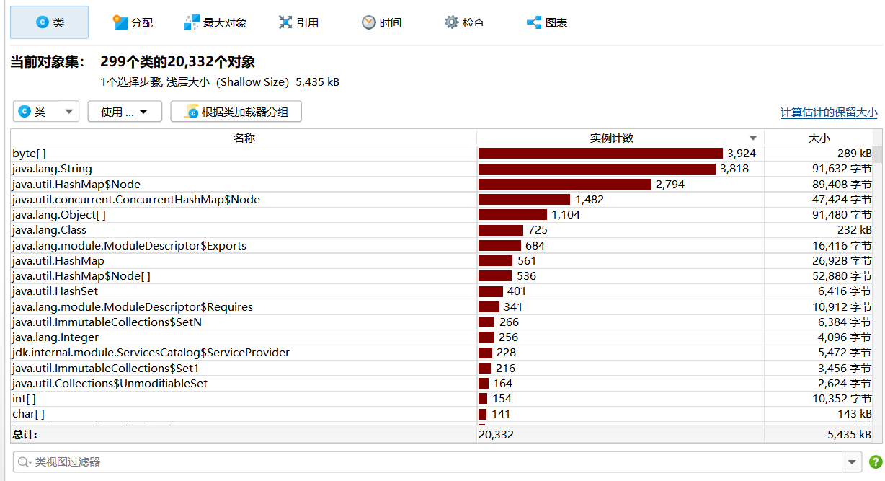
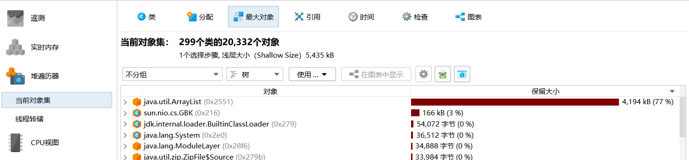
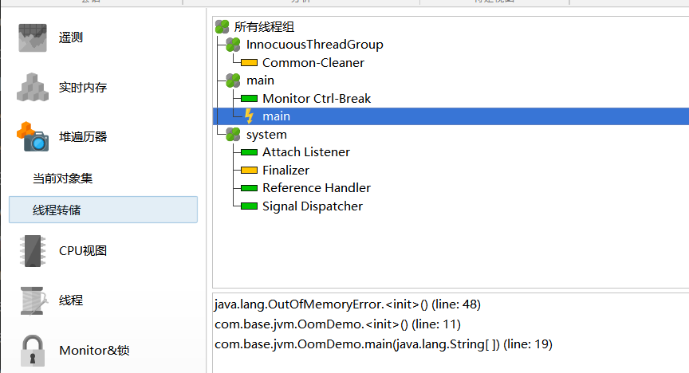

## GC
> 垃圾回收机制

### GC分类
- 轻GC：普通的GC（JVM在进行清除时，并不是对新生代、老年代进行统一回收，大部分时候，回收的都是新生代）
- 重GC：全局GC

### GC常用算法
**复制算法**
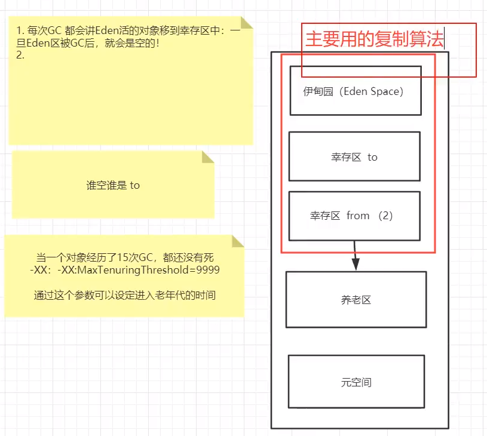

- 优点：没有内存碎片
- 缺点：浪费了内存空间

**标记清除**
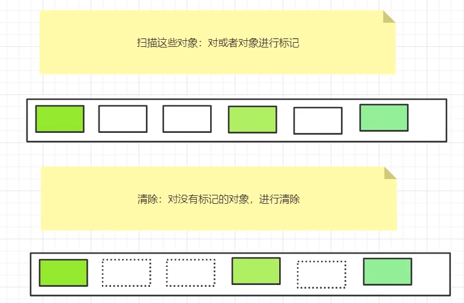

- 优点：不需要额外空间
- 缺点：两次扫描，严重浪费时间；会产生内存碎片

**标记整理(压缩)**
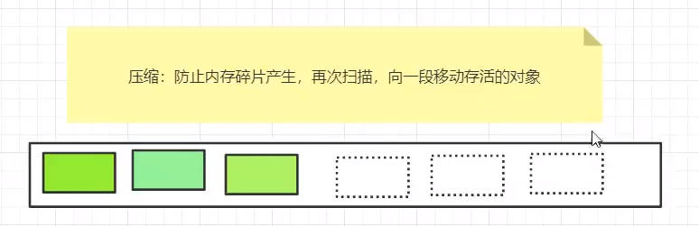

**引用计数器**
对每个对象设定一个计数器，记录引用该对象的对象个数。当GC发生时，清除掉那些计数为0的对象

**算法比较**
- 内存效率（时间复杂度）：复制算法 > 标记清除算法 > 标记整理算法
- 内存整齐度：复制算法 = 标记整理算法 > 标记清除算法
- 内存利用率：标记整理算法 = 标记清除算法 > 复制算法

