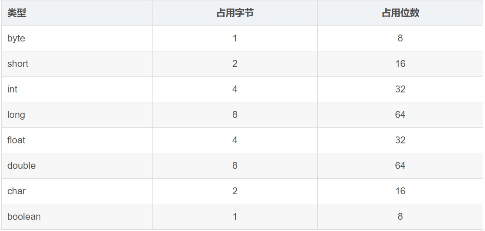

 ^ _ ^ 
<!-- more -->

# Q & A
> **JAVA中的几种基本数据类型是什么，各自占用多少字节？**




# 编程获取方式

```
System.out.printf("%s\t%s\n","类型","大小（字节）");
System.out.printf("%s\t%d\n","byte",Byte.SIZE/8);
System.out.printf("%s\t%d\n","short",Short.SIZE/8);
System.out.printf("%s\t%d\n","int",Integer.SIZE/8);
System.out.printf("%s\t%d\n","long",Long.SIZE/8);
System.out.printf("%s\t%d\n","float",Float.SIZE/8);
System.out.printf("%s\t%d\n","double",Double.SIZE/8);
System.out.printf("%s\t%d\n","char",Character.SIZE/8);
// Boolean并没有SIZE属性，Boolean.SIZE会出现编译错误
// System.out.printf("%s\t%d","boolean",Boolean.SIZE/8);
```

值得注意的一点是Boolean没有SIZE属性，其原因在于boolean类型本身就没有给出具体的占用字节数。对虚拟机来说并不存在boolean这个类型，boolean类型的数据存储时实际上是转换成了另一种基础类型储存。但一般是认为Boolean类型占用一个字节。

**[关于boolean占用内存大小的更多解释](https://blog.csdn.net/qq_36763419/article/details/91392297)**


