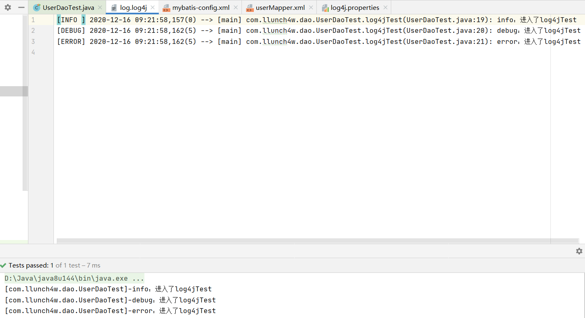

 ^ _ ^ 
<!-- more -->

# 前言
这篇文章记录了跟着狂神的MyBatis视频学习所进行的步骤，博客大纲也同狂神的视频一致。

狂神MyBatis视频链接：[https://www.bilibili.com/video/BV1NE411Q7Nx?p=2](https://www.bilibili.com/video/BV1NE411Q7Nx?p=2)


# 第一个MyBatis程序

**1. 搭建环境**
- File -> New -> Project
- 选择Maven项目，不勾选`Create from archetype`，表示创建一个基本Maven项目
- 为项目命名为MyBatis-Study，将groupId更改为org.llunch4w

- 项目创建成功后，将项目目录下的src文件夹删除，目的是使MyBatis-Study用作一个父工程，起一个容器的作用。具体的代码在其子模块中编写

- 编写pom.xml(MyBatis-Study)文件：配置子模块公共依赖

```xml
<!--导入依赖-->
<dependencies>
    <!--mysql驱动-->
    <dependency>
        <groupId>mysql</groupId>
        <artifactId>mysql-connector-java</artifactId>
        <version>5.1.6</version>
    </dependency>
    <!--mybatis-->
    <dependency>
        <groupId>org.mybatis</groupId>
        <artifactId>mybatis</artifactId>
        <version>3.5.2</version>
    </dependency>
    <!--junit-->
    <dependency>
        <groupId>junit</groupId>
        <artifactId>junit</artifactId>
        <version>4.12</version>
    </dependency>
</dependencies>
```
- 创建子模块
  - MyBatis-Study项目处右键 -> New -> Module
  - 选择Maven项目，不勾选`Create from archetype`
  - 配置模块名称
    
  - 子模块中已自动包含父工程中配置好的依赖
    
- 观察父工程pom.xml文件的变化


**2. 编写MyBatis核心配置文件**
> 此步骤的操作对象是mybatis-01子模块

- 在 __mybatis-01/src/main/resources__ 目录下创建mybatis核心配置文件 __mybatis-config.xml__ （这个名字可以自定义，但一般使用这个命名）
- 在 mybatis-config.xml 文件中填写如下基本代码
```xml
<?xml version="1.0" encoding="UTF-8" ?>
<!DOCTYPE configuration
        PUBLIC "-//mybatis.org//DTD Config 3.0//EN"
        "http://mybatis.org/dtd/mybatis-3-config.dtd">
<configuration>
    <environments default="development">
        <environment id="development">
            <transactionManager type="JDBC"/>
            <dataSource type="POOLED">
                <property name="driver" value="${driver}"/>
                <property name="url" value="${url}"/>
                <property name="username" value="${username}"/>
                <property name="password" value="${password}"/>
            </dataSource>
        </environment>
        <!--environments中可以存在多套环境，默认选择的环境根据其default选项指定
            比如test就可以是另一套环境-->
        <environment id="test">
            <transactionManager />
            <dataSource />
        </environment>
    </environments>
</configuration>
```
- 通过硬编码将数据库信息换成具体的值，具体值如下
```
driver = com.mysql.jdbc.Driver
url = jdbc:mysql://localhost:3307/mybatis?useSSL=false&amp;useUnicode=true&amp;charsetEncoding=UTF-8&amp;serverTimezone=UTC
username = root
password = MyNewPass
```

**3. 编写读取配置文件工具类**
```java
public class MyBatisUtil {
    private static SqlSessionFactory sqlSessionFactory;
    static{
        try{
            String resource = "mybatis-config.xml";
            InputStream inputStream = Resources.getResourceAsStream(resource);
            sqlSessionFactory = new SqlSessionFactoryBuilder().build(inputStream);
        }catch (Exception e){
            e.printStackTrace();
        }
    }

    public static SqlSession getSqlSession(){
        return sqlSessionFactory.openSession();
    }
}
```

**4. 创建数据库mybatis，并在其中添加数据表user**
```sql
create database mybatis;
use mybatis;
create table user(
    id int auto_increment,
    name varchar(20),
    pwd varchar(50),
    primary key(id)
)ENGINE=INNODB DEFAULT CHARSET=UTF8;

-- 往 user 表中添加一些数据
insert into user(name,pwd)
        values("李明",123),("李华",456),("东东",789);
```

**5. 添加对应于user表的实体类User**


**6. 添加操纵User的Dao接口UserDao**
```java
public interface UserDao {
    List<User> getAll();
}
```

**7. 编写对应于UserDao的映射文件 userMapper.xml**

```xml
<?xml version="1.0" encoding="UTF-8" ?>
<!DOCTYPE mapper
        PUBLIC "-//mybatis.org//DTD Mapper 3.0//EN"
        "http://mybatis.org/dtd/mybatis-3-mapper.dtd">
<mapper namespace="com.llunch4w.dao.UserDao">
    <select id="getAll" resultType="com.llunch4w.pojo.User">
        select * from user
    </select>
</mapper>
```

**9. 将 user-mapper.xml 文件在核心配置文件 mybatis-config.xml 中注册**

```xml
<!--每一个 mapper.xml 文件都需要在核心配置文件中注册-->
<mappers>
    <mapper resource="com/llunch4w/dao/userMapper.xml" />
</mappers>
```
> PS 如果不配置的话，会出现如下错误：
> org.apache.ibatis.binding.BindingException: Type interface com.llunch4w.dao.UserDao is not known to the MapperRegistry.

**10. 通过配置父工程的 pom.xml 文件制定编译条件，防止出现jdk1.5的警告**

```xml
<!--编译环境-->
<properties>
    <project.build.sourceEncoding>UTF-8</project.build.sourceEncoding>
    <maven.compiler.source>1.8</maven.compiler.source>
    <maven.compiler.target>1.8</maven.compiler.target>
</properties>
```
> 如果不配置的话，在运行java程序时，会出现如下警告：
> 

**11. 通过配置父工程的 pom.xml 文件制定资源过滤条件，防止 Maven 项目下资源导出失败问题**

```xml
<!--在build中配置resources，来放置资源导出失败问题-->
<build>
    <resources>
        <resource>
            <directory>src/main/resources</directory>
            <includes>
                <include>**/*.properties</include>
                <include>**/*.xml</include>
            </includes>
            <filtering>true</filtering>
        </resource>
        <resource>
            <directory>src/main/java</directory>
            <includes>
                <include>**/*.properties</include>
                <include>**/*.xml</include>
            </includes>
            <filtering>true</filtering>
        </resource>
    </resources>
</build>
```
> PS 如果不配置的话，会出现如下错误：
> Cause: org.apache.ibatis.builder.BuilderException: Error parsing SQL Mapper Configuration. Cause: java.io.IOException: Could not find resource com/llunch4w/dao/userMapper.xml

__这个问题也可以通过将mapper.xml文件放到resources目录下的方式来解决（注意最好有一定的目录结构，例如resources/com/mapper/userMapper.xml）__

**12. 编写测试文件进行测试**

```java
// 测试 UserDao 的 getAllUsers 方法
@Test
public void test01(){
    // 获取session
    SqlSession sqlSession = MyBatisUtil.getSqlSession();
    // 获取mapper
    UserDao userDao = sqlSession.getMapper(UserDao.class);
    // 操纵mapper
    List<User> allUserList = userDao.getAll();

    for (User user : allUserList) {
        System.out.println(user);
    }

    // 关闭session
    sqlSession.close();
}
```
> 补充，还有另一种不获取userDao直接用sqlSession进行查询的方法，如下：
> ```java
> List<User> userList = sqlSession.selectList("com.llunch4w.dao.UserDao.getAllUsers");
> ```
> 但这种方式不推荐使用，了解即可


# CRUD
> create、read、 update、delete

## 基本增删改查实现
**1. 检查namespace**
> nampespace中的包名要和Dao接口的包名一致

```xml
<mapper namespace="com.llunch4w.dao.UserDao">
    <!--mapper标签内部添加诸如select、insert、delete、update的标签-->
</mapper>
```

**2. 在Dao接口中添加方法申明**
```java
public interface UserDao {
    // 获取全部用户
    List<User> getAll();
    // 根据用户ID获取
    User getById(int id);
    // 添加用户
    int insert(User user);
    // 根据用户ID删除
    int deleteById(int id);
    // 根据用户ID更新
    int update(User user);
}
```

**3. 在 userMapper.xml 文件中的 mapper 标签下添加操作标签**
```xml
<!--返回类型和参数类型都应写全限定名-->
<select id="getAll" resultType="com.llunch4w.pojo.User">
    select * from user
</select>
<!--Tips：返回类型/参数类型 如果为基本类型，可以不用特别申明-->
<select id="getById" parameterType="int" resultType="com.llunch4w.pojo.User">
    select * from user where id = #{id}
</select>
<insert id="insert" parameterType="com.llunch4w.pojo.User">
    insert into user(id,name,pwd) values(#{id},#{name},#{pwd})
</insert>
<update id="update" parameterType="com.llunch4w.pojo.User">
    update user set name=#{name},pwd=#{pwd} where id=#{id}
</update>
<delete id="deleteById" parameterType="int">
    delete from user where id = #{id}
</delete>
```

**4. 测试：以更新为例**
> 注意：
> - sqlSession应及时关闭
> - 对于增加、删除、更新操作，sqlSession需要执行commmit后修改才会生效（事务才会提交）

```java
@Test
public void updateTest(){
    SqlSession sqlSession = MyBatisUtil.getSqlSession();
    UserDao userDao = sqlSession.getMapper(UserDao.class);

    User user = userDao.getById(5);
    user.setName("谢南");
    if(userDao.update(user) > 0){
        System.out.println("更新成功");
        sqlSession.commit();
    }

    sqlSession.close();
}
```

## map
**1. UserDao中声明传参为map的接口**
```java
int updateByMap(Map<String,Object> map);
```

**2. userMapper.xml中添加对应的操作标签**
```xml
<update id="updateByMap" parameterType="map">
    update user set name=#{userName} where id=#{userId}
</update>
```

**3. 编写测试函数**
```java
@Test
public void updateByMapTest(){
    SqlSession sqlSession = MyBatisUtil.getSqlSession();
    UserDao userDao = sqlSession.getMapper(UserDao.class);

    Map<String,Object> params = new HashMap<>();
    params.put("userName","林树");
    params.put("userId",1);

    if(userDao.updateByMap(params) > 0){
        System.out.println("更新成功");
        sqlSession.commit();
    }

    sqlSession.close();
}   
```

## 模糊查询
**1. UserDao中添加根据名称模糊查询的接口**
```java
// 根据用户名称进行模糊查询
List<User> getByNameInDim(String name);
```

### 方式一
> 在调用方法时添加模糊匹配字符 %

**2. 在userMapper.xml中添加模糊查询的操作标签**
```xml
<!--参数类型为String，不需要特别声明-->
<select id="getByNameInDim" resultType="com.llunch4w.pojo.User">
    select * from user where name like #{value}
</select>
```

**3. 测试类调用**
```java
@Test
public void getByNameInDimTest(){
    SqlSession sqlSession = MyBatisUtil.getSqlSession();
    UserDao userDao = sqlSession.getMapper(UserDao.class);

    List<User> userList = userDao.getByNameInDim("%谢%");
    for (User user : userList) {
        System.out.println(user);
    }

    sqlSession.close();
}
```

### 方式二
> 在userMapper.xml中直接编码 %

**2. 在userMapper.xml中添加模糊查询的操作标签**
```xml
<!--直接拼接方式1-->
<select id="getByNameInDim" resultType="com.llunch4w.pojo.User">
    select * from user where name like "%"#{value}"%"
</select>

<!--直接拼接方式2-->
<select id="getByNameInDim" resultType="com.llunch4w.pojo.User">
    select * from user where name like concat("%",#{value},"%")
</select>
```

**3. 测试类调用**
```java
List<User> userList = userDao.getByNameInDim("谢");
```

# 配置解析

**项目准备**
- 在 MyBatis-Study 父工程下新建一个子模块 mybatis-02，也是普通Maven工程
- 将 mybatis-01 中的代码拷贝一份到mybatis-02
- 将 mybatis-02 中 UserDao、userMapper.xml 中除了基本增删改查外的其他操作相关内容去除，将UserDaoTest中除了getAllTest之外的函数都去除
- 测试getAllTest的执行，执行成功则说明项目准备完成

## 环境配置（enviroments）
```xml
<!--MyBatis可以配置多种环境以适应多种环境（开发、测试、生产等）的需要
    但每个SqlSessionFactory实例只能选择一种环境
    default指定当前SqlSessionFactory选择的环境-->
<environments default="development">
    <!--每个enviroment结点代表一种环境-->
    <environment id="development">
        <!--事务管理器，MyBatis中有两种类型的事务管理器：[JDBC|MANAGED]
            JDBC – 这个配置直接使用了 JDBC 的提交和回滚设施，它依赖从数据源获得的连接来管理事务作用域
            MANAGED – 这个配置几乎没做什么。它从不提交或回滚一个连接，而是让容器来管理事务的整个生命周期（比如 JEE 应用服务器的上下文）
            如果你正在使用 Spring + MyBatis，则没有必要配置事务管理器，因为 Spring 模块会使用自带的管理器来覆盖前面的配置-->
        <transactionManager type="JDBC"/>
        <!--数据源，有三种内建的数据源类型：[UNPOOLED|POOLED|JNDI]
            UNPOOLED– 这个数据源的实现会每次请求时打开和关闭连接
            POOLED– 这种数据源的实现利用“池”的概念将 JDBC 连接对象组织起来，避免了创建新的连接实例时所必需的初始化和认证时间
            JNDI – 这个数据源实现是为了能在如 EJB 或应用服务器这类容器中使用-->
        <dataSource type="POOLED">
            <property name="driver" value="com.mysql.jdbc.Driver"/>
            <property name="url"
                        value="jdbc:mysql://localhost:3307/mybatis?useSSL=false&amp;useUnicode=true&amp;
                        charsetEncoding=UTF-8&amp;serverTimezone=UTC"/>
            <property name="username" value="root"/>
            <property name="password" value="MyNewPass"/>
        </dataSource>
    </environment>
</environments>
```

## 属性（properties）
- 可以通过properties属性实现引用配置文件
- 这些属性都是可外部配置和动态替换的：既可通过java属性文件配置，也可通过properties元素的子元素来传递

### 引用Java属性文件进行配置
**1. 编写一个数据库属性配置文件 jdbc.properties**
```properties
driver = com.mysql.jdbc.Driver
url = jdbc:mysql://localhost:3307/mybatis?useSSL=false&useUnicode=true&charsetEncoding=UTF-8&serverTimezone=UTC
username = root
password = MyNewPass
```

**2. 在核心配置文件 mybatis-config.xml 中引用**

```xml
<!--引入外部配置文件-->
<properties resource="jdbc.properties" />
```

**3. 运行UserDaoTest中的方法进行测试**

### 通过properties元素子元素进行配置
> 注意：&符号在xml文件中是非法的，应该用&amp;代替，而在properties文件中则不需要

```xml
<properties>
    <property name="driver" value="com.mysql.jdbc.Driver"/>
    <property name="url" value="jdbc:mysql://localhost:3307/mybatis?useSSL=false&amp;useUnicode=true&amp;charsetEncoding=UTF-8&amp;serverTimezone=UTC"/>
    <property name="username" value="root"/>
    <property name="password" value="MyNewPass"/>
</properties>
```

### 优先级比较实验
**1. 对mybatis-config.xml文件和jdbc.properties进行如下配置**
```xml
<!--mybatis-config.xml-->
<properties resource="jdbc.properties">
    <property name="username" value="root"/>
    <property name="password" value="111"/>
</properties>
```

```properties
# jdbc.properties
username = root
password = MyNewPass
```

**2. 测试UserDaoTest运行结果**
> 无错误

**3. 调换mybatis-config.xml文件和jdbc.properties的密码配置**
```xml
<!--mybatis-config.xml-->
<properties resource="jdbc.properties">
    <property name="username" value="root"/>
    <property name="password" value="MyNewPass"/>
</properties>
```

```properties
# jdbc.properties
username = root
password = 111
```

**4. 测试UserDaoTest运行结果**
> 出现错误

**5. 得出结论**
__properties中引用的resources优先级最高__


## 类型别名（typeAliases）
> 类型别名是为Java类型设置一个短的名字。它只和XML配置有关，存在的意义仅在于减少类全限定名的冗余

### 指定类别名
**1. 在 mybatis-config.xml 中添加别名配置**
```xml
<typeAliases>
    <typeAlias type="com.llunch4w.pojo.User" alias="User"/>
</typeAliases>
```

**2. 在 userMapper.xml 中就可将全限定类名用别名代替了**
```xml
<select id="getAll" resultType="User">
    select * from user
</select>
```

### 指定搜索包
> 可以指定一个包名，MyBatis会在包名下搜索需要的JavaBean

**1. 在 mybatis-config.xml 中添加别名配置**
```xml
<typeAliases>
    <package name="com.llunch4w.pojo"/>
</typeAliases>
```

**2. 在 userMapper.xml 中就可将全限定类名用类名（首字母小写）代替了**
> 默认别名是类名的首字母小写，但是直接使用类名也是可以的
> 一般是用小写，表名该类型是扫描包的
> PS：如果实体类有注解@Alias的话，那么别名是注解值

```xml
<select id="getAll" resultType="user">
    select * from user
</select>
```

## 设置（settings）
> 这是 MyBatis 中极为重要的调整设置，它们会改变 MyBatis 的运行时行为

**常见设置**

| 设置名 | 描述 | 有效值 | 默认值 |
|  ---   | --- | ---   | --- |
|cacheEnabled | 全局性地开启或关闭所有映射器配置文件中已配置的任何缓存 | true / false | true |
|lazyLoadingEnabled | 延迟加载的全局开关。当开启时，所有关联对象都会延迟加载。 | true / false |false|
| logImpl | 指定 MyBatis 所用日志的具体实现，未指定时将自动查找 | SLF4J / LOG4J / LOG4J2 / JDK_LOGGING / COMMONS_LOGGING / STDOUT_LOGGING / NO_LOGGING | 未设置 |

## 映射器（mappers）
> 映射器告诉MyBatis去哪里找SQL映射语句

### 方式一：使用相对于类路径的资源引用
> 推荐使用这种方式

```xml
<mappers>
    <mapper resource="com/llunch4w/dao/userMapper.xml" />
</mappers>
```

### 方式二：使用映射器接口实现类的完全限定类名
> 这种方式要求接口和其映射文件的名称相同且必须在同一包下
> 例如：映射文件是userMapper.xml，那么类名应该是UserMapper

```xml
<mappers>
    <mapper class="com.llunch4w.dao.UserMapper" />
</mappers>
```

### 方式三：将包内的映射器接口实现全部注册为映射器
> 这种方式要求包内所有接口和其对应映射文件的名称相同，且必须在同一包下

```xml
<mappers>
    <package name="com.llunch4w.dao"/>
</mappers>
```

## 顺序
> 核心配置文件 mybatis-config.xml 中各项配置是有一定先后顺序的
> The content of element type "configuration" must match "(properties?,settings?,typeAliases?,typeHandlers?,objectFactory?,objectWrapperFactory?,reflectorFactory?,plugins?,environments?,databaseIdProvider?,mappers?)".

## 生命周期和作用域
> 生命周期、作用域，是至关重要的，因为错误的使用会导致非常严重的 __并发问题__


**SqlSessionFactoryBuilder**
- 一旦创建了SqlSessionFactory后，就不再需要它了
- 最好作为局部变量存在

**SqlSessionFactory**
- 类似于数据库连接池
- SqlSessionFactory一旦被创建就应该在应用运行期间一直存在，没有任何理由丢弃它或重新创建一个实例
- 因此SqlSessionFactory的最佳作用域是应用作用域
- 最简单的就是使用单例模式或者静态单例模式

**SqlSession**
- 连接到连接池的一个请求
- SqlSession的实例不是线程安全的，因此是不能被共享的
- 因此SqlSession的最佳作用域是请求或方法作用域
- 用完之后需要赶紧关闭，否则资源被占用


这里面的每一个Mapper，就代表着一个具体的业务。

## 资料
mybatis官方文档：[https://mybatis.org/mybatis-3/zh/configuration.html](https://mybatis.org/mybatis-3/zh/configuration.html)


# ResultMap
> 结果集映射，用于解决数据库表名和对应JavaBean中字段名称不统一的问题

**0. 新建模块**
在MyBatis-Study父工程中新建一个子模块mybatis-03，然后将mybatis-02中的文件拷贝过去，删除一些配置使项目达到最简状态。

**1. 提出问题**
> 在数据库中，对于长字段通常是用下划线分割而不是使用驼峰命名法。原因是：数据库中并不区别大小写，驼峰命名法实际上起不到分割单词的作用；但在java中，变量的命名通常是驼峰命名
> 在MyBatis中，JavaBean的属性名必须和数据库中的字段是完全一致的，否则就会找不到对应字段。
> 所以，该如何统一两者之间的命名差异呢？

下面演示这种情况
（1）数据库表名字段和对应JavaBean属性不一致

（2）执行UserTestDao的getAllTest方法进行测试

（3）得出结论：数据库表名字段和对应JavaBean属性不一致时无对应字段的属性无法被赋值

**2. 解决方案一：修改userMapper.xml中的查询语句**


**3. 解决方案二：使用ResultMap**


## 设计思想
> 对于简单的语句根本不需要配置显式的结果映射，而对于复杂一点的语句，只需要描述他们的关系即可


# 日志
## 标准日志工厂
> 如果一个数据库操作，出现了异常，我们需要排错，日志就是最好的助手

**0. 新建模块**
在MyBatis-Study父工程中新建一个子模块mybatis-04，然后将mybatis-03中的文件拷贝过去，删除一些配置使项目达到最简状态。然后将UserDaoTest中的测试函数换为getByIdTest

**1. 测试UserDaoTest的运行效果**


**2. 在核心配置文件 mybatis-config.xml 中添加日志配置**
```xml
<settings>
    <setting name="logImpl" value="STDOUT_LOGGING"/>
</settings>
```

**3. 测试UserDaoTest的运行效果**


## 所有的日志工厂
- SLF4J 
- LOG4J 【掌握】：log4j日志工厂，需要导包
- LOG4J2 
- JDK_LOGGING 
- COMMONS_LOGGING 
- STDOUT_LOGGING 【掌握】：标准日志工厂，不需要导包依赖
- NO_LOGGING

## LOG4J
> Log4j是Apache的一个开源项目。通过使用Log4j，我们可以控制日志信息输送的目的地使控制台、文件、GUI组件
> 也可以控制每一条日志的输出格式
> 通过定义每一条日志信息的级别，我们能够更加细致地控制日志的生成过程
> 通过一个`配置文件`来灵活地进行配置，而不需要修改应用的代码

**1. 在mybatis-04模块的pom.xml中引入log4j依赖**
```xml
<!-- https://mvnrepository.com/artifact/log4j/log4j -->
<dependency>
    <groupId>log4j</groupId>
    <artifactId>log4j</artifactId>
    <version>1.2.17</version>
</dependency>
```

**2. 编写log4j.properties文件**
```properties
# 将等级为DEBUG的日志信息输出到 console 和 logFile 这两个目的地，console 和 logFile 的定义在下面的代码
log4j.rootLogger=DEBUG,console,logFile

# 控制台(console)
log4j.appender.console=org.apache.log4j.ConsoleAppender
log4j.appender.console.Threshold=DEBUG
log4j.appender.console.ImmediateFlush=true
log4j.appender.console.Target=System.out
log4j.appender.console.layout=org.apache.log4j.PatternLayout
log4j.appender.console.layout.ConversionPattern=[%c]-%m%n

# 日志文件(logFile)
log4j.appender.logFile=org.apache.log4j.RollingFileAppender
log4j.appender.logFile.Threshold=DEBUG
log4j.appender.logFile.MaxFileSize = 10mb
log4j.appender.logFile.File=./logs/log.log4j
log4j.appender.logFile.layout=org.apache.log4j.PatternLayout
log4j.appender.logFile.layout.ConversionPattern=[%-5p] %d(%r) --> [%t] %l: %m %x %n

# 日志输出级别
log4j.logger.org.mybatis=DEBUG
log4j.logger.java.sql=DEBUG
log4j.logger.java.sql.Statement=DEBUG
log4j.logger.java.sql.ResultSet=DEBUG
log4j.logger.java.sql.PreparedStatement=DEBUG
```

**3. 在核心配置文件 mybatis-config.xml 中添加log4j日志配置**
```xml
<settings>
    <setting name="logImpl" value="LOG4J"/>
</settings>
```

**4. 运行UserDaoTest进行测试**


**5. 观察logFile文件的生成**


**补充：log4j.properties中格式化符号的说明**


**6. 在UserTestDao中使用Logger添加一些自定义输出**


**7. 清空log.log4j文件后运行log4jTest函数进行测试，完成后观察log.log4j文件内容**



# 分页
## limit分页
**1. 在UserMapper接口中添加分页函数**
```java
List<User> getInLimit(Map<String,Object> params);
```

**2. 在userMapper.xml中添加数据库操作标签**
```xml
<select id="getInLimit" parameterType="map" resultMap="userMap">
    select * from user limit #{startIndex},#{pageSize}
</select>
```

**3. 在UserDaoTest类中添加测试函数**
```java
// limit分页查询测试
@Test
public void getInLimitTest(){
    SqlSession sqlSession = MyBatisUtil.getSqlSession();
    UserMapper userDao = sqlSession.getMapper(UserMapper.class);

    Map<String,Object> params = new HashMap<>();
    params.put("startIndex",0);
    params.put("pageSize",2);
    List<User> userList = userDao.getInLimit(params);

    for (User user : userList) {
        System.out.println(user);
    }

    sqlSession.close();
}
```

## RowBounds分页
> 核心思想：在java层面实现分页
> 这种方式不推荐使用，仅作了解

```java
// RowBound分页查询测试
@Test
public void getInRowBoundTest(){
    SqlSession sqlSession = MyBatisUtil.getSqlSession();

    // 参数为offset(起始位置)和limit(读取数据条数)
    RowBounds rowBounds = new RowBounds(0,2);
    List<User> userList = sqlSession.selectList("com.llunch4w.dao.UserMapper.getAll", null, rowBounds);

    for (User user : userList) {
        System.out.println(user);
    }

    sqlSession.close();
}
```

## 分页插件
> MyBatis分页插件PageHelper

PageHelper官方地址：[https://pagehelper.github.io/](https://pagehelper.github.io/)


# MyBatis执行流程


# 注解
**0. 在MyBatis-Study父工程下新建一个子模块mybatis-05**
- 将mybatis-04中resources目录下的jdbc.properties和mybatis-config.xml移动到mybatis-05的resources目录下，并将mybatis-config.xml中的setting设置logImpl的值改为STDOUT_LOGGING
- 将mybatis-04中java目录下的包移动到mybatis-05中，将dao包中的类和xml文件删除
- 将mybatis-01模块中test目录下的包拷贝到mybatis-05中test目录下，并对其中测试函数进行删减，使其满足只具有基本的增删改查功能

**1. 在dao包下添加UserDao接口**
```java
public interface UserDao {
    // 查询所有用户
    @Select("select * from user")
    List<User> getAll();

    // 根据用户ID进行查询
    // 方法存在多个参数时，所有参数前必须加上@Param注解
    @Select("select * from user where id = #{id}")
    User getById(@Param("id")int id);

    // 添加用户
    // 因为数据表中设置了id属性为自增的，所以添加时不幅值也没关系，它会自增
    @Insert("insert into user(name,pwd) values(#{name},#{password})")
    int insert(User user);

    // 更新用户
    @Update("update user set name=#{name},pwd=#{password} where id=#{id}")
    int update(User user);

    // 根据ID删除用户
    @Delete("delete from user where id=#{id}")
    int deleteById(int id);
}
```

**2. 通过MyBatisUtil类中获取SqlSession时设置自动提交为true**
```java
public static SqlSession getSqlSession(){
    return sqlSessionFactory.openSession(true);
}
```

**3. 在UserTestDao中测试接口各个功能**

**4. 注意：mybatis-config.xml中必须包含接口的映射路径**
```xml
<mappers>
    <package name="com.llunch4w.dao"/>
</mappers>
```

## Param注解基本规则
- 基本类型或String类型的参数，需要加上；但如果只有一个基本类型的话，可以不加（但建议加上）
- 引用类型不需要加
- 在SQL中的引用就是在@Param中设定的属性名


# Lombok
> Project Lombok is a java library that automatically plugs into your editor and build tools, spicing up your java.
> Never write another getter or equals method again, with one annotation your class has a fully featured builder, Automate your logging variables, and much more.

**1. 在mybatis-05的pom.xml中导入Maven依赖**
```xml
<dependency>
    <groupId>org.projectlombok</groupId>
    <artifactId>lombok</artifactId>
    <version>1.18.16</version>
</dependency>
```

**2. 在IDEA中安装lombok插件**
File -> Settings -> Plugins -> 搜索lombok


**3. 使用lombok标签简化开发**


**4. 对于User类只保留属性**


常用注解
```java
@Data  // 无参构造、set(@Set)、get(@Get)、toString(@ToString)、hashcode、equals(@EqualsAndHashCode)
@AllArgsConstructor // 全参构造
@NoArgsConstructor  // 无参构造
```

**5. 添加lombok的Data注解**
> 添加Data注解后，lombok自动为User类添加了很多方法


# 复杂查询
## 环境构建
**1. 在数据库mybatis中创建teacher表和student表并向其中插入数据**
```sql
create table teacher(
    id int not null auto_increment,
    name varchar(30) default null,
    primary key (id)
)engine=innodb default charset=utf8;

insert into teacher(id,name) values(1,'秦老师');

create table student(
    id int not null auto_increment,
    name varchar(30) default null,
    tid int default null,
    primary key (id),
    key fk_tid (tid),
    constraint fk_tid foreign key (tid) references teacher(id)
)engine=innodb default charset=utf8;

insert into student(name,tid) 
        values('小明',1),('小红',1),('小张',1),('小李',1),('小王',1);
```

**2. 在MyBatis-Study父工程下建立子模块mybatis-06**
- 将mybatis-05的pom.xml中包含的lombok依赖复制到mybatis-06的pom.xml文件中
- 将mybatis-05的resources目录下文件复制到mybatis-06的resources目录下
- 将mybatis-05 java目录下的包复制到mybatis-06的java目录下，并删除dao包和pojo包中的类

**3. 在pojo包中添加实体类 Teacher 和 Student**
```java
@Data
public class Teacher {
    private int id;
    private String name;
}
```

```java
@Data
public class Student {
    private int id;
    private String name;

    // 学生关联一个老师
    private Teacher teacher;
}
```

**4. 在dao包下添加数据库映射接口**
```java
public interface TeacherMapper {}
```

```java
public interface StudentMapper {}
```

**5. 在resources目录下建立com.llunch4w.dao目录**
> 这个目录结构与存放Mapper类源码的路径最好一致，用于存放mapper.xml文件

在该目录下添加 __studentMapper.xml__ 和 __teacherMapper.xml__ 文件
```xml
<?xml version="1.0" encoding="UTF-8" ?>
<!DOCTYPE mapper
        PUBLIC "-//mybatis.org//DTD Config 3.0//EN"
        "http://mybatis.org/dtd/mybatis-3-mapper.dtd">
<mapper namespace="com.llunch4w.dao.StudentMapper">
</mapper>
```

```xml
<?xml version="1.0" encoding="UTF-8" ?>
<!DOCTYPE mapper
        PUBLIC "-//mybatis.org//DTD Config 3.0//EN"
        "http://mybatis.org/dtd/mybatis-3-mapper.dtd">
<mapper namespace="com.llunch4w.dao.TeacherMapper">
</mapper>
```

**6. 在mybatis-config文件中添加studentMapper.xml和teacherMapper.xml的绑定**
```xml
<mappers>
    <mapper resource="com/llunch4w/dao/teacherMapper.xml" />
    <mapper resource="com/llunch4w/dao/studentMapper.xml" />
</mappers>
```

**7. 编写测试类进行测试，检查环境是否配置成功**
- TeacherMapper中添加方法getById
```java
// 根据ID获取教师
@Select("select * from teacher where id=#{id}")
Teacher getById(@Param("id")int id);
```
- test目录下测试类com.llunch4w.dao.TeacherMapperTest中添加函数
```java
@Test
public void getByIdTest(){
    SqlSession sqlSession = MyBatisUtil.getSqlSession();
    TeacherMapper teacherMapper = sqlSession.getMapper(TeacherMapper.class);

    Teacher teacher = teacherMapper.getById(1);
    System.out.println(teacher);
    
    sqlSession.close();
}
```

## 多对一处理
**1. 提出问题**
> 在Java类Student中包含一个对象属性Teacher，在数据库层面Teacher信息可以通过多表连接查询得到，但是又该如何将查询结果映射映射到Student的Teacher属性上呢？

**2. 为StudentMapper类添加查询所有学生的接口**
```java
List<Student> getAll();
```

**3. 编写studentMapper.xml文件**
```xml
<select id="getAll" resultType="Student">
    select * from student
</select>
```

**4. 编写StudentMapperTest测试查询所有学生**
```java
@Test
public void getAllTest(){
    SqlSession sqlSession = MyBatisUtil.getSqlSession();
    StudentMapper studentMapper = sqlSession.getMapper(StudentMapper.class);

    List<Student> studentList = studentMapper.getAll();
    for (Student student : studentList) {
        System.out.println(student);
    }

    sqlSession.close();
}
```
查询结果

> 发现：student的teacher属性不能被赋值

### 方案一
**5. 改写studentMapper.xml文件**
```xml
<select id="getAll" resultMap="StudentTeacher">
    select * from student
</select>
<resultMap id="StudentTeacher" type="Student">
    <!--复杂的对象，需要单独处理
        collection:集合
        association:对象
    -->
    <association property="teacher" column="tid" javaType="Teacher" select="getTeacherByTid" />
</resultMap>

<select id="getTeacherByTid" resultType="Teacher">
    select * from teacher where id=#{id}
</select>
```

**6. 运行StudentMapperTest的getAllTest函数**
查询结果

> 结论：teacher属性赋值成功

### 方案二
**5. 改写studentMapper.xml文件**
```xml
<select id="getAll" resultMap="StudentTeacher">
    select s.id sid,s.name sname,t.id tid,t.name tname
    from student s inner join teacher t on s.tid=t.id
</select>

<resultMap id="StudentTeacher" type="Student">
    <result property="id" column="sid" />
    <result property="name" column="sname" />
    <association property="teacher" column="tname">
        <result property="id" column="tid" />
        <result property="name" column="tname" />
    </association>
</resultMap>
```

**6. 运行StudentMapperTest的getAllTest函数**
查询结果：teacher属性赋值成功

## 一对多处理
**0. 重复一遍构建环境的过程，得到mybatis-07**
- 将mybatis-06的pom.xml中包含的lombok依赖复制到mybatis-07的pom.xml文件中
- 将mybatis-06的resources目录下文件复制到mybatis-07的resources目录下
- 将mybatis-06 java目录下的包复制到mybatis-07的java目录下，并删除pojo包中的类，清空dao包中接口包含的方法

**1. 在pojo包中添加实体类 Teacher 和 Student**
```java
@Data
public class Teacher {
    private int id;
    private String name;
    
    private List<Student> students; 
}
```

```java
@Data
public class Student {
    private int id;
    private String name;
    private int tid;    //教师ID
}
```

**2. 为TeacherMapper编写一个按ID查询的方法**
```java
// 根据ID获取教师
Teacher getById(@Param("id")int id);
```

### 方案一
**3. 编写teacherMapper.xml**
```xml
<select id="getById" resultMap="TeacherStudent">
    select s.id sid,s.name sname,t.id tid,t.name tname
    from student s inner join teacher t on s.tid=t.id
    where t.id=#{id}
</select>
<resultMap id="TeacherStudent" type="Teacher">
    <result property="id" column="tid" />
    <result property="name" column="tname" />
    <collection property="students" ofType="Student">
        <result property="id" column="sid" />
        <result property="name" column="sname" />
        <result property="tid" column="tid" />
    </collection>
</resultMap>
```

**4. 运行TeacherMapperTest中的getByIdTest函数进行测试**

> Teacher类中的students属性被顺利赋值

### 方案二
**3. 编写teacherMapper.xml**
```xml
<select id="getById" resultMap="TeacherStudent">
    select * from teacher where id=#{id}
</select>
<resultMap id="TeacherStudent" type="Teacher">
    <collection property="students" javaType="ArrayList" ofType="Student" select="getStudentByTeacherId" column="id"/>
</resultMap>
<select id="getStudentByTeacherId" resultType="Student">
    select * from student where tid=#{id}
</select>
```

**4. 运行TeacherMapperTest中的getByIdTest函数进行测试**

> Teacher类中的students属性被顺利赋值
> 但Teacher的id属性值不对，解决方式是在resultMap中添加
> ```xml
> <result property="id" column="id" />
> ```

# 动态SQL
> 动态SQL就是根据不同的条件生成不同的SQL语句

## 搭建环境
**1. 在mybatis数据库中创建数据表blog**
```sql
create table blog(
    id varchar(50) not null,
    title varchar(100) not null,
    author varchar(30) not null,
    create_time datetime not null comment '创建时间',
    view int(30) not null comment '浏览量'
)engine=innodb default charset=utf8;
```

**2. 在MyBatis-Study父工程下创建子模块mybatis-08**
- 将mybatis-07中pom.xml的lombok依赖拷贝到mybatis-08的pom.xml文件中
- 将mybatis-07 resources目录下的jdbc.properties文件和mybatis-config.xml文件拷贝到mybatis-08 resources目录下
- 将mybatis-07 java目录下的包拷贝到mybatis-08的java目录下，并清空pojo包和dao包中的类

**3. 在pojo包中编写Blog类**
```java
@Data
public class Blog {
    private String id;
    private String title;
    private String author;
    private Date createTime;
    private int view;
}
```

**4. 在utils包中添加IdUtil用于随机生产ID**
```java
public class IdUtil {
    public static String getId(){
        return UUID.randomUUID().toString();
    }
}
```

**5. 在mybatis-config.xml中添加`mapUnderscoreToCamelCase`的setting设置**
> 此设置可以使驼峰命名的Java属性和下划线命名的数据库列名相对应

```xml
<!--是否开启自动驼峰命名规则映射-->
<setting name="mapUnderscoreToCamelCase" value="true"/>
```

**6. 在dao包下添加接口BlogMapper**
```java
public interface BlogMapper {
    int insert(Blog blog);
}
```

**7. 在resources目录下的com/llunch4w/dao目录下添加blogMapper.xml**
```xml
<?xml version="1.0" encoding="UTF-8" ?>
<!DOCTYPE mapper
        PUBLIC "-//mybatis.org//DTD Config 3.0//EN"
        "http://mybatis.org/dtd/mybatis-3-mapper.dtd">
<mapper namespace="com.llunch4w.dao.BlogMapper">
    <insert id="insert" parameterType="Blog">
        insert into blog(id,title,author,create_time,view) values(#{id},#{title},#{author},#{createTime},#{view})
    </insert>
</mapper>
```

**8. 修改mybatis-config.xml中mapper配置**
```xml
<mappers>
    <mapper resource="com/llunch4w/dao/blogMapper.xml" />
</mappers>
```

**9. 在test目录下编写com.llunch4w.dao.BlogMapperTest类进行测试**
```java
@Test
public void insertTest(){
    SqlSession sqlSession = MyBatisUtil.getSqlSession();
    BlogMapper blogMapper = sqlSession.getMapper(BlogMapper.class);

    Blog blog = new Blog();
    blog.setId(IdUtil.getId());
    blog.setTitle("MyBatis如此困难");
    blog.setAuthor("Llunch Say");
    blog.setCreateTime(new Date());
    blog.setView(9999);

    blogMapper.insert(blog);

    String[] titles = {"Java","Spring","微服务"};
    for (String title : titles) {
        blog.setId(IdUtil.getId());
        blog.setTitle(title + "如此困难");
        blogMapper.insert(blog);
    }

    sqlSession.close();
}
```

## IF
**1. 在BlogMapper中添加函数getWithIf**
```java
List<Blog> getWithIf(Map<String,Object> params);
```

**2. 在blogMapper.xml中添加对应的查询语句**
```xml
<select id="getWithIf" parameterType="map" resultType="Blog">
    select * from blog where 1=1
    <if test="title != null">
        and title = #{title}
    </if>
    <if test="author != null">
        and author = #{author}
    </if>
</select>
```

**3. 在BlogMapperTest类中添加测试方法getWithIfTest**
```java
public void getWithIfTest(){
    SqlSession sqlSession = MyBatisUtil.getSqlSession();
    BlogMapper blogMapper = sqlSession.getMapper(BlogMapper.class);

    Map<String,Object> params = new HashMap<>();
    List<Blog> blogList = blogMapper.getWithIf(params);
    for (Blog blog : blogList) {
        System.out.println(blog);
    }

    sqlSession.close();
}
```
以上为不添加任何参数的情况，查询结果为：

> 结论：查出了所有数据

**4. 在getWithIfTest方法里params变量添加title参数限定**
```java
params.put("title","MyBatis如此困难");
```
查询结果为：

> 结论：限定了title的值进行查询

## trim
### WHERE + IF
**1. 提出问题**
对于IF的使用，考虑这样一种情况：
```xml
<select id="getWithIfProblem" parameterType="map" resultType="Blog">
    select * from blog where
    <if test="title != null">
        and title = #{title}
    </if>
    <if test="author != null">
        and author = #{author}
    </if>
</select>
```

如果此时传来的参数中title为null,author不为null的话，sql语句就会被动态拼接成
```sql
select * from blog where and author = ?
```
显然，这样是不正确的


**2. 解决问题**
所以引入了where元素，where 元素只会在子元素返回任何内容的情况下才插入 “WHERE” 子句。而且，若子句的开头为 “AND” 或 “OR”，where 元素也会将它们去除。

```xml
<select id="getWithTrim" parameterType="map" resultType="Blog">
    select * from blog
    <where>
        <if test="title != null">
            and title = #{title}
        </if>
        <if test="author != null">
            and author = #{author}
        </if>
    </where>
</select>
```
问题被解决了


### Where + Set
> 对于更新语句来说，需要用Where + Set的组合来避免SQL动态组合出错的情况
> set 元素会动态地在行首插入 SET 关键字，并会删掉额外的逗号（这些逗号是在使用条件语句给列赋值时引入的）

```xml
<update id="updateWithTrim" parameterType="map">
    update blog
    <set>
        <if test="title != null">
            title=#{title},
        </if>
        <if test="author != null">
            author = #{author}
        </if>
    </set>
    where id=#{id}
</update>
```

更新测试函数执行前：

更新测试函数执行后：


### 定制过滤条件
**1. 可以通过trim定制where过滤条件**
```xml
<trim prefix="WHERE" prefixOverrides="AND |OR ">
  ...
</trim>
```
> prefixOverrides 属性会忽略通过管道符分隔的文本序列（注意此例中的空格是必要的）

**2. 可以通过trim定制set过滤条件**
```xml
<trim prefix="SET" suffixOverrides=",">
  ...
</trim>
```

## choose(When  + Otherwise)
> choose标签类似于java语句中的switch：会在多个when中选择一个符合条件的执行，如果都不符合则执行otherwise标签中定义的语句

```xml
<select id="getWithChoose" parameterType="map" resultType="Blog">
    select * from blog
    <where>
        <choose>
            <when test="title != null">
                title = #{title}
            </when>
            <when test="author != null">
                and author = #{author}
            </when>
            <otherwise>
                and view = #{view}
            </otherwise>
        </choose>
    </where>
</select>
```

**1. 测试只添加view参数时**
> 会走otherwise路径


**2. 测试只添加author参数**


**3. 添加author参数和title参数限定**
> 发现只有title参数有效，说明choose标签会顺序判断所有when标签中条件是否满足，若满足则执行该标签，不会再考虑后面的when标签条件是否满足


## SQL片段
> 用于将公共的SQL片段提取出来，方便复用

```xml
<sql id="if-title-author">
    <if test="title != null">
        and title = #{title}
    </if>
    <if test="author != null">
        and author = #{author}
    </if>
</sql>

<select id="getWithIf" parameterType="map" resultType="Blog">
    select * from blog
    <where>
        <include refid="if-title-author"></include>
    </where>
</select>
```


**注意事项**
- 最好基于单表来定义SQL片段
- 不要存在where标签

## foreach
> 动态SQL的另一个常用需求是对一个集合进行遍历，通常是在构建IN条件语句时

**1. blogMapper.xml中定义查询语句**
```xml
<!--
    拼凑目标：select * from blog where (title='MyBatis如此困难' or title='Java如此困难')
-->
<select id="getWithForEach" parameterType="map" resultType="Blog">
    select * from blog
    <where>
        <foreach collection="titles" item="title" open="and (" close=")" separator="or">
            title = #{title}
        </foreach>
    </where>
</select>
```

**2. BlogMapper接口中定义函数**
```java
// 查询Blog（伴随ForEach）
List<Blog> getWithForEach(Map<String,Object> params);
```

**3. 编写测试函数**
```java
@Test
public void getWithForEachTest(){
    SqlSession sqlSession = MyBatisUtil.getSqlSession();
    BlogMapper blogMapper = sqlSession.getMapper(BlogMapper.class);

    Map<String,Object> params = new HashMap<>();
    List<String> titles = new ArrayList<>();
    titles.add("MyBatis如此困难");
    titles.add("Java如此困难");
    params.put("titles",titles);
    List<Blog> blogList = blogMapper.getWithForEach(params);
    for (Blog blog : blogList) {
        System.out.println(blog);
    }

    sqlSession.close();
}
```
查询成功


# 缓存
## 简介
1. 什么是缓存？
   - 存在内存中的临时数据
   - 将用户经常查询的数据放在缓存（内存）中，用户去查询数据就不用从磁盘上（关系型数据库数据文件）查询，而是从缓存中查询，从而提高查询效率，解决了高并发系统的性能问题
2. 为什么使用缓存？
   - 减少和数据库的交互次数，减少系统开销，提高系统效率
3. 什么样的数据能使用缓存？
   - 经常查询并且不经常改变的数据

## MyBatis缓存
> MyBatis包含一个非常强大的查询缓存特性，它可以非常方便地定制和配置缓存

MyBatis系统中默认定义了两级缓存：一级缓存和二级缓存
- 默认情况下，只有一级缓存开启（`SqlSession` 级别的缓存，也称为本地缓存）
- 二级缓存需要手动开启和配置，它是基于 `namespace` 级别的缓存
- 为了提高扩展性，MyBatis定义了缓存接口 `Cache`。我们可以通过实现Cache接口来自定义二级缓存

### 环境搭建
**0. 在MyBatis-Study父工程下创建子模块mybatis-09**
- 将mybatis-08的pom.xml文件中的lombok依赖复制到mybatis-09的pom.xml文件中
- 将mybatis-08的resources文件夹下内容复制到mybatis-09的resources文件夹
  - 并删除其中com.llunch4w.dao中的xml文件
  - 并对其mybatis-config.xml文件中的mapper路径进行对应修改
- 将mybatis-08的java文件夹下的包复制到mybatis-09的java文件夹下，并删除pojo包和dao包中的内容

**1. pojo包下创建User类**
```java
@Data
public class User {
    private int id;
    private String name;
    private String pwd;
}
```

**3. dao包下创建UserMapper接口**
```java
public interface UserMapper {
    User getById(@Param("id")int id);
}
```

**4. resources文件下com/llunch4w/dao目录下创建userMapper.xml文件**
```xml
<?xml version="1.0" encoding="UTF-8" ?>
<!DOCTYPE mapper
        PUBLIC "-//mybatis.org//DTD Config 3.0//EN"
        "http://mybatis.org/dtd/mybatis-3-mapper.dtd">
<mapper namespace="com.llunch4w.dao.UserMapper">
    <select id="getById" resultType="User">
        select * from user where id = #{id}
    </select>
</mapper>
```


### 一级缓存
一级缓存也叫本地缓存：`SqlSession`
- 与数据库同一次会话期间查询到的数据会放在本地缓存中
- 以后如果需要获取相同的数据，直接从缓存中拿，没必要再去查询数据库

**1. 测试同一SqlSession下的相同查询的缓存情况**
```java
@Test
public void firstCacheTest(){
    SqlSession sqlSession = MyBatisUtil.getSqlSession();
    UserMapper userMapper = sqlSession.getMapper(UserMapper.class);

    User user1 = userMapper.getById(1);
    System.out.println(user1);
    User user2 = userMapper.getById(1);
    System.out.println(user2);

    System.out.println("user1 == user2 ?" + (user1 == user2));

    sqlSession.close();
}
```
查询结果

> 结论：同一个SqlSession内的相同查询，在1+次查询时会直接使用缓存中的结果，不会重新查询

**2. 测试更新操作使缓存失效的情况**
> 同一SqlSession内的相同查询中间插入一个更新操作，缓存是否仍旧有效？
```java
User user1 = userMapper.getById(1);
System.out.println(user1);

userMapper.update(new User(2,"aaa","bbb"));

User user2 = userMapper.getById(1);
System.out.println(user2);
```
查询结果

> 结论：更新（同理还有增加和删除）操作可以使缓存失效

**3. 测试手动清理缓存使缓存失效的情况**
```java
sqlSession.clearCache();
```
查询结果

> 结论：手动清理缓存可以使缓存失效

### 二级缓存
- 二级缓存也叫全局缓存，一级缓存作用域太低了，所以诞生了二级缓存
- 基于namespace级别的缓存，一个名称空间，对应一个二级缓存
- 工作机制
  - 一个会话查询一条数据，这个数据就会被放在当前会话的一级缓存中
  - 如果当前会话关闭了，这个会话对应的一级缓存就没了；但我们希望的是：会话关闭了，一级缓存中的数据被保存到二级缓存中
  - 新的会话查询信息，就可以从二级缓存中获取
  - 不同mapper查出的数据会放在自己对应的缓存中

**1. 在mybatis-config.xml文件中显式的开启**
```xml
<!--显式开启全局缓存-->
<setting name="cacheEnable" value="true"/>
```

**2. 在当前mapper.xml中使用二级缓存**
```xml
<cache />
```
也可以自定义参数
```xml
<cache
  eviction="FIFO"
  flushInterval="60000"
  size="512"
  readOnly="true"/>
```
> 这个更高级的配置创建了一个 FIFO 缓存，每隔 60 秒刷新，最多可以存储结果对象或列表的 512 个引用，而且返回的对象被认为是只读的，因此对它们进行修改可能会在不同线程中的调用者产生冲突。
> 可用的清除策略有：
> - LRU – 最近最少使用：移除最长时间不被使用的对象。
> - FIFO – 先进先出：按对象进入缓存的顺序来移除它们。
> - SOFT – 软引用：基于垃圾回收器状态和软引用规则移除对象。
> - WEAK – 弱引用：更积极地基于垃圾收集器状态和弱引用规则移除对

**3. 测试二级缓存**
```java
@Test
public void secondCacheTest(){
    SqlSession sqlSession1 = MyBatisUtil.getSqlSession();
    UserMapper userMapper1 = sqlSession1.getMapper(UserMapper.class);
    User user1 = userMapper1.getById(1);
    System.out.println(user1);
    sqlSession1.close();

    SqlSession sqlSession2 = MyBatisUtil.getSqlSession();
    UserMapper userMapper2 = sqlSession2.getMapper(UserMapper.class);
    User user2 = userMapper2.getById(1);
    System.out.println(user2);
    sqlSession2.close();

    System.out.println("user1 == user2 ?" + (user1 == user2));
}
```
查询结果

> 结论：二级缓存已经失效，所以在第二个SqlSession中可以访问到第一个SqlSession查询到的数据结果

__小结__
- 只要开启的二级缓存，在同一个Mapper下就有效
- 所有的数据都会先放在一级缓存中
- 只有当会话提交（或关闭）时，才会提交到二级缓存中

## MyBatis缓存原理


## 自定义缓存Ehcache
> Ehcache是一种广泛使用的Java分布式缓存，主要用于面向缓存


