 ^ _ ^ 

<!-- more -->

# 简介
Netty是JBoss提供的一个Java开源框架，主要针对在TCP协议下，面向Client端的高并发应用，或者点对点场景下的大量数据持续的传输。Netty本质上是一个NIO框架，封装了进行NIO的一系列操作。

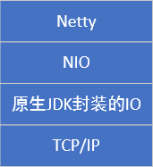


**Netty的实际应用**
- 大数据领域：Apache-Flink、Apache-Spark
- 游戏领域：联机游戏
- 互联网领域：分布式系统中结点之间的远程调用，如Dubbo

一般来说，需要用到高并发网络通信的地方都需要用到Netty


**推荐书籍**
Netty实战、Netty权威指南

# Java IO模型
Java支持三种网络IO模型，分别是BIO（阻塞IO）,NIO（非阻塞IO）,AIO（异步非阻塞IO，但只在windows系统上适用）

## BIO模型

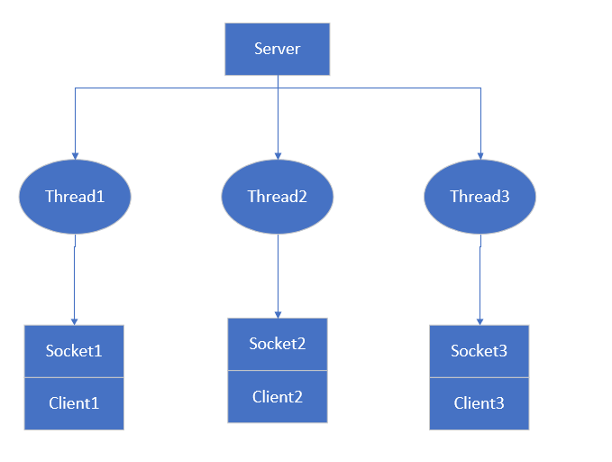

工作机制：
1. Server启动一个监听线程监听Client请求
2. 对于每一个可接收的Client请求，Server将创建一个线程与客户端进行通信

弊端：
1. 每个通信线程都是阻塞式的，如果和客户端交流并不频繁，则CPU浪费率很大
2. 对于每一个客户端都需要新建一个线程，当客户端很多是，系统负荷太大

应用场景：连接数目较小且固定的场景


## NIO模型

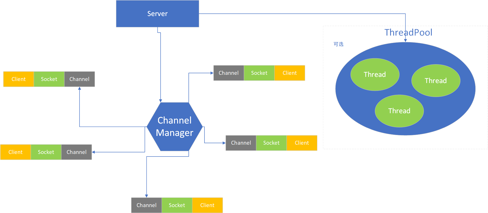

工作机制：
1. Server启动一个Channel Manager作为所有通信通道的管理者
2. 每个Client若希望与Server进行网络IO通信，则它会将希望进行的操作（如读、写、建立连接等）在Channel Manager处注册一个Channel
3. Channel Manager会不断轮询所有注册在册的Channel，若这个Channel中有事件发生，则对这个事件进行处理
4. 处理事件的线程既可以是Channel Manager所处线程，也可以是从线程池中取一个线程来进行处理（通常这种方式更高效）

Channel Manager通常被称作`Selector`，除此之外，NIO的核心组件还包括`Buffer`,`Channel`。
Buffer在上图中未表现，它实际上是Channel和Socket之间的缓冲区。

应用场景：连接数目较多且连接比较短的场景，如聊天服务器、弹幕系统、服务器之间的通讯等

### Buffer
Buffer是缓冲区，正是因为NIO模型具有Buffer，因此它是基于块的读写，相比于BIO基于流的读写更有效率。Buffer类派生了IntBuffer,ByteBuffer等子类，所有Buffer类保存数据的底层结构都是数组。

**Buffer类的核心属性**

|属性|描述|备注|
|---|---|---|
|capacity|容量|可容纳的最大数据量，在缓冲区创建时设定，设定后不可改变|
|limit|缓冲区当前终点|不能对缓冲区中超过limit的位置进行读写，limit是可以修改的|
|position|位置|下一个读/写元素的索引|
|mark|标记|可以在某些位置设置一些标记以方便用户操作|

### Channel
相比于流只能单向操作（读或者写），而通道支持同时读写。在NIO中，Channel从Buffer中读数据（write(ByteBuffer src)），写数据到Buffer中(read(ByteBuffer dst))。
Channel是NIO中的一个接口，常用的Channel类如下：
- ServerSocketChannel：对应服务器监听客户请求Socket
- SocketChannel：对应Server-Client通信Socket
- DatagramChannel：对应UDP数据报通信
- FileChannel：对应文件读写


### Selector
在NIO模型中充当一个管理者的角色，将不断轮询所有在它这注册过的channel，当channel处有事件发生时，通知相应程序来处理事件。这种机制使得服务器一个线程可以负责与多个客户端之间的通信，其中每个线程对应一个Selector。

**Selector常见操作**
```
// 创建一个Selector
Selector selector = Selector.open();
// 将一个channel注册到selector上
channel.register(selector,SelectorKey.OP_XXXX,[Buffer]);
// selector进行轮询
selector.select([time(ms)]);
// 获取Selector上所有有事件发生的SelectionKey（每个SelectionKey与一个注册事件相关联）
Set<SelectionKey> selectionKeys = selector.selectedKeys();
// 获取Selector上所有注册的SelectionKey
Set<SelectionKey> selectionKeys = selector.keys();
// 根据SelectionKey获取关联的Channel
channel = key.channel();
// 根据key获取关联channel的buffer
buffer = key.attachment();
```

### NIO与零拷贝
> 零拷贝并不意味着拷贝数目为0，而意味着CPU拷贝次数为0


**传统网络通信IO过程**

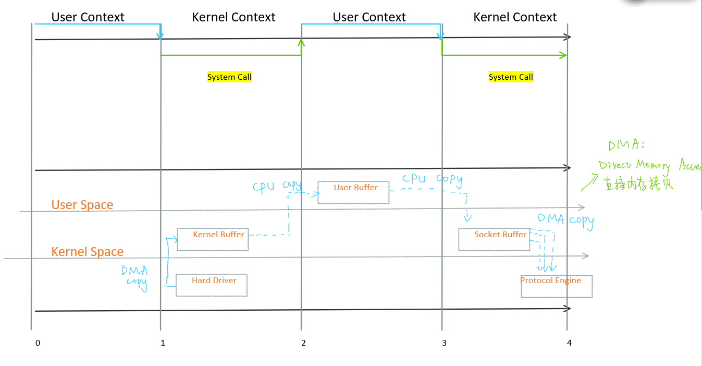

1. 数据一开始是存在于硬件驱动（`Hard Driver`）中的
2. 通过DMA将硬件中的数据传输到操作系统的内核空间里的缓冲区（`Kernel Buffer`）
3. 通过CPU总线将内核空间中的数据复制到用户空间里的缓冲区（`User Buffer`）
4. 通过CPU总线将用户空间的数据复制到内核空间中的套接字缓冲区（`Socket Buffer`）中
5. 套接字缓冲区再将数据复制到协议栈引擎（`Protocol Engine`）中

传统IO过程经历了4次复制，3次（用户态和内核态的）上下文切换

**mmap优化**

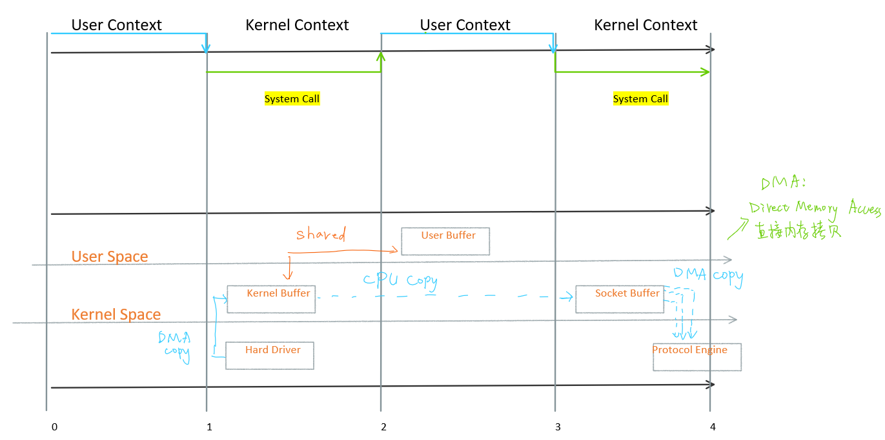

mmap通过内存映射，将文件映射到内核缓冲区。同时，用户空间可以共享内核空间的数据。这样，在网络传输过程中，就可以减少一次内核空间到用户空间的拷贝。
mmap优化后网络通信过程经历了3次复制，3次上下文切换

**sendFile优化**

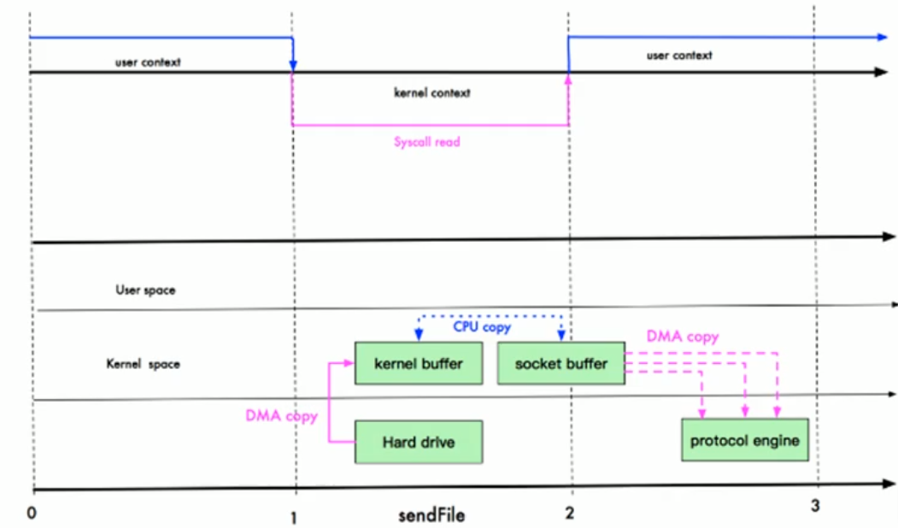

Linux2.1提供了sendFile函数，使得内核缓冲区中的数据可以不经过用户态直接拷贝到socket缓冲区内。
sendFile优化后网络通信过程经历了3次复制，2次上下文切换

**零拷贝**

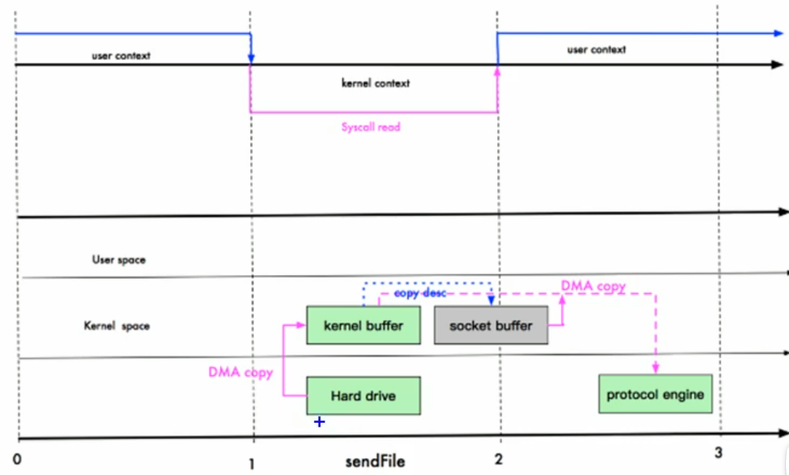

Linux2.4对sendFile函数做了优化，避免了从内核缓冲区将数据拷贝到socket缓冲区的操作，直接将内核缓冲区中的数据拷贝到了协议栈。这里其实有一次cpu拷贝（kernel buffer-->socket buffer），但拷贝的信息很少（如length,offset），消耗低，可以忽略。
这种方式可以近似经历了2次复制，2次上下文切换


## AIO模型
AIO引入了异步通道的概念，采用Proactor模式，简化了程序编写：有效的请求才启动线程，它的特点是先由操作系统完成后才通知服务端启动线程去处理。

应用场景：连接数目比较多且连接比较长的场景，如相册服务器


# Reactor模式

Reactor模式是一种设计模式，它是基于事件驱动的，可以并发的处理多个服务请求，当请求抵达后，依据多路复用策略，同步的派发这些请求至相关的请求处理程序。

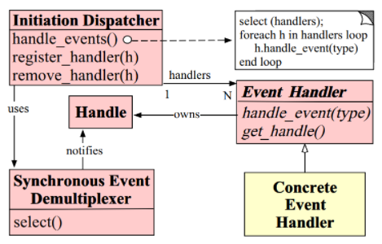

- **Handle**：操作系统的一种资源，用于表示一个事件（在网络编程中可以是连接事件、写事件、读事件）
- **Synchronous Event Demultiplexer**：本质上是一个系统调用，用于等待事件的发生。调用方在调用它是会阻塞，直到同步事件分离器上有事件发生
- **Initiation Dispatcher**：定义了一些控制事件的调度规范，提供事件管理。
- **Event Handler**：事件处理器的接口
- **Concrete Event Handler**：事件处理器的实现

**Reactor模式的工作流程**
1. 初始化Initiation Dispatcher，若干个Concret Event Handler注册到Dispatcher中（希望Dispatcher会在注册的事件发生时通知自己）
2. Initiation Dispatcher会要求每个Handler向其传递内部Handle，操作系统可以通过Handle标识对应的Handler
3. 当所有Concret Event Handler注册完毕，Initiation Dispatcher将启动循环，使用Synchronous Event Demultiplexer等待事件的发生
4. 当某个Handle发生时，Synchronous Event Demultiplexer会通知Initiation Dispatcher
5. Initiation Dispatcher再调用相应的Handler回调方法处理这个事件


## 单Reactor单线程

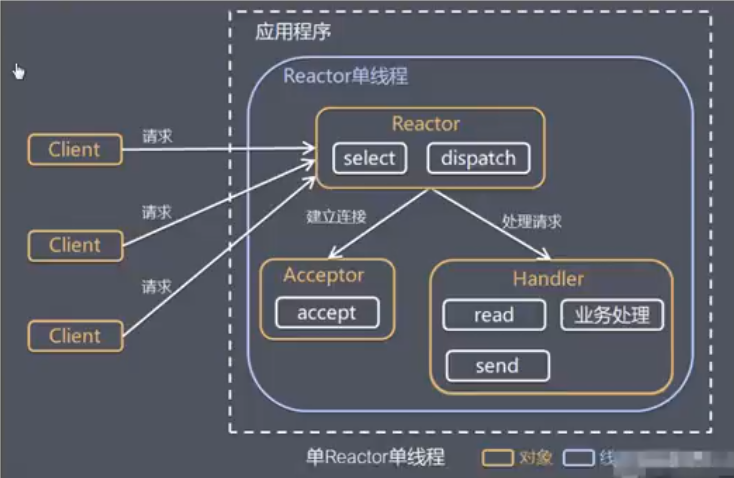

**工作机制**
1. Reactor通过select监听客户端请求事件，当有事件发生时，调用dispatcher进行分发
2. 如果是建立连接请求事件，则Acceptor通过accept处理连接请求事件，然后创建一个Handler对象处理完成连接后的各种事件
3. 如果不是连接请求，则由Reactor分发调用对应的Handler进行处理

Reactor和Handler都在同一线程中，说明当Handler在处理时，Reactor是不能工作的，那么此时到来的客户端请求就会被阻塞。

## 单Reactor多线程

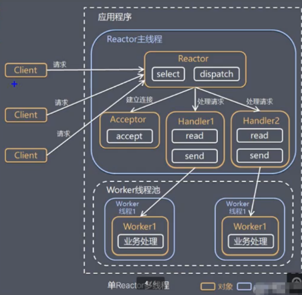

**工作机制**
1. Reactor通过select监听客户端请求事件，当有事件发生时，调用dispatcher进行分发
2. 如果是建立连接请求事件，则Acceptor通过accept处理连接请求事件，然后创建一个Handler对象处理完成连接后的各种事件
3. 如果不是连接请求，则由Reactor分发调用对应的Handler进行处理
4. Handler只负责响应事件，不做具体的业务处理。响应事件的Handler，会在读完数据后，分发给工作线程池中的某个线程处理具体的业务逻辑
5. 工作线程池会分配独立线程完成真正的业务，并将结果返回给Handler
6. Handler收到响应后，通过send方法将结果返回给客户端


## 主从Reactor多线程

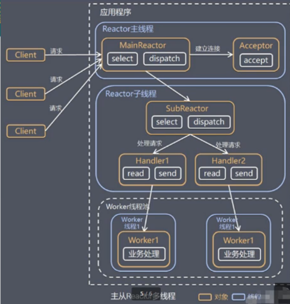

**工作机制**
1. Reactor主线程MainReactor对象通过select监听事件，收到连接事件后，通过Acceptor处理
2. 当Acceptor处理完连接事件后，MainReactor将连接分配给SubReactor
3. SubReactor将连接放入连接队列中进行监听，并创建Handler进行各种事件处理
4. 当有事件发生时，SubReactor就会调用对应的Handler进行处理
5. Handler通过read读取事件，然后分发给工作线程处理
6. 工作线程池分配独立的工作线程进行业务处理，返回结果给Handler
7. Handler收到响应的结果后，再通过send方法将结果返回给Client

MainReactor可以关联多个SubReactor

# Netty模型

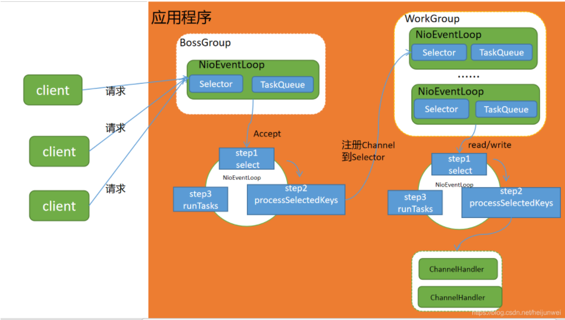

- Netty抽象出两组线程池
  - BossGroup专门负责处理与客户端之间的连接；
  - WorkGroup专门负责网络读写
  - BossGroup和WorkGroup类型都是NioEventLoopGroup
- NioEventLoopGroup相当于一个事件循环组，这个组中包含多个事件循环，每个循环都是一个NioEventLoop
- NioEventLoop表示一个不断循环的执行处理任务的线程，每个NioEventLoop上都有一个Selector，用于绑定在其上的socket网络通信
- NioEventLoopGroup可以有多个线程，即可以含有多个NioEventLoop
- 每个Work NioEventLoop处理业务时，会使用PipeLine（管道），PipeLine中包含了Channel（即可以通过PipeLine获取对应的Channel），同时管道中维护了很多Handler（处理器）

**数量关系**
- NioEventLoopGroup下包含多个NioEventLoop
- 每个NioEventLoop包含一个Selector，一个TaskQueue
- 每个Selector上可以注册多个NioChannel
- 每个NioChannel只会绑定在唯一的Selector上
- 每个NioChannel都绑定一个自己的ChannelPipeLine

**Boss NioEventLoop执行步骤**
1. 轮询accept事件
2. 处理accept事件，与Client建立连接，生成NioSocketChannel，并将其注册到某个Work NioEventLoop上的Selector
3. 处理任务队列的任务，即runAllTasks

**Work NioEventLoop执行步骤**
1. 轮询read/write事件
2. 处理IO事件（即read/write事件），在对应的NioSocketChannel上进行处理
3. 处理任务队列的其他任务，即runAllTasks

# Netty核心组件

## EventLoopGroup
EventLoopGroup是一个接口，常用实现类为NioEventLoopGroup。

- BossGroup和WorkerGroup都属于NioEventLoopGroup类，一个EventLoopGroup中可以包含多个EventLoop，具体数目默认为8，也可在创建时由程序员配置
- 一般将BossGroup配置1个EventLoop，对应着一个Selector，一个ServerSocketChannel，处理来自客户端的连接事件
- 如果连接结果是OP_ACCEPT，则交由Acceptor进行处理，否则则交给WorkerGroup处理后续I/O操作
- WorkerGroup对应多个EventLoop，每个EventLoop对应着一个Selector，每个Selector轮询注册到此EventLoop上的所有Channel
- EventLoopGroup具有next方法，返回下一个EventLoop

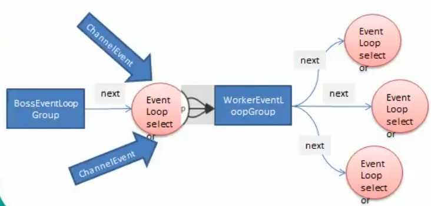

**创建方法**
```
// nThread默认个数为8
NioEventLoopGroup bossGroup = new NioEventLoopGroup(1);
NioEventLoopGroup workerGroup = new NioEventLoopGroup();
```

**关闭方法**
```
group.shutdownGracefully();
```

## Bootstrap
Bootstrap的意思是引导，Netty程序通常是从一个Bootstrap开始，用作配置整个Netty程序。其中，服务端程序使用的是ServerBootstrap，客户端使用的是Bootstrap。

**常见方法**
```
// Server端使用ServerBootstrap配置两个EventLoopGroup
serverBootstrap.group(bossGroup,workerGroup);
// 客户端使用Bootstrap配置一个EventLoopGroup
boostrap.group(workerGroup);
// 配置一个通道实现
channel(Class channelClass)
// 用来给ServerChannel添加配置
option(ChannelOption<T> option,T value)
// 用来给接收到的通道添加配置
childOption(ChannelOption<T> option,T value)
// 为bossGroup中的事件添加业务处理类
handler(ChannelHandler handler)
// 为workerGroup中的事件添加业务处理类
childHandler(ChannelHandler handler)
// 用于服务器端，占用端口号
ChannelFuture bind(int inetPort)
// 用于客户端，连接服务器
ChannelFuture connect(String inetHost,int inetPort)
```

## ChannelOption

**SO_BACKLOG**
对应TCP/IP协议中的listen函数的backlog参数，用来初始化服务器可连接队列大小。服务端对客户端的请求是顺序处理的，且在同一时间只能处理一个客户端的连接请求。当服务端正在处理连接请求时，有新的连接请求到来则会被放入可连接队列中等待。

**SO_KEEPALIVE**
设置为true的话则代表一直保持连接状态

## ChannelFuture
Netty中所有的IO操作的异步的，若想知道消息是否被正确处理，就需要通过ChannelFuture注册一个监听，当操作完成时监听会自动触发注册的监听事件。

**异步机制**
当异步执行某个操作时，当前线程不需要等待操作完成。当前线程调用此操作会立即得到一个返回的Future接口，然后此操作（任务）会在其他线程中执行。通过调用Future接口中的一系列方法此可以知道任务异步执行的情况，同时也可以通过添加监听器的方式来指示任务异步完成后自动执行的回调函数。

**Future-Listener机制**
```
// 绑定一个端口并且同步
ChannelFuture channelFuture = bootstrap.bind(6668).sync();
// 注册监听函数执行完成后的操作
channelFuture.addListener(new ChannelFutureListener() {
    @Override
    public void operationComplete(ChannelFuture channelFuture) throws Exception {
        if(channelFuture.isSuccess()){
            System.out.println("服务器绑定端口成功");
        }
        else {
            System.out.println("服务器绑定端口失败");
        }
    }
});
```

## ChannelHandler
ChannelHandler是一个接口，处理或拦截I/O事件，并将其转发到ChannelPipeLine（业务处理链）中的下一个处理程序

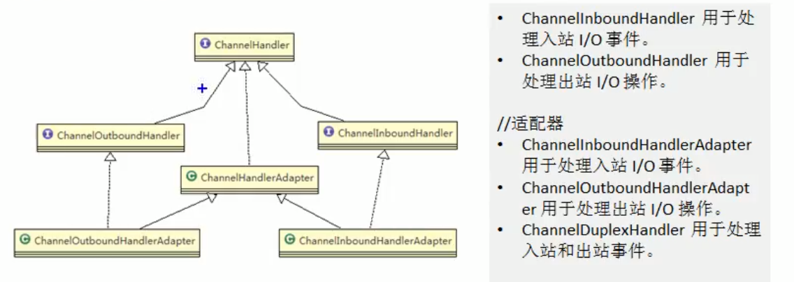

以客户端为例：
- 出站：如果事件的运动方向是从客户端到服务端，则称这些事件为出站
- 入站：如果事件的运动方向是从服务端到客户端，则称这些事件为入站

## ChannelPipeline

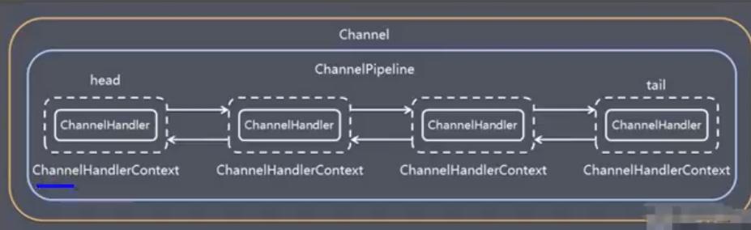

入站和出站事件在一个双向链表中：
- 入站事件会从链表head往后传递到最后一个入站的handler；
- 出站事件会从链表tail往前传递到最前一个出站的handler。
- 两种类型的handler互不影响，因为入站handler和出站handler分别保存在两条不同的双向链表中
  - 入站handler实现ChannelInboundHandler\<C\>接口，如解码器
  - 出站handler实现ChannelOutboundHandler\<C\>接口，如编码器
  - C代表通道类型，在网络通信中一般是SocketChannel


## TaskQueue

任务队列保存某些了耗时长的业务操作，TaskQueue中的任务会异步执行。在Netty模型中，TaskQueue有一个线程，它会不断从队头取一个任务进行执行。

**将任务加入TaskQueue的方法**

方案1：用户程序自定义普通任务
```
ctx.channel().eventLoop().excute(new Runnable(){
  @Override
  public void run(){
    // 耗时长的业务操作
  }
});
```

方案2：用户自定义定时任务
```
// 该任务是提交到scheduleTaskQueue
ctx.channel().eventLoop().schedule(new Runnable(){
  @Override
  public void run(){
    // 耗时长的业务操作
  }
},5,TimeUnit,SECONDS);
```

方案3：非当前Reactor线程调用Channel中的各种方法
一般是用在推送系统中。做法是用一个集合类保存需要推送消息的Channel，在需要推送时，遍历这个集合，获取每个Channel，然后调用eventLoop()函数获得他们所在的NioEventLoop，在对应的TaskQueue或ScheduleTaskQueue中加入任务。


## Unpooled
Unpooled类是Netty提供的一个专门用来操纵缓冲区的工具类

ByteBuf底层是一个数组，因此创建时可以指定其大小
```
ByteBuf buf = Unpooled.buffer(10);
```

在Netty中，ByteBuf不需要flip进行反转。Netty底层通过维护readIndex,writeIndex,capacity三个变量来控制读写区域。其中[0,readIndex)表示已读取区域； [readIndex,writeIndex)表示可读区域； [writeIndex,capacity)表示可写区域。

```
buf.writeByte(i); // 写入数据
buf.readByte();   // 读取数据
```

# Netty编码解码
在编写网络应用程序时，由于数据在网络中都是以二进制形式进行传输，因此在发送数据时就需要将业务数据编码成字节码，在接收数据后就需要将字节码解码成业务数据。
codec（编解码器）由两部分组成，分别是：decoder(解码器);encoder(编码器)

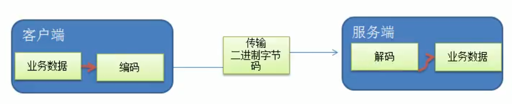

**Netty自身编码解码机制和问题**
1. Netty自身提供了一些codec
   - StringEncoder、StringDecoder：字符串编码、解码器
   - ObjectEncoder、ObjectDecoder：Java对象编码、解码器
2. Netty本身自带的Java对象编码、解码器底层使用的是序列化技术，此技术存在一些问题
   - Java序列化技术效率不高
   - 无法跨语言
   - 序列化后体积太大，是二进制编码的5倍多
3. 新的解决方案是Google的Protobuf

## Protobuf
Protobuf是谷歌发布的开源项目，全称Google Protocol Buffers，是一种轻便高效的结构化数据存储格式，可以用于结构化数据串行化（序列化）。
它很适合做数据存储或者RPC(Remote Procedure Call)数据交换格式。目前很多公司都从http+json的方式转换到tcp+protobuf的方式。

**ProtoBuf在java中的使用原理**
- 将类的定义通过.proto文件进行描述
- 然后通过protoc.exe编译器根据.proto自动生成.java文件

**ProtoBuf在IDEA中使用步骤**
1. 在pom.xml中添加protobuf-java依赖
```
<dependency>
    <groupId>com.google.protobuf</groupId>
    <artifactId>protobuf-java</artifactId>
    <version>3.13.0</version>
</dependency>
```

2. 编写.proto文件

3. 在pom.xml文件中添加编译插件
```
<build>
    <plugins>
        <plugin>
            <groupId>org.xolstice.maven.plugins</groupId>
            <artifactId>protobuf-maven-plugin</artifactId>
            <version>0.6.1</version>

            <configuration>
                <protocExecutable>
                    D:\protoc-3.13.0\bin\protoc.exe  <!-- 刚刚环境变量配置的位置 -->
                </protocExecutable>
                <pluginId>protoc-java</pluginId>
                <!-- proto文件放置的目录 -->
                <protoSourceRoot>${project.basedir}/src/main/java/com/dynner/netty/codec2</protoSourceRoot>
                <!-- 生成文件的目录 -->
                <outputDirectory>${project.basedir}/src/main/java/com/dynner/netty/codec2</outputDirectory>
                <!-- 生成文件前是否把目标目录清空，这个最好设置为false，以免误删项目文件 -->
                <clearOutputDirectory>false</clearOutputDirectory>
            </configuration>
            <executions>
                <execution>
                    <goals>
                        <goal>compile</goal>
                    </goals>
                </execution>
            </executions>
        </plugin>
    </plugins>
</build>
```

4. 利用Maven项目编译

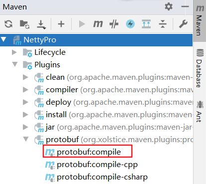

## ByteToMessageDecoder

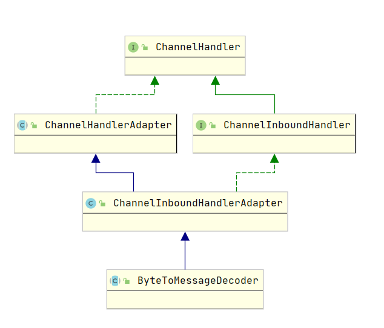

由于不知道远程节点是否会一次性发送一个完整消息，TCP可能会出现粘包拆包问题。这个类会对入站数据进行缓冲，知道它准备好被处理。

## handler链中的解码编码handler
- 不论解码handler还是编码handler，接收的消息必须与待处理的消息类型一致，否则handler不会被执行
- 在解码器进行解码时，需要判断缓存（ByteBuf）的数据是否足够，否则接收到的结果可能会与期望的结果不一致

## Netty其他常用编码、解码器

**ReplayingDecoder**
ReplayingDecoder\<S\> 扩展了ByteToMessageDecoder类
- 优点
  - 不必调用readableBytes方法人工判定缓存中数据量是否足够做转换
  - 参数S指定了用户状态管理类型（void表示不需要状态管理）
- 缺点
  - 并不是所有ByteBuf操作都支持
  - 某些情况下速度比ByteToMessageDecoder慢

**LineBasedFrameDecoder**
使用行尾控制符（\n或\r\n）作为分隔符来解析数据

**DelimiterBasedFrameDecoder**
使用自定义的特殊字符作为消息的分隔符

**HttpObjectDecoder**
一个Http数据的解码器

**LengthFieldBasedFrameDecoder**
通过指定长度来标识整包消息，这样就可以自动的处理粘包和半包消息


# TCP粘包和拆包
TCP是面向连接、面向流的，提供高可靠性服务。消息收发两端都要有一个成对的socket。发送端为了更高效的将包发送给接收方，使用了优化方法（Nagle算法），将多次间隔较小且数据量小的数据，合成一个大的数据块，然后进行封包。这样做虽然提高的效率，但接收端就难以分辨出完整的数据包了。因为面向流的通信是无消息保护边界的。由于TCP无消息保护边界，需要在接收端处理消息边界问题。


**案例说明**

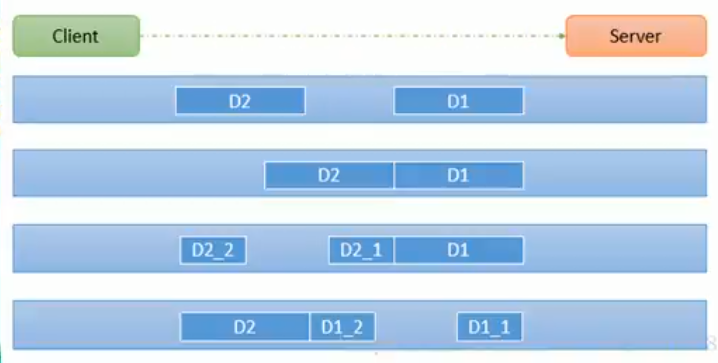

1. 前提：客户端发送了两个数据包 D1 和 D2 给服务端
2. 情况1：服务端分两次读取到两个独立数据包 D1 和 D2。没有粘包和拆包
3. 情况2：服务端一次接收到了两个数据包，D1 和 D2 粘合在一起。称之为TCP粘包
4. 情况3：服务端分两次读取到了数据包：第一次读取到完整的 D1 包和 D2 包部分内容；第二次读取到 D2 包剩余内容。称之为 TCP拆包
5. 情况4：服务端分两次读取到了数据包：第一次读取到了 D1 包的部分内容；第二次读取到了 D1 包的剩余内容和 D2 包。

# 来源
[尚硅谷韩顺平Netty教学](https://www.bilibili.com/video/BV1DJ411m7NR?from=search&seid=2689171580875062493)