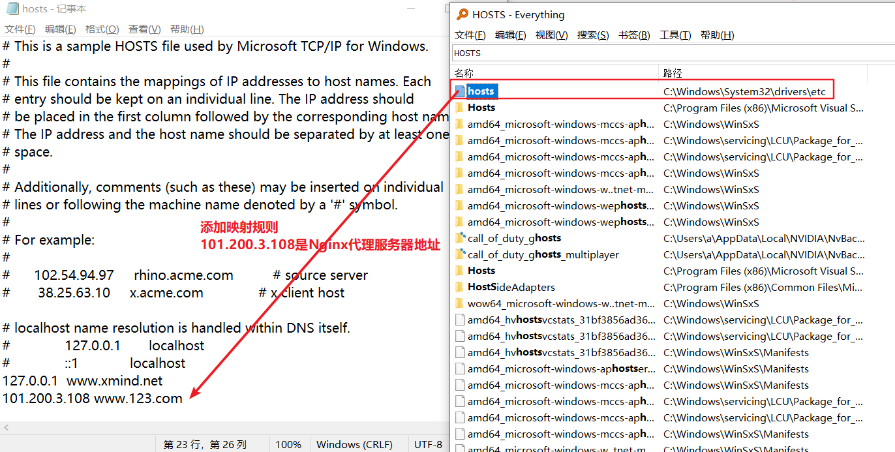
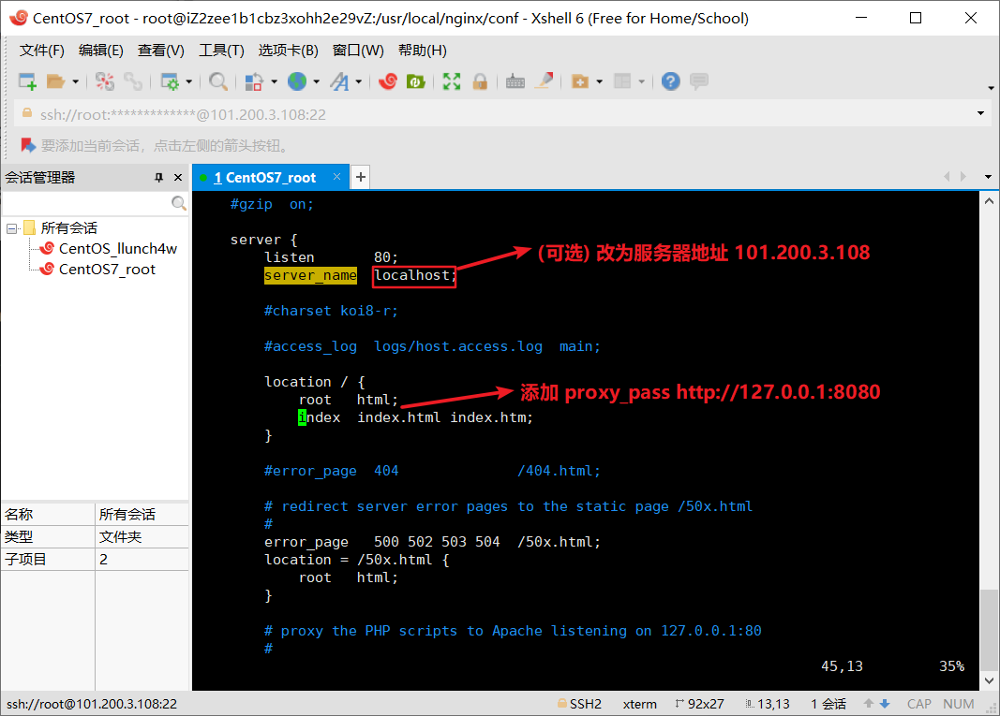

 ^ _ ^ 
<!-- more -->

# Nginx简介

Nginx是一个高性能反向代理服务器，其特点包括 _占用内存少_ ，_并发能力强_ 。Nginx专门为性能优化而开发，能经受住高负载的考验。

## 反向代理

**正向代理**：客户端通过代理服务器访问因特网，正向代理中客户端需要配置代理服务器。客户端对服务端来说是透明的，即服务端并不知道客户端的地址，知道的是代理服务器的地址。

**反向代理**：客户端仍是通过代理服务器访问因特网，但反向代理中客户端对代理无感知，不需要任何配置就可以访问。而反向代理服务器会从服务器集群中选择一个服务器获取数据返回。服务端和反向代理服务器对于客户端来说是一个整体。暴露的是代理服务器的地址，隐藏了真实服务器的IP地址。

## 负载均衡

代理服务器将接收到的客户端请求分发到服务器集群中的某个服务器上，使得单个服务器上的负载压力减小。

## 动静分离

将动态资源（jsp、servlet等)与静态资源（html、css、js、image等）分开部署

## 高可用

可以保持 7*24 不间断运行

# Nginx安装

Hexo博客部署到服务器文章中已写过，这篇文章中略

[跳转到Hexo博客部署博文](http://localhost:4000/2020/11/16/Hexo%E5%8D%9A%E5%AE%A2%E9%83%A8%E7%BD%B2%E5%88%B0%E6%9C%8D%E5%8A%A1%E5%99%A8/)

# Nginx配置

## Nginx配置文件

### 配置文件地址
/usr/local/nginx/conf/nginx.conf

### 配置文件组成

**1.全局块**
- 不在大括号里的内容
- 设置nginx服务器整体运行的配置指令
  - 运行Nginx服务器的用户（组）
  - 允许生成的 worker process 数
  - 进程 PID 存放路径
  - 日志存放路径和类型
  - 其他配置文件的引入

**2.events块**
- 影响Nginx服务器和用户网络之间的连接
  - 是否开启对多 work process 下的网络连接序列化
  - 是否允许同时接受多个网络连接
  - 选取哪种事件驱动模型来处理连接请求
  - 每个 work process 可以同时支持的最大连接数

**3.http块**
- 包含http全局块和server块
- http全局块配置的指令包括
  - 文件引入
  - MIME-TYPE定义
  - 日志自定义
  - 连接超时间
  - 单链接请求数上限
- server块包含全局server块和location块
  - 一个server可配置多个location
  - 全局server最常见的配置：
    - 监听配置
    - 主机名称
    - 主机IP配置
  - location块的作用是：
    - 基于Nginx服务器接收到的请求字符串，对主机名称（或IP别名）之外的字符串进行匹配，对特定请求进行处理
    - 地址定向
    - 数据缓存
    - 第三方模块

## Nginx配置实例

### 反向代理配置实例

**前提条件**
已安装好tomcat服务器
[跳转到安装教程](http://localhost:4000/2020/11/16/CentOS%E4%B8%8A%E7%9A%84%E7%8E%AF%E5%A2%83%E5%AE%89%E8%A3%85/)

#### 实例1

**实现目标**
在本机Windows浏览器上访问网址 [www.123.com](http://www.123.com:8080)，跳转到tomcat主页

**前提条件**
拥有并启动一个Tomcat服务器

**1. 修改Windows下的HOST文件，添加地址映射**

**检测**
浏览器端访问 [https://www.123.com:8080](https://www.123.com:8080) ，将跳转到tomcat页面

**2. 对nginx进行请求转发配置（反向代理配置）**

#### 实例2

**实现目标**
1. 访问 [http://101.200.3.108:9001/edu](http://101.200.3.108:9001/edu) 直接跳转到 127.0.0.1:8080
2. 访问 [http://101.200.3.108:9001/vod](http://101.200.3.108:9001/vod) 直接跳转到127.0.0.1:8080

**前提条件**
拥有并启动两个Tomcat服务器

### 负载均衡配置实例

### 动静分离配置实例

### 高可用配置实例