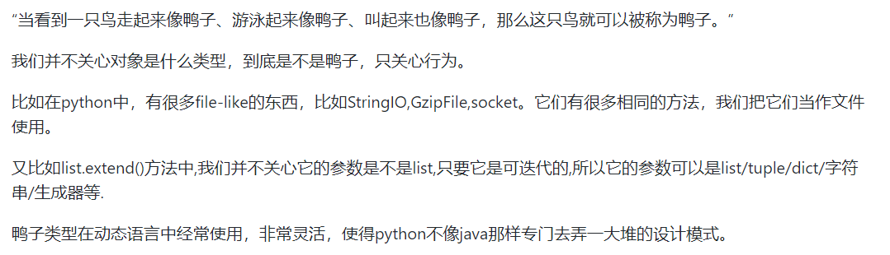

 ^ _ ^ 
<!-- more -->

# 函数参数传递
```python
a = 1
def fun(a):
    print "func_in",id(a)   # func_in 41322472
    a = 2
    print "re-point",id(a), id(2)   # re-point 41322448 41322448
print "func_out",id(a), id(1)  # func_out 41322472 41322472
fun(a)
print a  # 1
```

```python
a = []
def fun(a):
    print "func_in",id(a)  # func_in 53629256
    a.append(1)
print "func_out",id(a)     # func_out 53629256
fun(a)
print a  # [1]
```

**原因解释**
- Python中包含6大数据类型，其中list、set、dict为可变对象，number、tuple、string为不可变对象
- Python函数传参时，传的是对象的地址
- 对于可变对象，会根据传来的对象地址直接在内存中修改对象
- 而对于不可变对象，当需要对其进行修改时，会分配一块新的内存区域（并复制原值到该区域），对这块新分配的内存区域进行操作

# 元类(metaclass)
解释：[https://www.liaoxuefeng.com/wiki/1016959663602400/1017592449371072](https://www.liaoxuefeng.com/wiki/1016959663602400/1017592449371072)

# 静态方法、类方法、实例方法
```python
class A(object):
    # 实例方法
    def foo(self,x):
        print "executing foo(%s,%s)"%(self,x)

    # 类方法
    @classmethod
    def class_foo(cls,x):
        print "executing class_foo(%s,%s)"%(cls,x)

    # 静态方法
    @staticmethod
    def static_foo(x):
        print "executing static_foo(%s)"%x
```

# 类变量和实例变量
- 类变量被多个实例对象共享
- 实例变量为实例对象本身私有

**普通例子**
```python
class Test(object):  
    num_of_instance = 0  
    def __init__(self, name):  
        self.name = name  
        Test.num_of_instance += 1  
  
if __name__ == '__main__':  
    print Test.num_of_instance   # 0
    t1 = Test('jack')  
    print Test.num_of_instance   # 1
    t2 = Test('lucy')  
    print t1.name , t1.num_of_instance  # jack 2
    print t2.name , t2.num_of_instance  # lucy 2
```

**补充例子**
```python
class Person:
    name="aaa"

p1=Person()
p2=Person()
p1.name="bbb"
print p1.name  # bbb
print p2.name  # aaa
print Person.name  # aaa
```
- 本质上是函数传参的问题
- 这里p1.name="bbb"是实例调用了类变量，p1.name一开始是指向的类变量name="aaa",但是在实例的作用域里把类变量的引用改变了,就变成了一个实例变量,self.name不再引用Person的类变量name了。

# 自省
自省就是面向对象的语言所写的程序在运行时,所能知道对象的类型.简单一句就是运行时能够获得对象的类型。
例如：type(),dir(),getattr(),hasattr(),isinstance().

# 字典推导式
```python
d = {key: value for (key, value) in iterable}
```

# 单下划线和双下划线
- `__foo__`：python内部名字
- `_foo`：变量私有
- `__foo`：解析器用_classname__foo来代替这个名字,以区别和其他类相同的命名,它无法直接像公有成员一样随便访问,通过对象名._类名__xxx这样的方式可以访问.

# 迭代器和生成器

# \*args and \*\*kwargs

# AOP和装饰器
解释：[https://www.cnblogs.com/huxi/archive/2011/03/01/1967600.html](https://www.cnblogs.com/huxi/archive/2011/03/01/1967600.html)

# 鸭子类型


1

# 重载
函数重载主要是为了解决两个问题：
1. 可变参数类型：对于这种情况，Python中函数传参本来也不需要指明参数类型
2. 可变参数个数：对于这种情况，Python中可使用缺省参数

因此，Python中不需要重载

# 新式类和旧式类
