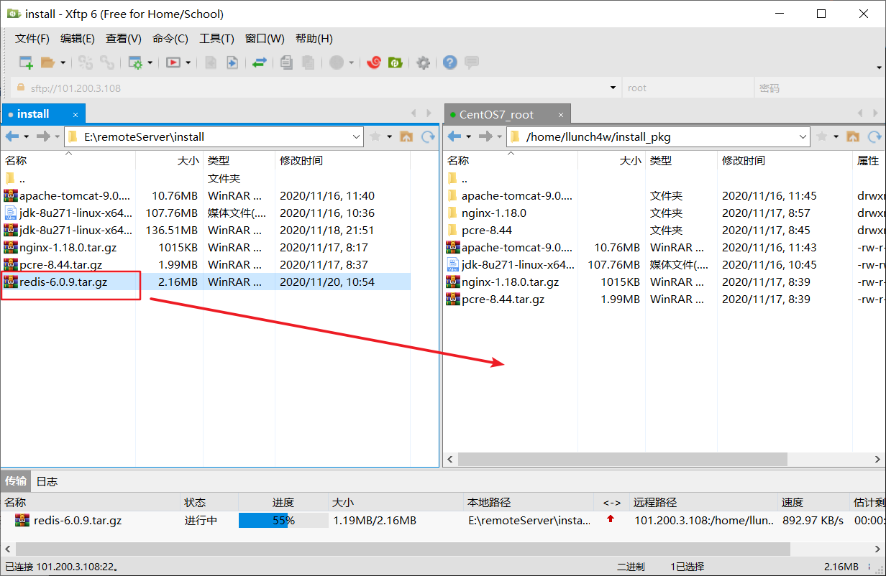
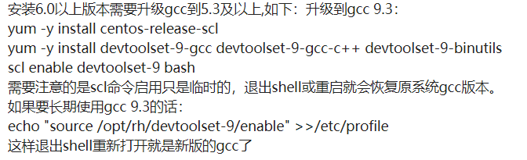
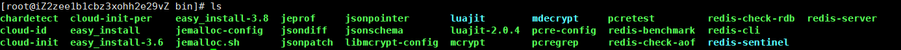
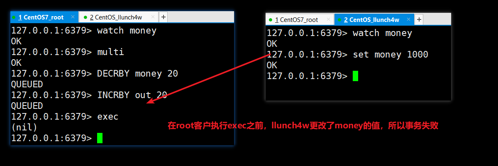
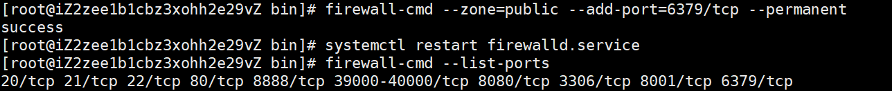
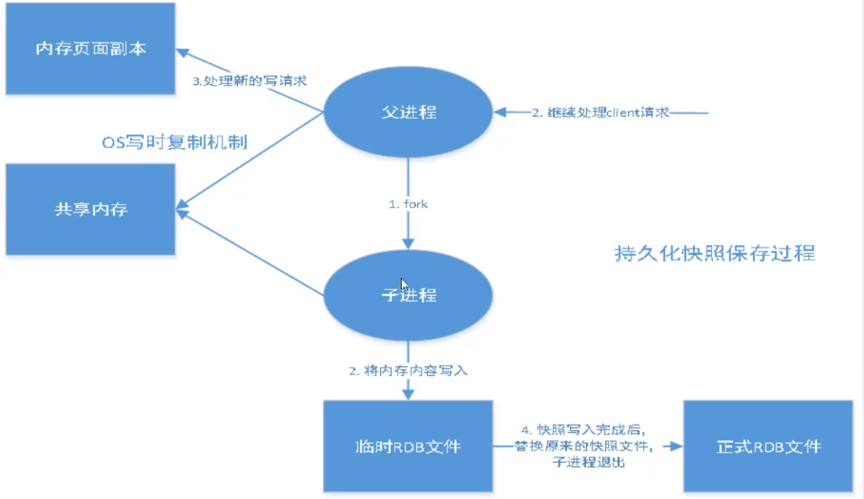
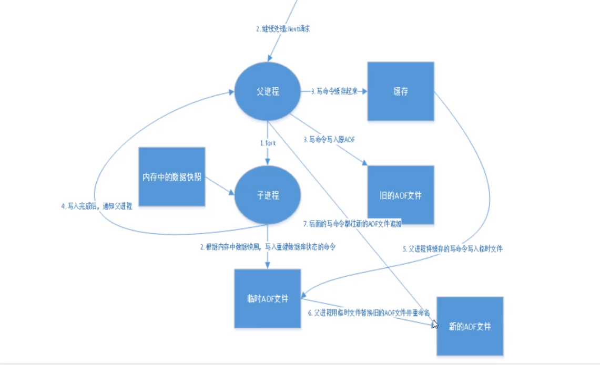
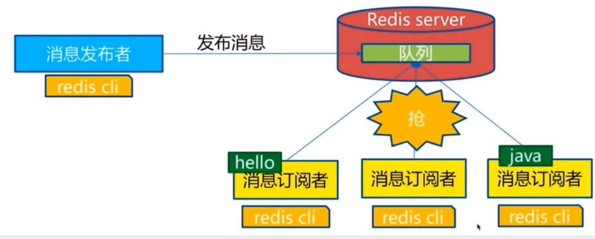

 ^ _ ^ 
<!-- more -->

# 简介

Redis：Remote Dictory Servicce，远程字典服务，是一个基于key-value方式的高性能存储系统。

**特点**
- Redis支持数据的持久化，可以将内存中的数据保存在磁盘中，重启的时候可以再次加载进行使用。
- Redis不仅仅支持简单的key-value类型的数据，同时还提供list，set，zset，hash等数据结构的存储。
- Redis支持数据的备份，即master-slave模式的数据备份。

**应用**
- 内存存储，持久化(rdb,aof)
- 高速缓存
- 发布订阅系统
- 地图信息分析
- 计时器、计数器（浏览量）


# 安装和配置

## 安装

**1. 下载Redis安装包**

Redis下载地址：[https://redis.io/](https://redis.io/)

**2. 将安装包通过Xftp传输到服务器中**



**3. 解压缩压缩包**

```
# tar -zxvf redis压缩包名称
tar -zxvf redis-6.0.9.tar.gz
# 将解压得到的redis文件夹移动到/etc/opt目录（仅仅因为这个目录通常用来存放用户安装文件）
mv redis-6.0.9 /etc/opt
```

**4. （根据电脑环境选择）**

Redis是根据 ANSI C 语言编写的，所以编译需要c++环境，如果环境下没有的话，需要先安装c++
```
yum -y install gcc-c++
```

**5. 执行make命令**
```
# 进入redis文件夹
make && make install
```

> make命令执行后发生了错误，发现是因为gcc版本过低，需要升级版本



解决方法1：使用redis6以下的版本进行安装

redis5安装地址：[https://redis.io/download](https://redis.io/download)

解决方案2：放弃解压缩安装方式，直接使用docker一键安装
```bash
docker pull redis # 从远程仓库拉取redis镜像

docker run --name redis01 -d -P redis # 通过镜像创建并启动一个容器命名为redis01

docker exec -it redis01 /bin/bash # 以交互方式进入容器

redis-cli # redis命令：进入redis客户端
```

## Redis目录

/usr/local/bin




## 配置

_将/etc/opt/redis-5.0.10/下的配置文件移动到/usr/local/bin/kconfig下，修改kconfig下的配置文件来控制redis的启动_

1. 进入/usr/local/bin
2. 创建配置文件目录kconfig
3. 将/etc/opt/redis-5.0.10/下的redis.conf文件复制到kconfig文件夹下


4. redis默认不是后台启动的，修改配置文件中`daemonsize`的值为`yes`


## 启动测试

```bash
cd /usr/local/bin

redis-server kconfig/redis.conf

# 连接
redis-cli -p 6379 
ping

# 关闭连接（可选）
shutdown
# 退出
exit
```

# Redis命令

## 切换数据库

- redix默认有16个数据库，在配置文件中通过`databases`配置
- 默认进入的是0号数据库，可通过`select`命令进行切换
- 可使用`dbsize`命令查看当前数据库大小
- 可使用`flushdb`清空当前数据库
- 可使用`flushall`清空所有数据库

## 数据类型

### Redis-Key

```bash
127.0.0.1:6379> keys *          # 查看当前数据库中所有key
(empty list or set)
127.0.0.1:6379> set name llunch # 设置键值
OK
127.0.0.1:6379> set age 21
OK
127.0.0.1:6379> get name        # 根据键获取值
"llunch"
127.0.0.1:6379> type name       # 键的类型
string
127.0.0.1:6379> keys *
1) "age"
2) "name"
127.0.0.1:6379> exists name     # 当前数据库是否存在某键
(integer) 1
127.0.0.1:6379> exists name0
(integer) 0
127.0.0.1:6379> move name 1     # 将当前数据库中某键值移动到指定数据库中
(integer) 1
127.0.0.1:6379> keys *
1) "age"
127.0.0.1:6379> select 1        # 切换数据库
OK
127.0.0.1:6379[1]> keys *
1) "name"
127.0.0.1:6379[1]> select 0
OK
127.0.0.1:6379> expire age 10   # 设置过期时间
(integer) 1
127.0.0.1:6379> ttl age         # 查看过期时间
(integer) 8
127.0.0.1:6379> ttl age
(integer) 5
```

#### String

```bash
#####################################################
127.0.0.1:6379> set key1 "hello"
OK
127.0.0.1:6379> get key1
"hello"
127.0.0.1:6379> append key1 ",llunch"   # 追加字符串
(integer) 12
127.0.0.1:6379> get key1
"hello,llunch"
127.0.0.1:6379> strlen key1             # 查看字符串长度
(integer) 12
#####################################################
127.0.0.1:6379> set view 0
OK
127.0.0.1:6379> incr view               # 自增1
(integer) 1
127.0.0.1:6379> incrby view 10          # 指定步长自增
(integer) 11
127.0.0.1:6379> incr view
(integer) 12
127.0.0.1:6379> decr view               # 自减1
(integer) 11
127.0.0.1:6379> decrby view 20          # 指定步长自减
(integer) -9
#####################################################
127.0.0.1:6379> get key1
"hello,llunch"
127.0.0.1:6379> getrange key1 0 3       # 指定范围查看字符串
"hell"
127.0.0.1:6379> getrange key1 0 -1
"hello,llunch"
127.0.0.1:6379> set key2 abcdef
OK
127.0.0.1:6379> setrange key2 1 xx      # 指定偏移位置替换字符串
(integer) 6
127.0.0.1:6379> get key2
"axxdef"
#####################################################
127.0.0.1:6379> setex key3 30 "setex test"  # set with expire
OK
127.0.0.1:6379> ttl key3
(integer) 26
127.0.0.1:6379> setnx mykey "redis"         # set if not exists
(integer) 1
127.0.0.1:6379> get mykey
"redis"
127.0.0.1:6379> setnx mykey "mongoDB"
(integer) 0
127.0.0.1:6379> get mykey
"redis"
127.0.0.1:6379> get key3
(nil)
#####################################################
127.0.0.1:6379> keys *
(empty list or set)
127.0.0.1:6379> mset k1 v1 k2 v2 k3 v3  # 批量添加
OK
127.0.0.1:6379> mget k1 k3              # 批量获取
1) "v1"
2) "v3"
127.0.0.1:6379> msetnx k1 c1 k4 c4      # 批量 set if not exists，原子操作（一个失败整体失败）
(integer) 0
127.0.0.1:6379> mget k1 k2 k3 k4
1) "v1"
2) "v2"
3) "v3"
4) (nil)
127.0.0.1:6379> msetnx k5 c5 k6 c6
(integer) 1
127.0.0.1:6379> keys *
1) "k2"
2) "k5"
3) "k1"
4) "k3"
5) "k6"
#####################################################
127.0.0.1:6379> set user:a {name:llunch,age:20}         # 设置json字符串来保存对象
OK
127.0.0.1:6379> get user:a
"{name:llunch,age:20}"

127.0.0.1:6379> mset user:1:name llunch4w user:1:age 21 # 通过{obj}:{id}:{field}来保存对象
OK
127.0.0.1:6379> keys *
1) "user:1:name"
2) "user:1:age"
3) "user:a"
127.0.0.1:6379> mget user:1:name user:1:age
1) "llunch4w"
2) "21"
#####################################################
127.0.0.1:6379> getset db redis     # 先get再set，返回值是原值
(nil)
127.0.0.1:6379> get db
"redis"
127.0.0.1:6379> getset db mysql
"redis"
127.0.0.1:6379> get db
"mysql"
```

#### List

```bash
#####################################################
127.0.0.1:6379> lpush list v1 v2 v3     # 添加列表元素（头插）
(integer) 3
127.0.0.1:6379> lrange list 0 1         # 指定范围显示列表元素
1) "v3"
2) "v2"
127.0.0.1:6379> lrange list 0 -1        # 显示全部列表元素
1) "v3"
2) "v2"
3) "v1"
127.0.0.1:6379> lpush list v4
(integer) 4
127.0.0.1:6379> rpush list right        # 添加列表元素（尾插）
(integer) 5
#####################################################
127.0.0.1:6379> lrange list 0 -1
1) "v4"
2) "v3"
3) "v2"
4) "v1"
5) "right"
127.0.0.1:6379> lpop list               # 移除列表的第一个元素
"v4"    
127.0.0.1:6379> rpop list               # 移除列表的最后一个元素
"right"
#####################################################
127.0.0.1:6379> lrange list 0 -1
1) "v3"
2) "v2"
3) "v1"
127.0.0.1:6379> lindex list 1           # 获取列表的1号元素
"v2"
#####################################################
127.0.0.1:6379> llen list               # 获取列表长度
(integer) 3
#####################################################
127.0.0.1:6379> lrange list 0 -1
1) "v3"
2) "v2"
3) "v1"
127.0.0.1:6379> lrem list 1 v3          # 删除指定个数列表元素
(integer) 1
127.0.0.1:6379> lrem list 2 v2
(integer) 1
127.0.0.1:6379> lrange list 0 -1
1) "v1"
127.0.0.1:6379> lpush list v1
(integer) 2
127.0.0.1:6379> lrange list 0 -1
1) "v1"
2) "v1"
127.0.0.1:6379> lrem list 2 v1
(integer) 2
127.0.0.1:6379> lrange list 0 -1
(empty list or set)
#####################################################
127.0.0.1:6379> keys *
(empty list or set)
127.0.0.1:6379> rpush list v0 v1 v2 v3
(integer) 4
127.0.0.1:6379> lrange list 0 -1
1) "v0"
2) "v1"
3) "v2"
4) "v3"
127.0.0.1:6379> ltrim list 1 2              # 截取部分列表
OK
127.0.0.1:6379> lrange list 0 -1
1) "v1"
2) "v2"
#####################################################
127.0.0.1:6379> rpoplpush list otherlist    # 弹出一个列表中的最后一个元素放入另一个列表头部
"v2"
127.0.0.1:6379> lrange list 0 -1
1) "v1"
127.0.0.1:6379> lrange otherlist 0 -1
1) "v2"
#####################################################
127.0.0.1:6379> keys *
(empty list or set)
127.0.0.1:6379> rpush list abcd , world
(integer) 3
127.0.0.1:6379> lrange list 0 -1
1) "abcd"
2) ","
3) "world"
127.0.0.1:6379> lset list 0 hello                   # 指定下标设置列表元素值
OK
127.0.0.1:6379> lrange list 0 0
1) "hello"
127.0.0.1:6379> linsert list before world "redis "  # 指定位置向前插入元素
(integer) 4
127.0.0.1:6379> linsert list after world "!"        # 指定位置向后插入元素
(integer) 5
127.0.0.1:6379> lrange list 0 -1
1) "hello"
2) ","
3) "redis "
4) "world"
5) "!"
```

#### Set

```bash
#####################################################
127.0.0.1:6379> sadd set s1 s2 s3   # set中添加元素
(integer) 3
127.0.0.1:6379> smembers set        # 显示set中所有成员
1) "s2"
2) "s1"
3) "s3"
127.0.0.1:6379> sismember set s1    # 判断某元素是否在set中
(integer) 1
127.0.0.1:6379> sismember set s4
(integer) 0
#####################################################
127.0.0.1:6379> scard set           # 查看set中元素个数
(integer) 3
#####################################################
127.0.0.1:6379> srem set s1         # 删除set中元素
(integer) 1
127.0.0.1:6379> smembers set
1) "s2"
2) "s3"
#####################################################
127.0.0.1:6379> sadd set s4 s5 s6 s7 s8 s9
(integer) 6
127.0.0.1:6379> srandmember set 3   # 从set中随机抽取指定个数元素
1) "s5"
2) "s4"
3) "s6"
127.0.0.1:6379> srandmember set 3
1) "s2"
2) "s3"
3) "s6"
#####################################################
127.0.0.1:6379> spop set        # 随机移除一个元素
"s4"
#####################################################
127.0.0.1:6379> sadd set01 a b c d
(integer) 4
127.0.0.1:6379> sadd set02 e f a d k o
(integer) 6
127.0.0.1:6379> smove set02 set01 k        # 将一个集合中的指定元素移动到另一集合中
(integer) 1
127.0.0.1:6379> smembers set01
1) "d"
2) "b"
3) "c"
4) "a"
5) "k"
127.0.0.1:6379> smembers set02
1) "a"
2) "e"
3) "f"
4) "o"
5) "d"
127.0.0.1:6379> sdiff set01 set02           # 集合差集 set01-set02
1) "k"
2) "b"
3) "c"
127.0.0.1:6379> sdiff set02 set01           # 集合差集 set02-set01
1) "f"
2) "o"
3) "e"
127.0.0.1:6379> sinter set01 set02          # 集合交集
1) "a"
2) "d"
127.0.0.1:6379> sunion set01 set02          # 集合并集
1) "k"
2) "f"
3) "a"
4) "c"
5) "o"
6) "e"
7) "d"
8) "b"
```

#### Hash

```bash
#####################################################
127.0.0.1:6379> keys *
(empty list or set)
127.0.0.1:6379> hset hash name llunch   # 添加hash键值对
(integer) 1
127.0.0.1:6379> hset hash age 20
(integer) 1
127.0.0.1:6379> hget hash name          # 获取hash中某键对应值
"llunch"
127.0.0.1:6379> hgetall hash            # 获取hash中所有键和值
1) "name"
2) "llunch"
3) "age"
4) "20"
#####################################################
127.0.0.1:6379> hkeys hash              # 获取hash中所有键
1) "name"
2) "age"
127.0.0.1:6379> hvals hash              # 获取hash中所有值
1) "llunch"
2) "20"
#####################################################
127.0.0.1:6379> hmset hash hobby TV pet rabbit  # 一次赋值多个
OK
127.0.0.1:6379> hmget hash hobby pet            # 一次获取多个键
1) "TV"
2) "rabbit"
127.0.0.1:6379> hset hash hobby "watch TV"      # 更改已存在键
(integer) 0
127.0.0.1:6379> hget hash hobby
"watch TV"
127.0.0.1:6379> hdel hash hobby                 # 删除键
(integer) 1
#####################################################
127.0.0.1:6379> hlen hash           # 获取hash长度
(integer) 3
#####################################################
127.0.0.1:6379> hexists hash hobby  # 判断hash中某key是否存在
(integer) 0
127.0.0.1:6379> hexists hash name
(integer) 1
```

#### Zset

```bash
#####################################################
127.0.0.1:6379> keys *
(empty list or set)
127.0.0.1:6379> zadd salary 1000 xiaohong   # 添加zset
(integer) 1
127.0.0.1:6379> zadd salary -1000 xiaoming
(integer) 1
127.0.0.1:6379> zadd salary 500 afang
(integer) 1
127.0.0.1:6379> zrange salary 0 -1          # 显示zset（默认升序，不显示score）
1) "xiaoming"
2) "afang"
3) "xiaohong"
#####################################################
127.0.0.1:6379> zrange salary 0 -1 withscores # 显示zset（显示score）
1) "xiaoming"
2) "-1000"
3) "afang"
4) "500"
5) "xiaohong"
6) "1000"
127.0.0.1:6379> zrevrange salary 0 -1         # 降序显示
1) "xiaohong"
2) "afang"
3) "xiaoming"
127.0.0.1:6379> zrangebyscore salary 0 +inf   # 显示指定score范围的zset
1) "afang"
2) "xiaohong"
#####################################################
127.0.0.1:6379> zcard salary            # 查看集合中元素个数
(integer) 3
127.0.0.1:6379> zrem salary xiaohong    # 删除集合元素
(integer) 1
127.0.0.1:6379> zcard salary
(integer) 2
#####################################################
127.0.0.1:6379> zadd nums 1 1 2 2 3 3 4 4 5 5 6 6
(integer) 6
127.0.0.1:6379> zcount nums 2 5         # 统计指定区间的元素个数
(integer) 4
#####################################################
```

### 特殊数据类型

#### Geospatial

> Geosptial的底层是ZSet，对ZSet的操作都可以用于Geospatial

```bash
#####################################################
127.0.0.1:6379> geoadd china:city 116.40 39.90 beijing      # 添加单地点
(integer) 1
127.0.0.1:6379> geoadd china:city 121.47 31.23 shanghai
(integer) 1
127.0.0.1:6379> geoadd china:city 106.50 29.53 chongqing 114.05 22.52 shenzhen # 添加多地点
(integer) 2
127.0.0.1:6379> geoadd china:city 120.16 30.24 hangzhou 108.96 34.26 xian
(integer) 2
#####################################################
127.0.0.1:6379> geopos china:city beijing   # 查询地点
1) 1) "116.39999896287918091"
   2) "39.90000009167092543"
#####################################################
127.0.0.1:6379> geodist china:city beijing shanghai km  # 查询地点之间的距离
"1067.3788"
#####################################################
127.0.0.1:6379> georadius china:city 110 30 1000 km     # 指定圆心和半径查找范围内的地点
1) "chongqing"
2) "xian"
3) "shenzhen"
4) "hangzhou"
127.0.0.1:6379> georadius china:city 110 30 500 km
1) "chongqing"
2) "xian"
127.0.0.1:6379> georadius china:city 110 30 500 km withdist     # 范围查找并显示与圆心距离
1) 1) "chongqing"
   2) "341.9374"
2) 1) "xian"
   2) "483.8340"
127.0.0.1:6379> georadius china:city 110 30 500 km withcoord    # 范围查找并显示地点经纬度
1) 1) "chongqing"
   2) 1) "106.49999767541885376"
      2) "29.52999957900659211"
2) 1) "xian"
   2) 1) "108.96000176668167114"
      2) "34.25999964418929977"
#####################################################
127.0.0.1:6379> georadiusbymember china:city beijing 1000 km    # 以地点名称为中间的范围查找
1) "beijing"
2) "xian"
#####################################################
127.0.0.1:6379> geohash china:city shanghai     # 将二维经纬度转换成一维字符串
1) "wtw3sj5zbj0"
#####################################################
```

#### Hyperloglog

> 一般用于基数统计

```bash
127.0.0.1:6379> pfadd key1 a b c d e    # 添加
(integer) 1
127.0.0.1:6379> pfadd key2 f i a cd e
(integer) 1
127.0.0.1:6379> pfcount key1            # 记数
(integer) 5
127.0.0.1:6379> pfcount key2
(integer) 5
127.0.0.1:6379> pfmerge key3 key1 key2  # 合并
OK
127.0.0.1:6379> pfcount key3
(integer) 8

```

#### Bitmap

```bash
127.0.0.1:6379> setbit sign 0 1     # 设置bit [key offset value]
(integer) 0
127.0.0.1:6379> setbit sign 1 1
(integer) 0
127.0.0.1:6379> setbit sign 2 0
(integer) 0
127.0.0.1:6379> getbit sign 2       # 获取指定位置的bit
(integer) 0
127.0.0.1:6379> getbit sign 1 
(integer) 1
127.0.0.1:6379> bitcount sign       # 统计指定key中1的个数
(integer) 2
```

# 事务

- Redis事务的本质：一组命令的集合。一个事务中所有命令都会被序列化，在事务执行过程中，会按照顺序执行。
- Redis事务没有隔离级别的概念
- 所有的命令在事务中，并没有直接被执行。只有在发起执行命令时才会执行
- Redis单条命令保证原子性，但事务不保证原子性

**Redis事务**
- 开启事务：`multi`
- 命令入队：`一系列具体命令`
- 执行事务：`exec`
- 放弃事务：`discard`

```
127.0.0.1:6379> multi
OK
127.0.0.1:6379> set k1 v1
QUEUED
127.0.0.1:6379> set k2 v2
QUEUED
127.0.0.1:6379> mget k1 k2
QUEUED
127.0.0.1:6379> exec
1) OK
2) OK
3) 1) "v1"
   2) "v2"
```

**异常**
1. 编译型异常（代码有问题），事务中所有命令都不会被执行
2. 运行型异常（如1/0)，事务中其他命令可以正常执行，错误命令抛出异常


## 监控

**悲观锁**
很悲观，认为什么时候都会出现问题，无论做什么都加锁

**乐观锁**
- 很乐观，认为什么时候都不会出现问题，所以不会上锁。更新数据的时候去判断一下，在此期间是否有人修改过这个数据
- 获取version
- 更新时比较Version

> watch的底层是乐观锁

```bash
# 成功的案例
127.0.0.1:6379> set money 100
OK
127.0.0.1:6379> set out 0
OK
127.0.0.1:6379> watch money     # 加锁
OK
127.0.0.1:6379> multi           # 开启事务
OK
127.0.0.1:6379> INCRBY money 10
QUEUED
127.0.0.1:6379> DECRBY money 20
QUEUED
127.0.0.1:6379> INCRBY out 10
QUEUED
127.0.0.1:6379> mget money out
QUEUED
127.0.0.1:6379> exec            # 执行事务
1) (integer) 110
2) (integer) 90
3) (integer) 10
4) 1) "90"
   2) "10"
127.0.0.1:6379> unwatch     # 解锁
OK
```



> 如果发现事务失败，就先解锁，再加锁


# JRedis

> JRedis 是 Redis 官方推荐的 java 连接开发工具，使用 java 操作 Redis 的中间件


## 连接步骤

**1. 在服务器端配置远程连接**

（1）在阿里云服务器上安全组中开放端口6379

（2）在服务器端防火墙放行端口6379


（3）修改redis.conf文件
```bash
cd /usr/local/bin
vim kconfig/redis.conf

# 更改两项键值对
bind 127.0.0.1      # --> 0.0.0.0
protected-mode yes  # --> no
```

（4）关闭正在进行的redis-server进程
```bash
# 查询正在运行的redis-server进程
ps -ef | grep redis

# 杀死正在运行的redis-server进程
kill -9 xxxx  # xxxx为redis-server进程id
```

**2. 在IDEA端配置Jedis环境**

（1）Maven工程中设置jdk8环境
```xml
<properties>
    <project.build.sourceEncoding>UTF-8</project.build.sourceEncoding>
    <maven.compiler.source>1.8</maven.compiler.source>
    <maven.compiler.target>1.8</maven.compiler.target>
</properties>
```

（2）Maven工程中添加`jedis`、`fastjson`依赖
```xml
<dependencies>
    <dependency>
        <groupId>redis.clients</groupId>
        <artifactId>jedis</artifactId>
        <version>3.2.0</version>
    </dependency>

    <dependency>
        <groupId>com.alibaba</groupId>
        <artifactId>fastjson</artifactId>
        <version>1.2.7</version>
    </dependency>

    <dependency>
        <groupId>junit</groupId>
        <artifactId>junit</artifactId>
        <version>4.13.1</version>
        <scope>compile</scope>
    </dependency>
</dependencies>
```

（3）编写Java文件测试连接

```java
public class TestPing {
    @Test
    public void testPing(){
        Jedis jedis = new Jedis("101.200.3.108",6379);
        System.out.println(jedis.ping());
    }
}
```

## 命令使用

> Jedis 的命令和 Redis 是完全相同的

# Redis.conf组成

## 按照配置文件启动

```bash
# ./redis-server /path/to/redis.conf
redis-server /usr/local/bin/kconfig/redis.conf
```

## 内存单位

```bash
# 1k => 1000 bytes
# 1kb => 1024 bytes
# 1m => 1000000 bytes
# 1mb => 1024*1024 bytes
# 1g => 1000000000 bytes
# 1gb => 1024*1024*1024 bytes

# 单位忽略大小写
```

## Includes

> 包含一个或多个配置文件，多用于部署多个 Redis Server 时作为模板文件

```bash
# include /path/to/local.conf
# include /path/to/other.conf
```

## Modules

```bash
# loadmodule /path/to/my_module.so
# loadmodule /path/to/other_module.so
```

## Network

```bash
# bind 192.168.1.100 10.0.0.1   # 监听指定IP的连接
# bind 127.0.0.1 ::1            # 只监听本机的连接
bind 0.0.0.0                    # 监听所有IP的连接

# protected-mode yes            # 保护模式，是否允许非本机IP的连接
protected-mode no

port 6379                       # TCP监听端口，若为0则表示不接受TCP请求

## TCP listen() backlog
# /proc/sys/net/core/somaxconn somaxconn tcp_max_syn_backlog
tcp-backlog 511                 # TCP listen backlog

## Unix Socket
# unixsocket /tmp/redis.sock
# unixsocketperm 700
timeout 0                       # 当用户空闲Ns时关闭连接

## TCP keepalive
tcp-keepalive 300               # 当用户空闲时隔Ns发送一个ACK包试探其是否在线
```

## General

```bash

# 当开启daemonize时会用/var/run/redis/pid保存pid
daemonize yes       # 是否开启后台进程

# 设置保存pid的文件路径，默认是/var/run/redis/pid
pidfile /var/run/redis_6379.pid

#   supervised no      - no supervision interaction
#   supervised upstart - signal upstart by putting Redis into SIGSTOP mode
#   supervised systemd - signal systemd by writing READY=1 to $NOTIFY_SOCKET
#   supervised auto    - detect upstart or systemd method based on
#                        UPSTART_JOB or NOTIFY_SOCKET environment variables
supervised no

# 日志级别
# debug (a lot of information, useful for development/testing)
# verbose (many rarely useful info, but not a mess like the debug level)
# notice (moderately verbose, what you want in production probably)
# warning (only very important / critical messages are logged)
loglevel notice

# 日志保存目录
# 空字符串 --> 输出到控制台 --> /dev/null
logfile ""

# syslog-enabled no         # 是否将日志输出到 system logger
# syslog-ident redis        # 指定系统目录的标识符
# syslog-facility local0    # 指定系统目录的工具 Must be USER or between LOCAL0-LOCAL7.

# 数据库个数
databases 16

# 是否显示logo
always-show-logo yes
```

## SnapShotting

> Save the DB on disk -- 持久化保存
> save \<seconds\> \<changes\>

```bash

# save ""       # 清空所有save设置
save 900 1      # 900s内有1+ key发生更改则进行一次持久化     
save 300 10     # 300s内有10+ key发生更改则进行一次持久化
save 60 10000   # 60s内有10k+ key发生更改则进行一次持久化

# 持久化操作发生错误时是否停止
stop-writes-on-bgsave-error yes

# 是否压缩rdb文件
rdbcompression yes

# 保存rdb文件时，是否进行错误的勘验
rdbchecksum yes

# 用于持久化的文件
dbfilename dump.rdb

# rdb 文件保存的目录
dir ./

```

## Replication

> 主从复制

```bash

replica-serve-stale-data yes

replica-read-only yes

repl-diskless-sync no

repl-diskless-sync-delay 5

repl-disable-tcp-nodelay no

replica-priority 100

```

## Security

```bash

# 登陆密码
requirepass 123456Lq


```


## Clients

```bash

# 最大并发客户端数
# maxclients 10000
```

## Memory Management

```bash
# 内存上限
# maxmemory <bytes>

# MAXMEMORY POLICY: how Redis will select what to remove when maxmemory
# volatile-lru -> Evict using approximated LRU among the keys with an expire set.
# allkeys-lru -> Evict any key using approximated LRU.
# volatile-lfu -> Evict using approximated LFU among the keys with an expire set.
# allkeys-lfu -> Evict any key using approximated LFU.
# volatile-random -> Remove a random key among the ones with an expire set.
# allkeys-random -> Remove a random key, any key.
# volatile-ttl -> Remove the key with the nearest expire time (minor TTL)
# noeviction -> Don't evict anything, just return an error on write operations.

# Redis将选择的移除策略
# maxmemory-policy noeviction

# maxmemory-samples 5

# replica-ignore-maxmemory yes
```

## Lazy Freeing

```bash

lazyfree-lazy-eviction no
lazyfree-lazy-expire no
lazyfree-lazy-server-del no
replica-lazy-flush no

```

## Append Only Mode

```bash
# 默认不开启aof模式，默认采用rdb方式进行持久化
appendonly no

# 持久化文件的名字
appendfilename "appendonly.aof"

# appendfsync no        # 不执行sync
# appendfsync always    # 每次修改执行一次sync
appendfsync everysec    # 每秒执行一次sync

no-appendfsync-on-rewrite no

auto-aof-rewrite-percentage 100
auto-aof-rewrite-min-size 64mb

aof-load-truncated yes

aof-use-rdb-preamble yes
```

## LUA Scripting

```bash

lua-time-limit 5000
```

## Redis Cluster

```bash

# cluster-enabled yes

# cluster-config-file nodes-6379.conf

# cluster-node-timeout 15000

# cluster-replica-validity-factor 10

# cluster-migration-barrier 1

# cluster-require-full-coverage yes

# cluster-replica-no-failover no

# cluster-announce-ip 10.1.1.5
# cluster-announce-port 6379
# cluster-announce-bus-port 6380
```

## Slow Log

```bash

slowlog-log-slower-than 10000

slowlog-max-len 128

```

## Latency Monitor

```bash

latency-monitor-threshold 0
```

## Event Notification

```bash

notify-keyspace-events ""
```

## Advanced Config

```bash

hash-max-ziplist-entries 512
hash-max-ziplist-value 64

list-max-ziplist-size -2

list-compress-depth 0

set-max-intset-entries 512

zset-max-ziplist-entries 128
zset-max-ziplist-value 64

hll-sparse-max-bytes 3000

stream-node-max-bytes 4096
stream-node-max-entries 100

activerehashing yes

client-output-buffer-limit normal 0 0 0
client-output-buffer-limit replica 256mb 64mb 60
client-output-buffer-limit pubsub 32mb 8mb 60

# client-query-buffer-limit 1gb

# proto-max-bulk-len 512mb

hz 10

dynamic-hz yes

aof-rewrite-incremental-fsync yes

rdb-save-incremental-fsync yes

# lfu-log-factor 10
# lfu-decay-time 1
```

## Active Defragmentation


# 持久化

> Redis 是内存数据库，如果不将内存中的数据库状态保存到磁盘，那么一旦服务进程退出，服务器中的数据库状态也会消失。所以Redis提供了持久化功能。

## RDB(Redis Database)

> RDB通过写 rdb 文件来备份数据，默认保存在 dump.rdb 中。只需要将rdb文件放在redis的启动目录下，redis启动时会自动检测rdb文件来恢复其中数据



- 在指定时间间隔内将内存中的数据集快照写入磁盘，它恢复时是将快照文件读入到内存中
- Redis会单独创建一个子进程来进行持久化：先将数据写入一个临时持久化文件，等持久化操作结束后再用临时持久化文件替换上次持久化好的文件
- 整个过程中，主进程是不进行任何IO操作的，这就确保了极高的性能
- 如果需要大规模恢复数据且对数据完整性不敏感时，使用RDB比AOF方式更高效
- RDB的缺点是最后一次持久化的数据可能丢失
- 默认情况下是使用RDB，一般情况下不需要更改这个配置

**rdb文件默认为dump.rdb**

**优点**
- 适合大规模的数据恢复
- 对数据完整性要求不高

**缺点**
- 需要一定的时间间隔进行操作
- fork进程时，会占用一定的内存空阿金


## AOF(Append Only File)

> 将所有命令记录下来，恢复的时候就把这个文件全部再执行一遍



- 以日志的形式来记录每个写操作，将Redis执行过的指令记录下来（读操作不记录）
- 只许追加文件但不可以改写文件
- Redis启动之初会读取该文件重新构建数据，即Redis重启会根据日志内容将写指令从前往后执行一次以完成数据的恢复
- 默认是不开启的

**aof默认文件为appendonly.aof**

如果这个aof文件有错位，这时redis是启动不起来的，需要修复这个aof文件
```bash
redis-check-aof --fix appendonly.aof
```

**优点**
- 每一次修改都同步；文件完整性会更好
- 每一秒同步一次：可能会丢失一秒数据
- 从不同步：效率最高

**缺点**
- aof文件大小远大于rdb，修复速度也比rdb慢
- aof运行效率也比rdb慢


# 发布订阅



```bash
# 消息订阅端
127.0.0.1:6379> subscribe channel01
Reading messages... (press Ctrl-C to quit)
1) "subscribe"
2) "channel01"
3) (integer) 1
1) "message"
2) "channel01"
3) "hello,world"
```

```bash
# 消息发布duan
127.0.0.1:6379> publish channel01 "hello,world"
(integer) 1
```

**原理**
维护一个字典，键为频道，值为一个链表，保存所有该频道的订阅者


# 主从复制

> 将一台Redis服务器的数据，复制到其他的Redis服务器。前者称为主节点，后者称为从节点
> 数据复制是单向的，只能由主结点到从结点
> 一个主节点可以有多个从节点，但一个从节点只能有一个主节点

**主从复制的作用**
- 数据冗余：实现了数据的热备份，是持久化之外的一种数据冗余方式
- 故障恢复：当主节点出现故障时，可以由从节点提供服务，实现快速的故障恢复
- 负载均衡：在主从复制的基础上，配合读写分离。由主节点提供写服务，从节点提供读服务，分担服务器负载
- 高可用基石：主从复制是哨兵和集群能够实施的基础


