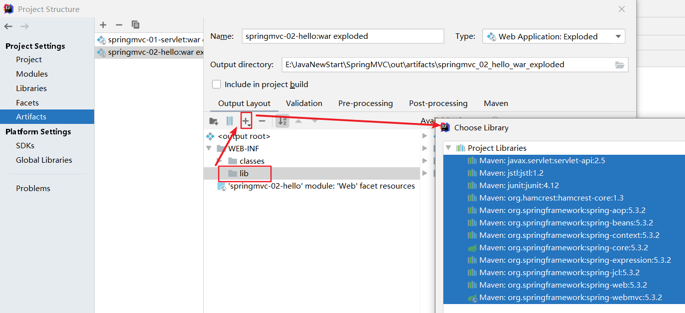

 ^ _ ^ 
<!-- more -->

# 配置环境依赖
在pom.xml文件中配置编译环境
```xml
<properties>
    <project.build.sourceEncoding>UTF-8</project.build.sourceEncoding>
    <maven.compiler.source>1.8</maven.compiler.source>
    <maven.compiler.target>1.8</maven.compiler.target>
</properties>
```

在pom.xml文件中添加依赖包
```xml
<dependencies>
    <!--Junit-->
    <dependency>
        <groupId>junit</groupId>
        <artifactId>junit</artifactId>
        <version>4.12</version>
    </dependency>
    <!--数据库驱动-->
    <dependency>
        <groupId>mysql</groupId>
        <artifactId>mysql-connector-java</artifactId>
        <version>5.1.6</version>
    </dependency>
    <!-- 数据库连接池 -->
    <dependency>
        <groupId>com.mchange</groupId>
        <artifactId>c3p0</artifactId>
        <version>0.9.5.2</version>
    </dependency>

    <!--Servlet - JSP -->
    <dependency>
        <groupId>javax.servlet</groupId>
        <artifactId>servlet-api</artifactId>
        <version>2.5</version>
    </dependency>
    <dependency>
        <groupId>javax.servlet.jsp</groupId>
        <artifactId>jsp-api</artifactId>
        <version>2.0</version>
    </dependency>
    <dependency>
        <groupId>jstl</groupId>
        <artifactId>jstl</artifactId>
        <version>1.2</version>
    </dependency>

    <!--Mybatis-->
    <dependency>
        <groupId>org.mybatis</groupId>
        <artifactId>mybatis</artifactId>
        <version>3.5.2</version>
    </dependency>
    <dependency>
        <groupId>org.mybatis</groupId>
        <artifactId>mybatis-spring</artifactId>
        <version>2.0.6</version>
    </dependency>

    <!--Spring-->
    <dependency>
        <groupId>org.springframework</groupId>
        <artifactId>spring-webmvc</artifactId>
        <version>5.3.2</version>
    </dependency>
    <dependency>
        <groupId>org.springframework</groupId>
        <artifactId>spring-jdbc</artifactId>
        <version>5.1.9.RELEASE</version>
    </dependency>

    <!--lombok-->
    <dependency>
        <groupId>org.projectlombok</groupId>
        <artifactId>lombok</artifactId>
        <version>1.18.16</version>
    </dependency>
</dependencies>
```

在pom.xml文件中添加资源过滤配置
```xml
<build>
    <resources>
        <resource>
            <directory>src/main/java</directory>
            <includes>
                <include>**/*.properties</include>
                <include>**/*.xml</include>
            </includes>
            <filtering>false</filtering>
        </resource>
        <resource>
            <directory>src/main/resources</directory>
            <includes>
                <include>**/*.properties</include>
                <include>**/*.xml</include>
            </includes>
        </resource>
    </resources>
</build>
```

# 建立项目基本包结构
> 在 src/main/java 目录下建立

1. pojo包 -- 实体类
2. dao包 -- 数据库接口
3. service包 -- 服务接口
4. impl包 -- 位于service包下，保存服务接口的实现类
5. controller包 -- 接收前端数据并返回处理结果的类


# 建立数据库
```sql
create database book_shop;
use book_shop;

create table books(
    id int(10) not null auto_increment,
    name varchar(100) not null,
    count int(11) not null,
    detail text not null,
    primary key (id)
)ENGINE=INNODB DEFAULT CHARSET=utf8;

insert into books(name,count,detail) values('Java',1,'从入门到放弃'),
        ('MySQL',10,'从删库到跑路'),('Linux',5,'从进门到进牢');
```


# 添加配置文件
1. 数据库配置文件 `jdbc.properties`
```properties
driver = com.mysql.jdbc.Driver
url = jdbc:mysql://localhost:3307/book_shop?useSSL=false&useUnicode=true&charsetEncoding=UTF-8&serverTimezone=UTC
username = root
password = MyNewPass
```

2. 添加mybatis配置文件 `mybatis-config.xml`
```xml
<?xml version="1.0" encoding="UTF-8" ?>
<!DOCTYPE configuration
        PUBLIC "-//mybatis.org//DTD Config 3.0//EN"
        "http://mybatis.org/dtd/mybatis-3-config.dtd">
<configuration>
    <settings>
        <!--开启自动驼峰命名规则映射-->
        <setting name="mapUnderscoreToCamelCase" value="true"/>
        <!--标准日志工厂-->
        <setting name="logImpl" value="STDOUT_LOGGING"/>
    </settings>

    <typeAliases>
        <package name="com.llunch4w.pojo"/>
    </typeAliases>

    <mappers>
        <package name="com.llunch4w.dao"/>
    </mappers>
</configuration>
```

3. 添加 spring 配置文件 `applicationContext.xml`
```xml
<?xml version="1.0" encoding="UTF-8"?>
<beans xmlns="http://www.springframework.org/schema/beans"
       xmlns:xsi="http://www.w3.org/2001/XMLSchema-instance"
       xsi:schemaLocation="http://www.springframework.org/schema/beans http://www.springframework.org/schema/beans/spring-beans.xsd">

    <import resource="spring-dao.xml"/>
    <import resource="spring-service.xml"/>
    <import resource="spring-mvc.xml"/>
</beans>
```

4. 配置 spring 整合 mybatis 文件 `spring-dao.xml`
```xml
<?xml version="1.0" encoding="UTF-8"?>
<beans xmlns="http://www.springframework.org/schema/beans"
       xmlns:xsi="http://www.w3.org/2001/XMLSchema-instance"
       xmlns:context="http://www.springframework.org/schema/context"
       xsi:schemaLocation="http://www.springframework.org/schema/beans
        http://www.springframework.org/schema/beans/spring-beans.xsd
        http://www.springframework.org/schema/context
        https://www.springframework.org/schema/context/spring-context.xsd">
    <!-- 配置整合mybatis -->
    <!-- 1.关联数据库文件 -->
    <context:property-placeholder location="classpath:jdbc.properties" />

    <!-- 2.数据库连接池 -->
    <!--数据库连接池
        dbcp  半自动化操作  不能自动连接
        c3p0  自动化操作（自动的加载配置文件 并且设置到对象里面）
    -->
    <bean id="dataSource" class="com.mchange.v2.c3p0.ComboPooledDataSource">
        <!-- 配置连接池属性 -->
        <property name="driverClass" value="${driver}"/>
        <property name="jdbcUrl" value="${url}"/>
        <property name="user" value="${username}"/>
        <property name="password" value="${password}"/>

        <!-- c3p0连接池的私有属性 -->
        <property name="maxPoolSize" value="30"/>
        <property name="minPoolSize" value="10"/>
        <!-- 关闭连接后不自动commit -->
        <property name="autoCommitOnClose" value="false"/>
        <!-- 获取连接超时时间 -->
        <property name="checkoutTimeout" value="10000"/>
        <!-- 当获取连接失败重试次数 -->
        <property name="acquireRetryAttempts" value="2"/>
    </bean>

    <!-- 3.配置SqlSessionFactory对象 -->
    <bean id="sqlSessionFactory" class="org.mybatis.spring.SqlSessionFactoryBean">
        <!-- 注入数据库连接池 -->
        <property name="dataSource" ref="dataSource"/>
        <!-- 配置MyBaties全局配置文件:mybatis-config.xml -->
        <property name="configLocation" value="classpath:mybatis-config.xml"/>
    </bean>

    <!-- 4.配置扫描Dao接口包，动态实现Dao接口注入到spring容器中 -->
    <bean class="org.mybatis.spring.mapper.MapperScannerConfigurer">
        <!-- 注入sqlSessionFactory -->
        <property name="sqlSessionFactoryBeanName" value="sqlSessionFactory"/>
        <!-- 给出需要扫描Dao接口包 -->
        <property name="basePackage" value="com.llunch4w.dao"/>
    </bean>
</beans>
```

5. 配置 spring 整合 service 层文件 `spring-service.xml`
```xml
<?xml version="1.0" encoding="UTF-8"?>
<beans xmlns="http://www.springframework.org/schema/beans"
       xmlns:xsi="http://www.w3.org/2001/XMLSchema-instance"
       xmlns:context="http://www.springframework.org/schema/context"
       xsi:schemaLocation="http://www.springframework.org/schema/beans
    http://www.springframework.org/schema/beans/spring-beans.xsd
    http://www.springframework.org/schema/context
    http://www.springframework.org/schema/context/spring-context.xsd">

    <!-- 开启Spring注解驱动 -->
    <context:annotation-config/>

    <!--扫描指定包下的注解-->
    <context:component-scan base-package="com.llunch4w.service.impl" />

    <!-- 配置事务管理器 -->
    <bean id="transactionManager" class="org.springframework.jdbc.datasource.DataSourceTransactionManager">
        <!-- 注入数据库连接池 -->
        <property name="dataSource" ref="dataSource" />
    </bean>
</beans>
```

6. 配置 spring 与 web 层整合文件 `spring-mvc.xml`
```xml
<?xml version="1.0" encoding="UTF-8"?>
<beans xmlns="http://www.springframework.org/schema/beans"
       xmlns:xsi="http://www.w3.org/2001/XMLSchema-instance"
       xmlns:context="http://www.springframework.org/schema/context"
       xmlns:mvc="http://www.springframework.org/schema/mvc"
       xsi:schemaLocation="http://www.springframework.org/schema/beans
    http://www.springframework.org/schema/beans/spring-beans.xsd
    http://www.springframework.org/schema/context
    http://www.springframework.org/schema/context/spring-context.xsd
    http://www.springframework.org/schema/mvc
    https://www.springframework.org/schema/mvc/spring-mvc.xsd">

    <!-- 配置SpringMVC -->
    <!-- 1.开启SpringMVC注解驱动 -->
    <mvc:annotation-driven />
    <!-- 2.静态资源默认servlet配置-->
    <mvc:default-servlet-handler/>

    <!-- 3.配置jsp 显示ViewResolver视图解析器 -->
    <bean class="org.springframework.web.servlet.view.InternalResourceViewResolver">
        <property name="viewClass" value="org.springframework.web.servlet.view.JstlView" />
        <property name="prefix" value="/WEB-INF/jsp/" />
        <property name="suffix" value=".jsp" />
    </bean>

    <!-- 4.扫描web相关的bean -->
    <context:component-scan base-package="com.llunch4w.controller" />
</beans>
```

7. 将项目添加Web的框架支持，然后编写web/WEB-INF/下的 `web.xml` 文件
```xml
<?xml version="1.0" encoding="UTF-8"?>
<web-app xmlns="http://xmlns.jcp.org/xml/ns/javaee"
         xmlns:xsi="http://www.w3.org/2001/XMLSchema-instance"
         xsi:schemaLocation="http://xmlns.jcp.org/xml/ns/javaee http://xmlns.jcp.org/xml/ns/javaee/web-app_4_0.xsd"
         version="4.0">
    
    <!--DispatcherServlet-->
    <servlet>
        <servlet-name>DispatcherServlet</servlet-name>
        <servlet-class>org.springframework.web.servlet.DispatcherServlet</servlet-class>
        <init-param>
            <param-name>contextConfigLocation</param-name>
            <param-value>classpath:applicationContext.xml</param-value>
        </init-param>
        <load-on-startup>1</load-on-startup>
    </servlet>
    <servlet-mapping>
        <servlet-name>DispatcherServlet</servlet-name>
        <url-pattern>/</url-pattern>
    </servlet-mapping>

    <!--encodingFilter-->
    <filter>
        <filter-name>encodingFilter</filter-name>
        <filter-class>
            org.springframework.web.filter.CharacterEncodingFilter
        </filter-class>
        <init-param>
            <param-name>encoding</param-name>
            <param-value>utf-8</param-value>
        </init-param>
    </filter>
    <filter-mapping>
        <filter-name>encodingFilter</filter-name>
        <url-pattern>/*</url-pattern>
    </filter-mapping>

    <!--Session过期时间-->
    <session-config>
        <session-timeout>15</session-timeout>
    </session-config>

    <!--引导页-->
    <welcome-file-list>
        <welcome-file>index.jsp</welcome-file>
    </welcome-file-list>

    <!--自己配置描述文件-->
    <jsp-config>
        <taglib>
        <taglib-uri>http://java.sun.com/jsp/jstl/core</taglib-uri>
        <taglib-location>/WEB-INF/jstl_tld/c.tld</taglib-location>
        </taglib>
        <taglib>
        <taglib-uri>http://java.sun.com/jsp/jstl/fmt</taglib-uri>
        <taglib-location>/WEB-INF/jstl_tld/fmt.tld</taglib-location>
        </taglib>
        <taglib>
        <taglib-uri>http://java.sun.com/jsp/jstl/fn</taglib-uri>
        <taglib-location>/WEB-INF/jstl_tld/fn.tld</taglib-location>
        </taglib>
    </jsp-config>
</web-app>
```

# 编写类
1. pojo包下的 Books 类
```java
@Data
@AllArgsConstructor
@NoArgsConstructor
public class Books {
    private int id;
    private String name;
    private int count;
    private String detail;
}
```

2. 编写dao包下的数据库接口和对应的xml文件
BooksMapper.java
```java
@Repository
public interface BooksMapper {
    int insert(Books book);

    int delete(int id);

    int update(Books book);

    List<Books> queryById(int id);

    List<Books> queryAll();
}
```

BooksMapper.xml
```xml
<?xml version="1.0" encoding="UTF-8" ?>
<!DOCTYPE mapper
        PUBLIC "-//mybatis.org//DTD Mapper 3.0//EN"
        "http://mybatis.org/dtd/mybatis-3-mapper.dtd">
<mapper namespace="com.llunch4w.dao.BooksMapper">
    <!--增加-->
    <insert id="insert" parameterType="Books">
        insert into books(name,count,detail) values(#{name},#{count},#{detail})
    </insert>

    <!--删除-->
    <delete id="deleteById">
        delete from books where id=#{id}
    </delete>

    <!--更新-->
    <update id="updateById">
        update books set name=#{name},count=#{count},detail=#{detail} where id=#{id}
    </update>

    <!--通过ID查询-->
    <select id="queryById" resultType="Books">
        select * from books where id=#{id}
    </select>

    <!--查询所有-->
    <select id="queryAll" resultType="Books">
        select * from books
    </select>
</mapper>
```

3. 在service包下编写类
BooksService.java
```java
public interface BooksService {
    boolean insert(Books book);

    boolean deleteById(int id);

    boolean updateById(Books book);

    List<Books> queryById(int id);

    List<Books> queryAll();
}
```

impl包下BooksServiceImpl.java
```java
@Service
public class BooksServiceImpl implements BooksService {
    @Autowired
    @Qualifier("booksMapper")
    private BooksMapper booksMapper;

    public boolean insert(Books book) {
        return booksMapper.insert(book) > 0 ;
    }

    public boolean deleteById(int id) {
        return booksMapper.deleteById(id) > 0;
    }

    public boolean updateById(Books book) {
        return booksMapper.updateById(book) > 0;
    }

    public List<Books> queryById(int id) {
        return booksMapper.queryById(id);
    }

    public List<Books> queryAll() {
        return booksMapper.queryAll();
    }
}
```

4. 在controller包下编写类
BooksController.java
```java
@Controller("books")
@RequestMapping("/book")
public class BooksController {
    @Autowired
    @Qualifier("booksServiceImpl")
    private BooksService booksService;

    @RequestMapping("/getAllBooks")
    public String getAllBooks(Model model){
        List<Books> bookList = booksService.queryAll();
        model.addAttribute("bookList",bookList);
        return "allBooks";
    }
}
```

5. 添加依赖，否则会出现404错误


# 测试
```java
@Test
public void test1(){
    ClassPathXmlApplicationContext context = new ClassPathXmlApplicationContext("applicationContext.xml");
    BooksService service = (BooksServiceImpl)context.getBean("booksServiceImpl");
    List<Books> booksList = service.queryAll();
    for (Books book : booksList) {
        System.out.println(book);
    }
}
```