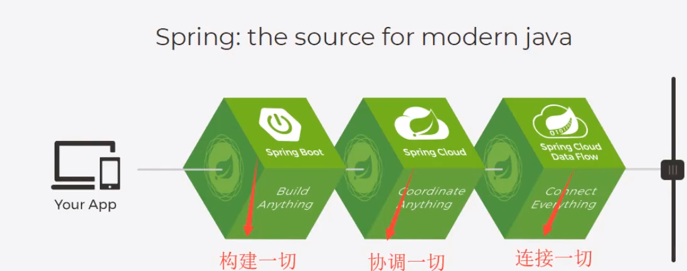
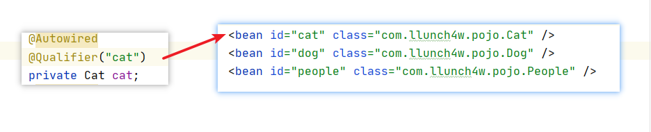

 ^ _ ^ 
<!-- more -->

# 简介
> Sping理念：使现有的技术更加容易使用。
> Spring本身是一个大杂烩，整合了现有的技术框架



## 下载
官网：[https://spring.io/projects](https://spring.io/projects)
官方下载地址：[https://repo.spring.io/release/org/springframework/spring/](https://repo.spring.io/release/org/springframework/spring/)
Github：[https://github.com/spring-projects/spring-framework](https://github.com/spring-projects/spring-framework)

**在Maven工程中需安装的依赖**
```xml
<!-- https://mvnrepository.com/artifact/org.springframework/spring-webmvc -->
<dependency>
    <groupId>org.springframework</groupId>
    <artifactId>spring-webmvc</artifactId>
    <version>5.2.11.RELEASE</version>
</dependency>
<!-- https://mvnrepository.com/artifact/org.springframework/spring-webmvc -->
<dependency>
    <groupId>org.springframework</groupId>
    <artifactId>spring-jdbc</artifactId>
    <version>5.2.11.RELEASE</version>
</dependency>
```

## 优点
- Spring是一个开源的免费的框架（容器）
- Spring是一个轻量级、非入侵式（导入后不会对原有项目造成影响）的框架
- 控制反转（IOC），面向切面编程（AOP）
- 支持事务的处理，对框架整合的支持（几乎能整合市面上所有的java框架）

## 组成


# 环境准备
**1. 创建父工程Spring-Study**
- New -> Project -> 普通Maven工程
- 对工程进行配置

- 在pom.xml文件中添加依赖
```xml
<dependency>
    <groupId>org.springframework</groupId>
    <artifactId>spring-webmvc</artifactId>
    <version>5.2.11.RELEASE</version>
</dependency>
<!--junit-->
<dependency>
    <groupId>junit</groupId>
    <artifactId>junit</artifactId>
    <version>4.12</version>
</dependency>
```
- 在pom.xml文件中配置编译环境为1.8
```xml
<!--编译环境-->
<properties>
    <project.build.sourceEncoding>UTF-8</project.build.sourceEncoding>
    <maven.compiler.source>1.8</maven.compiler.source>
    <maven.compiler.target>1.8</maven.compiler.target>
</properties>
```
- 删除Spring-Study工程下的source目录

# IOC理论推导
**1. 创建子模块spring-01-ioc**

**2. 按照传统web编程模式编写一个小程序**


```java
// UserDao
public interface UserDao {
    void getUser();
}

// UserDaoImpl
public class UserDaoImpl implements UserDao{
    public void getUser(){
        System.out.println("数据库获取User");
    }
}

// UserService
public interface UserService {
    void getUser();
}

// UserServiceImpl
public class UserServiceImpl implements UserService{
    private UserDao userDao = new UserDaoImpl();

    public void getUser(){
        userDao.getUser();
    }
}
```

**3. 用测试类模拟客户端**
```java
@Test
public void test(){
    UserService userService = new UserServiceImpl();
    userService.getUser();
}
```


**4. 提出问题**
> 如果 UserDao 增加一个实现类会如何？

```java
public class UserSqlDaoImpl implements UserDao{
    public void getUser(){
        System.out.println("Mysql数据库获取User");
    }
}
```

那么如果客户端想使用UserSqlDaoImpl实现类，需要程序猿在UserServiceImpl中进行更改
```java
private UserDao userDao = new UserSqlDaoImpl();
```
MyTest重新执行结果


**5. 利用Set接口对程序进行修改**
- 对UserServiceImpl进行如下修改
```java
private UserDao userDao;
public void setUserDao(UserDao userDao){
    this.userDao = userDao;
}
```
- 客户端（Test）的调用变成
```java
UserService userService = new UserServiceImpl();
userService.setUserDao(new UserSqlDaoImpl());
userService.getUser();
```

**6. 结论**
- 之前，程序是主动创建对象，控制权在程序猿手上
- 使用了set注入后，程序不再具有主动性，而是变成了被动接受对象

这种思想，从本质上解决了问题，程序猿不用再去管理对象的创建了，系统的耦合性大大降低，可以更加专注在业务的实现上。
> 这就是IOC的原型

**7. IOC本质**
控制反转（Inversion of Control），是一种设计思想，DI（依赖注入）是实现IOC的一种方法。
我们使用面向对象编程，对象的创建与对象间的依赖关系完全硬编码在程序中，对象的创建由程序自己控制，控制反转将创建转移给第三方。
所谓控制反转就是：获得依赖的方式反转了。

控制反转是一种通过描述（XML或注解）并通过第三方去生产或获取特定对象的方式。在Spring中实现控制反转的是IOC容器，其实现方式是依赖注入。

# HelloSpring
**1. 创建spring-02-hellospring模块**

**2. 在java目录下添加com.llunch4w.pojo.Hello类**
```java
@Data
public class Hello {
    private String str;
}
```

**3. 在resources目录下添加beans.xml**
```xml
<?xml version="1.0" encoding="UTF-8"?>
<beans xmlns="http://www.springframework.org/schema/beans"
       xmlns:xsi="http://www.w3.org/2001/XMLSchema-instance"
       xsi:schemaLocation="http://www.springframework.org/schema/beans
        https://www.springframework.org/schema/beans/spring-beans.xsd">
    <!--使用Spring来创建对象，在Spring里这些都称之为bean-->
    <bean id="hello" class="com.llunch4w.pojo.Hello">
        <property name="str" value="Spring" />
    </bean>
</beans>
```

**4. test/java目录下添加MyTest测试类**
```java
// 获取Spring的上下文对象
ApplicationContext context = new ClassPathXmlApplicationContext("beans.xml");
// 现在对象都在Spring中管理了，要使用的话直接从里面取出来即可
Hello hello = (Hello)context.getBean("hello");
System.out.println(hello);
```

## 利用spring改写spring-01-ioc
**1. 在resources目录下新建beans.xml**
```xml
<?xml version="1.0" encoding="UTF-8"?>
<beans xmlns="http://www.springframework.org/schema/beans"
       xmlns:xsi="http://www.w3.org/2001/XMLSchema-instance"
       xsi:schemaLocation="http://www.springframework.org/schema/beans
        https://www.springframework.org/schema/beans/spring-beans.xsd">
    <bean id="userDaoImpl" class="com.llunch4w.dao.UserDaoImpl" />
    <bean id="userSqlDaoImpl" class="com.llunch4w.dao.UserSqlDaoImpl" />

    <bean id="userServiceImpl" class="com.llunch4w.service.UserServiceImpl">
        <!--
            ref：引用Spring容器中创建好的对象
            value：具体的值，基本数据类型
        -->
        <property name="userDao" ref="userDaoImpl" />
    </bean>
</beans>
```

**2. 编写测试函数**
```java
ClassPathXmlApplicationContext context = new ClassPathXmlApplicationContext("beans.xml");
UserService userService = (UserService)context.getBean("userServiceImpl");
userService.getUser();
```

# IOC创建对象的方式
1. 默认使用无参构造创建对象
2. 使用有参构造
    - 下标赋值
    ```xml
    <bean id="user" class="com.llunch4w.pojo.User">
        <constructor-arg index="0" value="kkk" />
    </bean>
    ```
    - 类型赋值（不推荐使用）
    ```xml
    <constructor-arg type="java.lang.String" value="kkk" />
    ```
    - 属性名赋值（推荐）
    ```xml
    <constructor-arg name="name" value="kkk" />
    ```
3. 在配置文件加载时，容器中的管理对象就已经初始化了；默认多次获取对象时返回的是同一个对象（单例模式）

# Spring配置
## alias（别名）
```xml
<alias name="user" alias="userAlias" />
```

## bean
```xml
<!--
    id : bean的唯一标识符
    class : bean对象所对应的全限定名
    name : 也是别名，而且name可以同时取多个别名，比alias更高级
-->
<bean id="user" class="com.llunch4w.pojo.User" name="u2,u3">
    <constructor-arg name="name" value="kkk" />
</bean>
```

## import
> import，一般用于团队合作，他可以将多个配置文件导入合并为一个

```xml
<import resource="beans2.xml" />
```

# 依赖注入
## 构造器注入
```xml
<bean id="user" class="com.llunch4w.pojo.User" name="u2,u3">
    <constructor-arg name="name" value="kkk" />
</bean>
```

## Set方式注入
**依赖注入**
- 依赖：bean对象的创建依赖于容器
- 注入：bean对象中所有的属性，由容器来注入

**1. 创建spring-04-di模块**

**2. 在java目录下com.llunch4w.pojo包中新建User类和Address类**
```java
// User
@Data
public class User {
    private String name;
    private Address address;
    private String[] books;
    private List<String> hobbies;
    private Map<String,String> card;
    private Set<String> games;
    private String wife;
    private Properties info;
}

// Address
@Data
public class Address {
    private String name;
}
```

**3. 在resources目录下添加beans.xml**
```xml
<bean id="address" class="com.llunch4w.pojo.Address">
    <property name="name" value="长春" />
</bean>

<bean id="user" class="com.llunch4w.pojo.User">
    <!--第一种，普通值注入，直接使用value-->
    <property name="name" value="llunch" />
    <!--第二种，引用类型注入，使用ref-->
    <property name="address" ref="address" />
    <!--数组类型注入-->
    <property name="books">
        <array>
            <value>MyBatis入门</value>
            <value>Spring入门</value>
            <value>Javajingtong</value>
        </array>
    </property>
    <!--list类型注入-->
    <property name="hobbies">
        <list>
            <value>唱歌</value>
            <value>跳舞</value>
            <value>Rap</value>
        </list>
    </property>
    <!--map类型注入-->
    <property name="card">
        <map>
            <entry key="身份证" value="122221212" />
            <entry key="银行卡" value="77777888" />
        </map>
    </property>
    <!--set类型注入-->
    <property name="games">
        <set>
            <value>lol</value>
            <value>bob</value>
            <value>coc</value>
        </set>
    </property>
    <!--null注入-->
    <property name="wife">
        <null></null>
    </property>
    <!--properties类型注入-->
    <property name="info">
        <props>
            <prop key="学号">214389</prop>
            <prop key="性别">男</prop>
            <prop key="姓名">小明</prop>
        </props>
    </property>
</bean>
```

**4. 编写测试函数**
```java
ClassPathXmlApplicationContext context = new ClassPathXmlApplicationContext("beans.xml");
User user = (User)context.getBean("user");
System.out.println(user);
```

## c命名和p命名空间注入
**1. 新建User类演示命名空间注入**
```java
@Data
@AllArgsConstructor
@NoArgsConstructor
public class Student {
    String name;
    int age;
}
```

**2. 编写studentBeans.xml**
> 注意：需要导入p命名和c命名空间约束

```xml
<?xml version="1.0" encoding="UTF-8"?>
<beans xmlns="http://www.springframework.org/schema/beans"
       xmlns:xsi="http://www.w3.org/2001/XMLSchema-instance"
       xmlns:p="http://www.springframework.org/schema/p"
       xmlns:c="http://www.springframework.org/schema/c"
       xsi:schemaLocation="http://www.springframework.org/schema/beans
        https://www.springframework.org/schema/beans/spring-beans.xsd">
    
</beans>
```

**3. 使用p命名空间注入**
```xml
<bean id="student" class="com.llunch4w.pojo.Student" p:name="llunch" p:age="21" /> 
```

**4. 编写测试函数进行测试**
```java
ClassPathXmlApplicationContext context = new ClassPathXmlApplicationContext("studentBeans.xml");
Student student = context.getBean("student", Student.class);
System.out.println(student);
```

**5. 使用c命名空间注入**
```xml
<bean id="student" class="com.llunch4w.pojo.Student" c:name="llunch" c:age="21" />
```

**6. 结论**
- p命名空间相当于Set注入
- c命名空间相当于构造器注入

# bean的作用域


- 单例模式（Spring默认机制）：多次从容器中获取返回的是同一对象
```xml
<bean id="student" class="com.llunch4w.pojo.Student" c:name="llunch" c:age="21" 
        scope="singleton"/>
```
- 原型模式：多次从容器中获取返回的是不同对象
```xml
<bean id="student" class="com.llunch4w.pojo.Student" c:name="llunch" c:age="21"
        scope="prototype"/>
```
- 其余的 request 、 session 、 application，这些只能在web开发中使用到

# Bean的自动装配
- 自动装配是Spring满足bean依赖的一种方式
- Spring会在上下文中自动寻找，并自动给bean装配属性

在Spring中有3中装配方式：
- 在xml中显式的配置
- 在java中显式配置
- 隐式的自动装配bean【重要】

**1. 环境搭建**
- 创建子模块spring-05-autowired
- 在java目录下添加包com.llunch4w.pojo，在pojo包中添加Cat、Dog、People
```java
// Cat
public class Cat {
    public void shout(){
        System.out.println("miao~");
    }
}

// Dog
public class Dog {
    public void shout(){
        System.out.println("wang~");
    }
}

// People
@Data
public class People {
    private Cat cat;
    private Dog dog;
    private String name;
}
```
- resources目录下编写beans.xml文件
```xml
<bean id="cat" class="com.llunch4w.pojo.Cat" />
<bean id="dog" class="com.llunch4w.pojo.Dog" />

<bean id="people" class="com.llunch4w.pojo.People">
    <property name="name" value="llunch" />
    <property name="cat" ref="cat" />
    <property name="dog" ref="dog" />
</bean>
```
- 编写测试函数
```java
ApplicationContext context = new ClassPathXmlApplicationContext("beans.xml");
People people = context.getBean("people", People.class);
people.getCat().shout();
people.getDog().shout();
```

## xml文件实现自动装配
**2. 更改beans.xml文件使其实现byName自动装配**
```xml
<bean id="people" class="com.llunch4w.pojo.People" autowire="byName">
    <property name="name" value="llunch" />
</bean>
```

**3. 更改beans.xml文件使其实现byType自动装配**
```xml
<bean id="people" class="com.llunch4w.pojo.People" autowire="byType">
    <property name="name" value="llunch" />
</bean>
```

**4. 小结**
- byName的时候，需要保证所有bean的id唯一，并且这个bean需要和自动注入的属性的set方法一致
- byType的时候，需要保证所有bean的class唯一，并且这个bean需要和自动注入的属性的类型一致

## 注解实现自动装配
_jdk从1.5开始支持注解，spring从2.5开始支持注解_

使用注解需要：
- 导入约束 : context约束
- 配置注解的支持 : context:annotation-config

**1. 修改beans.xml文件**
```xml
<?xml version="1.0" encoding="UTF-8"?>
<beans xmlns="http://www.springframework.org/schema/beans"
       xmlns:xsi="http://www.w3.org/2001/XMLSchema-instance"
       xmlns:context="http://www.springframework.org/schema/context"
       xsi:schemaLocation="http://www.springframework.org/schema/beans
        https://www.springframework.org/schema/beans/spring-beans.xsd
        http://www.springframework.org/schema/context
        https://www.springframework.org/schema/context/spring-context.xsd">

    <context:annotation-config/>

    <bean id="cat" class="com.llunch4w.pojo.Cat" />
    <bean id="dog" class="com.llunch4w.pojo.Dog" />
    <bean id="people" class="com.llunch4w.pojo.People" />

</beans>
```

### Autowired
**2. 修改People类**
```java
@Data
public class People {
    @Autowired
    private Cat cat;
    @Autowired
    private Dog dog;
    private String name;
}
```

**3. 进行测试**
> 输出结果与之前xml配置时一致，说明使用@Autowired注解自动装配成功

**4. @Autowired小结**
- 直接在属性上使用即可，也可在set方法上使用
- 使用Autowired后我们可以不用编写set方法了，但前提是这个自动装配的属性在IOC容器中存在，且符合名字

### Qualifier
```java
@Autowired
@Qualifier("cat")
private Cat cat;
```

> 通常，Qualifier可以和Autowired组合使用，通过设置Qualifier的value值来显式的指定装配的对象（通过beans.xml中定义的bean id）

### Resource
```java
@Resource(name = "dog")
private Dog dog;
```

- @Resource和@Autowired都是用来自动装配的，都可以放在属性字段上
- @Autowired通过byType的方式实现，而且这个对象必须存在
- @Resource默认通过byName的方式实现，如果找不到名字，则通过byType

### Nullable
```java
// 如果显式地定义了Autowired的required属性为false，说明这个对象可以为null，否则不允许为空
@Autowired(required=false)
// 在参数前面添加Nullable，表示该参数可以为null类型
@Nullable
```

# 使用注解开发
**前提条件**
1. 在Spring4之后，要使用注解开发，必须要保证aop包的导入

2. 使用注解需要导入context约束，增加注解的支持
```xml
<?xml version="1.0" encoding="UTF-8"?>
<beans xmlns="http://www.springframework.org/schema/beans"
    xmlns:xsi="http://www.w3.org/2001/XMLSchema-instance"
    xmlns:context="http://www.springframework.org/schema/context"
    xsi:schemaLocation="http://www.springframework.org/schema/beans
        https://www.springframework.org/schema/beans/spring-beans.xsd
        http://www.springframework.org/schema/context
        https://www.springframework.org/schema/context/spring-context.xsd">

    <context:annotation-config/>
</beans>
```

## 扫描指定包下的注解
```xml
<context:component-scan base-package="com.llunch4w" />
```

## 注解
### @Component
> 组件，放在类上，说明这个类被Spring管理了，就是bean

@Component有几个衍生注解，在web开发中，会按照mvc三层架构分层
- dao : @Repository
- service : @Service
- controller : @Controller

这四个注解的功能是一样的，都代表将某个类注册到Spring容器中，装配Bean

### @Value
> 进行属性注入

### 自动装配注解
- @Autowired
- @Qualifier
- @Resource
- @Nullable

### @Scope
> 进行作用域设置

**作用域可选值**
- singleton
- prototype
- request
- session
- application

## 实例演示
- 新建模块spring-06-anno
- java目录下新建com.llunch4w包，再在此包下新建dao、pojo、controller、service包，并添加相应代码
```java
// User
package com.llunch4w.pojo;
@Data
@Component
/*相当于<bean id="user" class="com.llunch4w.pojo.User">*/
@Scope("prototype")
public class User {
    /*相当于<property name="name" value="llunch" /> */
    @Value("llunch")
    private String name;
    @Value("18")
    private int age;
}

// UserDao
package com.llunch4w.dao;
@Repository
public class UserDao {
}

// UserService
package com.llunch4w.service;
@Service
public class UserService {
}

// UserController
package com.llunch4w.controller;
@Controller
public class UserController {
}
```
- 在resources目录下添加beans.xml
```xml
<?xml version="1.0" encoding="UTF-8"?>
<beans xmlns="http://www.springframework.org/schema/beans"
       xmlns:xsi="http://www.w3.org/2001/XMLSchema-instance"
       xmlns:context="http://www.springframework.org/schema/context"
       xsi:schemaLocation="http://www.springframework.org/schema/beans
        https://www.springframework.org/schema/beans/spring-beans.xsd
        http://www.springframework.org/schema/context
        https://www.springframework.org/schema/context/spring-context.xsd">

    <context:component-scan base-package="com.llunch4w" />
    <context:annotation-config/>
</beans>
```
- 创建测试函数
```java
ApplicationContext context = new ClassPathXmlApplicationContext("beans.xml");
User user1 = context.getBean("user", User.class);
System.out.println(user1);

User user2 = context.getBean("user", User.class);
System.out.println(user1 == user2);
```

## xml与注解比较
- xml更加万能，适用于任何场合，维护简单方便
- 注解不是自己的类用不了，维护相对复杂

最佳实践：
- xml用来管理bean
- 注解只负责完成属性的注入

# 使用Java方式配置Spring
我们现在完全不需要Spring的xml配置了，全权交给Java来做。
JavaConfig是Spring的一个子项目，在Spring4之后，它成为了一个核心功能。

**1. 创建子模块spring-07-config**

**2. 在java目录下添加com.llunch4w包，再在此包下添加pojo包，包中添加User类**
```java
@Data
@Component
public class User {
    @Value("llunch")
    private String name;
    @Value("18")
    private int age;
}
```

**3. 在com.llunch4w包下添加config包，包中添加MyConfig类**
> Configuration本质也是一个Component，代表该类交给Spring容器托管，它的作用相当于一个配置文件beans.xml
```java
@Configuration
@ComponentScan("com.llunch4w.pojo")
public class MyConfig {
    @Bean
    public User user(){
        return new User();
    }
}
```

**4. 编写测试函数**
```java
ApplicationContext context = new AnnotationConfigApplicationContext(MyConfig.class);
User user = context.getBean("user", User.class);
System.out.println(user);
```

**5. MyConfig中也可以引用其他的配置类**
- 在pojo包下新建一个AnotherUser类
```java
@Data
@Component
public class AnotherUser {
    @Value("another")
    private String name;
}
```
- 在config包下新建一个AnotherConfig类
```java
@Configuration
@ComponentScan("com.llunch4w.pojo")
public class AnotherConfig {
    @Bean
    public AnotherUser getAnotherUser(){
        return new AnotherUser();
    }
}
```
- 在MyConfig中引入AnotherConfig
```java
@Configuration
@ComponentScan("com.llunch4w.pojo")
public class AnotherConfig {
    @Bean
    public AnotherUser getAnotherUser(){
        return new AnotherUser();
    }
}
```
- 测试用MyConfig获取AnotherUser
```java
ApplicationContext context = new AnnotationConfigApplicationContext(MyConfig.class);
AnotherUser anotherUser = context.getBean("getAnotherUser", AnotherUser.class);
System.out.println(anotherUser);
```

> 纯Java配置在SpringBoot中是很常见的

# 代理模式


## 静态代理
**角色分析：**
- 抽象角色：一般使用接口或者抽象类来解决
- 真实角色：被代理的角色
- 代理角色：代理真实角色，代理真实角色后，一般会做一些附属操作
- 客户：访问代理对象的人

### 静态代理编码实例
**1. 创建子模块spring-08-proxy**

**2. 在java目录下添加com.llunch4w.demo1包**

**3. 在demo1包下添加Rent接口**
```java
public interface Rent {
    void rent();
}
```

**4. 在demo1包下添加Host类（房东）**
```java
public class Host implements Rent{
    @Override
    public void rent() {
        System.out.println("房东出租房子");
    }
}
```

**5. 在demo1包下添加Proxy类（代理）**
```java
public class Proxy implements Rent{
    private Host host;

    public Host getHost() {
        return host;
    }

    public void setHost(Host host) {
        this.host = host;
    }

    public void seeHouse(){
        System.out.println("代理用户看房");
    }

    public void fare(){
        System.out.println("代理端收费");
    }

    @Override
    public void rent() {
        seeHouse();
        host.rent();
        fare();
    }
}
```

**6. 编写客户端代码**
```java
public class Client {
    public static void main(String[] args) {
        Host host = new Host();
        Proxy proxy = new Proxy();
        proxy.setHost(host);
        proxy.rent();
    }
}
```

代理模式的好处：
- 可以使真实角色的操作更加纯粹，不用去关注一些公共的业务
- 公共业务交给代理角色，实现了业务分工
- 公共业务产生拓展时，方便集中管理
代理模式的缺点：
- 一个真实角色就会产生一个代理角色，代码量翻倍，开发效率会变低


> 代理模式本质上是实现横向开发，即在不改变原有代码的前提下增加一些功能。而实现这个需求的方式就是：创建一个代理类，让代理类做增加的工作，然后调用原有类实现原有功能。


### 横向修改编码实例
**1. 创建demo2包**

**2. 添加UserServiceImpl类**
```java
public class UserServiceImpl {
    public void add(){
        System.out.println("添加用户");
    }

    public void delete(){
        System.out.println("删除用户");
    }
}
```

**3. 编写客户端代码使用UserServiceImpl类**
```java
public class Client {
    public static void main(String[] args) {
        UserServiceImpl userService = new UserServiceImpl();
        userService.add();
    }
}
```

**4. 提出问题**
> 如果要添加一个新功能：即将UserServiceImpl的行为记录一份日志，该如何修改呢？

**5. 第一种解决方案**
> 修改UserServiceImpl类
```java
public class UserServiceImpl {
    public void add(){
        log("UserServiceImpl添加用户");
        System.out.println("添加用户");
    }

    public void delete(){
        log("UserServiceImpl删除用户");
        System.out.println("删除用户");
    }
    
    private void log(String msg){
        System.out.println("[Info] : " + msg);
    }
}
```
> 但这样修改的弊端很明显，就是修改了原有代码，违背了开闭原则

**6. 第二种解决方案**
> 更优的一种解决方案应该是：添加一个新的类，使新增的功能在新增类中实现。对原有的UserServiceImpl类不作任何修改

```java
public class UserServiceImpl {
    public void add(){
        System.out.println("添加用户");
    }

    public void delete(){
        System.out.println("删除用户");
    }
}
```

```java
public class Proxy {
    private UserServiceImpl service;

    public void setService(UserServiceImpl service) {
        this.service = service;
    }

    public void add(){
        log("UserServiceImpl添加用户");
        service.add();
    }

    public void delete(){
        log("UserServiceImpl删除用户");
        service.delete();
    }

    private void log(String msg){
        System.out.println("[Info] : " + msg);
    }
}
```

```java
public class Client {
    public static void main(String[] args) {
        UserServiceImpl userService = new UserServiceImpl();
        Proxy proxy = new Proxy();
        proxy.setService(userService);
        proxy.add();
    }
}
```
> 这样就满足了开闭原则：对拓展开放，对修改关闭

## 动态代理
- 动态代理的角色和静态代理一样
- 动态代理的代理类是动态生成的，不是我们直接写的
- 动态代理分为两大类：基于接口的动态代理和基于类的动态代理
  - 基于接口 -- JDK 动态代理
  - 基于类 -- cglib
  - java字节码实现 -- javasist

需要了解两个类：Proxy（代理）、InvocationHandler（调用处理程序）

### 实例
**1. 准备工作**
- 创建demo3包
- 将demo1包中的Rent接口和Host类复制到demo3包下

**2. 创建动态代理调用处理类ProxyInvocationHandler**
```java
// 使用这个类，自动生成代理类
public class ProxyInvocationHandler implements InvocationHandler {
    // 被代理的接口
    private Rent rent;

    public void setRent(Rent rent) {
        this.rent = rent;
    }

    // 生成得到代理类
    public Object getProxy(){
        return Proxy.newProxyInstance(this.getClass().getClassLoader(),rent.getClass().getInterfaces(),this);
    }

    // 处理实例，并返回结果
    @Override
    public Object invoke(Object o, Method method, Object[] args) throws Throwable {
        // 动态代理的本质，就是使用反射机制
        Object result = method.invoke(rent,args);

        return result;
    }
}
```

**3. 编写Client类并利用ProxyInvocationHandler类生成代理类**
```java
public class Client {
    public static void main(String[] args) {
        // 真实角色
        Host host = new Host();

        // 调用程序处理角色
        ProxyInvocationHandler invocationHandler = new ProxyInvocationHandler();
        // 通过调用程序处理角色来处理我们要调用的接口对象
        invocationHandler.setRent(host);

        Rent proxy = (Rent)invocationHandler.getProxy();
        proxy.rent();
    }
}
```

**4. 如果要给Proxy类添加功能，只需修改ProxyInvocationHandler类的invoke函数**
```java
@Override
public Object invoke(Object o, Method method, Object[] args) throws Throwable {
    seeHouse();
    // 动态代理的本质，就是使用反射机制
    Object result = method.invoke(rent,args);
    fare();
    return result;
}

void seeHouse(){
    System.out.println("中介带你看房");
}

void fare(){
    System.out.println("收中介费");
}
```

**5. 创建demo4，演示利用ProxyInvocationHandler改造**
```java
public interface UserService {
    void add();
    void delete();
}
```

```java
public class UserServiceImpl implements UserService{
    public void add(){
        System.out.println("添加用户");
    }

    public void delete(){
        System.out.println("删除用户");
    }
}
```

```java
public class ProxyInvocationHandler implements InvocationHandler {
    // 被代理的接口
    private Object target;

    public void setTarget(Object target) {
        this.target = target;
    }

    // 生成得到代理类
    public Object getProxy(){
        return Proxy.newProxyInstance(this.getClass().getClassLoader(),target.getClass().getInterfaces(),this);
    }

    // 处理实例，并返回结果
    @Override
    public Object invoke(Object o, Method method, Object[] args) throws Throwable {
        log(method.getName());
        // 动态代理的本质，就是使用反射机制
        Object result = method.invoke(target,args);
        return result;
    }

    void log(String msg){
        System.out.println("[Info] : 执行了 " + msg + " 方法");
    }
}
```

```java
public class Client {
    public static void main(String[] args) {
        // 真实角色
        UserService userService = new UserServiceImpl();

        // 调用程序处理角色
        ProxyInvocationHandler invocationHandler = new ProxyInvocationHandler();
        // 通过调用程序处理角色来处理我们要调用的接口对象
        invocationHandler.setTarget(userService);

        UserService proxy = (UserService)invocationHandler.getProxy();
        proxy.add();
    }
}
```

# AOP
> Aspect Oriented Programming，面向切片编程，通过预编译方式和运行期动态代理实现程序功能统一维护的一种技术

**AOP在Spring中的作用**
> 提供声明式事务，允许用户自定义切面

- 横切关注点：跨越应用程序多个模块的方法或功能。即是，与业务逻辑无关，但我们需要关注的部分，就是横切关注点，如日志、安全、缓存、事务等
- 切面（Aspect）：横切关注点被模块化后的特殊对象。即它是一个类
- 通知（Advice）：切面必须完成的工作。即，它是类中的一个方法
- 目标（Target）：被通知的对象
- 代理（Proxy）：向目标对象应用通知之后创建的对象
- 切入点（PointCut）：切面通知执行的“地点”的定义
- 连接点（JointPoint）：与切入点匹配的执行点

**Spring中支持5种类型的Advice**


## Spring中使用AOP
__使用AOP织入，需要导入一个依赖包__
```xml
<!-- https://mvnrepository.com/artifact/org.aspectj/aspectjweaver -->
<dependency>
    <groupId>org.aspectj</groupId>
    <artifactId>aspectjweaver</artifactId>
    <version>1.9.6</version>
    <scope>runtime</scope>
</dependency>
```

**1. 创建子模块spring-09-aop**

**2. 在模块的pom.xml中导入aspectjweaver依赖**

**3. 在java目录下添加com.llunch4w包，包下添加service包和log包**

**4. service包下添加UserService接口和UserServiceImpl类**
```java
public interface UserService {
    void add();
    void delete();
    void update();
    void select();
}
```

```java
public class UserServiceImpl implements UserService{
    @Override
    public void add() {
        System.out.println("新增了一个用户");
    }

    @Override
    public void delete() {
        System.out.println("删除了一个用户");
    }

    @Override
    public void update() {
        System.out.println("更新了一个用户");
    }

    @Override
    public void select() {
        System.out.println("查找用户");
    }
}
```

### 方式一
> 使用 Spring API接口

**5. log包下添加Log类和AfterLog类**
```java
public class Log implements MethodBeforeAdvice {
    /* method : 要执行的目标对象的方法
    *  args   : 参数
    *  target : 目标对象
    * */
    @Override
    public void before(Method method, Object[] args, Object target) throws Throwable {
        System.out.println(target.getClass().getName() + "的" + method.getName() + "被执行了");
    }
}
```

```java
public class AfterLog implements AfterReturningAdvice {
    // returnValue : 返回值
    @Override
    public void afterReturning(Object returnValue, Method method, Object[] args, Object target) throws Throwable {
        System.out.println(target.getClass().getName() + "的" + method.getName() + "被执行了，返回结果为：" + returnValue);
    }
}
```

**6. 在resources包下添加applicationContext.xml**
```xml
<?xml version="1.0" encoding="UTF-8"?>
<beans xmlns="http://www.springframework.org/schema/beans"
       xmlns:xsi="http://www.w3.org/2001/XMLSchema-instance"
       xmlns:aop="http://www.springframework.org/schema/aop"
       xsi:schemaLocation="http://www.springframework.org/schema/beans
       http://www.springframework.org/schema/beans/spring-beans.xsd
        http://www.springframework.org/schema/aop
        https://www.springframework.org/schema/aop/spring-aop.xsd">

    <!--注册bean-->
    <bean id="userService" class="com.llunch4w.service.UserServiceImpl" />
    <bean id="log" class="com.llunch4w.log.Log" />
    <bean id="afterLog" class="com.llunch4w.log.AfterLog" />

    <!--配置aop，需要导入aop的约束-->
    <aop:config>
        <!--切入点-->
        <aop:pointcut id="pointcut" expression="execution(* com.llunch4w.service.UserServiceImpl.*(..))"/>

        <!--执行环绕增加-->
        <aop:advisor advice-ref="log" pointcut-ref="pointcut" />
        <aop:advisor advice-ref="afterLog" pointcut-ref="pointcut" />
    </aop:config>
</beans>
```

**7. 编写测试函数**
```java
public class MyTest {
    @Test
    public void test(){
        ApplicationContext context = new ClassPathXmlApplicationContext("applicationContext.xml");
        UserService userService = (UserService) context.getBean("userService");
        userService.add();
    }
}
```
测试结果：


### 方式二
> 自定义实现aop

**5. 在diy包下自定义切片类DiyPointCut**
```java
public class DiyPointCut {
    public void before(){
        System.out.println("========方法执行前=========");
    }
    
    public void after(){
        System.out.println("========方法执行后=========");
    }
}
```

**6. 在applicationContext.xml中配置**
```xml
<?xml version="1.0" encoding="UTF-8"?>
<beans xmlns="http://www.springframework.org/schema/beans"
       xmlns:xsi="http://www.w3.org/2001/XMLSchema-instance"
       xmlns:aop="http://www.springframework.org/schema/aop"
       xsi:schemaLocation="http://www.springframework.org/schema/beans
       http://www.springframework.org/schema/beans/spring-beans.xsd
        http://www.springframework.org/schema/aop
        https://www.springframework.org/schema/aop/spring-aop.xsd">

    <bean id="userService" class="com.llunch4w.service.UserServiceImpl" />
    <bean id="diy" class="com.llunch4w.diy.DiyPointCut" />
    <aop:config>
        <!--自定义切面,ref为要引用的类-->
        <aop:aspect ref="diy">
            <!--切点-->
            <aop:pointcut id="point" expression="execution(* com.llunch4w.service.UserServiceImpl.*(..))"/>
            <aop:before method="before" pointcut-ref="point" />
            <aop:after-returning method="after" pointcut-ref="point" />
        </aop:aspect>
    </aop:config>
</beans>
```

**7. 重新执行测试函数**


### 方式三
> 使用注解实现

**5. 在diy包下创建AnnotationPointCut类并使用注解标注其为切面**
```java
@Aspect
public class AnnotationPointCut {
    @Before("execution(* com.llunch4w.service.UserServiceImpl.*(..))")
    public void before(){
        System.out.println("========方法执行前=========");
    }

    @After("execution(* com.llunch4w.service.UserServiceImpl.*(..))")
    public void after(){
        System.out.println("========方法执行后=========");
    }

    // 在环绕增强中，我们可以给定一个参数，代表我们要处理切入的点
    @Around("execution(* com.llunch4w.service.UserServiceImpl.*(..))")
    public void around(ProceedingJoinPoint joinPoint) throws Throwable{
        System.out.println("环绕前");

        Signature signature = joinPoint.getSignature();
        System.out.println("signature : " + signature);

        // 执行方法
        Object proceed = joinPoint.proceed();
        
        System.out.println("环绕后");
    }
}
```

**6. 修改applicationContext.xml文件**
```xml
<?xml version="1.0" encoding="UTF-8"?>
<beans xmlns="http://www.springframework.org/schema/beans"
       xmlns:xsi="http://www.w3.org/2001/XMLSchema-instance"
       xmlns:aop="http://www.springframework.org/schema/aop"
       xsi:schemaLocation="http://www.springframework.org/schema/beans
       http://www.springframework.org/schema/beans/spring-beans.xsd
        http://www.springframework.org/schema/aop
        https://www.springframework.org/schema/aop/spring-aop.xsd">

    <bean id="userService" class="com.llunch4w.service.UserServiceImpl" />
    <bean id="annotationPointCut" class="com.llunch4w.diy.AnnotationPointCut" />
    <!--开启注解-->
    <aop:aspectj-autoproxy />
</beans>
```

**7. 重新执行测试函数**


# 整合MyBatis
## 依赖包
```xml
<dependencies>
    <!--mysql驱动-->
    <dependency>
        <groupId>mysql</groupId>
        <artifactId>mysql-connector-java</artifactId>
        <version>5.1.6</version>
    </dependency>
    <!--mybatis-->
    <dependency>
        <groupId>org.mybatis</groupId>
        <artifactId>mybatis</artifactId>
        <version>3.5.2</version>
    </dependency>
    <!--junit-->
    <dependency>
        <groupId>junit</groupId>
        <artifactId>junit</artifactId>
        <version>4.12</version>
    </dependency>
    <!--spring-->
    <dependency>
        <groupId>org.springframework</groupId>
        <artifactId>spring-webmvc</artifactId>
        <version>5.2.11.RELEASE</version>
    </dependency>
    <!--spring想要操纵数据库的话，还需要一个spring-jdbc-->
    <dependency>
        <groupId>org.springframework</groupId>
        <artifactId>spring-jdbc</artifactId>
        <version>5.1.9.RELEASE</version>
    </dependency>
    <!--aop织入包-->
    <dependency>
        <groupId>org.aspectj</groupId>
        <artifactId>aspectjweaver</artifactId>
        <version>1.9.6</version>
    </dependency>
    <!--mybatis-spring-->
    <dependency>
        <groupId>org.mybatis</groupId>
        <artifactId>mybatis-spring</artifactId>
        <version>2.0.6</version>
    </dependency>
</dependencies>
```

## 回顾创建一个mybatis工程
**1. 创建子模块spring-10-mybatis**

**2. 导入依赖**

**3. 在build中配置resources，来防止资源导出失败的问题**
```xml
<!--在build中配置resources，来放置资源导出失败问题-->
<build>
    <resources>
        <resource>
            <directory>src/main/resources</directory>
            <includes>
                <include>**/*.properties</include>
                <include>**/*.xml</include>
            </includes>
            <filtering>true</filtering>
        </resource>
        <resource>
            <directory>src/main/java</directory>
            <includes>
                <include>**/*.properties</include>
                <include>**/*.xml</include>
            </includes>
            <filtering>true</filtering>
        </resource>
    </resources>
</build>
```

**4. java目录下创建com.llunch4w包，该包下创建pojo包、mapper包、utils包**

**5. pojo包中添加User类**
```java
@Data
public class User {
    private int id;
    private String name;
    private String pwd;
}
```

**6. 在utils包下编写MyBatisUtil类**
```java
public class MyBatisUtil {
    private static SqlSessionFactory sqlSessionFactory;
    static{
        try{
            String resource = "mybatis-config.xml";
            InputStream inputStream = Resources.getResourceAsStream(resource);
            sqlSessionFactory = new SqlSessionFactoryBuilder().build(inputStream);
        }catch (Exception e){
            e.printStackTrace();
        }
    }

    public static SqlSession getSqlSession(){
        return sqlSessionFactory.openSession(true);
    }
}
```

**7. mapper包下创建UserMapper接口**
```java
public interface UserMapper {
    List<User> queryAll();
}
```

**8. mapper包下创建userMapper.xml文件**
```xml
<?xml version="1.0" encoding="UTF-8" ?>
<!DOCTYPE mapper
        PUBLIC "-//mybatis.org//DTD Mapper 3.0//EN"
        "http://mybatis.org/dtd/mybatis-3-mapper.dtd">
<mapper namespace="com.llunch4w.mapper.UserMapper">
    <select id="queryAll" resultType="com.llunch4w.pojo.User">
        select * from user
    </select>
</mapper>
```

**9. resources目录下添加mybatis-config.xml文件和jdbc.properties文件**
```properties
driver = com.mysql.jdbc.Driver
url = jdbc:mysql://localhost:3307/mybatis?useSSL=false&useUnicode=true&charsetEncoding=UTF-8&serverTimezone=UTC
username = root
password = MyNewPass
```

```xml
<?xml version="1.0" encoding="UTF-8" ?>
<!DOCTYPE configuration
        PUBLIC "-//mybatis.org//DTD Config 3.0//EN"
        "http://mybatis.org/dtd/mybatis-3-config.dtd">
<configuration>
    <!--引入外部配置文件-->
    <properties resource="jdbc.properties" />

    <typeAliases>
        <package name="com.llunch4w.pojo"/>
    </typeAliases>

    <environments default="development">
        <environment id="development">
            <transactionManager type="JDBC"/>
            <dataSource type="POOLED">
                <property name="driver" value="${driver}"/>
                <property name="url" value="${url}"/>
                <property name="username" value="${username}"/>
                <property name="password" value="${password}"/>
            </dataSource>
        </environment>
    </environments>

    <mappers>
        <package name="com.llunch4w.mapper"/>
    </mappers>
</configuration>
```

**10. 编写测试函数测试**
```java
@Test
public void test(){
    // 获取session
    SqlSession sqlSession = MyBatisUtil.getSqlSession();
    // 获取mapper
    UserMapper userMapper = sqlSession.getMapper(UserMapper.class);
    // 操纵mapper
    List<User> allUserList = userMapper.queryAll();

    for (User user : allUserList) {
        System.out.println(user);
    }

    // 关闭session
    sqlSession.close();
}
```

## MyBatis-Spring

MyBatis-Spring官方文档：[https://mybatis.org/spring/zh/](https://mybatis.org/spring/zh/)

### 方式一
**1. 编写spring-dao.xml文件**
```xml
<?xml version="1.0" encoding="UTF-8"?>
<beans xmlns="http://www.springframework.org/schema/beans"
       xmlns:xsi="http://www.w3.org/2001/XMLSchema-instance"
       xsi:schemaLocation="http://www.springframework.org/schema/beans http://www.springframework.org/schema/beans/spring-beans.xsd">

    <!--
        DataSource:使用Spring的数据源替换MyBatis的配置 c3p0 dbcp druid
        这里使用Spring提供的JDBC ：org.springframework.jdbc.datasource
    -->
    <bean id="dataSource" class="org.springframework.jdbc.datasource.DriverManagerDataSource">
        <property name="driverClassName" value="com.mysql.jdbc.Driver" />
        <property name="url" value="jdbc:mysql://localhost:3307/mybatis?useSSL=false&amp;useUnicode=true&amp;charsetEncoding=UTF-8&amp;serverTimezone=UTC" />
        <property name="username" value="root" />
        <property name="password" value="MyNewPass" />
    </bean>

    <!--SqlSessionFactory-->
    <bean id="sqlSessionFactory" class="org.mybatis.spring.SqlSessionFactoryBean">
        <property name="dataSource" ref="dataSource" />
        <!--绑定MyBatis配置文件-->
        <property name="configLocation" value="classpath:mybatis-config.xml" />
        <!--以下这句不起效果，原因未知-->
        <!--<property name="mapperLocations" value="classpath:com/llunch4w/mapper/*.xml" />-->
    </bean>

    <!--SqlSessionTemplate : 使用sqlSession-->
    <bean id="sqlSession" class="org.mybatis.spring.SqlSessionTemplate">
        <!--只能使用构造器注入sqlSessionFactory-->
        <constructor-arg ref="sqlSessionFactory" />
    </bean>

</beans>
```

**2. 去掉jdbc.properties文件，改写mybatis-config.xml文件**
```xml
<?xml version="1.0" encoding="UTF-8" ?>
<!DOCTYPE configuration
        PUBLIC "-//mybatis.org//DTD Config 3.0//EN"
        "http://mybatis.org/dtd/mybatis-3-config.dtd">
<configuration>
    <typeAliases>
        <package name="com.llunch4w.pojo"/>
    </typeAliases>

    <mappers>
        <package name="com.llunch4w.mapper"/>
    </mappers>
</configuration>
```

**3. mapper包下编写UserMapperImpl类**
```java
public class UserMapperImpl implements UserMapper{
    // 我们的所有操作，在原来都使用sqlSession来执行，而现在使用的是sqlSessionTemplate
    private SqlSessionTemplate sqlSession;

    public void setSqlSession(SqlSessionTemplate sqlSession) {
        this.sqlSession = sqlSession;
    }

    @Override
    public List<User> queryAll() {
        UserMapper userMapper = sqlSession.getMapper(UserMapper.class);
        return userMapper.queryAll();
    }
}
```

**4. 编写applicationContext.xml文件**
```xml
<?xml version="1.0" encoding="UTF-8"?>
<beans xmlns="http://www.springframework.org/schema/beans"
       xmlns:xsi="http://www.w3.org/2001/XMLSchema-instance"
       xsi:schemaLocation="http://www.springframework.org/schema/beans http://www.springframework.org/schema/beans/spring-beans.xsd">

    <import resource="spring-dao.xml" />

    <bean id="userMapper" class="com.llunch4w.mapper.UserMapperImpl">
        <property name="sqlSession" ref="sqlSession" />
    </bean>
</beans>
```

**5. 编写测试函数**
```java
ApplicationContext context = new ClassPathXmlApplicationContext("applicationContext.xml");
UserMapper userMapper = context.getBean("userMapper", UserMapper.class);
List<User> userList = userMapper.queryAll();
for (User user : userList) {
    System.out.println(user);
}
```

### 方式二
**1. 在mapper包下添加UserMapperImpl2类**
```java
public class UserMapperImpl2 extends SqlSessionDaoSupport implements UserMapper {
    @Override
    public List<User> queryAll() {
        SqlSession sqlSession = getSqlSession();
        UserMapper userMapper = sqlSession.getMapper(UserMapper.class);
        return userMapper.queryAll();
    }
}
```

**2. 修改applicationContext.xml文件**
```xml
<bean id="userMapper" class="com.llunch4w.mapper.UserMapperImpl2">
    <property name="sqlSessionFactory" ref="sqlSessionFactory" />
</bean>
```

**3. 重新执行方式一中的测试函数**

# 声明式事务
**事务**
> 把一组业务当做一个业务来做；要么都成功，要么都失败

**Spring中的事务管理**
- 声明式事务：AOP
- 编程式事务：需要在代码中进行事务管理

## 实例演示
**1. 创建模块spring-11-transcation，将spring-10-mybatis中的内容搬过来**
- 代码搬过来
- 配置文件搬过来
- pom.xml中的依赖和build搬过来

**2. 在UserMapper接口中添加add方法和delete方法**
```java
int add(User user);
int delete(@Param("id") int id);
```

**3. 修改userMapper.xml文件**
```xml
<insert id="add" parameterType="User">
    insert into user(id,name,pwd) values(#{id},#{name},#{pwd})
</insert>
<delete id="delete" parameterType="int">
    delete from user where id=#{id}
</delete>
```

**4. UserMapperImpl类添加新增接口函数的实现**
```java
@Override
public int add(User user) {
    return sqlSession.getMapper(UserMapper.class).add(user);
}

@Override
public int delete(int id) {
    return sqlSession.getMapper(UserMapper.class).delete(id);
}
```

**5. 编写测试函数**
> 测试通过则说明基本环境搭建成功

**6. 提出问题**
假设UserMapperImpl类中的queryAll方法是这样写的
```java
public List<User> queryAll() {
    UserMapper userMapper = sqlSession.getMapper(UserMapper.class);
    userMapper.add(new User(13,"李明","1234"));
    userMapper.delete(13);
    return userMapper.queryAll();
}
```
而delete方法对应的sql语句出现了错误：
```xml
<delete id="delete" parameterType="int">
    deletes from user where id=#{id}
</delete>
```
那么，执行queryAll方法时，会出现什么？

> 1. 首先，会出现报错：SQL语法出现错误
> 2. 但是，查看数据表，会发现：insert语句执行成功
> 3. 这说明，如果把queryAll函数当做一个事务的话，没有出现回滚，未被了一致性

**7. 解决方案：利用spring配置事务**
> 修改spring-dao.xml文件

```xml
<!--配置声明式事务-->
<bean id="transcationManager" class="org.springframework.jdbc.datasource.DataSourceTransactionManager">
    <property name="dataSource" ref="dataSource" />
</bean>

<!--结合AOP实现事务的织入-->
<!--配置事务通知-->
<tx:advice id="txAdvice" transaction-manager="transcationManager">
    <!--给哪些方法配置事务-->
    <!--事务的传播特性 propagation
        REQUIRED是默认值，含义：支持当前事务，如果没有当期事务，就新建一个事务（这是最常见的选择）
        -->
    <tx:attributes>
        <tx:method name="add" propagation="REQUIRED"/>
        <tx:method name="delete" />
        <tx:method name="queryAll"/>
        <!--所有方法-->
        <tx:method name="*" />
    </tx:attributes>
</tx:advice>

<!--配置事务切入-->
<aop:config>
    <aop:pointcut id="txPointCut" expression="execution(* com.llunch4w.mapper.*.*(..))"/>
    <aop:advisor advice-ref="txAdvice" pointcut-ref="txPointCut" />
</aop:config>
```

**8. 再次测试**
> 测试结果:依旧报SQL语法错误，但insert语句不再生效了，说明事务回滚成功


