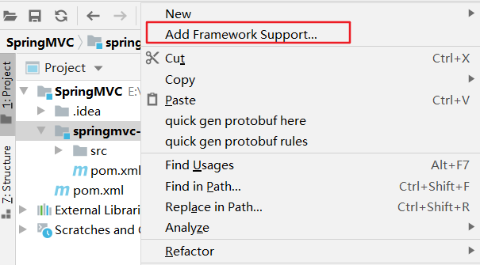
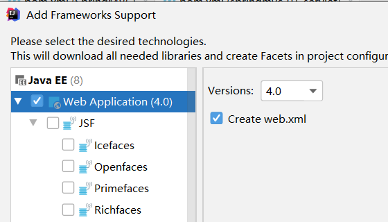
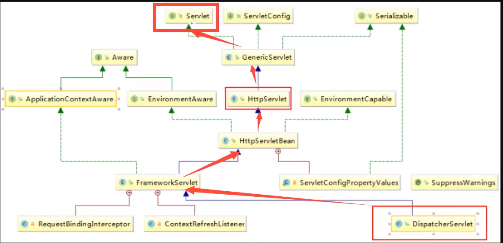
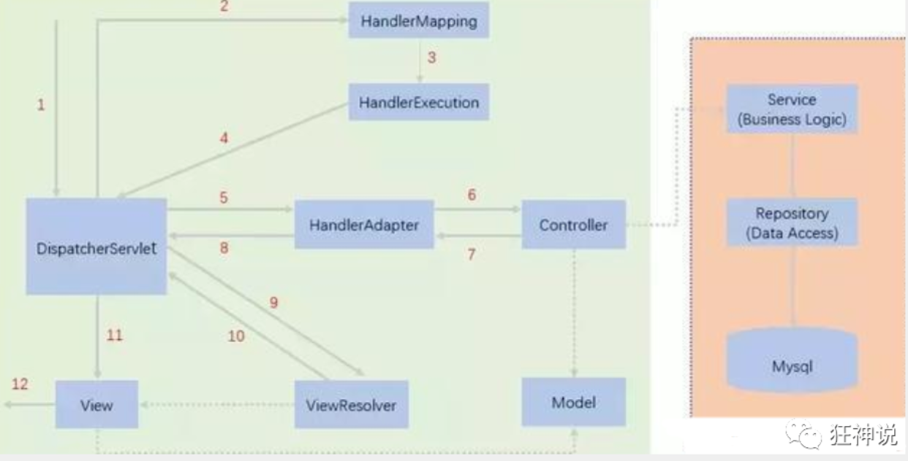
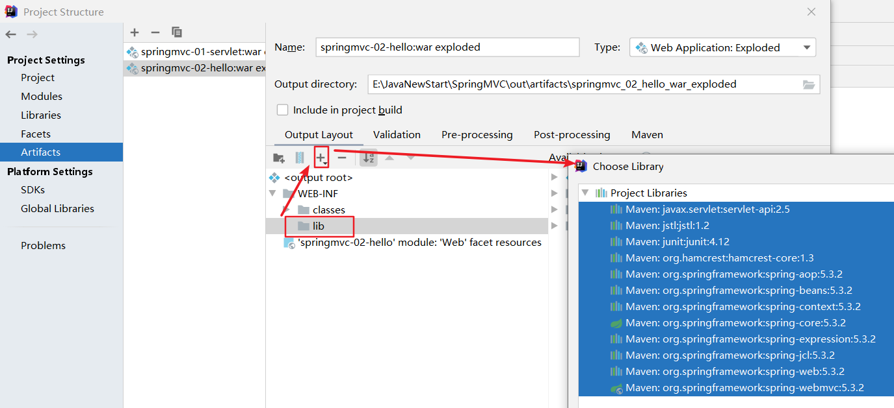

 ^ _ ^ 
<!-- more -->

# 资料
官方文档：[https://docs.spring.io/spring-framework/docs/current/reference/html/web.html](https://docs.spring.io/spring-framework/docs/current/reference/html/web.html)
狂神视频：[https://www.bilibili.com/video/BV1aE41167Tu?p=4](https://www.bilibili.com/video/BV1aE41167Tu?p=4)

# 环境准备
1. 创建父工程为普通Maven工程，命名为SpringMVC

2. 删除父工程中的src目录

3. 在pom.xml文件中添加环境依赖
```xml
<!--junit-->
<dependency>
    <groupId>junit</groupId>
    <artifactId>junit</artifactId>
    <version>4.12</version>
</dependency>
<!--spring-mvc-->
<dependency>
    <groupId>org.springframework</groupId>
    <artifactId>spring-webmvc</artifactId>
    <version>5.3.2</version>
</dependency>
<!--jsp-->
<dependency>
    <groupId>javax.servlet</groupId>
    <artifactId>servlet-api</artifactId>
    <version>2.5</version>
</dependency>
<!--jstl-->
<dependency>
    <groupId>jstl</groupId>
    <artifactId>jstl</artifactId>
    <version>1.2</version>
</dependency>
```

4. 在pom.xml文件中配置编译环境为1.8
```xml
<properties>
    <project.build.sourceEncoding>UTF-8</project.build.sourceEncoding>
    <maven.compiler.source>1.8</maven.compiler.source>
    <maven.compiler.target>1.8</maven.compiler.target>
</properties>
```

# 回顾servlet
1. 以maven工程模板创建子模块 springmvc-01-servlet

2. 将 springmvc-01-servlet 转换为 web项目



3. java文件夹下添加 com.llunch4w.servlet.TestServlet 类
```java
public class TestServlet extends HttpServlet {
    @Override
    protected void doGet(HttpServletRequest req, HttpServletResponse resp) throws ServletException, IOException {
        // 获取参数
        String method = req.getParameter("method");

        HttpSession session = req.getSession();
        if(method.equals("add")){
            session.setAttribute("msg","增加");
        }
        else if(method.equals("delete")){
            session.setAttribute("msg","删除");
        }

        resp.sendRedirect("test.jsp");
    }

    @Override
    protected void doPost(HttpServletRequest req, HttpServletResponse resp) throws ServletException, IOException {
        super.doGet(req, resp);
    }
}
```

1. webapp目录下按照jsp模板创建 test.jsp，在body中添加${msg}
```jsp
<body>
    ${msg}
</body>
```

5. 修改webapp/WEB-INF目录下的web.xml文件
```xml
<!--在web-app标签下添加如下子标签-->
<servlet>
    <servlet-name>TestServlet</servlet-name>
    <servlet-class>com.llunch4w.servlet.TestServlet</servlet-class>
</servlet>

<servlet-mapping>
    <servlet-name>TestServlet</servlet-name>
    <url-pattern>/test</url-pattern>
</servlet-mapping>
```

6. 启动服务器进行测试
分别输入网址进行测试
- http://localhost:8080/springmvc_01_servlet_war_exploded/test.jsp?method=add
- http://localhost:8080/springmvc_01_servlet_war_exploded/test.jsp?method=delete

# 初识SpringMVC
## 中心控制器
Spring的web框架围绕DispatcherServlet设计。DispatcherServlet的作用是将请求分发到不同的处理器。从Spring 2.5开始，使用Java 5或者以上版本的用户可以采用基于注解的controller声明方式。


## SpringMVC执行原理


1. 用户发出请求，DispatcherServlet接收请求并拦截请求
2. HandlerMapping为处理器映射。DispatcherServlet调用HandlerMapping,HandlerMapping根据请求url查找Handler
3. HandlerExecution表示具体的Handler,其主要作用是根据url查找控制器
4. HandlerExecution将解析后的信息传递给DispatcherServlet,如解析控制器映射等
5. HandlerAdapter表示处理器适配器，其按照特定的规则去执行Handler
6. Handler让具体的Controller执行
7. Controller将具体的执行信息返回给HandlerAdapter,如ModelAndView
8. HandlerAdapter将视图逻辑名或模型传递给DispatcherServlet
9. DispatcherServlet调用视图解析器(ViewResolver)来解析HandlerAdapter传递的逻辑视图名
10. 视图解析器将解析的逻辑视图名传给DispatcherServlet
11. DispatcherServlet根据视图解析器解析的视图结果，调用具体的视图
12. 最终视图呈现给用户

# 第一个SpringMVC项目
1. 以maven工程模板创建子模块 springmvc-02-hello 并将其添加 web 支持

2. 在 webapp/WEB-INF 目录下的 web.xml 中的webapp结点下添加
```xml
<servlet>
    <servlet-name>springmvc</servlet-name>
    <servlet-class>org.springframework.web.servlet.DispatcherServlet</servlet-class>
    <!--关联一个springmvc配置文件-->
    <init-param>
        <param-name>contextConfigLocation</param-name>
        <param-value>classpath:springmvc-servlet.xml</param-value>
    </init-param>
    <!--启动级别-->
    <load-on-startup>1</load-on-startup>
</servlet>

<!--/ 匹配所有的请求；（不包括.jsp）-->
<!--/* 匹配所有的请求；（包括.jsp）-->
<servlet-mapping>
    <servlet-name>springmvc</servlet-name>
    <url-pattern>/</url-pattern>
</servlet-mapping>
```

3. 在resources目录下添加 springmvc-servlet.xml 文件
```xml
<?xml version="1.0" encoding="UTF-8"?>
<beans xmlns="http://www.springframework.org/schema/beans"
       xmlns:xsi="http://www.w3.org/2001/XMLSchema-instance"
       xsi:schemaLocation="http://www.springframework.org/schema/beans
       http://www.springframework.org/schema/beans/spring-beans.xsd">

    <!--添加 处理映射器-->
    <bean class="org.springframework.web.servlet.handler.BeanNameUrlHandlerMapping"/>
    <!--添加 处理器适配器-->
    <bean class="org.springframework.web.servlet.mvc.SimpleControllerHandlerAdapter"/>
    <!--添加 视图解析器-->
    <!--视图解析器:DispatcherServlet给他的ModelAndView-->
    <bean class="org.springframework.web.servlet.view.InternalResourceViewResolver" id="InternalResourceViewResolver">
        <!--前缀-->
        <property name="prefix" value="/pages/"/>
        <!--后缀-->
        <property name="suffix" value=".jsp"/>
    </bean>

</beans>
```

4. 编写操作业务Controller ，要么实现Controller接口，要么增加注解
```java
package com.llunch4w.controller;
import org.springframework.web.servlet.mvc.Controller;
public class HelloController implements Controller {
    @Override
    public ModelAndView handleRequest(HttpServletRequest httpServletRequest, HttpServletResponse httpServletResponse) throws Exception {
        //ModelAndView 模型和视图
        ModelAndView mv = new ModelAndView();
        //封装对象，放在ModelAndView中。Model
        mv.addObject("msg","HelloSpringMVC!");
        //封装要跳转的视图，放在ModelAndView中
        mv.setViewName("hello"); //: /WEB-INF/jsp/hello.jsp
        return mv;
    }
}
```

5. 将自己的类交给SpringIOC容器，注册bean
> 即在 springmvc-servlet.xml 文件中添加语句

```xml
<!--Handler-->
<bean id="/hello" class="com.llunch4w.controller.HelloController"/>
```

6. 在 webapp/pages 目录下添加 hello.jsp，并在body标签下添加 ${msg}
```jsp
<body>
    ${msg}
</body>
```

7. 添加依赖，否则会出现404错误


8. 启动服务器进行测试
在浏览器输入网址：[http://localhost:8080/springmvc_02_hello_war_exploded/hello](http://localhost:8080/springmvc_02_hello_war_exploded/hello)

# 实现注解开发SpringMVC项目
1. 重复“第一个springmvc-02-hello”的开发步骤直到步骤5

2. 更改 springmvc-servlet.xml
```xml
<?xml version="1.0" encoding="UTF-8"?>
<beans xmlns="http://www.springframework.org/schema/beans"
       xmlns:xsi="http://www.w3.org/2001/XMLSchema-instance"
       xmlns:context="http://www.springframework.org/schema/context"
       xmlns:mvc="http://www.springframework.org/schema/mvc"
       xsi:schemaLocation="http://www.springframework.org/schema/beans
       http://www.springframework.org/schema/beans/spring-beans.xsd
       http://www.springframework.org/schema/context
       https://www.springframework.org/schema/context/spring-context.xsd
       http://www.springframework.org/schema/mvc
       https://www.springframework.org/schema/mvc/spring-mvc.xsd">


    <!-- 自动扫描包，让指定包下的注解生效,由IOC容器统一管理 -->
    <context:component-scan base-package="com.llunch4w.controller"/>
    <!-- 让Spring MVC不处理静态资源 -->
    <mvc:default-servlet-handler />
    <!--
    支持mvc注解驱动
        在spring中一般采用@RequestMapping注解来完成映射关系
        要想使@RequestMapping注解生效
        必须向上下文中注册DefaultAnnotationHandlerMapping
        和一个AnnotationMethodHandlerAdapter实例
        这两个实例分别在类级别和方法级别处理。
        而annotation-driven配置帮助我们自动完成上述两个实例的注入。
     -->
    <mvc:annotation-driven />


    <!-- 视图解析器 -->
    <bean class="org.springframework.web.servlet.view.InternalResourceViewResolver"
          id="internalResourceViewResolver">
        <!-- 前缀 -->
        <property name="prefix" value="/WEB-INF/pages/" />
        <!-- 后缀 -->
        <property name="suffix" value=".jsp" />
    </bean>

</beans>
```

3. 更新HelloController为注解方式
```java
package com.llunch4w.controller;
import org.springframework.stereotype.Controller;
@Controller
@RequestMapping("/hello")
public class HelloController {
    @RequestMapping("/say")
    public String sayHello(Model model){
        //向模型中添加属性msg与值，可以在JSP页面中取出并渲染
        model.addAttribute("msg","hello,SpringMVC");
        //web-inf/pages/hello.jsp
        return "hello";
    }
}
```

4. 在 webapp/WEB-INF/pages 目录下添加 hello.jsp，并在body标签下添加 ${msg}
```jsp
<body>
    ${msg}
</body>
```

> 在WEB-INF目录下的文件客户端是不可访问的，这样能有效防止客户端通过手动输入网址来访问一些不可直接访问的网页，例如跳过登陆直接通过网址访问菜单页。

5. 添加依赖，否则会出现404错误


6. 启动服务器进行测试
在浏览器输入网址：[http://localhost:8080/springmvc_03_annotation_war_exploded/hello/say](http://localhost:8080/springmvc_03_annotation_war_exploded/hello/say)

# RestFul风格
## 概念
Restful就是一个资源定位及资源操作的风格。不是标准也不是协议，只是一种风格。基于这个风格设计的软件可以更简洁，更有层次，更易于实现缓存等机制。

## 功能
资源：互联网所有的事物都可以被抽象为资源
资源操作：使用POST、DELETE、PUT、GET，使用不同方法对资源进行操作。
分别对应 添加、 删除、修改、查询

## 实例
```java
@Controller
public class RestFulController {
 
    //映射访问路径
    @RequestMapping("/commit/{p1}/{p2}")
    public String index(@PathVariable int p1, @PathVariable int p2, Model model){
        
        int result = p1+p2;
        //Spring MVC会自动实例化一个Model对象用于向视图中传值
        model.addAttribute("msg", "结果："+result);
        //返回视图位置
        return "test";
        
    }
}
```
请求网址：http://localhost:8080/commit/1/2

## 使用method属性指定请求类型
```java
//映射访问路径,必须是POST请求
@RequestMapping(value = "/hello",method = {RequestMethod.POST})
public String index2(Model model){
    model.addAttribute("msg", "hello!");
    return "test";
}
```
> 设置后只能使用POST方法访问

## 方法级别的注解变体
```java
@GetMapping
@PostMapping
@PutMapping
@DeleteMapping
@PatchMapping
```

# 拦截器
> 比如说，用户可以直接通过网址访问登陆页，却不能通过网址直接访问主菜单页，即不能跳过登陆流程。拦截器的作用就是拦截那些未登陆用户直接访问主菜单页的行为

## 过滤器 vs 拦截器
**过滤器**
- servlet规范的一部分，任何 java web 工程都可以使用
- 在 url-pattern 中配置了/*之后，可以对所有要访问的资源进行过滤

**拦截器**
- 是 SpringMVC 框架自己的，只有使用了 SpringMVC 框架的工程才能使用
- 拦截器只会拦截访问控制器的方法，如果访问的是 jsp/html/css/image/js 是不会进行拦截的

## 自定义拦截器
1. 新建模块 spring-04-intercepter，为该模块添加 web 支持
2. 在 resources 包下添加 applicationContext.xml 文件
```xml
<?xml version="1.0" encoding="UTF-8"?>
<beans xmlns="http://www.springframework.org/schema/beans"
       xmlns:xsi="http://www.w3.org/2001/XMLSchema-instance"
       xmlns:context="http://www.springframework.org/schema/context"
       xmlns:mvc="http://www.springframework.org/schema/mvc"
       xsi:schemaLocation="http://www.springframework.org/schema/beans
    http://www.springframework.org/schema/beans/spring-beans.xsd
    http://www.springframework.org/schema/context
    http://www.springframework.org/schema/context/spring-context.xsd
    http://www.springframework.org/schema/mvc
    https://www.springframework.org/schema/mvc/spring-mvc.xsd">

    <!-- 配置SpringMVC -->
    <!-- 1.开启SpringMVC注解驱动 -->
    <mvc:annotation-driven />
    <!-- 2.静态资源默认servlet配置-->
    <mvc:default-servlet-handler/>

    <!-- 3.配置jsp 显示ViewResolver视图解析器 -->
    <bean class="org.springframework.web.servlet.view.InternalResourceViewResolver">
        <property name="viewClass" value="org.springframework.web.servlet.view.JstlView" />
        <property name="prefix" value="/WEB-INF/jsp/" />
        <property name="suffix" value=".jsp" />
    </bean>

    <!-- 4.扫描web相关的bean -->
    <context:component-scan base-package="com.llunch4w.controller" />
</beans>
```
3. 修改 WEB-INF 文件夹下的 web.xml文件
```xml
<?xml version="1.0" encoding="UTF-8"?>
<web-app xmlns="http://xmlns.jcp.org/xml/ns/javaee"
         xmlns:xsi="http://www.w3.org/2001/XMLSchema-instance"
         xsi:schemaLocation="http://xmlns.jcp.org/xml/ns/javaee http://xmlns.jcp.org/xml/ns/javaee/web-app_4_0.xsd"
         version="4.0">

    <!--DispatcherServlet-->
    <servlet>
        <servlet-name>DispatcherServlet</servlet-name>
        <servlet-class>org.springframework.web.servlet.DispatcherServlet</servlet-class>
        <init-param>
            <param-name>contextConfigLocation</param-name>
            <param-value>classpath:applicationContext.xml</param-value>
        </init-param>
        <load-on-startup>1</load-on-startup>
    </servlet>
    <servlet-mapping>
        <servlet-name>DispatcherServlet</servlet-name>
        <url-pattern>/</url-pattern>
    </servlet-mapping>

    <!--encodingFilter-->
    <filter>
        <filter-name>encodingFilter</filter-name>
        <filter-class>
            org.springframework.web.filter.CharacterEncodingFilter
        </filter-class>
        <init-param>
            <param-name>encoding</param-name>
            <param-value>utf-8</param-value>
        </init-param>
    </filter>
    <filter-mapping>
        <filter-name>encodingFilter</filter-name>
        <url-pattern>/*</url-pattern>
    </filter-mapping>

</web-app>
```
4. 模块设置 -》 Artifacts
WEB-INF 文件夹下添加 lib目录，lib目录下添加 LibraryFiles

5. 添加自定义 intercepter 类
```java
public class MyInterceptor01 implements HandlerInterceptor {
    // 预处理，Controller方法执行前
    @Override
    public boolean preHandle(HttpServletRequest request, HttpServletResponse response, Object handler) throws Exception {
        System.out.println("MyInterceptor01执行前...");
        HttpSession session = request.getSession();
        if(session.getAttribute("user") != null){
            return true;
        }
        if(request.getRequestURI().contains("login")){
            return true;
        }
        else{
            request.getRequestDispatcher("/WEB-INF/jsp/login.jsp").forward(request,response);
            return false;
        }
    }

    // Controller方法执行后，jsp执行前
    @Override
    public void postHandle(HttpServletRequest request, HttpServletResponse response, Object handler, ModelAndView modelAndView) throws Exception {
        System.out.println("MyInterceptor01执行后...");
    }

    // jsp方法执行后
    @Override
    public void afterCompletion(HttpServletRequest request, HttpServletResponse response, Object handler, Exception ex) throws Exception {
        System.out.println("最后");
    }
}
```

6. 在 applicaitonContext.xml 文件中添加拦截器配置
```xml
<?xml version="1.0" encoding="UTF-8"?>
<beans xmlns="http://www.springframework.org/schema/beans"
       xmlns:xsi="http://www.w3.org/2001/XMLSchema-instance"
       xmlns:context="http://www.springframework.org/schema/context"
       xmlns:mvc="http://www.springframework.org/schema/mvc"
       xsi:schemaLocation="http://www.springframework.org/schema/beans
    http://www.springframework.org/schema/beans/spring-beans.xsd
    http://www.springframework.org/schema/context
    http://www.springframework.org/schema/context/spring-context.xsd
    http://www.springframework.org/schema/mvc
    https://www.springframework.org/schema/mvc/spring-mvc.xsd">

    <!-- 配置SpringMVC -->
    <!-- 1.开启SpringMVC注解驱动 -->
    <mvc:annotation-driven />
    <!-- 2.静态资源默认servlet配置-->
    <mvc:default-servlet-handler/>
    
    <!--SpringMVC拦截器-->
    <mvc:interceptors>
        <mvc:interceptor>
            <mvc:mapping path="/user/*"/>
            <bean class="com.llunch4w.interceptor.MyInterceptor01"></bean>
        </mvc:interceptor>
    </mvc:interceptors>

    <!-- 3.配置jsp 显示ViewResolver视图解析器 -->
    <bean class="org.springframework.web.servlet.view.InternalResourceViewResolver">
        <property name="viewClass" value="org.springframework.web.servlet.view.JstlView" />
        <property name="prefix" value="/WEB-INF/jsp/" />
        <property name="suffix" value=".jsp" />
    </bean>

    <!-- 4.扫描web相关的bean -->
    <context:component-scan base-package="com.llunch4w.controller" />
</beans>
```

7. 编写控制类
```java
@Controller
@RequestMapping("/user")
public class UserController {

    @RequestMapping("/login")
    public String login(String username, String password, HttpSession session,Model model){
        if(username.equals("user") && password.equals("password")){
            //session.setAttribute("user",user);
            return "menu";
        }
        else{
            model.addAttribute("msg","用户名或密码错误");
            return "login";
        }
    }

    @RequestMapping("/goPage")
    public String goPage(String page,Model model){
        return page;
    }
}
```

8. 进行网页测试
index.jsp
```jsp
<h1><a href="${pageContext.request.contextPath}/user/goPage?page=login">登陆</a></h1>
<h1><a href="${pageContext.request.contextPath}/user/goPage?page=menu">首页</a></h1>
```

login.jsp
```jsp
<h1>登陆页</h1>
<form action="${pageContext.request.contextPath}/user/login">
    用户名：<input name="username" type="text">
    密 码：<input name="password" type="password">
    <input type="submit" value="登陆">
</form>
<h6 style="color: red">${msg}</h6>
```

menu.jsp
```jsp
<h1>首页</h1>
```