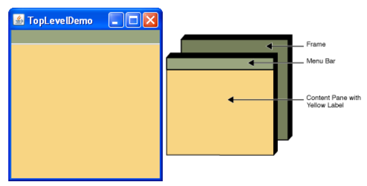
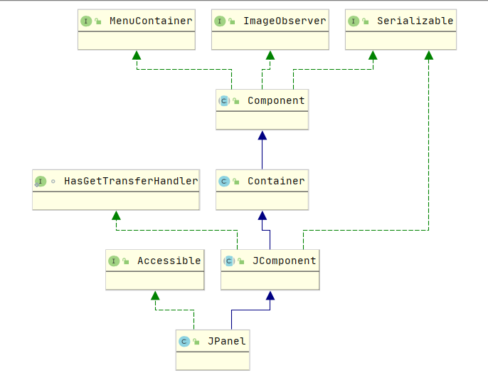
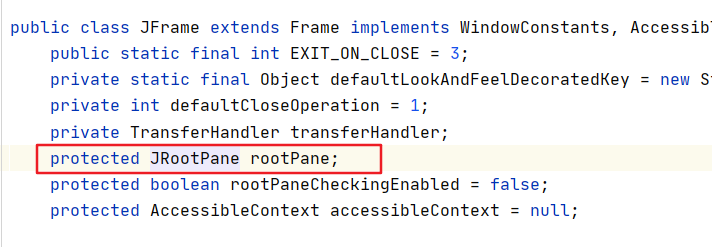
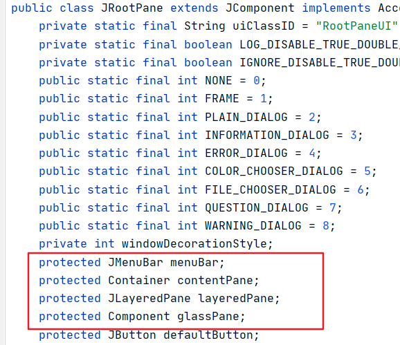
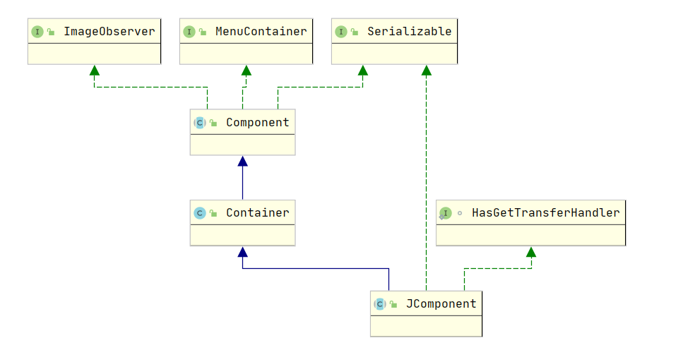
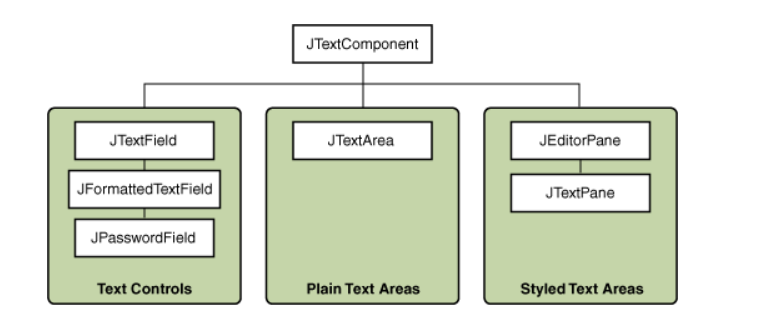
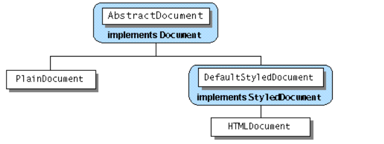

 ^ _ ^ 

<!-- more -->

# 引入swing包包
```
import javax.swing.*;
```

# 顶层容器
Swing提供了三种顶层容器，分别是：`JFrame`,`JDialog`,`JApplet`
- 显示在屏幕上的GUI组件必须处于一个容器层级结构（一棵以顶层容器为根的组件树）中
- 每个GUI组件只能处于一个容器中一次：如果将一个组件从一个容器中移入到另一个，则移出方中该组件会消失
- 每个顶层容器都有一个content pane，包含着顶级容器GUI中的可见组件
- 可以选择性地为顶层容器添加菜单栏，菜单栏并不包含在content pane中



## Top-Level Container 和 Containment Hierarchy
每个Top-Level Container对应着一个Containment Hierarchy，它们是Containment Hierarchy的根，往Top-Level Container中添加的其他组件就是Containment Hierachy的子节点。
如果一个应用中包含着多个Top-Level Container，那么它也有多个Containment Hierarchy。

## Content Pane
1. 每个Top-Level Container包含一个默认的Content Pane
```
// frame is a JFrame
Container contentPanel = frame.getContentPane();
```

2. 默认的Content Pane是一个继承自JComponent的中间件，使用BorderLayout为默认布局方式

但是，如1所示，JFrame的getContentPane方法返回的是Container类型，这就导致Content Pane无法使用一些JComponent特有的方法。
解决这个问题的方法有：
- 将使用getContentPane得到的Container强制类型转换成JComponent
- 自定义JPanel，然后使用setContentPane设置为Top-Level的Content Pane
```
// Content Pane强制转换成panel
JPanel panel = (JPanel)frame.getContentPane();

// 自定义JPanel，设置为JFrame的Content Pane
// JPanel默认是FlowLayout布局方式的
JPanel customizePanel = new JPanel(new BorderLayout());
frame.setContentPane(customizePanel);
```

3. frame的add,remove,setLayout方法真正的作用对象是它的Content Pane

## Root Pane
每个Top-Level都依赖于一个隐藏的中间层--RootPane


- LayeredPane：包含Menu Bar和Content Pane，用于布置组件
- GlassPane：用于捕获输入事件和组件上的绘图


# JComponent类
> 所有的Swing组件，除了JFrame和JDialog，只要是以'J'开头，均派生自JComponent



- Component：提供布局、绘图、事件捕获等功能
- Container：提供增加组件到container和放置它们的功能


# Text Component



JTextComponent类是Swing Text组件的基础，它为它的子类提供了如下特征：
- model：`document`，用于管理组件的内容
- view：控制组件如何显示在屏幕上
- controller：`editor kit`，控制读写操作和基于事件的编辑
- 支持无限次撤销和重做
- 支持文本插入的监听器和导航过滤器



对于JTextComponent的子类，Text Controls（JTextField,JFormattedField,JPasswordField）和Text Area包含的文档模型都是PlainDocument，字体有着相同的样式。而Styled Text Area（JEditorPane,JTextPane）所包含的模型是DefaultStyledDocuement，可以像word文档一样设置丰富的文本样式，包括设置字体颜色大小，添加图片，添加组件等等。


# 装饰
## Border
Border的作用：
- 划线
- 给组件边缘添加边框
- 提供标题和边距

理论上可以给所有的JComponent类型组件添加Border，但是实际上一般添加边框的组件都是`JPanel`和`JLabel`，对于其他JComponent类型添加边框可能效果不是太好。

