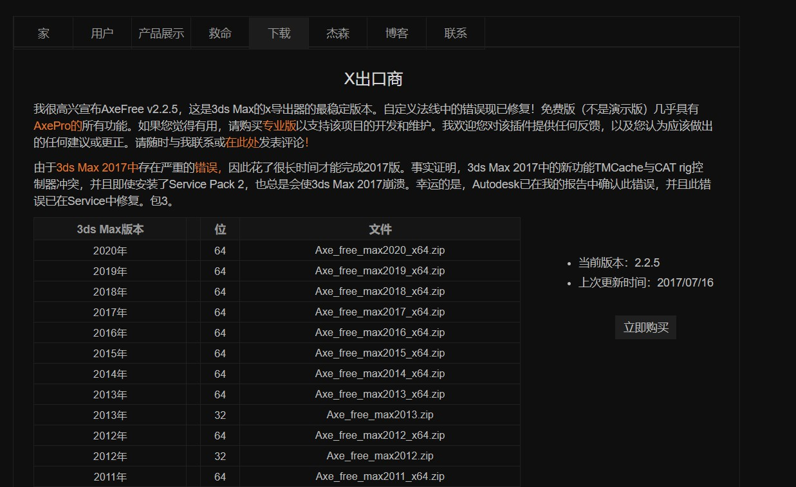
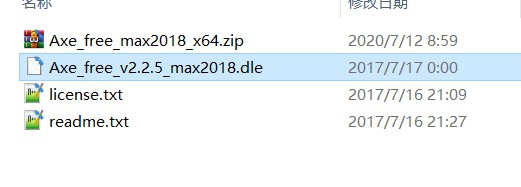
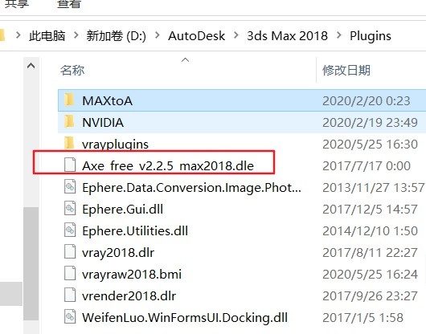
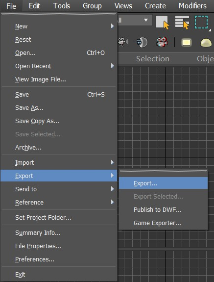
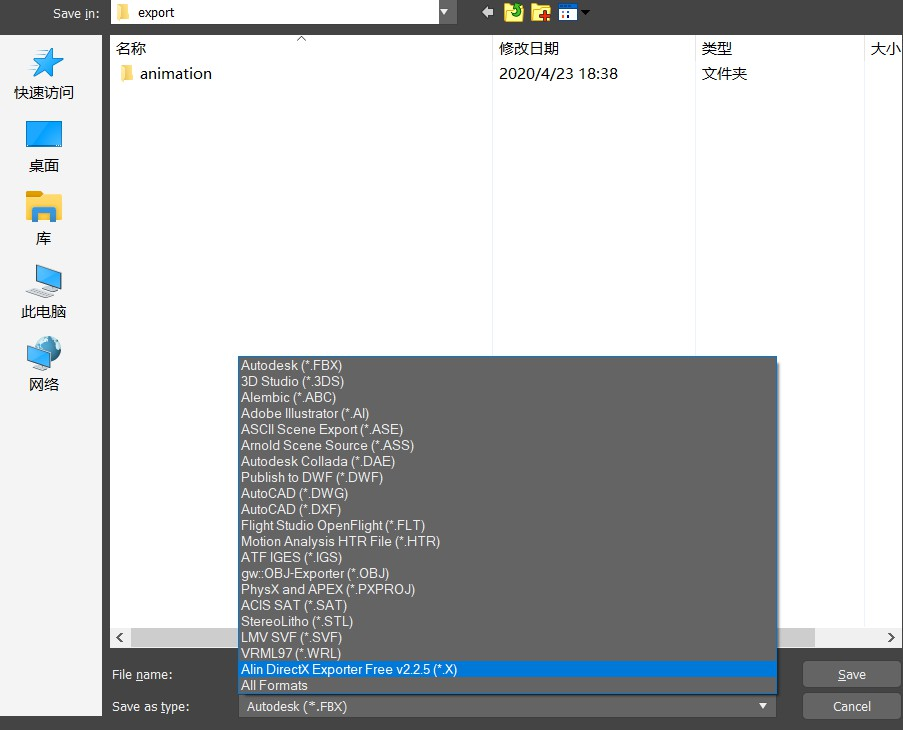

 从3dmax中导出x文件 
<!-- more -->

# x文件
以X为文件扩展名的文件是微软定义的文件格式，用来存放3D模型。
在3dsmax中建模完成的模型导出为x文件后，就可以在DirectX中进行导入然后使用。

# 从3dmax中导出x文件
3dsmax自带的导出文件类型中并没有x文件类型，所以需要下载插件。

插件下载网站为[http://www.cgdev.net/](http://www.cgdev.net/)

选择箭头所指向的模块

选择对应3dmax版本的插件进行下载

下载得到压缩包，对其进行解压

把dle文件复制到3dsmax安装目录下的Plugins文件夹下

打开3dsmax软件，选择导出

导出类型选项中就出现x文件了

## 参考博客
[使用Axe_free_v2.2.5_max2018.dle插件从3d max中导出.x文件](https://blog.csdn.net/xingkwe/article/details/86658465)
[3d max插件的基本知识和安装方法](https://blog.csdn.net/puppet_master/article/details/48978317)

