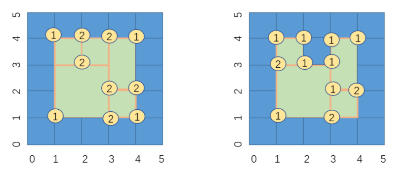

 ^ _ ^ 
<!-- more -->

# 简介
在计算几何中，扫描线算法（Sweep Line Algorithm）或平面扫描算法（Plane Sweep Algorithm）是一种算法范例，它使用虚拟扫描线或扫描面来解决欧几里德空间中的各种问题。它是计算几何中的关键技术之一。

这种算法背后的想法是想象一条线（通常是一条垂直线）在平面上扫过或移动，在某些点停止。几何操作仅限于几何对象，无论何时停止，它们都与扫描线相交或紧邻扫描线，并且一旦线穿过所有对象，就可以获得完整的解。

# 391.完美矩形
## 题目描述


题目链接：[https://leetcode-cn.com/problems/perfect-rectangle/](https://leetcode-cn.com/problems/perfect-rectangle/)

## 题目理解
根据题意，完美矩形应具有的条件如下：
- 所有小矩形构成一个大矩形
- 大矩形是完整的，中间不能有空缺
- 小矩形之间不能有覆盖

## 思路1：面积累加 + 坐标消融
对于一个完美矩形，应该满足如下两个条件：
- 小矩形的面积之和 == 大矩形的面积
- 在小矩形所有顶点组成的序列中，出现次数为1的顶点就是最后完美矩形的四个顶点，其他的顶点都出现了两次，如下图所示


### 第一次尝试
```python
def isRectangleCover(rectangles) -> bool:
    area = 0
    points = []
    for rectangle in rectangles:
        leftDown = rectangle[0:2]
        rightUp = rectangle[2:4]
        leftUp = [leftDown[0],rightUp[1]]
        rightDown = [rightUp[0],leftDown[1]]

        points.remove(leftDown) if leftDown in points else points.append(leftDown)
        points.remove(rightUp) if rightUp in points else points.append(rightUp)
        points.remove(leftUp) if leftUp in points else points.append(leftUp)
        points.remove(rightDown) if rightDown in points else points.append(rightDown)

        area += (rectangle[3]-rectangle[1])*(rectangle[2]-rectangle[0])
    # print(f"points:{points}")
    if len(points) != 4:
        return False
    points = sorted(points,key=lambda kv:(kv[0],kv[1]))
    # print(f"sortedPoints:{points}")
    if (points[3][0]-points[0][0])*(points[3][1]-points[0][1]) == area:
        return True
    else:
        return False
```


### 第二次尝试
```python
import sys
def isRectangleCover(rectangles) -> bool:
    area = 0
    points = []
    # X1,Y1,X2,Y2为大矩形的坐标
    X1,Y1,X2,Y2 = sys.maxsize,sys.maxsize,-sys.maxsize,-sys.maxsize
    for x1,y1,x2,y2 in rectangles:
        X1,Y1,X2,Y2 = min(x1,X1),min(y1,Y1),max(x2,X2),max(y2,Y2)

        rectangle = [(x1,y1),(x2,y2),(x1,y2),(x2,y1)]
        for point in rectangle:
            points.remove(point) if point in points else points.append(point)

        area += (y2 - y1)*(x2 - x1)
    if len(points) != 4:
        return False
    if not all([point in points for point in [(X1,Y1),(X2,Y2),(X1,Y2),(X2,Y1)]]):
        return False
    return True if (Y2 - Y1)*(X2 - X1) == area else False
```


### 第三次尝试
> 将保存点的points由list换成了set，带来了效率的显著提升

```python
def isRectangleCover(rectangles) -> bool:
    area = 0
    points = set()
    # X1,Y1,X2,Y2为大矩形的坐标
    X1,Y1,X2,Y2 = sys.maxsize,sys.maxsize,-sys.maxsize,-sys.maxsize
    for x1,y1,x2,y2 in rectangles:
        X1,Y1,X2,Y2 = min(x1,X1),min(y1,Y1),max(x2,X2),max(y2,Y2)

        rectangle = [(x1,y1),(x2,y2),(x1,y2),(x2,y1)]
        for point in rectangle:
            points.remove(point) if point in points else points.add(point)

        area += (y2 - y1)*(x2 - x1)
    if (Y2 - Y1)*(X2 - X1) != area:
        return False
    if len(points) != 4:
        return False
    return all([point in points for point in [(X1,Y1),(X2,Y2),(X1,Y2),(X2,Y1)]])
```


**关于set的补充**
- 集合能如此高效，和它的内部的数据结构密不可分。不同于其他数据结构，集合的内部结构是一张哈希表。
- 当向集合中插入数据时，Python会根据通过 hash(valuse) 函数，计算该元素对应的哈希值。得到哈希值（例如为 hash）之后，再结合集合要存储数据的个数（例如 n），就可以得到该元素应该插入到哈希表中的位置
  - 如果哈希表中此位置是空的，那么此元素就可以直接插入其中
  - 反之，如果此位置已被其他元素占用，那么 Python 会比较这两个元素的哈希值是否相等
    - 如果相等，则表明该元素已经存在，再比较他们的值，不相等就进行更新
    - 如果不相等，这种情况称为哈希冲突（即两个元素的键不同，但求得的哈希值相同）。这种情况下，Python 会使用开放定址法、再哈希法等继续寻找哈希表中空余的位置，直到找到位置
- 在哈希表中查找数据，和插入操作类似，Python 会根据哈希值，找到该元素应该存储到哈希表中的位置，然后和该位置的元素比较元素值
  - 如果相等，则证明找到
  - 反之，则证明当初存储该元素时，遇到了哈希冲突，需要继续使用当初解决哈希冲突的方法进行查找，直到找到该元素或者找到空位为止。 
  - 这里的找到空位，表示哈希表中没有存储目标元素
- 对于删除操作，Python 会暂时对这个位置的元素赋于一个特殊的值，等到重新调整哈希表的大小时，再将其删除
  - 需要注意的是，哈希冲突的发生往往会降低字典和集合操作的速度
  - 因此，为了保证其高效性，字典和集合内的哈希表，通常会保证其至少留有 1/3 的剩余空间
  - 随着元素的不停插入，当剩余空间小于 1/3 时，Python 会重新获取更大的内存空间，扩充哈希表，与此同时，表内所有的元素位置都会被重新排放
- 虽然哈希冲突和哈希表大小的调整，都会导致速度减缓，但是这种情况发生的次数极少。所以，平均情况下，仍能保证插入、查找和删除的时间复杂度为 O(1)。
- set的去重是通过两个函数__hash__和__eq__结合实现的
  - 当两个元素的哈希值不相同时，就认为这两个变量是不同的
  - 当两个元素哈希值一样时，调用__eq__方法，当返回值为True时认为这两个变量是同一个，应该去除一个。返回FALSE时，不去重

## 思路2：扫描线算法
