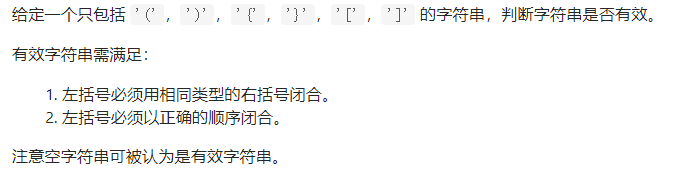
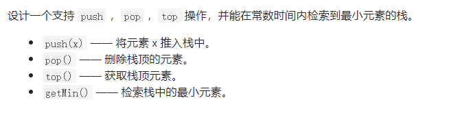

 ^ _ ^ 
<!-- more -->

# 简介
栈是一种先进后出的数据结构。

# 简单题
## 20 有效的括号
### 题目描述


题目链接：[https://leetcode-cn.com/problems/valid-parentheses/](https://leetcode-cn.com/problems/valid-parentheses/)

### 解题思路
1. 用dict保存(右括号，左括号)之间的映射关系
2. 用一个栈保存当前还未匹配的字符
3. 逐步读入字符串中的每个字符
    - 如果该字符不属于dict的键，则直接入栈（不在dict中说明当前符号属于左括号）
    - 否则，（当前符号属于右括号）
      - 如果此时栈为空，匹配失败
      - 如果该键在dict中对应的值和栈顶元素相同，则出栈栈顶元素；不然匹配失败
4. 字符串中字符读入完毕，若栈为空，匹配成功；否则，匹配失败

### 第一次尝试
```python
def isValid(s):
    bracketMap = {'}':'{',']':'[',')':'('}
    tokenStack = []
    for c in s:
        if c not in bracketMap:
            tokenStack.append(c)
        else:
            if len(tokenStack) == 0 or tokenStack[-1] != bracketMap[c]:
                return False
            tokenStack.pop()
    return not tokenStack
```

**复杂度分析**
- 时间复杂度：O(n), n为字符串长度
- 空间复杂度：O(n + 6)，n为字符串长度，n为括号字符集大小

## 155 最小栈
### 题目描述


题目链接：[https://leetcode-cn.com/problems/min-stack/](https://leetcode-cn.com/problems/min-stack/)

### 解题思路1
1. 类内部保存两个栈，一个是普通栈，一个是最小栈
2. 对于最小栈，本质上是一个普通栈，只是入栈和出栈条件发生了改变，最小栈规则如下：
    - 最小栈为空时，入最小栈
    - 当前入栈元素小于等于最小栈栈顶元素时，入最小栈
    - 当前出栈元素与最小栈栈顶元素相同时，出最小栈

### 第一次尝试
```python
class MinStack:

    def __init__(self):
        self.stack = []
        self.minStack = []

    def push(self, x: int) -> None:
        self.stack.append(x)
        if not self.minStack or self.minStack[-1] >= x:
            self.minStack.append(x)

    def pop(self) -> None:
        x = self.stack.pop()
        if self.minStack and self.minStack[-1] == x:
            self.minStack.pop()

    def top(self) -> int:
        return self.stack[-1]

    def getMin(self) -> int:
        return self.minStack[-1]
```

**复杂度**
- 时间复杂度：O(1)
- 空间复杂度：O(n)

### 解题思路2
1. 类内部只保存一个栈，栈中元素是元组形式(元素值，当前栈中最小值)
2. 入栈和出栈条件如下：
    - 栈为空时，入栈元素(x,x)
    - 栈不为空时，入栈元素(x,min(stack))
    - 出栈则直接出栈

### 第二次尝试
```python
class MinStack:

    def __init__(self):
        self.stack = []

    def push(self, x: int) -> None:
        if not self.stack:
            self.stack.append((x,x))
        else:
            self.stack.append((x,min(x,self.stack[-1][-1])))

    def pop(self) -> None:
        self.stack.pop()

    def top(self) -> int:
        return self.stack[-1][0]

    def getMin(self) -> int:
        return self.stack[-1][-1]
```

**复杂度**
- 时间复杂度：O(1)
- 空间复杂度：O(n)

## 225 用队列实现栈
