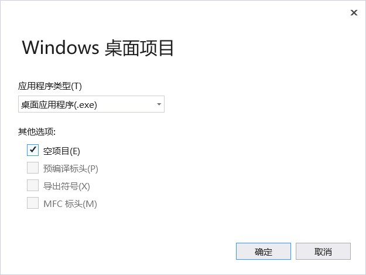

 从一个绘制茶壶的例子开始入门DirectX编程 

<!-- more -->

# 1 新建一个DirectX项目
> 在Visual Studio 2017中新建一个DirectX项目

1. 解决方案处右键--》添加--》项目，打开新建项目向导

2. 选择`Visual C++`/`Windows桌面`下的Windows桌面向导


3. 在弹出窗口中选择`桌面应用程序`，并勾选`空项目`


4. 设置项目属性
- 项目处右键--》属性
- VC++目录--》包含目录--》添加 D:\DirectX\Include
- VC++目录--》库目录--》添加 D:\DirectX\Lib\x86
- 链接器--》输入--》附加依赖项--》添加d3d9.lib d3dx9.lib winmm.lib（每行显示一个）

# 2 思路分析
## 初始化Direct3D
需要四个步骤：
### 1. 创建Direct3D对象，获取IDirect3D9接口指针
```
// LPDIRECT3D9 是 Direct3D9* 的宏定义
// 该函数只有一个参数，该参数必须设置为D3D_SDK_VERSION
LPDIRECT3D9 g_pD3D = Direct3DCreate9(D3D_SDK_VERSION);
if (g_pD3D == NULL)
    return E_FAIL;
```

### 2. 检查设备性能
- 通过GetDeviceCaps方法填充一个D3DCAP9结构
- 通过检查D3DCAP9结构的各个成员，可以判断当前硬件是否支持某项功能

**使用方式**
```
D3DCAPS9  caps;
// 填充caps
g_pD3D->GetDeviceCaps(D3DADAPTER_DEFAULT, D3DDEVTYPE_HAL, &caps);
// 根据caps判断支持顶点处理类型
int vp = 0;
if (caps.DevCaps & D3DDEVCAPS_HWTRANSFORMANDLIGHT)
{
    vp = D3DCREATE_HARDWARE_VERTEXPROCESSING;
}
else
{
    vp = D3DCREATE_SOFTWARE_VERTEXPROCESSING;
}
```

**GetDeviceCaps函数原型**
```
HRESULT GetDeviceCaps(
    UINT Adapter,           // 显示适配器的序号，D3DADAPTER_DEFAULT始终是主要的显示适配器
    D3DDEVTYPE DeviceType,  // 设备类型，D3DDEVTYPE是枚举类型
    D3DCAPS9 * pCaps  );    // 指向D3DCAPS9结构的指针，该结构将填充描述设备功能的信息
```

返回值取值：
- 成功：D3D_OK
- 失败：D3DERR_INVALIDCALL|D3DERR_INVALIDDEVICE|D3DERR_OUTOFVIDEOMEMORY|D3DERR_NOTAVAILABLE

D3DDEVTYPE原型：
```
typedef enum D3DDEVTYPE
{
    D3DDEVTYPE_HAL = 1,     // HAL设备，硬件栅格化
    D3DDEVTYPE_REF = 2,     // REF设备，参考栅格化程序
    D3DDEVTYPE_SW = 3,      // 软件设备(很少使用），可插拔软件设备
    D3DDEVTYPE_NULLREF = 4, // 在既没有硬件也没有参考栅格化的计算机上初始化Direct3D
    D3DDEVTYPE_FORCE_DWORD = 0xffffffff,    // 强制将此枚举编译为32位大小
} D3DDEVTYPE, *LPD3DDEVTYPE;
```

**顶点运行方法**
- `D3DCREATE_SOFTWARE_VERTEXPROCESSING`：硬件顶点处理（处理能力可变）
- `D3DCREATE_HARDWARE_VERTEXPROCESSING`：软件顶点处理（处理能力不可变）
- `D3DCREATE_MIXED_VERTEXPROCESSING` ：软硬件混合顶点处理


### 3. 填充D3DPRESENT_PARAMETERS结构
```
D3DPRESENT_PARAMETERS d3dpp;
ZeroMemory(&d3dpp, sizeof(d3dpp));
d3dpp.Windowed = TRUE;
d3dpp.SwapEffect = D3DSWAPEFFECT_DISCARD;
d3dpp.BackBufferFormat = D3DFMT_UNKNOWN;
d3dpp.EnableAutoDepthStencil = TRUE;
d3dpp.AutoDepthStencilFormat = D3DFMT_D16;
d3dpp.PresentationInterval = D3DPRESENT_INTERVAL_IMMEDIATE;
```

[MSDN完整定义](https://docs.microsoft.com/en-us/windows/win32/direct3d9/d3dpresent-parameters)

**D3DPRESENT_PARAMETERS结构原型**
```
typedef struct D3DPRESENT_PARAMETERS {
  UINT                BackBufferWidth;      // 新交换链的后缓冲区的宽度
  UINT                BackBufferHeight;     // 新交换链的后缓冲区的高度
  D3DFORMAT           BackBufferFormat;     // 后台缓冲区格式
  UINT                BackBufferCount;      // 后台缓冲区个数
  D3DMULTISAMPLE_TYPE MultiSampleType;      // 多级采样类型（级别）
  DWORD               MultiSampleQuality;   // 多样采样质量
  D3DSWAPEFFECT       SwapEffect;           // 交换效果
  HWND                hDeviceWindow;        // 设备窗口确定屏幕上后台缓冲区的位置和大小
  BOOL                Windowed;             // 如果应用程序运行在窗口中，则为TRUE;全屏为FALSE
  BOOL                EnableAutoDepthStencil;   // 是否创建深度模板缓冲区
  D3DFORMAT           AutoDepthStencilFormat;   // 自动深度模具表面的格式
  DWORD               Flags;                    // D3DPRESENTFLAG常数
  UINT                FullScreen_RefreshRateInHz;   // 显示适配器刷新屏幕的速率
  UINT                PresentationInterval; // 交换链的后缓冲区可以提供给前缓冲区的最大速率
} D3DPRESENT_PARAMETERS, *LPD3DPRESENT_PARAMETERS;
```
`D3DFORMAT`
是一个枚举类，表示表面格式，包含的格式种类有：
- [BackBuffer或显示格式](https://docs.microsoft.com/en-us/windows/win32/direct3d9/d3dformat#backbuffer-or-display-formats)
- [缓冲区格式](https://docs.microsoft.com/en-us/windows/win32/direct3d9/d3dformat#buffer-formats)
- [DXTn压缩纹理格式](https://docs.microsoft.com/en-us/windows/win32/direct3d9/d3dformat#dxtn-compressed-texture-formats)
- [浮点格式](https://docs.microsoft.com/en-us/windows/win32/direct3d9/d3dformat#floating-point-formats)
- [FOURCC格式](https://docs.microsoft.com/en-us/windows/win32/direct3d9/d3dformat#fourcc-formats)
- [IEEE格式](https://docs.microsoft.com/en-us/windows/win32/direct3d9/d3dformat#ieee-formats)
- [混合格式](https://docs.microsoft.com/en-us/windows/win32/direct3d9/d3dformat#mixed-formats)
- [签名格式](https://docs.microsoft.com/en-us/windows/win32/direct3d9/d3dformat#signed-formats)
- [无符号格式](https://docs.microsoft.com/en-us/windows/win32/direct3d9/d3dformat#unsigned-formats)
- [其他](https://docs.microsoft.com/en-us/windows/win32/direct3d9/d3dformat#other)

**常用取值举例** 
- D3DFMT_UNKNOWN：未知像素格式
- D3DFMT_R8G8B8：每个像素由8位R、G、B组成
- D3DFMT_X8R8G8B8：每个像素由8位R、G、B和8位保留位组成
- D3DFMT_A8R8G8B8：每个像素由8位R、G、B、A(Alpha)组成
- D3DFMT_R5G6B5：每个像素由5位R、6位G、5位B组成
- D3DFMT_D32：32位z缓冲区的位深度
- D3DFMT_D16：16位z缓冲区的位深度

**交换链与表现翻转**
大多数三维图形程序拥有2个或更多颜色缓存。用于当前屏幕刷新的颜色缓存称为前台缓存，用于图形绘制的其他颜色缓存称为后台缓存。
当在后台缓存绘制完图形后，就需要将后台缓存移动到前台缓存进行显示，这个过程称为**表面翻转**。
**交换链**是按顺序逐个提交到前台显示的多个后台缓存的集合。在Direct3D中创建的每个渲染设备至少有一个交换链。 

`D3DSWAPEFFECT`
```
typedef enum D3DSWAPEFFECT { 
  D3DSWAPEFFECT_DISCARD      = 1,
  D3DSWAPEFFECT_FLIP         = 2,
  D3DSWAPEFFECT_COPY         = 3,
  D3DSWAPEFFECT_OVERLAY      = 4,
  D3DSWAPEFFECT_FLIPEX       = 5,
  D3DSWAPEFFECT_FORCE_DWORD  = 0xFFFFFFFF
} D3DSWAPEFFECT, *LPD3DSWAPEFFECT;
```
- `D3DSWAPEFFECT_FLIP`：交换链上包含多个缓存。用一个循环队列来实现，队头指针指向的是前台缓存，这种方式通过队头指针移动来更新队头缓存，以此来实现翻转。
- `D3DSWAPEFFECT_COPY`：交换链上只包含两个缓存。通过将后台缓存的数据复制到前台缓存的方式来进行翻转。
- `D3DSWAPEFFECT_DISCARD`：交换链上包含多个缓存。是`D3DSWAPEFFECT_FLIP`的改进版，可以避免以上两种在不合适情况下造成的大量开销。
- `D3DSWAPEFFECT_OVERLAY`：使用可覆盖在主表面上的显存专用区域。当显示覆盖时，不执行复制。覆盖操作在硬件中执行，而不修改主表面中的数据。
- `D3DSWAPEFFECT_FORCE_DWORD`：强制将此枚举编译为32位的大小。如果没有此值，一些编译器将允许此枚举编译到32位以外的大小。不使用此值。


### 4. 创建Direct3D设备对象，获取IDirect3DDevice9接口指针
```
g_pD3D->CreateDevice(D3DADAPTER_DEFAULT, D3DDEVTYPE_HAL, hWnd, vp, &d3dpp, &g_pd3dDevice)
```

**CreateDevice函数原型**
```
HRESULT CreateDevice(
  UINT                  Adapter,	\\ 显示适配器的序号
  D3DDEVTYPE            DeviceType,	\\ 所需的设备类型
  HWND                  hFocusWindow,	\\ 焦点窗口
  DWORD                 BehaviorFlags,	\\ 控制设备创建的一个或多个选项的组合
  D3DPRESENT_PARAMETERS *pPresentationParameters,	\\ 要创建的设备的显示参数
  IDirect3DDevice9      **ppReturnedDeviceInterface	\\ 指向返回的IDirect3DDevice9接口的指针的地址，该接口代表创建的设备
);
```
返回值：
- 如果该方法成功，则返回值为D3D_OK
- 如果方法失败，则返回值可以是以下值之一：D3DERR_DEVICELOST，D3DERR_INVALIDCALL，D3DERR_NOTAVAILABLE，D3DERR_OUTOFVIDEOMEMORY

### 额外功能
#### 创建字体对象
```
D3DXCreateFont(g_pd3dDevice, 0, 0, 0, 0, 0, 0, 0, 0, 0, L"Arial", &g_pFont)
```

**D3DXCreateFont函数原型**
```
HRESULT D3DXCreateFont(
  _In_  LPDIRECT3DDEVICE9 pDevice,	\\ 指向IDirect3DDevice9接口的指针，该接口与字体对象关联
  _In_  INT               Height,	\\ 字符的高度，以逻辑单位表示
  _In_  UINT              Width,	\\ 字符的宽度，以逻辑单位表示
  _In_  UINT              Weight,	\\ 字符粗细
  _In_  UINT              MipLevels,\\ mipmap级别数
  _In_  BOOL              Italic,	\\ 斜体字体为true，否则为false
  _In_  DWORD             CharSet,	\\ 字体的字符集
  _In_  DWORD             OutputPrecision,	\\ 指定Windows应如何尝试将所需的字体大小和特征与实际字体进行匹配。以确保始终获得TrueType字体。
  _In_  DWORD             Quality,	\\ 指定Windows如何将所需字体与实际字体匹配。它仅适用于光栅字体，不应影响TrueType字体。
  _In_  DWORD             PitchAndFamily,
  _In_  LPCTSTR           pFacename,\\ 包含字体名称的字符串
  _Out_ LPD3DXFONT        *ppFont	\\返回一个指向ID3DXFont接口的指针，该接口代表创建的字体对象
);
```

返回值：
- 如果函数成功，则返回值为S_OK
- 如果该函数失败，则返回值可以是以下之一：D3DERR_INVALIDCALL，D3DXERR_INVALIDDATA，E_OUTOFMEMORY

#### 获取窗口客户区
```
GetClientRect(hWnd, &g_ClientRect);
```

**GetClientRect函数原型**
```
BOOL GetClientRect(
  HWND   hWnd,		\\ 要获取其客户区坐标的窗口的句柄
  LPRECT lpRect		\\ 指向接收客户坐标的RECT结构的指针。
);
```
返回值：
- 如果函数成功，则返回值为非零
- 如果函数失败，则返回值为零

## 设置观察和投影矩阵
### 观察矩阵设置
> 观察变换使世界坐标系的坐标转换成观察坐标系的坐标
```
D3DXVECTOR3 vEyePt(0.0f, 0.0f, -5.0f);
D3DXVECTOR3 vLookatPt(0.0f, 0.0f, 0.0f);
D3DXVECTOR3 vUpVec(0.0f, 1.0f, 0.0f);
D3DXMATRIXA16 matView;
D3DXMatrixLookAtLH(&matView, &vEyePt, &vLookatPt, &vUpVec);
g_pd3dDevice->SetTransform(D3DTS_VIEW, &matView);
```

**D3DXMATRIXA16类**
一个 4x4 , 16位对齐的矩阵。

**DirectX常用坐标系**


**D3DXMatrixLookAtLH函数原型**
```
D3DXMATRIX* D3DXMatrixLookAtLH(
  _Inout_       D3DXMATRIX  *pOut,	\\ 观察矩阵（结果）
  _In_    const D3DXVECTOR3 *pEye,	\\ 观察点（摄像机所处位置）
  _In_    const D3DXVECTOR3 *pAt,	\\ 观察目标
  _In_    const D3DXVECTOR3 *pUp	\\ 上方向，通常为[0,1,0]
);
```
**D3DXMatrixLookAtLH函数原理说明**
> 齐次坐标表示法就是用n+1维向量表示一个n维向量
> 应用齐次坐标可以有效地用矩阵运算把二维、三维甚至更高维空间中点集从一个坐标系转换到另一个坐标系中
```
zaxis = normal(At - Eye)
xaxis = normal(cross(Up, zaxis))
yaxis = cross(zaxis, xaxis)
    
 xaxis.x           yaxis.x           zaxis.x          0
 xaxis.y           yaxis.y           zaxis.y          0
 xaxis.z           yaxis.z           zaxis.z          0
-dot(xaxis, eye)  -dot(yaxis, eye)  -dot(zaxis, eye)  1
```
由此可知，在观察坐标系里，z轴方向代表实现方向，y轴代表上方向。

### 变换设置
```
g_pd3dDevice->SetTransform(D3DTS_VIEW, &matView);
```

**SetTransform函数原型**
```
HRESULT SetTransform(
  D3DTRANSFORMSTATETYPE State,		\\ 被修改的设备状态
  const D3DMATRIX       *pMatrix	\\ 指向当前变换矩阵的指针
);
```

**D3DTRANSFORMSTATETYPE结构**
```
typedef enum D3DTRANSFORMSTATETYPE { 
  D3DTS_VIEW         = 2,	\\ 观察变换
  D3DTS_PROJECTION   = 3,	\\ 投影变换
  D3DTS_TEXTURE0     = 16,	\\ 纹理变换
  D3DTS_TEXTURE1     = 17,
  D3DTS_TEXTURE2     = 18,
  D3DTS_TEXTURE3     = 19,
  D3DTS_TEXTURE4     = 20,
  D3DTS_TEXTURE5     = 21,
  D3DTS_TEXTURE6     = 22,
  D3DTS_TEXTURE7     = 23,
  D3DTS_FORCE_DWORD  = 0x7fffffff	// 强制将此枚举编译为32位大小
} D3DTRANSFORMSTATETYPE, *LPD3DTRANSFORMSTATETYPE;
```

### 投影矩阵设置
> 投影变换将三维坐标变换成二维坐标
```
D3DXMATRIXA16 matProj;
float aspect = (float)(g_ClientRect.right - g_ClientRect.left) / (g_ClientRect.bottom - g_ClientRect.top);
D3DXMatrixPerspectiveFovLH(&matProj, D3DX_PI / 4, aspect, 1.0f, 100.0f);
g_pd3dDevice->SetTransform(D3DTS_PROJECTION, &matProj);
```

**D3DXMatrixPerspectiveFovLH函数原型**
```
D3DXMATRIX* D3DXMatrixPerspectiveFovLH(
  _Inout_ D3DXMATRIX *pOut,		\\ 指向投影矩阵的指针（结果）
  _In_    FLOAT      fovy,		\\ y方向上的视场，以弧度为单位
  _In_    FLOAT      Aspect,	\\ 长宽比，定义为视图空间的宽度除以高度
  _In_    FLOAT      zn,		\\ 近视平面的Z值
  _In_    FLOAT      zf			\\ 远视平面的Z值
);
```


## 创建场景图形
```
HRESULT InitGeometry()
{
	HRESULT hr;
	V_RETURN(D3DXCreateTeapot(g_pd3dDevice, &g_pTeapotMesh, NULL));
	return S_OK;
}
```

**D3DXCreateTeapot函数原型**
```
HRESULT D3DXCreateTeapot(
  _In_  LPDIRECT3DDEVICE9 pDevice,		\\ 该接口表示与创建的茶壶网格关联的设备
  _Out_ LPD3DXMESH        *ppMesh,		\\ 指向输出形状的指针的地址
  _Out_ LPD3DXBUFFER      *ppAdjacency	\\ 指向ID3DXBuffer接口的指针的地址。
);
```
当方法返回时，ppAdjacency参数将由每个面三个DWORD的数组填充，这些数组为网格中的每个面指定三个邻居。可以指定NULL

返回值：
- 如果函数成功，则返回值为D3D_OK
- 如果函数失败，则返回值可以是以下之一：D3DERR_INVALIDCALL，D3DXERR_INVALIDDATA，E_OUTOFMEMORY


## 图形渲染
**渲染步骤**
- 先通过IDirect3DDevice9接口进行相关的渲染状态设置
- 然后渲染图形【所有渲染操作必须在BeginScene()和EndScene()之间进行】

### 1. 清空后台缓存
```
g_pd3dDevice->Clear(0, NULL, D3DCLEAR_TARGET | D3DCLEAR_ZBUFFER, D3DCOLOR_XRGB(45, 50, 170), 1.0f, 0);
```

**Clear函数原型**
```
HRESULT Clear(
  DWORD         Count,		// 数组pRects中元素的个数
  const D3DRECT *pRects,	// 指向所有需要清除区域组成数组的指针
  DWORD         Flags,		// 指定要清除的表面的一个或多个D3DCLEAR标志的组合
  D3DCOLOR      Color,		// 将渲染目标清除为这个ARGB颜色。
  float         Z,			// 将深度缓冲区清除为新的z值(z值的范围从0到1)
  DWORD         Stencil		// 将模板缓存清除为新的值(n是模板缓存深度，0~2^n-1是取值范围)
);
```
返回值：
- 成功，返回D3D_OK
- 失败，返回D3DERR_INVALIDCALL

Flags取值：
- `D3DCLEAR_STENCIL`：清除模板缓冲区
- `D3DCLEAR_TARGET`：清除渲染目标
- `D3DCLEAR_ZBUFFER`：清除深度缓冲区

### 2. 绘制图形
```
g_pd3dDevice->BeginScene()	// 开始在后台缓存绘制图形
...							// 绘制步骤
g_pd3dDevice->EndScene()	// 结束在后台缓存渲染图形	
```

#### 设置灯光
##### 方向光
```
D3DXVECTOR3 vecDir;
D3DLIGHT9 light;
ZeroMemory(&light, sizeof(D3DLIGHT9));
light.Type = D3DLIGHT_DIRECTIONAL;
light.Diffuse.r = 1.0f;
light.Diffuse.g = 1.0f;
light.Diffuse.b = 1.0f;
vecDir = D3DXVECTOR3(1, -1, 1);
D3DXVec3Normalize((D3DXVECTOR3*)&light.Direction, &vecDir);
light.Range = 1000.0f;
g_pd3dDevice->SetLight(0, &light);
g_pd3dDevice->LightEnable(0, TRUE);
g_pd3dDevice->SetRenderState(D3DRS_LIGHTING, true);
```

**结构体D3DLIGHT9原型**
```
typedef struct D3DLIGHT9 {
  D3DLIGHTTYPE  Type;			\\ 光源类型
  D3DCOLORVALUE Diffuse;		\\ 光线发出的漫反射色
  D3DCOLORVALUE Specular;		\\ 光发出的镜面颜色
  D3DCOLORVALUE Ambient;		\\ 光线发出的环境颜色
  D3DVECTOR     Position;		\\ 光线在世界空间中的位置(对定向灯没有意义)
  D3DVECTOR     Direction;		\\ 光线在世界空间中指向的方向(仅对定向和聚光灯有意义)
  float         Range;			\\ 光线范围(不影响定向灯)
  float         Falloff;		\\ 衰减(大多数开发人员将此值设置为1.0)
  float         Attenuation0;	\\ 衰减常数
  float         Attenuation1;	\\ 衰减常数
  float         Attenuation2;	\\ 衰减常数
  float         Theta;			\\ 聚光灯内锥（即完全照明的聚光锥）的弧度角（以弧度为单位）
  float         Phi;			\\ 以弧度表示的角度，它定义了聚光灯的外部圆锥的外部边缘
} D3DLIGHT9, *LPD3DLIGHT;
```
**聚光灯模型**


**D3DLIGHTTYPE类定义**
```
typedef enum D3DLIGHTTYPE { 
  D3DLIGHT_POINT        = 1,	\\ 点光源，光线在空间中具有一定位置，并向各个方向辐射光
  D3DLIGHT_SPOT         = 2,	\\ 聚光灯，该光源类似于点光源，但照明仅限于锥形
  D3DLIGHT_DIRECTIONAL  = 3,	\\ 光是定向光源
  D3DLIGHT_FORCE_DWORD  = 0x7fffffff	\\ 强制将此枚举编译为32位大小
} D3DLIGHTTYPE, *LPD3DLIGHTTYPE;
```

**光源比较**

| 光源 | 包含属性 | 特性 |
| --- | --- | --- |
| 点光源 | 颜色、位置 | 发出的光的强度会虽随着距离物体的远近而衰减 |
| 定向光 | 颜色、方向 | 所有光线平行地沿着某个特定方向传播，不会衰减 |
| 聚光灯 | 颜色、位置、方向 | 聚光灯发出的光线由一个明亮的内锥体和大一点的外锥体组成且光线强度从内锥体到外锥体逐渐衰减 |

- 定向光要比点光源快一点
- 但点光看起来要好一些
- 聚光灯提供有趣的视觉效果，但计算耗时

##### 全局环境光
```
g_pd3dDevice->SetRenderState(D3DRS_AMBIENT, 0xff505050);
```

**SetRenderState函数原型**
> 设置单个设备的渲染状态参数
```
HRESULT SetRenderState(
  D3DRENDERSTATETYPE State,	\\ 正在修改的设备状态变量
  DWORD              Value	\\ 要设置的设备渲染状态的新值
);
```

**D3DRENDERSTATETYPE类**
[MSDN官方定义](https://docs.microsoft.com/en-us/windows/win32/direct3d9/d3drenderstatetype)

#### 设置材质
```
D3DMATERIAL9 mtrl;
ZeroMemory(&mtrl, sizeof(D3DMATERIAL9));
mtrl.Diffuse.r = mtrl.Ambient.r = 1.0f;
mtrl.Diffuse.g = mtrl.Ambient.g = 0.0f;
mtrl.Diffuse.b = mtrl.Ambient.b = 0.0f;
mtrl.Diffuse.a = mtrl.Ambient.a = 1.0f;
g_pd3dDevice->SetMaterial(&mtrl);
```

**D3DMATERIAL9类结构**
```
typedef struct D3DMATERIAL9 {
  D3DCOLORVALUE Diffuse;  	\\ 指定材质的漫反射颜色的值
  D3DCOLORVALUE Ambient;	\\ 指定材料环境颜色的值
  D3DCOLORVALUE Specular;	\\ 指定材质的镜面反射颜色的值
  D3DCOLORVALUE Emissive;	\\ 指定材料的发射颜色的值
  float         Power;		\\ 指定镜面高光的清晰度
} D3DMATERIAL9, *LPD3DMATERIAL9;
```

#### 设置世界矩阵
```
D3DXMATRIXA16 matWorld;
float  time = timeGetTime() * 0.001f;
float fAngle = time * D3DX_PI / 2;
//fAngle = 0;
D3DXMatrixRotationY(&matWorld, fAngle);     //绕y轴旋转fAngle度
g_pd3dDevice->SetTransform(D3DTS_WORLD, &matWorld);
```

#### 绘制茶壶
```
g_pTeapotMesh->DrawSubset(0);
```

**DrawSubset函数原型**
```
HRESULT DrawSubset(
  [in] DWORD AttribId \\ 指定要绘制网格的哪个子集。该值用于区分网格中属于一个或多个属性组的面
);
```

#### 帧速率
```
static float  fps = 0;
static int    frameCount = 0;
static float  currentTime = 0.0f;
static float  lastTime = 0.0f;

frameCount++;
currentTime = timeGetTime()*0.001f;

if (currentTime - lastTime > 1.0f)
{
	fps = (float)frameCount / (currentTime - lastTime);
	lastTime = currentTime;
	frameCount = 0;
}

return fps;
```

**timeGetTime函数**
- 检索系统时间，以毫秒为单位
- 系统时间是自Windows启动以来经过的时间

### 将在后台缓存绘制的图形提交到前台缓存显示
```
g_pd3dDevice->Present(NULL, NULL, NULL, NULL);
```

# 3 完整代码
## 头文件UtilMacro.h
```
// UtilMacro.h
//=============================================================================
// Desc: 辅助宏定义
//=============================================================================

#pragma once

#ifndef V
#define V(x)           { hr = x; }
#endif

#ifndef V_RETURN
#define V_RETURN(x)    { hr = x; if( FAILED(hr) ) { return hr; } }
#endif

#ifndef SAFE_DELETE
#define SAFE_DELETE(p)       { if(p) { delete (p);     (p)=NULL; } }
#endif    
#ifndef SAFE_DELETE_ARRAY
#define SAFE_DELETE_ARRAY(p) { if(p) { delete[] (p);   (p)=NULL; } }
#endif    
#ifndef SAFE_RELEASE
#define SAFE_RELEASE(p)      { if(p) { (p)->Release(); (p)=NULL; } }
#endif
```

## 源文件Main.cpp
```
// Main.cpp

//=============================================================================
// Desc: 绘制茶壶模型
//=============================================================================
#include <d3dx9.h>  //该头文件中又包含了d3d9.h头文件
#include <tchar.h>
#include <d3dx9core.h>
#include "UtilMacro.h"


//-----------------------------------------------------------------------------
// Desc: 全局变量
//-----------------------------------------------------------------------------
LPDIRECT3D9             g_pD3D = NULL;    //Direct3D对象
LPDIRECT3DDEVICE9       g_pd3dDevice = NULL;    //Direct3D设备对象
LPD3DXFONT              g_pFont = 0;       //字体对象
LPD3DXMESH              g_pTeapotMesh = NULL;   //茶壶网格模型

RECT   g_ClientRect;    //窗口客户区
float  g_FPS = 0;       //帧速率
WCHAR  g_strFPS[20];    //包含帧速率的字符数组


//-----------------------------------------------------------------------------
// Desc: 顶点结构和顶点格式
//-----------------------------------------------------------------------------
struct CUSTOMVERTEX
{
	D3DXVECTOR3 position;
	DWORD color;
};
#define D3DFVF_CUSTOMVERTEX (D3DFVF_XYZ | D3DFVF_DIFFUSE)


//-----------------------------------------------------------------------------
// Desc: 设置世界矩阵
//-----------------------------------------------------------------------------
void SetWorldMatrix()
{
	//创建并设置世界矩阵
	D3DXMATRIXA16 matWorld;
	float  time = timeGetTime() * 0.001f;
	float fAngle = time * D3DX_PI / 2;
	//fAngle = 0;
	D3DXMatrixRotationY(&matWorld, fAngle);     //旋转	
	g_pd3dDevice->SetTransform(D3DTS_WORLD, &matWorld);
}


//-----------------------------------------------------------------------------
// Desc: 设置观察矩阵和投影矩阵
//-----------------------------------------------------------------------------
void SetViewandProjMatrices()
{
	//建立并设置观察矩阵
	D3DXVECTOR3 vEyePt(0.0f, 0.0f, -5.0f);
	D3DXVECTOR3 vLookatPt(0.0f, 0.0f, 0.0f);
	D3DXVECTOR3 vUpVec(0.0f, 1.0f, 0.0f);
	D3DXMATRIXA16 matView;
	D3DXMatrixLookAtLH(&matView, &vEyePt, &vLookatPt, &vUpVec);
	g_pd3dDevice->SetTransform(D3DTS_VIEW, &matView);

	//建立并设置投影矩阵
	D3DXMATRIXA16 matProj;
	float aspect = (float)(g_ClientRect.right - g_ClientRect.left) / (g_ClientRect.bottom - g_ClientRect.top);
	D3DXMatrixPerspectiveFovLH(&matProj, D3DX_PI / 4, aspect, 1.0f, 100.0f);
	g_pd3dDevice->SetTransform(D3DTS_PROJECTION, &matProj);
}


//-----------------------------------------------------------------------------
// Desc: 设置灯光
//-----------------------------------------------------------------------------
void SetLights()
{
	//方向光
	D3DXVECTOR3 vecDir;
	D3DLIGHT9 light;
	ZeroMemory(&light, sizeof(D3DLIGHT9));
	light.Type = D3DLIGHT_DIRECTIONAL;
	light.Diffuse.r = 1.0f;
	light.Diffuse.g = 1.0f;
	light.Diffuse.b = 1.0f;
	vecDir = D3DXVECTOR3(1, -1, 1);
	D3DXVec3Normalize((D3DXVECTOR3*)&light.Direction, &vecDir);
	light.Range = 1000.0f;
	g_pd3dDevice->SetLight(0, &light);
	g_pd3dDevice->LightEnable(0, TRUE);
	g_pd3dDevice->SetRenderState(D3DRS_LIGHTING, true);

	//全局环境光
	g_pd3dDevice->SetRenderState(D3DRS_AMBIENT, 0xff505050);
}

//-----------------------------------------------------------------------------
// Desc: 设置灯光
//-----------------------------------------------------------------------------
void SetMaterial()
{
	D3DMATERIAL9 mtrl;
	ZeroMemory(&mtrl, sizeof(D3DMATERIAL9));
	mtrl.Diffuse.r = mtrl.Ambient.r = 1.0f;
	mtrl.Diffuse.g = mtrl.Ambient.g = 0.0f;
	mtrl.Diffuse.b = mtrl.Ambient.b = 0.0f;
	mtrl.Diffuse.a = mtrl.Ambient.a = 1.0f;
	g_pd3dDevice->SetMaterial(&mtrl);
}


//-----------------------------------------------------------------------------
// Desc: 初始化Direct3D
//-----------------------------------------------------------------------------
HRESULT InitD3D(HWND hWnd)
{
	HRESULT hr;

	//创建Direct3D对象, 该对象用来创建Direct3D设备对象
	g_pD3D = Direct3DCreate9(D3D_SDK_VERSION);
	if (g_pD3D == NULL)
		return E_FAIL;

	//检查设备性能
	D3DCAPS9  caps;
	g_pD3D->GetDeviceCaps(D3DADAPTER_DEFAULT, D3DDEVTYPE_HAL, &caps);

	//检查设备是否支持硬件顶点处理
	int vp = 0;
	if (caps.DevCaps & D3DDEVCAPS_HWTRANSFORMANDLIGHT)
	{
		vp = D3DCREATE_HARDWARE_VERTEXPROCESSING;
	}
	else
	{
		vp = D3DCREATE_SOFTWARE_VERTEXPROCESSING;
	}

	//设置D3DPRESENT_PARAMETERS结构
	D3DPRESENT_PARAMETERS d3dpp;
	ZeroMemory(&d3dpp, sizeof(d3dpp));
	d3dpp.Windowed = TRUE;
	d3dpp.SwapEffect = D3DSWAPEFFECT_DISCARD;
	d3dpp.BackBufferFormat = D3DFMT_UNKNOWN;
	d3dpp.EnableAutoDepthStencil = TRUE;
	d3dpp.AutoDepthStencilFormat = D3DFMT_D16;
	d3dpp.PresentationInterval = D3DPRESENT_INTERVAL_IMMEDIATE;

	//创建Direct3D设备对象
	V_RETURN(g_pD3D->CreateDevice(D3DADAPTER_DEFAULT, D3DDEVTYPE_HAL, hWnd, vp, &d3dpp, &g_pd3dDevice));

	//创建字体对象
	V_RETURN(D3DXCreateFont(g_pd3dDevice, 0, 0, 0, 0, 0, 0, 0, 0, 0, L"Arial", &g_pFont));

	//获取窗口客户区
	GetClientRect(hWnd, &g_ClientRect);

	//设置观察和投影矩阵
	SetViewandProjMatrices();

	return S_OK;
}


//-----------------------------------------------------------------------------
// Desc: 创建场景图形
//-----------------------------------------------------------------------------
HRESULT InitGeometry()
{
	HRESULT hr;
	V_RETURN(D3DXCreateTeapot(g_pd3dDevice, &g_pTeapotMesh, NULL));
	return S_OK;
}


//-----------------------------------------------------------------------------
// Desc: 计算帧速率
//-----------------------------------------------------------------------------
float GetFPS()
{
	static float  fps = 0;
	static int    frameCount = 0;
	static float  currentTime = 0.0f;
	static float  lastTime = 0.0f;

	frameCount++;
	currentTime = timeGetTime()*0.001f;

	if (currentTime - lastTime > 1.0f)
	{
		fps = (float)frameCount / (currentTime - lastTime);
		lastTime = currentTime;
		frameCount = 0;
	}

	return fps;
}


//-----------------------------------------------------------------------------
// Desc: 渲染图形 
//-----------------------------------------------------------------------------
void Render()
{
	//清空后台缓存
	g_pd3dDevice->Clear(0, NULL, D3DCLEAR_TARGET | D3DCLEAR_ZBUFFER, D3DCOLOR_XRGB(45, 50, 170), 1.0f, 0);

	//开始在后台缓存绘制图形
	if (SUCCEEDED(g_pd3dDevice->BeginScene()))
	{
		//设置灯光和材质
		SetLights();
		SetMaterial();

		//设置世界矩阵
		SetWorldMatrix();

		//绘制茶壶
		g_pTeapotMesh->DrawSubset(0);

		//在窗口左上角绘制文本
		int charCount = swprintf_s(g_strFPS, 20, L"FPS: %0.2f", GetFPS());
		g_pFont->DrawText(NULL, g_strFPS, charCount, &g_ClientRect, DT_TOP | DT_LEFT, 0xffffffff);

		//结束在后台缓存渲染图形
		g_pd3dDevice->EndScene();
	}

	//将在后台缓存绘制的图形提交到前台缓存显示
	g_pd3dDevice->Present(NULL, NULL, NULL, NULL);
}


//-----------------------------------------------------------------------------
// Desc: 释放创建的对象
//-----------------------------------------------------------------------------
void Cleanup()
{
	SAFE_RELEASE(g_pTeapotMesh);
	SAFE_RELEASE(g_pFont);
	SAFE_RELEASE(g_pd3dDevice);
	SAFE_RELEASE(g_pD3D);
}


//-----------------------------------------------------------------------------
// Desc: 消息处理
//-----------------------------------------------------------------------------
LRESULT WINAPI WndProc(HWND hWnd, UINT msg, WPARAM wParam, LPARAM lParam)
{
	switch (msg)
	{
	case WM_KEYDOWN:
		if (wParam == VK_ESCAPE)
			PostQuitMessage(0);
		break;

	case WM_DESTROY:
		PostQuitMessage(0);
		break;
	}

	return DefWindowProc(hWnd, msg, wParam, lParam);
}


//-----------------------------------------------------------------------------
// Desc: 程序入口
//-----------------------------------------------------------------------------
int _stdcall _tWinMain(HINSTANCE hInstance, HINSTANCE hPrevInstance,
	PTSTR szCmdLine, int iCmdShow)
{
	//定义窗口类
	WNDCLASSEX wndClassEx;
	wndClassEx.cbSize = sizeof(WNDCLASSEX);
	wndClassEx.style = CS_CLASSDC;
	wndClassEx.lpfnWndProc = WndProc;
	wndClassEx.cbClsExtra = 0;
	wndClassEx.cbWndExtra = 0;
	wndClassEx.hInstance = hInstance;
	wndClassEx.hIcon = LoadIcon(NULL, IDI_APPLICATION);
	wndClassEx.hCursor = LoadCursor(NULL, IDC_ARROW);
	wndClassEx.hbrBackground = (HBRUSH)GetStockObject(WHITE_BRUSH);
	wndClassEx.lpszMenuName = NULL;
	wndClassEx.lpszClassName = L"ClassName";
	wndClassEx.hIconSm = NULL;

	//注册窗口类
	if (!RegisterClassEx(&wndClassEx))
	{
		MessageBox(NULL, L"注册窗口类失败!", L"Teapot", 0);
		return 0;
	}

	//创建窗口
	HWND hWnd = NULL;
	hWnd = CreateWindowEx(NULL, //窗口扩展风格
		L"ClassName",            //窗口类名称
		L"Teapot",               //窗口标题
		WS_OVERLAPPEDWINDOW,     //窗口风格
		CW_USEDEFAULT,           //窗口初始X位置
		CW_USEDEFAULT,           //窗口初始Y位置
		600,                     //窗口初始宽度
		480,                     //窗口初始高度
		NULL,                    //父窗口句柄
		NULL,                    //窗口菜单句柄
		hInstance,               //程序实例句柄
		NULL);                  // 创建参数

	if (hWnd == NULL)
	{
		MessageBox(NULL, L"创建窗口失败!", L"Teapot", 0);
		return 0;
	}


	//初始化Direct3D
	if (SUCCEEDED(InitD3D(hWnd)))
	{
		//创建并填充顶点缓存
		if (SUCCEEDED(InitGeometry()))
		{
			//显示窗口
			ShowWindow(hWnd, SW_SHOWDEFAULT);
			UpdateWindow(hWnd);

			//进入消息循环
			MSG msg;
			ZeroMemory(&msg, sizeof(msg));
			while (msg.message != WM_QUIT)
			{
				if (PeekMessage(&msg, NULL, 0U, 0U, PM_REMOVE))
				{
					TranslateMessage(&msg);
					DispatchMessage(&msg);
				}
				else
				{
					Render();  //渲染图形
				}
			}
		}
	}

	//释放创建的相关对象
	Cleanup();

	return 0;
}
```


