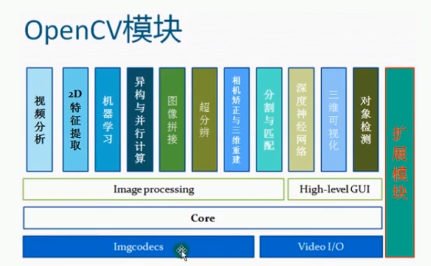
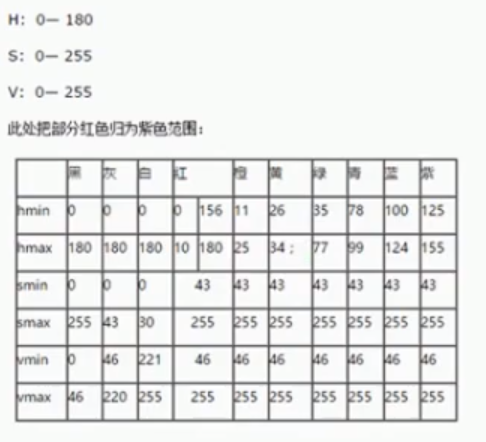
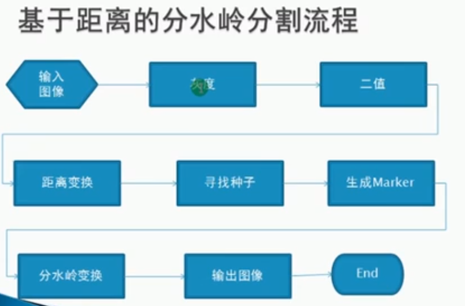

 ^ _ ^ 
<!-- more -->

# 资料
1. B站视频【基于python3的Opencv图像处理教程(从零到实践)】：[https://www.bilibili.com/video/BV1CJ411D7Yj?from=search&seid=14244991535486395451](https://www.bilibili.com/video/BV1CJ411D7Yj?from=search&seid=14244991535486395451)

2. opencv3.4文档：[https://docs.opencv.org/master/](https://docs.opencv.org/master/)

3. opencv官网：[https://opencv.org/]([https://opencv.org/)

4. opencv中文网论坛：[http://www.opencv.org.cn/](http://www.opencv.org.cn/)

5. opencv库各版本下载地址：[https://sourceforge.net/projects/opencvlibrary/files/](https://sourceforge.net/projects/opencvlibrary/files/)

# opencv简介
OpenCV（Open Source Computer Vision Library）开放源代码计算机视觉库，主要算法涉及图像处理、计算机视觉和机器学习相关方法。OpenCV 其实就是一堆 C 和 C++语言的源代码文件，这些源代码文件中实现了许多常用的计算机视觉算法。

**图像处理、数字图像处理、计算机视觉**
- 图像处理（Image Processing）：一般包括图像压缩，增强和复原，匹配、描述和识别3个部分
- 数字图像处理（Digital Image Processing）：通过计算机对图像进行去除噪声、增强、复原、分割、提取特征等处理的方法和技术
- 计算机视觉（Computer Vision）：是指用摄像机和电脑代替人眼对目标进行识别、跟踪和测量等机器视觉，并进一步做图形处理，使之成为更适合人眼观察或仪器检测图像的一门学科

## 模块


opencv的框架与各模块功能介绍：[https://blog.csdn.net/u012679707/article/details/79505279](https://blog.csdn.net/u012679707/article/details/79505279)

## 安装
**目前python版本**
```cmd
PS E:\Github\Blog> python --version
Python 3.6.6
```

**opencv依赖库**
> 将python需要安装的依赖库写入requirements.txt中
```txt
opencv-python
opencv-contrib-python
pytesseract
```

**安装依赖库**
```bash
# 升级python版本（如果出现pip version版本过低的Warning则执行此步骤）
python -m pip install -i https://mirrors.aliyun.com/pypi/simple/ --upgrade pip 
# 安装requirements.txt中说明的各依赖库
python -m pip install -i https://mirrors.aliyun.com/pypi/simple/ \
pip install -r requirements.txt
```

# 图像的加载和保存


# numpy


# 色彩空间
- RGB
- HSV

- HLS
- YCrCb
- YUV


# 像素运算
## 算术运算

## 逻辑运算

# ROI和泛洪填充
## ROI
> Region of Interest

- FLOODFILL_FIXED_RANGE : 改变图像，泛洪填充
- FLOODFILL_MASK_ONLY ：不改变图像，只填充遮罩层本身

# 模糊操作
## 卷积原理

## 中值模糊

## 均值模糊
### 基于平均值

### 高斯模糊（基于权重）


## 自定义模糊

# 边缘保留滤波（EPF）
## 高斯双边

## 均值迁移

# 直方图
## 直方图均衡化
- equalizeHist
- createCLAHE

## 直方图比较
- 巴氏距离
- 相关性
- 卡方

## 反向投影

# 模板匹配

# 二值化
## 全局二值化

## 局部二值化

## 超大图像二值化

## 空白图像过滤

# 图像金字塔
- pyrdown : 降采样
- pyrup : 还原

## 高斯金字塔

## 拉普拉斯金字塔

# 图像梯度
- Sobel算子
- 拉普拉斯算子

# Canny边缘提取
**Canny算法步骤**
1. 高斯模糊：GaussianBlur
2. 灰度转换：cvtColor
3. 计算梯度：Sobel/Scharr
4. 非最大信号抑制
5. 高低阈值输出二值图像


# 直线检测
## 霍夫直线变换

# 圆检测
## 霍夫圆检测

# 轮廓发现

# 对象测量


# 形态学操作
## 膨胀与腐蚀

## 开闭操作
- 开操作：腐蚀 + 膨胀
- 闭操作：膨胀 + 腐蚀

## 其他形态学操作
- 顶帽（tophat）: 原图像与开操作之间的差值图像
- 黑帽（blackhat） : 闭操作与原图像之间的差值图像

## 形态学梯度
- 基本梯度 : 膨胀之后的图像减去腐蚀之后的图像得到的差值图像
- 内部梯度 : 原图减去腐蚀之后的图像得到的差值图像
- 外部梯度 : 膨胀之后的图像减去原图得到的差值图像

# 分水岭算法
基于距离的分水岭分割流程


# 人脸检测

# 验证码识别