 ^ _ ^ 
<!-- more -->

# 分布式

## 大型网站系统的特点
- **高并发、大流量**：通常有大量用户同时访问、同时在线。
- **高可用**：服务器必须保持 7 * 24 无间断运行。
- **海量数据**：大型网站需要存储、操作海量数据，需要大量服务器。
- **用户分布广泛，网络复杂**：许多大型网站为全球用户提供服务。用户分布范围广泛，各地网络情况不同。在国内，还有不同运营商网络互通难的问题。
- **安全威胁**：许多大型网站几乎每天都会遭受到黑客的攻击。
- **需求变更块，发布频繁**：互联网产品快速适应市场，满足客户需求，产品发布频率高。
- **渐进式发展**：几乎所有的大型互联网网站都是从一个小网站开始，慢慢发展起来的。

## 大型网站架构演化发展历程

### （一）初始阶段

应用程序、文件、数据库等所有资源都在一台服务器上。

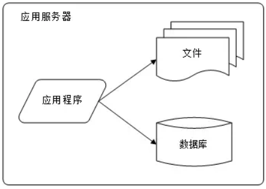

### （二）应用服务和数据服务分离

应用和数据分离后整个网站使用3台服务器：应用服务器、文件服务器、数据库服务器，这3台服务器对硬件资源有不同的要求：
- 应用服务器：需要处理大量业务逻辑，因此需要更快的CPU
- 文件服务器：需要存储大量用户上传的文件，因此需要更大的硬盘
- 数据库服务器：需要快速磁盘检索和数据缓存，因此需要更快的磁盘和更大的内存

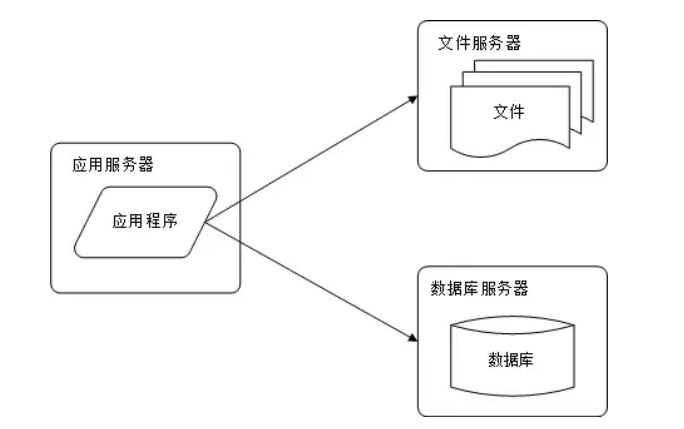

### （三）使用缓存
网络访问遵循二八定律：80%的访问集中在20%的数据上。因此将一小部分数据缓存在内存中，有利于提高整体访问速率、减轻数据库压力。
缓存分为本地缓存和远程缓存：
- 本地缓存：受应用服务器内存限制，且会与应用程序争夺内存，但访问速度稍快
- 远程缓存：可使用集群的方式，部署大内存服务器作为专门的缓存服务器

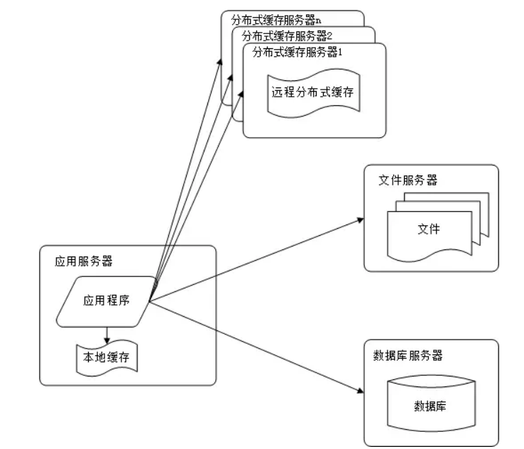

### （四）应用服务器集群
单一应用服务器能处理的并发连接有限，在网站访问高峰期，应用服务器称为网站的瓶颈。
集群后，通过应用服务器负载均衡调度器，可以将来自用户浏览器的访问请求分发到服务器集群中的任何一台服务器上，如果有更多用户，则可通过在集群中添加服务器来改善系统性能。

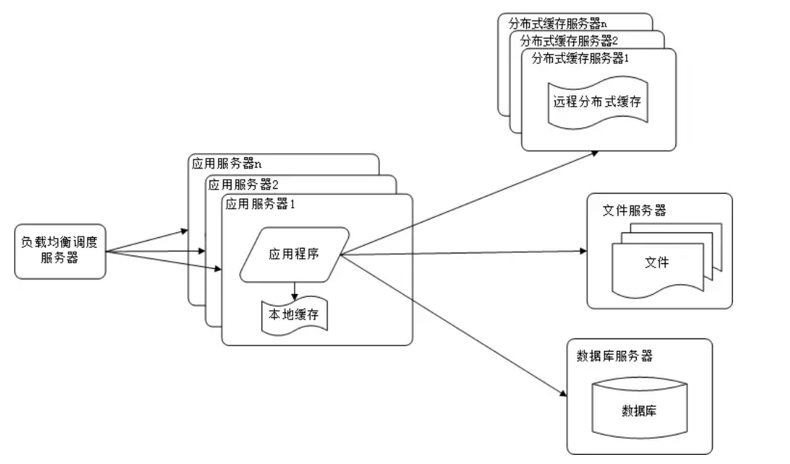

### （五）数据库读写分离
网站在使用缓存后，大部分操作可以不通过数据库就能完成。但仍然有一部分操作需要访问数据库（如缓存不命中、缓存过期和全部写操作）。当用户达到一定规模后，数据库因为负载过高而成为网站的瓶颈。

目前大多数数据库都提供主从热备功能（通过配置两台数据库主从关系，可以将一台数据库服务器的数据同步更新到另一台数据库服务器上）。利用这项技术，可以实现数据库的读写分离：
- 应用服务器写数据时，访问主数据库。主数据库更新外数据后将数据同步到从数据库
- 应用服务器读数据时，访问从数据库。
- 通常应用程序后端使用专门的数据访问模块，使得读写分离对应用程序透明。

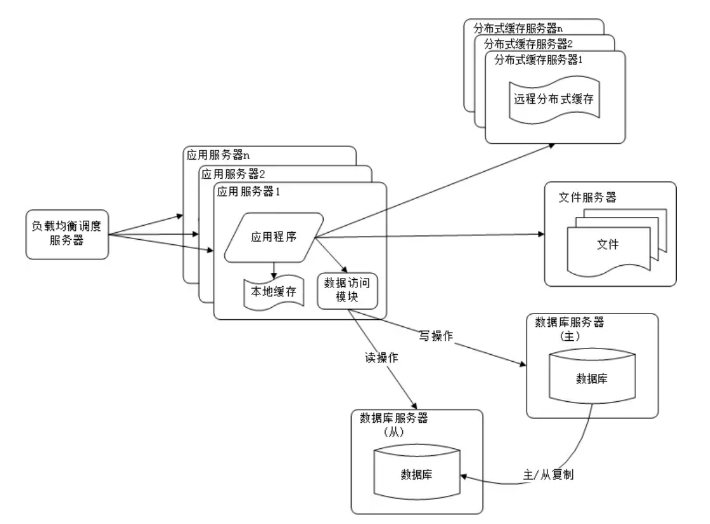

### （六）使用反向代理和CDN
由于网站用户分布范围广，网络环境复杂。各地网络环境各异，不同地区用户访问速度差别很大。一般离应用服务器越远的用户访问速度越慢。如果网站响应过慢，就很有可能丢失客户。

**CDN**
CDN（Content Delivery Network）内容分发网络，就是为了改善互联网服务质量的，具体来说就是提高访问速度。
服务器上的资源分为两种：
- 静态资源：这种资源很少变动，如image,css,js,html
- 动态资源：这种资源不同用户不同时刻访问通常是不一样的，比如jsp。

如果通过在全国各地部署服务器，使得每个服务器上都有相同的动态资源的话，则还需要配置相应的数据库，还需涉及多个数据库之间的数据同步问题，这会导致成本很高。
而如果通过在全国各地部署服务器，但每个服务器上只部署静态资源的话，则不需要涉及数据库，而且也能提高用户的访问速度。

CDN专用DNS服务器可以帮助客户端找到离它最近的一台服务器供其访问。
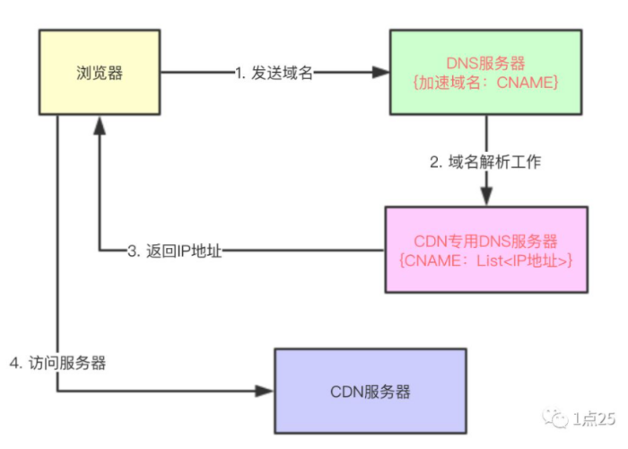

**反向代理**
- 正向代理
  - 客户端非常明确要访问的服务器地址；
  - 而服务器只清楚请求来自哪个代理服务器，而不知道来自哪个具体的客户端；
  - 正向代理屏蔽或隐藏了真实的客户端信息
- 反向代理
  - 多个客户端发送请求，反向代理服务器收到后，按照一定的规则分配给服务器集群中的某个服务器进行处理
  - 客户端也是明确的，但具体由哪台服务器处理并不明确
  - 主要用于服务器集群分布式部署情况下，反向代理隐藏了服务端信息

**CDN和反向代理**
- CDN部署在网络提供商的机房：用户请求网站服务时，可以从距离自己最近的网络提供商机房获取数据
- 反向代理部署在网站的中心机房：当用户请求到达中心机房时，首先访问的服务器是反向代理服务器，如果反向代理服务器中缓存中用户请求的资源，则直接返回给用户。
- CDN和反向代理的基本原理都是缓存
- CDN和反向代理的目的都是尽早返回数据给用户

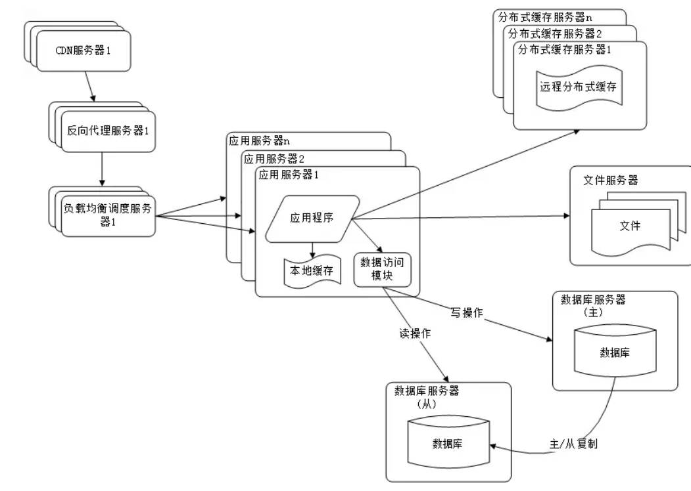

### （七）分布式文件系统和分布式数据库

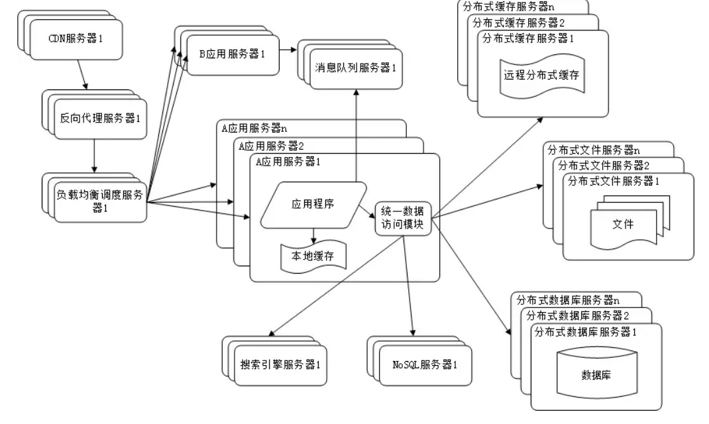

分布式数据库是数据库拆分的最后手段，只有在单表数据规模非常庞大时才使用。不到不得已时，网站更常用的数据库拆分手段时`业务分库`（将不同业务的数据部署在不同的物理服务器上）

### （八）NoSQL和搜索引擎
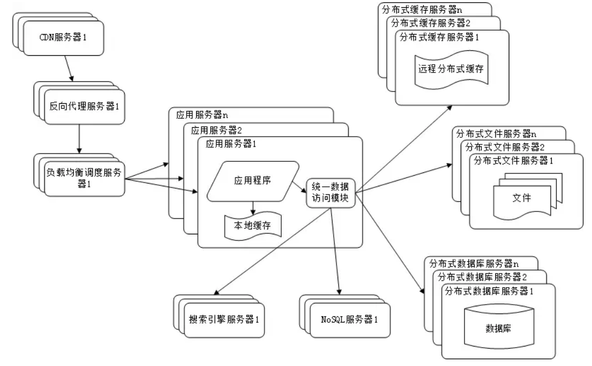

NoSQL和搜索引擎都是来源于互联网的技术手段，可对可伸缩的分布式特性具有更好的支持。应用服务器则通过一个统一的数据访问模块访问各种资源，减轻管理诸多数据源的麻烦。

### （九）业务拆分
大网站为了应对日益复杂的应用场景，采用分而治之的方式将网站业务分成不同的产品线。具体到技术上，也会根据产品线划分，将网站拆分成不同的应用。每个应用独立部署，应用之间可以通过超链接建立关系，也可以通过消息队列分发数据，最多的还是通过访问同一个数据库存储系统来构建一个完整的系统。

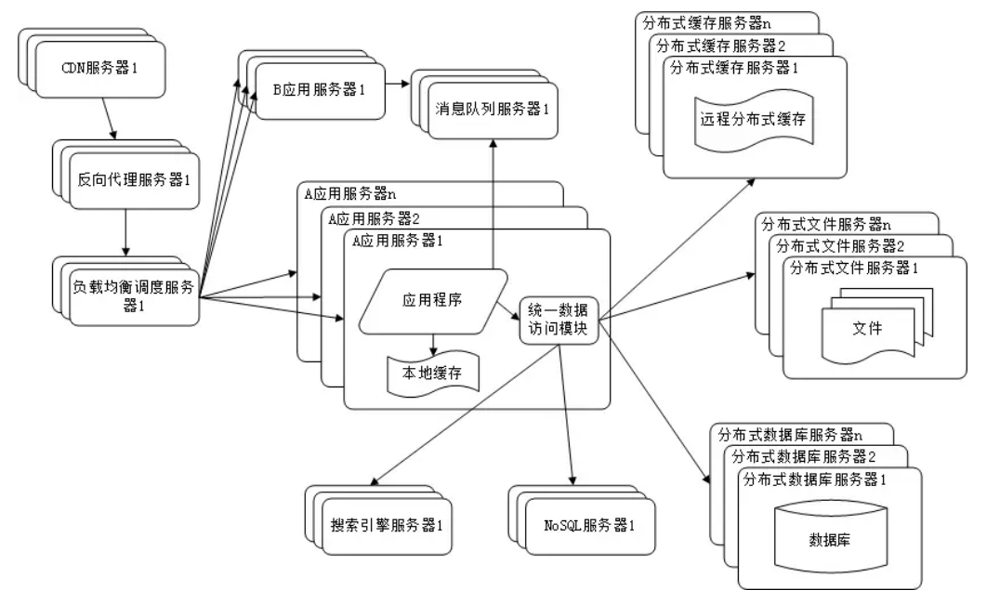

### （十）分布式微服务
随着业务拆分越来越小，存储系统越来越大，应用系统整体复杂度指数级增加。由于所有应用都需要与数据库建立连接，连接的数目是服务器规模的平方。当服务器规模过大时，数据库资源不足，将拒绝服务。

解决策略是将各个应用中共有的业务操作抽取出来，独立部署。由这些可复用的业务连接数据库，提供业务服务。而应用系统只需要管理用户界面，通过分布式服务调用共用业务服务完成具体操作。

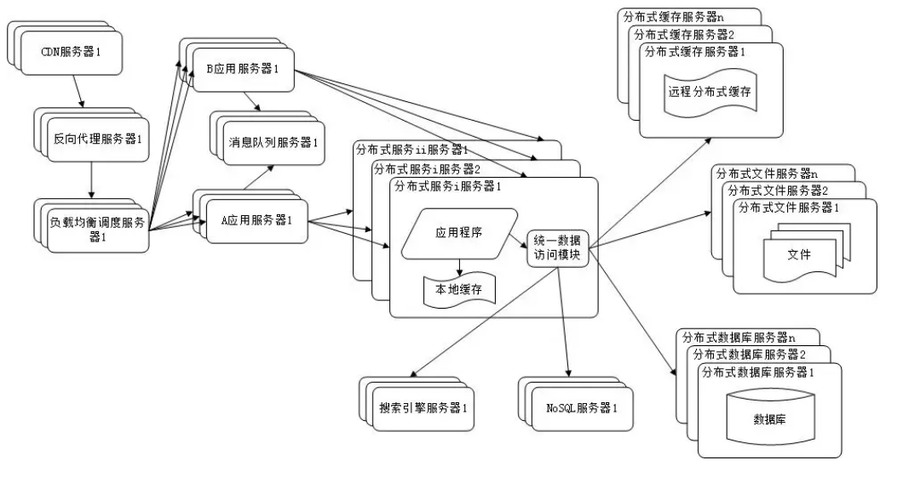

## 概念辨析
### 拆分和集群
**拆分**：不同的服务器上部署不同的服务模块。模块之间通过RPC通信和调用，用于拆分业务功能。独立部署，多个服务器共同组成一个整体对外提供服务。

**集群**：不同的服务器上部署相同的服务模块。通过分布式调度软件进行统一调度。用于分流容灾，降低单个服务器的访问压力。

### 微服务和SOA
- 微服务是一种架构风格，一个大型复杂软件应用由一个或多个微服务组成。
- 系统中各个微服务是独立部署的，各个微服务之间是松耦合的。
- 每个微服务仅关注于完成一个任务

微服务从本质意义上来看还是SOA架构。但内涵有所不同，微服务并不绑定某一特定技术。在一个微服务系统中，可以有Java编写的服务，也可以有Python编写的服务。它们是靠Restful风格统一成一个系统的。所以微服务本身与具体的实现技术无关，扩展性强。

### 前后端完全分离和Rest规范

**Rest操作最佳实践**
现在在很多企业中，虽然都支持Rest规范，但是真正严格遵守的几乎没有。因为按照Rest规范，删除需要发送Delete请求，插入需要发送PUT请求，过于繁琐。再者，对于某些框架（如Ajax，SpringMVC等），对于Delete和Put的支持不太友好。所以实际中还是很少使用这两种请求，一般还是使用Get和Post请求，使用接口名字来区分。所以对于Rest规范，只需要记住传递数据只使用JSON，而不是后端去渲染模板，从而实现前后端分离。

## CAP三进二和Base定理

### ACID
关系型数据库遵循ACID原则：
- Atomicity：原子性。事务是操作的序列，这些操作按序执行。要么全部操作执行成功，要么如果中间有某个操作出现错误，则整个事务回滚，事务中已完成操作对数据库的影响将会撤销。
- Consistency：一致性。事务执行前后数据库处于一致状态。一般是指语义上的正确状态，比如说转账时转账方钱减少多少，收款方账户就应该增加相同的数目。
- Isolution：隔离性。事务之间互不影响。
- Durability：持久性。提交成功的事务所做的修改将持久化存储在数据库中。

### CAP三进二

- Consistancy：强一致性
- Availability：可用性
- Partion Tolerance：分区容错性

**CAP理论**：一个分布式系统不可能同时很好的满足强一致性、可用性、分区容错性这三个需求，最多只能较好地满足其中的两个。

- CA：如传统的Oracle数据库
- AP：大多数网站架构的选择
- CP：Redis,MongoDB

### BASE定理
- Basical Availiable：基本可用，支持分区失败
- Soft State：软状态：状态可以有一段时间不同步（处于异步状态）
- Eventually Consistent：最终一致（数据最终一致即可，不要求时时一致）

BASE是为了解决关系型数据库强一致引起的问题导致可用性降低提出的解决方案。它的思想是通过放松系统对某一时刻一致性的要求来换取系统整体伸缩性和性能上的改观。

# 中间件

## 缓存
