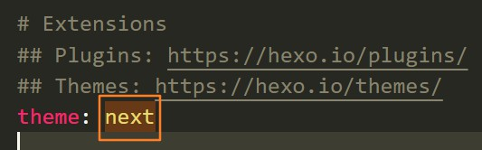
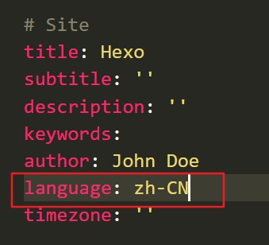
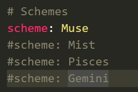
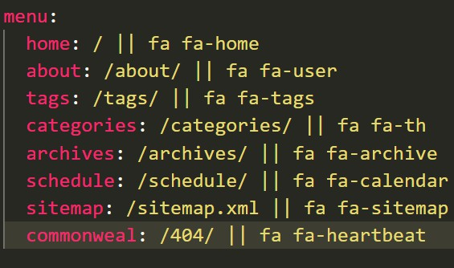
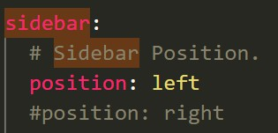
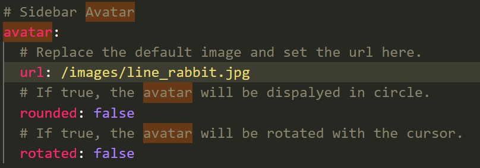

 nextT主题，从简陋到初具规模 
<!-- more -->
# 注意事项
每次更改项目_config.yml后，需要重新启动网站才能生效。
```
hexo s
```
而如果更改的是next里的_config.yml的话，只需要在浏览器里刷新页面。

# clone 项目
在hexo目录下打开Git Bash
```
git clone https://github.com/next-theme/hexo-theme-next themes/next
```

# 更改项目配置
- 打开项目文件夹下的_config.yml
- 找到关键字theme，赋值为next



# 语言配置
**配置简体中文**
- 打开项目的_config.yml文件
- 将下图所示的language设置为zh-CN
- 所有的语言设置可以在next/language中看到



# 主题样式
- 打开themes/next文件夹下的_congif.yml
- 找到Schemes关键字
- 将选择的风格注释取消，不选择的加上注释



# 菜单栏配置
## 配置菜单栏选项
- 打开themes/next文件夹下的_config.yml
- 将menu中需要出现的菜单项的注释取消



## 菜单项页面设置
### 设置标签页面
1. 在项目目录下执行如下命令：
```
hexo n page tags
```
2. 成功后Blog/source目录中将增加一个tags文件夹

### 设置分类页面
1. 在项目目录下执行如下命令：
```
hexo n page categories
```
2. 成功后Blog/source目录中将增加一个categories文件夹

### 设置关于页面
1. 在项目目录下执行如下命令：
```
hexo n page about
```
2. 成功后Blog/source目录中将增加一个about文件夹


# 侧栏配置
## 设置侧栏位置
- 打开themes/next文件夹下的_congif.yml
- 找到关键字Sidebar
- 选择侧栏靠左还是靠右



## 设置侧栏显示时机
> 只在 Muse | Mist下有效
- 打开themes/next文件夹下的_congif.yml
- 找到关键字Sidebar Display

# 个人信息配置
## 网站title|作者姓名
- 打开项目文件夹下的_congif.yml
- 在Site关键字下配置title和author的值

## 头像配置
- 打开themes/next文件夹下的_congif.yml
- 找到关键字avatar
- 图片存放的根目录是next/source，图片地址格式为/images/xxx.jpg
- 将url换成图片地址



## 社交链接
- 打开themes/next文件夹下的_congif.yml
- 找到关键字social
- 将需要添加的社交链接取消注释，并赋值自己的社交账号地址

# 阅读全文
在md文件中加上如下注释，那么此注释下所有内容都会省略，并出现阅读全文按钮
```
<!-- more -->
```

# 搜索功能
1. 安装hexo-generator-searchdb
```
npm install hexo-generator-searchdb --save
```
2. 站点配置文件新增
```
search:
    path: search.xml
    field: post
    format: html
    limit: 10000
```
3. 主题配置文件
```
# Local Search
Local_search:
    enable: true
```

# 显示图片
直接用相对路径访问图片是不能在网站上显示出来的
解决方案：
**前提**   
1. 修改站点_config.yml
```
post_asset_folder: true
```
2. 安装插件
```
npm install https://github.com/CodeFalling/hexo-asset-image --save
```
**方法** 
1. 在source/_post下新建一个和md文件同名的文件夹
2. 将要添加的图片放入这个同名文件夹内
3. 在md文件中按如下方式引用
```

```

# 内置标签使用方法
```
 可以是一句对文章有概括性的话 
```