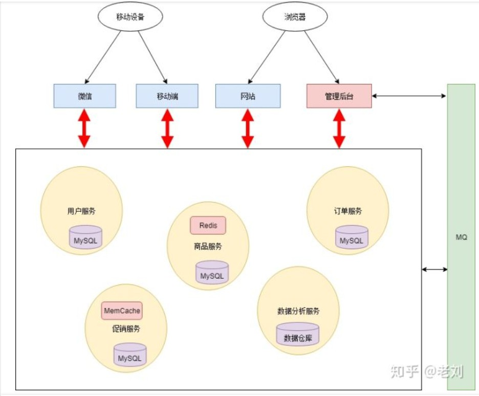
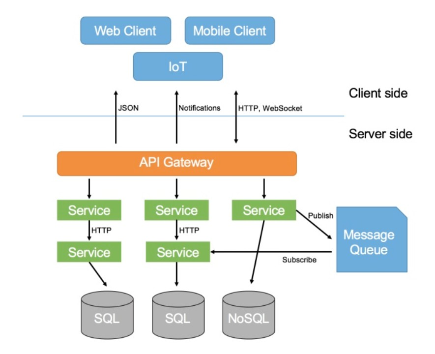

 ^ _ ^ 
<!-- more -->

# 微服务概念

- **服务注册中心**：每个服务实例在启动时，向注册中心注册自己的IP地址等信息。这样，服务在调用别的服务的接口时，就可以通过注册中心，查询到其他服务的实例，向实例发起请求。
- **负载均衡**：由于一个服务可以有多个实例，所以不管是来自外部客户端的请求，还是微服务系统内部服务之间发起的请求，都需要引入负载均衡的机制，来发挥多实例集群的作用。两种负载均衡为服务器端负载均衡和客户端负载均衡，各自具有代表性意义的实现分别是Nginx和Ribbon。
- **API Gateway**：它就像整个微服务系统的门面，所有请求，都要先经过它的处理，才会转发到对应的服务
  - **请求路由**：一个外部请求过来之后，我们需要知道这个请求是发给哪个服务的
  - **请求过滤**：不是所有请求都可以被我们系统处理的，我们需要判断这个请求是否携带一些必要的鉴权信息，并对其进行鉴权

## 参考资料
[如何给老婆解释什么是微服务](https://www.zhihu.com/search?type=content&q=%E5%BE%AE%E6%9C%8D%E5%8A%A1)
[什么是微服务架构](https://www.zhihu.com/question/65502802)

# 微服务相关技术
## Spring

## SpringMVC

## SpringBoot

## SpringCloud