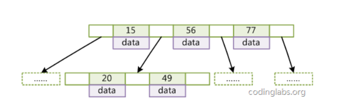
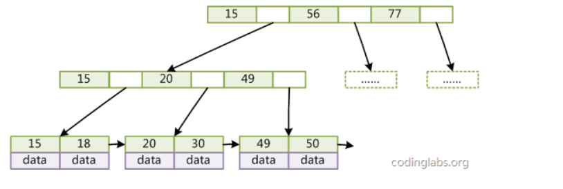
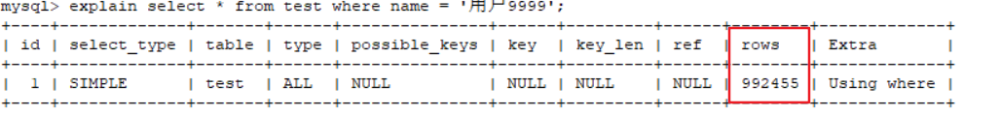
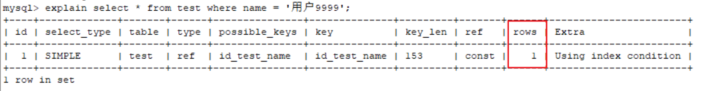
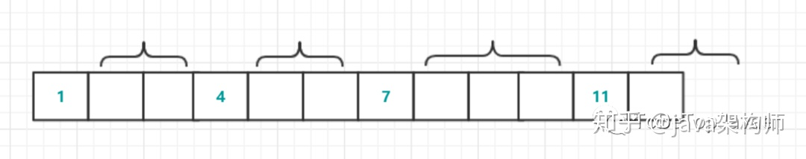
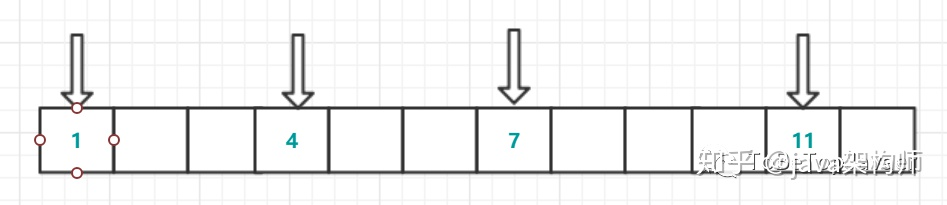

 ^ _ ^ 

<!-- more -->

# 数据库基本概念
> DB--DataBase,用于存储和管理数据的仓库

**特点**
- 持久化存储数据，本质上是一个文件系统
- 使用统一的方式管理数据库 -- `SQL`


# 常见数据库
**关系型**
- `MySQL`：免费开源的小型数据库
- `Orcal`：收费的大型数据库
- `DB2`：常用于银行系统
- `SQLServer`：MicroSoft公司中型数据库，C#,.net常用
- `SQLite`：嵌入式小型数据库，应用于手机端

**非关系型（NoSQL）**
- `Redis`
- `MongoDB`

## 关系型数据库和非关系型数据库
**非关系型数据库的优势**
1. 性能：NoSQL基于键值对存储，不需要经过SQL层解析，所以性能很高；
2. 可扩展性：键值对之间没有耦合性，容易进行水平扩展

**关系型数据库的优势**
1. 复杂查询：可以使用SQL语句方便的在一个表或多个表之间进行非常复杂的查询
2. 事务支持：使得对于安全性很高的数据访问要求得以实现

# 数据库引擎
## MyIASM
- MySQL默认的存储引擎
- 不支持数据库事务、行级锁和外键，因此在INSERT或UPDATE数据即写操作时需要锁定整个表
- 优点是执行读取操作的速度快，且占用的内存和存储资源较少。它在设计之初就假设数据被组织成固定长度的记录，在查找数据时，MyISAM直接查找文件的OFFSET，定位比InnoDB快

## InnoDB
- InnoDB为MySQL提供了事务支持、回滚、崩溃修复能力、多版本并发控制、事务安全的操作
- InnoDB底层存储结构为B+树
  - B+树的每个节点都对应InnoDB的一个Page，Page大小是固定的，一般设为16KB
  - 其中，非叶子节点只有键值，叶子结点包含完整的数据
- InnoDB适用的场景：
  - 经常有数据更新的表，适合处理多重并发更新请求
  - 支持灾难恢复（通过bin-log日志）
  - 支持外键约束，只有InnoDB支持外键
  - 支持自动增加列属性auto_increment

# SQL
> Structured Query Language,结构化查询语言，定义了操作所有关系型数据库的规则

## 分类
- `DDL`：数据库定义语言，如create,drop,alter
- `DML`：数据库操作语言，如insert,delete,update
- `DQL`：数据库查询语言，如select,where
- `DCL`：数据库控制语言，如grant,revoke

### DDL
> CRUD

#### 针对数据库
1. C(Create):创建
```
create database [数据库名]; -- 创建数据库
create database [数据库名] if not exists [数据库名]; -- 如果某数据库不存在时创建
create database [数据库名] character set [字符编码方式]; -- 创建数据库并指定编码方式
```

2. R(Retrieve):查询
```
show database; -- 查询所有数据库名称
show create database [数据库名]; -- 查询指定名称数据库
```

3. U(Update):修改
```
alter database [数据库名称] character set [编码方式]
```

4. D(Drop):删除
```
drop database [数据库名];
drop database [数据库名] if exists [数据库名];
```

5. 使用
```
select database(); -- 查看当前使用的数据库
use database [数据库名]; -- 选择当前使用的数据库
```


#### 针对数据表
1. C(Create)：创建
```
create table [表名]( -- 创建表
    [属性名1] [属性类型1] [约束1],
    [属性名2] [属性类型1] [约束1]
);
create table tb( -- 创建表实例
    name varchar(12) NOT NULL,
    id int UNIQUE,
    salary double(5,2)
);
create table [表名1] like [表名2]; -- 赋值表2
```

2. R(Retrieve)：查询
```
show tables; -- 显示数据库中所有表
desc [表名]; -- 显示表结构
```

3. U(Updata)：修改
```
alter table [表名] rename to [新表名]; -- 修改表名
alter table [表名] character set [字符集名]; -- 修改字符集
alter table [表名] add [列名] [数据类型]; -- 新增一列
alter table [表名] change [列名] [修改后的列名] [修改后的数据类型]; -- 修改列名称，类型
alter table [表名] modify [列名] [修改后的数据类型]; -- 修改列的数据类型
alter table [表名] drop [列名]; -- 删除列
```

4. D(Drop)：删除
```
drop table [表名];
drop table [表名] if exists [表名];
```


### DML
1. 增加数据
```
insert into 【表名】(属性1,属性2) values(属性值1,属性值2); -- 向表中添加一行数据
insert into 【表名】(属性1,属性2) values((属性值1,属性值2),(属性值3,属性值4),...); -- 向表中添加多行数据
insert into 【表名】 values(属性1,属性2,..属性n); -- 默认为所有列添加属性值
insert into tb(name,age) values("zhangsan",2),("lisi",3); -- 例子
```

2. 修改数据
```
update [表名] set 属性1=属性值1,属性2=属性值2 where [条件]; -- 对满足条件的数据进行更改
```

3. 删除数据
```
delete from [表名] where [条件]; -- 删除所有满足条件的数据
delete from [表名]; -- 删除表中所有数据，原理是逐条删除所有数据
truncate table [表名]; -- 删除表中所有数据，原理是drop掉原表并创立一个同名空表
```

### DQL
0. 基本查询
```
select [属性1],[属性2] from [表名];
select distinct [属性1],[属性2] from [表名]; -- 查询结果中(属性1，属性2)是不重复的;
select ifnull([属性],[默认值]) from [表名]; -- 如果查询属性为空的话在结果中将替换成默认值
```

1. 排序查询
```
select * from [表名] order by [属性名1] asc,[属性名2] desc; -- 先按属性1升序再按属性2降序排列
```

2. 聚合函数
```
count -- 计算个数
min -- 最小值
max -- 最大值
avg -- 平均值
sum -- 求和
select count(IFNULL([属性],[默认值])) from [表名]; -- 当遇见值为Null的属性值时，默认其为0进行聚合
```

3. 分组查询
```
select [属性] from [表名] group by [分组字段] having [条件]; -- 其中属性和条件只能为分组字段或聚合函数
```
> having和where的区别？
> - where在分组之前进行限定，不满足条件的数据行将不参与分组
> - having在分组之后进行限定，不满则条件的分组不会被查询出来


4. 分页查询
```
select * from [表名] limit [偏移量],[条数]; -- 取第[偏移量+1]~[偏移量+条数]的数据
select * from tb limit 0,3; -- 取第1条到第3条共三条数据
```

5. 条件查询
```
1. 关系运算符：<、>、<=、>=、=、<>(不等于)、!=
2. 数值范围：between ... and ...
3. 集合范围：in
4. 模糊查询：like
    - _:单字匹配
    - %:任意匹配
5. 是否为空：is null
6. 条件连接词：AND、OR、&&、||、not、is、!
```

### DCL
1. 管理用户
```
use mysql; -- 进入mysql数据库（为MySQL数据库自带的一个库）
select * from user; -- 查询用户
create user '用户名'@'主机名' identified by '密码'; -- 创建用户
drop user '用户名'@'主机名'; -- 删除用户
update user set password=password('新密码') where user='用户名';
```

2. 权限管理
```
show grants for '用户名'@'主机名'; -- 查询权限
grant [权限列表] on [数据库].[表名] to '用户名'@'主机名'; -- 授予权限
grant all to *.* to '用户名'@'主机名'; -- 授予所有权限
revoke [权限列表] on [数据库].[表名] from '用户名'@'主机名'; -- 撤销权限
```


## 约束
1. 主键约束
```
create table tb(
    id int,
    name varchar(12),
    primary key id
);
```

2. 非空约束
```
create table tb(
    id int not null,
    name varchar(12),
    primary key id
);
```

3. 唯一约束
```
create table tb(
    id int unique,
    name varchar(12),
    primary key id
);
```

4. 外键约束
```
create table dept(
    id int,
    primary key (id)
);
create table employee(
    id int,
    name varchar(12),
    dept_id int,
    primary key (id),
    constraint my_key foreign key (dept_id) references dept(id)
);
```

### 约束的增加和删除
1. 主键约束
```
alter table [表名] modify [属性] [属性类型] PRIMARY KEY; -- 添加主键约束
alter table [表名] drop primary key; -- 删除主键约束
alter table [表名] modify [属性] [属性类型] [其他约束] AUTO_INCREMENT; -- 添加主键自动增长
alter table [表名] modify [属性] [属性类型] [其他约束]; -- 删除自动增长
```

2. 非空约束
```
alter table [表名] modify [属性] [类型] [其他约束] NOT NULL; -- 添加非空约束
alter table [表名] modify [属性] [类型] [新约束]; -- 删除非空约束，新约束为可选项
```

3. 唯一约束
```
alter table [表名] modify [属性] [类型] [其他约束] UNIQUE; -- 添加唯一约束
alter table [表名] drop index [属性]; -- 删除唯一约束
```

4. 外键约束
```
alter table [表名] add constraint emp_dept_key foreign key (id) references dept(id); -- 添加外键
alter table [表名] drop foreign key [外键名]; -- 删除外键
```


### 级联操作
```
alter table [表名] add constraint emp_dept_key foreign key (id) references dept(id) on updata cascade; -- 添加级联操作
```

**级联操作分类**：
- 级联更新：on update cascade;
- 级联删除：on delete cascade;

# 多表关系
1. 一对一：外键可以设置在任意一方
2. 一对多：外键设置在多的一方
3. 多对多：设置一个单独的表来进行存储双方的外键

## 多表查询
### 内连接
```
select * from [表1] a inner join [表2] b on a.[属性1]=b.[属性1]; -- 内连接，那些在a中却不在b中的属性1和在b中却不在a中的属性1所在行都不会出现在结果中
```

### 外连接
```
select * from [表1] a left join [表2] b on a.[属性1]=b.[属性1]; -- 左外连接，表示a中属性1中的所有值都会出现结果中，即使没有b的属性1的值与其相等
select * from [表1] a right join [表2] b on a.[属性1]=b.[属性1]; -- 右外连接，表示b中属性1中的所有值都会出现结果中，即使没有a的属性1的值与其相等
```

### 子查询
1. 子查询结果是单行单列的
> 可以作为数值查询的条件

2. 子查询结果是多行单列的
> 可以作为集合查询的条件

3. 子查询结果是多行多列的
> 可以作为表


# 范式
> 设计数据库时遵循的一些规范，使得表结构具有最小冗余

## 码
- 超码：一个或多个属性的集合，这些属性的组合可以使我们在一个关系中唯一地表识一个元组
- 候选码：任意真子集都不是超码的超码，候选码可能有多个
- 主码：数据库设计者选中用于一个关系的的候选码

## 1NF
> 每一列都是不可分割的原子数据

## 2NF
> 1NF的基础上，任何非主属性完全依赖于候选码（消除部分函数依赖）

## 3NF
> 2NF的基础上，任何非主属性不依赖于其他非主属性（消除传递函数依赖）

## 例子
假设这样一个表，字段为（学号，姓名，系的系主任，课程，成绩）

1. 系的系主任违反了第一范式，因为物理系张主任，物理系王主任这样的数据既产生了“物理系”前缀带来的冗余，也会带来删除所有主任时导致物理系也随之消失的错误。因此，将表改为（学号，姓名，系，系主任，课程，成绩）
2. 该表的候选码为（学号，课程），但对于姓名属性，并不依赖于课程属性，也就是不完全依赖于候选码，违反第二范式。因此，将表分为（学号，姓名，系，系主任）+（学号，课程，成绩）两个表
3. 对于（学号，姓名，系，系主任）表，系主任属性依赖于系属性，而系属性并非主属性，违反了第三范式。因此，将表分为（学号，姓名）+（系，系主任）两个表


# 数据库的备份和还原
**备份**
```
mysqldump -u用户名 -p密码 > 保存的路径
```

**还原**
执行备份得到的sql文件

# 索引
> 帮助数据库高效获取数据的数据结构

## 创建索引的原则
1. 选择唯一性索引：一般基于Hash算法实现
2. 为经常需要排序、分组核联合操作的字段建立索引
3. 为常作为查询条件的字段建立索引
4. 限制索引数量：索引越多，数据更新表越慢
5. 尽量使用数据量少的索引：如果索引的值很长，则占用的磁盘变大，查询速度会受到影响
6. 删除不再使用或很少使用的索引
7. 索引列不能参与计算：带函数的查询不建议参与所以
8. 尽量扩展现有索引：联合索引的查询效率比多个独立索引高

## 索引文件的结构
**hash**
- 根据计算索引属性的hash值来确定数据的位置，如果产生了hash冲突，则利用拉链法进行解决
- 缺点：
  - 需要将所有的数据文件添加到内存，比较耗费内存空间
  - 只适合等值查询，不适合范围查询

**二叉树**
- 每个结点最多有两个子节点的树，用于数据库的其实是二叉查找树
- 缺点：会因为树的深度过深而造成io次数变多

**红黑树**
- 一种特殊的平衡二叉查找树
- 特征
  - 结点是红色或黑色
  - 根是黑色的
  - 所有叶子结点是黑色的
  - 每个红色结点必须有两个黑色结点（从叶子到根的路径上不能有两个连续的红色结点）
  - 从任一结点到其叶子结点的所有叶子结点上都包含相同数目的黑色结点
- 缺点也是会因为树的深度过深而造成io次数变多

**B树**
- 多叉平衡树
- 特征
  - 所有键值分布在整棵树中
  - 搜索有可能在非叶子节点结束，在关键字全集内做一次查找，性能接近二分查找
  - 一棵m阶B树，每个结点最多有m个子树
  - 根结点至少有2个子树
  - 分支结点（除根结点和叶子结点之外的结点）至少拥有m/2棵子树
  - 所有叶子结点都在同一层，每个结点最多有m-1个key



**B+树**
- 键值只存储在叶子结点中
- 叶子结点之间通过链表相连，是一种链式环结构
- 一个结点大小一般是整数页
- 可以对B+树进行两种查找运算
  - 对于主键的范围查找和分页查找
  - 从根结点开始的随机查找
- B+树中有两个头指针，一个指向根结点，另一个指向关键字最小的叶子结点



## 索引分类

```sql
-- 显示所有的索引信息
show index from [table];
```

### 主键索引
> 主键作为索引

```sql
-- 创建表时添加主键索引
create table test(
  id int,
  name varchar(12),
  primary key (id)
)ENGINE=INNODB DEFAULT CHARSET=utf8;

-- 创建表后为其删除主键
alter table test drop primary key;

-- 创建表后为某列添加主键索引
alter table test add primary key (id);
```

### 唯一索引
> 索引列的所有值都只能出现一次，值可以为空

```sql
-- 创建表时添加唯一索引
create table test(
  id int,
  name varchar(12),
  unique key index_id(id) comment 'index_id是索引名，id是列名'
)ENGINE=INNODB DEFAULT CHARSET=utf8;

-- 创建表后为其删除主键
alter table test drop index index_id;

-- 创建表后为某列添加主键索引
alter table test add unique key index_id(id);

-- 另一种添加索引的方式
create unique index index_test_id on test(id);
```

### 普通索引
> 基本的索引类型，没有唯一性的限制

```sql
-- 创建表时添加普通索引
create table test(
  id int,
  name varchar(12),
  key name_index(name) comment 'name_index是索引名，name是列名'
)ENGINE=INNODB DEFAULT CHARSET=utf8;

-- 创建表后为其删除主键
alter table test drop index name_index;

-- 创建表后为某列添加主键索引
alter table test add key name_index(name);

-- 另一种添加索引的方式
create index index_test_id on test(id);
```

### 全文索引
> 全文索引的索引类型为FULLTEXT。全文索引可以在varchar、char、text类型的列上创建

```sql
-- 创建表时添加全文索引
create table test(
  id int,
  name varchar(12),
  fulltext key name_index(name) comment 'name_index是索引名，name是列名'
)ENGINE=INNODB DEFAULT CHARSET=utf8;

-- 创建表后为其删除主键
alter table test drop index name_index;

-- 创建表后为某列添加主键索引
alter table test add fulltext key name_index(name);

-- 另一种添加索引的方式
create fulltext index id_test_name on test(name);
```

### 组合索引
> 多列值组成一个索引，专门用于组合搜索


## 索引效果测试

**1. 创建test表**
```sql
create table test(
  id bigint(20) unsigned not null auto_increment,
  name varchar(50) default '',
  email varchar(50) not null,
  phone varchar(20) default '',
  gender int(4) unsigned default 0,
  password varchar(100) not null,
  age tinyint(4) default 0,
  createTime datetime default current_timestamp,
  updateTime timestamp null default current_timestamp on update current_timestamp,
  primary key (id)
) ENGINE=INNODB DEFAULT CHARSET=utf8;
```

**2. 编写插入100万条数据的函数**
```sql
DELIMITER $$ -- 写函数前必须要写，标志
create function mock_data()
returns int
begin
  declare num int default 1000000;
  declare i int default 0;
  while i<num do
    insert into test(name,email,phone,gender,password,age)
      values(concat('用户',i),'1220296312@qq.com',concat(18,
      floor(rand()*(999999999-100000000)+100000000)),
      floor(rand()*2),uuid(),floor(rand()*100));
    set i = i + 1;          
  end while;
  return i;
end $$
DELIMITER;
```

**3. 执行函数插入100万条数据**
```sql
select mock_data();
```

**4. 测试未添加索引时的查询**
```sql
explain select * from test where name = '用户9999';
```



**5. 创建索引后再测试相同的查询**
```sql
-- 为test的name字段添加索引
create index id_test_name on test(name);
-- 搜索
explain select * from test where name = '用户9999';
```




# 事务
## 事务概述
如果一个包含多个步骤的事务操作，被事务管理，那么这些操作要么同时成功，要么同时失败。

## 事务的自动提交和手动提交
- MySQL默认是自动提交
    - select @@autocommit; -- 1代表自动提交，0代表手动提交
    - set @@autocommit=1; -- 设置提交方式
- 操作方式
    1. 开启事务：start transaction;
    2. 成功则提交：commit;
    3. 失败则回滚：rollback;

## 事务的四大特征
1. 原子性(Atomicity)：一个事务的操作要么全部执行成功，要么全部回滚；
2. 持久性(Consistency)：事务提交成功后或回滚后其结果会持久化保存在数据库中，即使电脑断电也不会消失；
3. 隔离性(Isolation)：事务之间不能相互影响；
4. 一致性(Durability)：事务执行前后，数据库中数据总量具有一致性

## 事务的隔离级别
**问题类型**
- 脏读：一个事务读取到另一个事务被回滚的数据；
- 不可重复读（虚读）：在同一个事务中，两次读取到的数据不一样；
- 幻读：一个事务操作数据表中所有记录，另一个事务添加了一条数据，则第一个事务查询不到自己的修改

**隔离级别**
1. read uncommitted：未提交读
- 一个事务可以读取到另一个事务未提交的更改
- 可能引起`脏读`，`不可重复读`、`幻读`

2. read commmitted：已提交读
- 一个事务只能读取到另一个事务已提交的结果
- 解决了`脏读`问题，但仍会产生`不可重复读问题`、`幻读`
- Orcal默认的隔离界别

1. repeatable read：可重复读
- 在一个事务中两次查询同一语句结果是一样的
- 解决了`不可重复读问题`，但仍会产生`幻读`
- MySQL默认的隔离级别

4. serializable：串行化
- 可以解决所有问题，因为一个事务时会将这个表锁起来

**设置隔离级别的方式**
```
select @@tx_isolation; -- 查询数据库隔离级别
set global transaction isolation level [级别字符串]; -- 设置数据库隔离级别
set tx_isolation=[级别字符串]; -- 设置数据库隔离级别 
```

## InnoDB锁机制
### 行锁与表锁
待补充....

### 锁分类
1. 共享锁
- 又称S锁，读锁
- 当一个事务为一个对象加上S锁后，在锁释放之前其他事务都不能够再对其加写锁或对其进行修改
```
select ... lock in share mode; -- 加共享锁
```

2. 排他锁：一个事务对某个表加上排他锁后，其他事务不能对这个表做任何操作； 
- 又称X锁，写锁
- 当一个事务为一个对象加上X锁后，在锁释放之前其他事务都不能够对其进行任何操作
```
select ... for update; -- 加排他锁
```

3. 意向共享锁
事务想要在获得表中某些记录的共享锁，需要在表上先加意向共享锁。

4. 意向排他锁
事务想要在获得表中某些记录的互斥锁，需要在表上先加意向互斥锁。

5. 自增锁


6. 临键锁
临键锁，作用于非唯一索引上，是记录锁与间隙锁的组合


```
UPDATE table SET name = 'javaHuang' WHERE age = 4;
SELECT * FROM table WHERE age = 4 FOR UPDATE;
这两个语句都会锁定（2,4]，(4,7)这两个区间。
即， InnoDB 会获取该记录行的 临键锁 ，并同时获取该记录行下一个区间的间隙锁。
```

7. 间隙锁
- 作用于非唯一索引上，主要目的，就是为了防止其他事务在间隔中插入数据，以导致“不可重复读”；
- 如果把事务的隔离级别降级为读提交(Read Committed, RC)，间隙锁则会自动失效


```
SELECT * FROM table WHERE id = 8 FOR UPDATE;
----此时，（7,11）就会被锁定
SELECT * FROM table WHERE id BETWEN 2 AND 5 FOR UPDATE;
----此时，（1,4）和（4,7）就会被锁定
```

8. 记录锁
记录锁，它封锁索引记录，作用于唯一索引上


```
select * from t where id=4 for update;
它会在id=4的索引记录上加锁，以阻止其他事务插入，更新，删除id=1的这一行。
需要说明的是：
select * from t where id=4;
则是快照读(SnapShot Read)，它并不加锁，不影响其他事务操作该数据。
```


# 阅读材料

1. [MySQL索引背后的数据结构](https://blog.codinglabs.org/articles/theory-of-mysql-index.html)