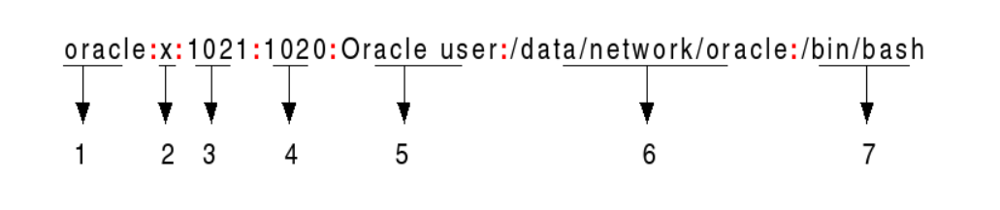
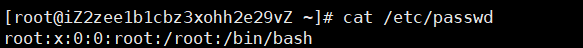
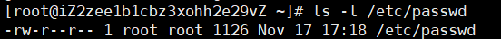

 ^ _ ^ 
<!-- more -->

# 简介

`/etc/passwd`文件存储登录时需要的基本信息。换句话说，它存储用户帐户信息。
/etc/passwd是一个纯文本文件。它包含系统帐户的列表，为每个帐户提供一些有用的信息，如用户ID、组ID、主目录、shell等等。
/etc/passwd文件应该具有一般读取权限，因为许多命令实用程序使用它来将用户id映射到用户名。但是，对/etc/passwd的写访问必须仅限于超级用户/根帐户。


# 显示格式



1. **Username** ：用户名；用于登陆的用户名，长度在1~32个字符之间。
2. **Password**：密码；x字符表示加密的密码存储在/etc/shadow文件中。请注意，您需要使用passwd命令来计算在CLl中输入的密码的哈希值，或者在/etc/shadow文件中存储/更新密码的哈希值。
3. **User ID（UID）**：用户ID；必须为每个用户分配一个用户ID (UID)。UID 0为根帐户保留，UID 1-99为其他预定义帐户保留。系统还为管理和系统帐户/组保留了UID 100-999。
4. **Group ID（GID）**：主组ID(存储在/etc/group文件中)
5. **User ID Info**：用户信息；它允许您添加关于用户的额外信息，如用户的全名、电话号码等。此字段由用户输入。
6. **Home Directory**：主目录；用户登录时将在的目录的绝对路径。如果此目录不存在，则用户主目录变为根目录
7. **Command/Shell**：命令或shell (/bin/bash)的绝对路径。通常，这是一个外壳。请注意，它不必是一个shell。例如，sysadmin可以使用nologin shell，它充当用户帐户的替代shell。如果shell设置为/sbin/nologin，并且用户尝试直接登录到Linux系统，那么/sbin/nologin shell将关闭连接。


# 实例

## 查看 /etc/passwd 文件

```bash
cat /etc/passwd
```




## 查看 /etc/passwd 文件权限

```bash
ls -l /etc/passwd
```




## 利用sh脚本查看 /etc/passwd

```bash
#!/bin/bash
# seven fields from /etc/passwd stored in $f1,f2...,$f7
# 
while IFS=: read -r f1 f2 f3 f4 f5 f6 f7
do 
 echo "User $f1 use $f7 shell and stores files in $f6 directory."
done < /etc/passwd
```