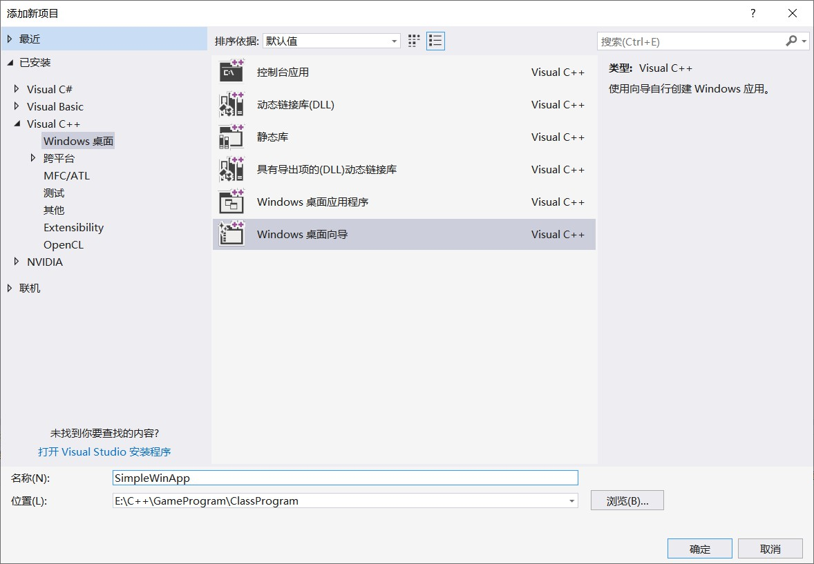
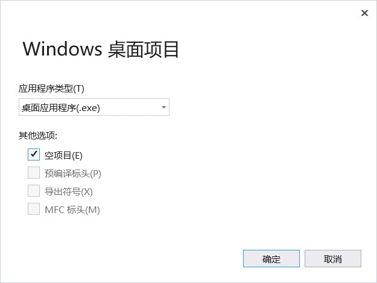
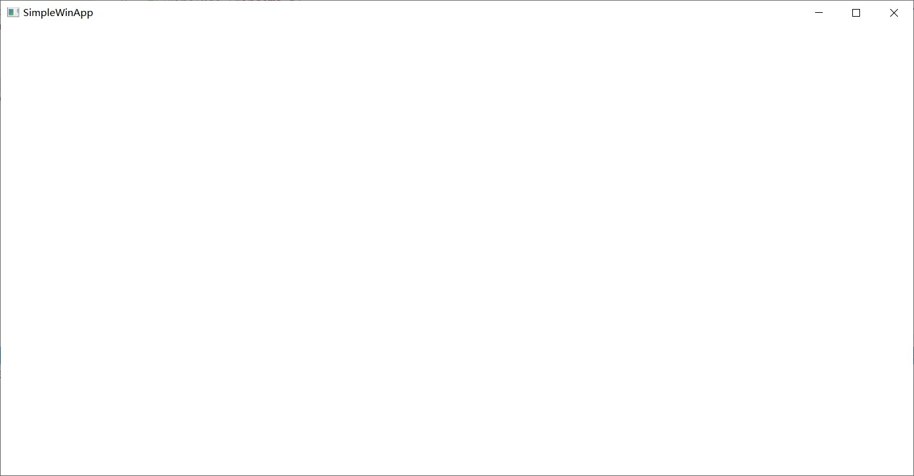

 一个基于Visual Studio 2017的Windows窗口程序 
> 无装饰，超朴素，除了流程一无所有

<!-- more -->

# 1 新建项目
> 在Visual Studio 2017中新建一个Windows窗口程序

0. 新建一个解决方案

1. 解决方案处右键--》添加--》项目，打开新建项目向导

2. 选择`Visual C++`/`Windows桌面`下的Windows桌面向导


3. 在弹出窗口中选择`桌面应用程序`，并勾选`空项目`


4. 在源文件夹下新建C++源文件simpleWinApp.cpp

# 2 编写Windows窗口程序

## 头文件
`#include <Windows.h>`

## 程序结构
### 函数组成
**1. 入口函数**
```
int _stdcall _tWinMain ( HINSTANCE hInstance,
                         HINSTANCE hPrevInstance,
						 PTSTR szCmdLine, 
                         int iCmdShow )
```
- hInstance：实例句柄。当可执行文件加载到内存中时，操作系统使用该值来标识该可执行文件
- hPrevInstance：没有任何意义。它曾在16位Windows中使用，但现在始终为零。
- pCmdLine：作为Unicode字符串包含命令行参数。
- nCmdShow：是一个标志，指示是否将主应用程序窗口最小化，最大化或正常显示。
- 返回值：操作系统不使用该返回值，但是可以使用该返回值将状态代码传送给您编写的其他程序。

**2. 窗口过程**
```
// 处理窗口消息
LRESULT CALLBACK WndProc (HWND hwnd,        // 窗口句柄
                          UINT message,     // 消息类型
                          WPARAM wParam,    // 第一个消息参数
                          LPARAM lParam)    // 第二个消息参数
```

**宏定义和函数调用方式扫盲**
1. `__stdcall` 是 Standard Call 的缩写，是 C++ 的标准调用方式：所有参数从右到左依次入栈，如果是调用类成员的话，最后一个入栈的是 this 指针。
2. `#define CALLBACK    __stdcall`
3. `LRESULT`
```
typedef LONG_PTR    LRESULT;
typedef _W64 long LONG_PTR, *PLONG_PTR; // _W64在VS2013后就取消了
```
4. `WPARAM`
```
typedef UINT_PTR    WPARAM;
typedef _W64 unsigned int UINT_PTR, *PUINT_PTR;
```
5. `LPARAM`
```
typedef LONG_PTR    LPARAM;
```

### 入口函数
> _tWinMain

#### 源码
```
int _stdcall _tWinMain(HINSTANCE hInstance, HINSTANCE hPrevInstance,
	PTSTR szCmdLine, int iCmdShow)
{
	//定义窗口类
	WNDCLASSEX wndClassEx;
	wndClassEx.cbSize = sizeof(WNDCLASSEX);
	wndClassEx.style = CS_HREDRAW | CS_VREDRAW;
	wndClassEx.lpfnWndProc = WndProc;
	wndClassEx.cbClsExtra = 0;
	wndClassEx.cbWndExtra = 0;
	wndClassEx.hInstance = hInstance;
	wndClassEx.hIcon = LoadIcon(NULL, IDI_APPLICATION);
	wndClassEx.hCursor = LoadCursor(NULL, IDC_ARROW);
	wndClassEx.hbrBackground = (HBRUSH)GetStockObject(WHITE_BRUSH);
	wndClassEx.lpszMenuName = NULL;
	wndClassEx.lpszClassName = L"SimWinClass";
	wndClassEx.hIconSm = NULL;

	//注册窗口类
	if (!RegisterClassEx(&wndClassEx))
	{
		MessageBox(NULL, L"注册窗口类失败!", L"SimpleWinApp", 0);
		return 0;
	}

	//创建窗口
	HWND hwnd = NULL;
	hwnd = CreateWindowEx(NULL, //窗口扩展风格
		L"SimWinClass",          //窗口类名称
		L"SimpleWinApp",         //窗口标题
		WS_OVERLAPPEDWINDOW,     //窗口风格
		CW_USEDEFAULT,           //窗口初始X位置
		CW_USEDEFAULT,           //窗口初始Y位置
		CW_USEDEFAULT,           //窗口初始宽度
		CW_USEDEFAULT,           //窗口初始高度
		NULL,                    //父窗口句柄
		NULL,                    //窗口菜单句柄
		hInstance,               //程序实例句柄
		NULL);                  // 创建参数

	if (hwnd == NULL)
	{
		MessageBox(NULL, L"创建窗口失败!", L"SimpleWinApp", 0);
		return 0;
	}

	//显示窗口
	ShowWindow(hwnd, iCmdShow);
	UpdateWindow(hwnd);

	//消息循环
	MSG  msg;
	while (GetMessage(&msg, NULL, 0, 0))
	{
		TranslateMessage(&msg);
		DispatchMessage(&msg);
	}

	//另外一种消息循环
	/**
	MSG  msg;
	while(TRUE)
	{
		if(PeekMessage(&msg, NULL, 0, 0, PM_REMOVE))
		{
			if(msg.message == WM_QUIT)
				break;

			TranslateMessage( &msg );
			DispatchMessage( &msg );
		}
		else
		{
			//进行其它处理
		}
	}
	**/

	return msg.wParam;
}
```

#### 相关类定义
##### WNDCLASS
> 窗口类
```
typedef struct tagWNDCLASSW {
    UINT        cbSize;         // 窗口类所占字节数
    UINT        style;          // 指定窗口类型
    WNDPROC     lpfnWndProc;    // 指定窗口过程（必须是回调函数）
    int         cbClsExtra;     // 预留的额外空间，一般为 0
    int         cbWndExtra;     // 预留的额外空间，一般为 0
    HINSTANCE   hInstance;      // 应用程序的实例句柄
    HICON       hIcon;          // 为所有基于该窗口类的窗口设定一个图标
    HCURSOR     hCursor;        // 为所有基于该窗口类的窗口设定一个鼠标指针
    HBRUSH      hbrBackground;  // 指定窗口背景色
    LPCWSTR     lpszMenuName;   // 指定窗口菜单
    LPCWSTR     lpszClassName;  // 指定窗口类名
} WNDCLASSW, *PWNDCLASSW, NEAR *NPWNDCLASSW, FAR *LPWNDCLASSW;
```

**常见style**   
- `CS_VREDRAW`：移动或者调整窗口的高度（垂直方向）时，重绘整个窗口
- `CS_HREDRAW`：移动或者调整窗口的宽度（水平方向）时，重绘整个窗口

**宏定义扫盲**
- `typedef unsigned int   UINT;`
- `typedef LRESULT (CALLBACK* WNDPROC)(HWND, UINT, WPARAM, LPARAM);`
- `LPCWSTR`
```
typedef _Null_terminated_ CONST WCHAR *LPCWSTR, *PCWSTR;
typedef wchar_t WCHAR;    // wc,   16-bit UNICODE character
```

#### 相关函数定义
##### CreateWindow

```
HWND WINAPI CreateWindow(
  _In_opt_  LPCTSTR lpClassName,    // 窗口类名称
  _In_opt_  LPCTSTR lpWindowName,   // 窗口标题
  _In_      DWORD dwStyle,          // 窗口风格，或称窗口格式
  _In_      int x,                  // 初始 x 坐标
  _In_      int y,                  // 初始 y 坐标
  _In_      int nWidth,             // 初始 x 方向尺寸
  _In_      int nHeight,            // 初始 y 方向尺寸
  _In_opt_  HWND hWndParent,        // 父窗口句柄
  _In_opt_  HMENU hMenu,            // 窗口菜单句柄
  _In_opt_  HINSTANCE hInstance,    // 程序实例句柄
  _In_opt_  LPVOID lpParam          // 创建参数
);
```
**返回值**
1. 如果函数成功，返回值为新窗口的句柄；
2. 如果函数失败，返回值为 NULL。

**修饰符扫盲**  
- `_In_` 说明该参数是输入的
- `_opt_` 说明该参数是可选参数

**常见dwStyle风格**
- `WS_BORDER`：创建一个带边框的窗口
- `WS_CAPTION`：创建一个有标题框的窗口（包含了 WS_BODER 风格）
- `WS_HSCROLL`：创建一个有水平滚动条的窗口
- `WS_VSCROL`：创建一个有垂直滚动条的窗口
- `WS_SYSMENU`：创建一个在标题条上带有窗口菜单的窗口，必须同时设定 WS_CAPTION 风格
- `WS_OVERLAPPED`：产生一个层叠的窗口，一个层叠的窗口有一个标题条和一个边框
- `WS_THICKFRAME`：创建一个具有可调边框的窗口，与 WS_SIZEBOX 风格相同
- `WS_MAXIMIZEBOX`：创建一个具有最大化按钮的窗口
- `WS_MINIMIZEBOX`：创建一个具有最小化按钮的窗口
- `WS_OVERLAPPEDWINDOW`：相当于（WS_OVERLAPPED | WS_CAPTION | WS_SYSMENU | WS_THICKFRAME | WS_MINIMIZEBOX | WS_MAXIMIZEBOX），与 WS_TILEDWINDOW 风格相同


##### MessageBox
```
int WINAPI MessageBox(
        _In_opt_  HWND hWnd,            // 该消息框的父窗口句柄(如果为NULL，则没有拥有父窗口)
        _In_opt_  LPCTSTR lpText,       // 消息框的内容
        _In_opt_  LPCTSTR lpCaption,    // 消息框的标题
        _In_      UINT uType            // 指定一个决定对话框的内容和行为的位标志集
);
```

**返回值**  
- 消息框中返回一个整数值
- 该值指示用户单击了哪个按钮

| 返回值 | 含义 |
| --- | --- |
|IDOK|用户按下了“确认”按钮
IDCANCEL|用户按下了“取消”按钮
IDABORT|用户按下了“中止”按钮
IDRETRY|用户按下了“重试”按钮
IDIGNORE|用户按下了“忽略”按钮
IDYE|用户按下了“是”按钮
IDNO|用户按下了“否”按钮

**uType参数取值**

| 按钮 | 含义 |
| --- | --- |
|MB_OK|默认值，有一个“确认”按钮在里面
MB_YESNO|有“是”和“否”两个按钮在里面
MB_ABORTRETRYIGNORE|有“中止”，“重试”和“跳过”三个按钮在里面
MB_YESNOCANCEL|有“是”，“否”和“取消”三个按钮在里面
MB_RETRYCANCEL|有“重试”和“取消”两个按钮在里面
MB_OKCANCEL|有“确定”和“取消”两个按钮在里面

| 图标 | 含义 |
| --- | --- |
MB_ICONWARNING|惊叹号
MB_ICONINFORMATION|字母i
MB_ICONQUESTION|问号
MB_ICONERROR|叉号

##### ShowWindow
```
BOOL WINAPI ShowWindow(
        _In_  HWND hWnd,        // 窗口句柄
        _In_  int nCmdShow      // 控制窗口如何显示
);
```
**返回值**
- 如果窗口之前可见，则返回值为非 0
- 如果窗口之前被隐藏，则返回值为 0

**使用方式**
ShowWindow 函数用于设置窗口的显示状态。
应用程序第一次调用 ShowWindow 时，应该使用 WinMain 函数的 nCmdshow 参数作为它的 nCmdShow 参数。在随后调用 ShowWindow 函数时，必须使用下列显示方式中的一个给定值，而不是由 WinMain 函数的 nCmdSHow 参数指定的值。

**nCmdShow常用参数**
- `SW_SHOW`：在窗口原来的位置以原来的尺寸激活并显示窗口
- `SW_HIDE`：隐藏窗口并激活其他窗口

##### UpdateWindow
```
BOOL UpdateWindow(
  _In_  HWND hWnd   // 指定要更新的窗口的句柄
);
```

**返回值**
- 如果函数调用成功，返回值为非 0
- 如果函数调用不成功，返回值为 0

**功能说明**
- 如果窗口更新的区域不为空，UpdateWindow 函数通过发送一个 WM_PAINT 消息来更新指定窗口的客户区
- 如果更新区域为空，则不发送消息

##### GetMessage
```
BOOL WINAPI GetMessage(
  _Out_     LPMSG lpMsg,            // 指向 MSG 结构的指针，用于存放获取到的消息
  _In_opt_  HWND hWnd,              // 需要获取消息的窗口的句柄
  _In_      UINT wMsgFilterMin,     // 指定被可以被获取的消息值的最小整数
  _In_      UINT wMsgFilterMax      // 指定被可以被获取的消息值的最大整数
);
```

**返回值**
- 如果函数取得 WM_QUIT 之外的其他消息，返回值是 true
- 如果函数取得 WM_QUIT 消息，返回值是 false

**功能说明**
- GetMessage 函数的作用是从当前线程的消息队列里获取一个消息并填入 MSG 结构 中
- 该函数只能获取调用线程的消息，不能获得其他线程的消息。成功获取消息后，线程将从消息队列中删除该消息
- 如果消息队列为空，函数会一直等待直到有消息到来才有返回值

**参数说明**
1. `hWnd`
    - 值不为NULL，指向的窗口必须属于当前线程
    - 其值是 NULL 时，将获取所有的当前线程的窗口消息和线程消息
    - 当其值是 -1 时，只获取当前线程消息
2.  `wMsgFilterMin` 和 `wMsgFilterMax` 参数限定消息获取的范围，如果二者都为 0，则消息获取的范围为所有消息

##### PeekMessage
```
BOOL WINAPI PeekMessage(
  _Out_     LPMSG lpMsg,            // 指向 MSG 结构的指针，用于存放获取到的消息
  _In_opt_  HWND hWnd,              // 需要获取消息的窗口的句柄
  _In_      UINT wMsgFilterMin,     // 指定被可以被获取的消息值的最小整数
  _In_      UINT wMsgFilterMax      // 指定被可以被获取的消息值的最大整数
  _In_     UINT  wRemoveMsg         // 指定消息如何被处理
);
```

**返回值**
- 如果获取到有效的消息，返回值是 true；
- 如果获取不到消息，返回值是 false
  
**与GetMessage的区别**
- 使用 GetMessage 函数，如果消息队列为空，函数会一直等待直到有消息到来才有返回值
- 而 PeekMessage 函数会立即返回结果

**wRemoveMsg取值**
- `PM_NOREMOVE`：消息被获取后不从消息队列中删除
- `PM_REMOVE`：消息被获取后并从消息队列中删除
- `PM_NOYIELD`：防止系统释放任何正在等待被调用的线程
- `PM_QS_INPUT`：处理鼠标和键盘消息
- `PM_QS_PAINT`：处理绘图消息
- `PM_QS_POSTMESSAGE`：处理所有 posted 的消息，包括计时器和快捷键消息
- `PM_QS_SENDMESSAGE`：处理所有 send 的消息

##### TranslateMessage
```
BOOL WINAPI TranslateMessage(
  _In_  const MSG *lpMsg        // 指向含有消息的 MSG 结构的指针
);
```

**函数功能**
- 将虚拟键消息转换为字符消息
- 字符消息被寄送到当前线程的消息队列里
- 当下一次线程调用函数 GetMessage 或 PeekMessage 时被读出

**返回值**
1. 如果消息被转换（字符消息被寄送到当前线程的消息队列里）则返回非零值；
2. 如果消息是 WM_KEYDOWN，WM_KEYUP WM_SYSKEYDOWN 或 WM_SYSKEYUP，返回非零值，不考虑转换；
3. 如果消息没被转换（字符消息没被寄送到调用线程的消息队列里）则返回值是零。

##### DispatchMessage
```
LRESULT WINAPI DispatchMessage(
  _In_  const MSG *lpmsg        // 指向含有消息的 MSG结构 的指针
);
```

**函数功能**
分派一个消息给窗口过程（回调函数）

**返回值**
返回值是窗口过程返回的值

### 窗口过程
#### 源码
```
LRESULT CALLBACK WndProc(HWND hwnd, UINT message, WPARAM wParam, LPARAM lParam)
{
	switch (message)
	{
	case WM_CREATE:
		break;

	case WM_KEYDOWN:
		if (wParam == VK_ESCAPE)
			PostQuitMessage(0);
		break;

	case WM_DESTROY:
		PostQuitMessage(0);
		break;
	}

	return DefWindowProc(hwnd, message, wParam, lParam);
}
```

#### 相关函数
##### PostQuitMessage
```
VOID WINAPI PostQuitMessage(
  _In_  int nExitCode       \\ 指定应用程序的退出代码，此值被用作 WM_QUIT 消息的 wParam 参数
);
```

**函数功能**
- 向系统表明有个线程提出终止（退出）请求
- 实际上是发送一个 WM_QUIT 消息给线程的消息队列并立即返回

##### DefWindowProc
```
LRESULT WINAPI DefWindowProc(
  _In_  HWND hWnd,      \\ 接收消息的窗口句柄
  _In_  UINT Msg,       \\ 消息的标识符
  _In_  WPARAM wParam,  \\ 指定消息的附加消息
  _In_  LPARAM lParam   \\ 指定消息的附加消息
);
```

**返回值**
消息处理结果

**函数功能**
- 调用默认的窗口过程来处理我们不感兴趣的任何消息
- 该函数是为了确保每个消息都被处理

#### Windows常用消息和含义

[Windows常用消息和含义](https://fishc.com.cn/thread-47244-1-1.html)

# 3 完整代码
```
#include <Windows.h>
#include <tchar.h>

//窗口过程声明
LRESULT _stdcall WndProc(HWND, UINT, WPARAM, LPARAM);


//-----------------------------------------------------------------------------
// Desc: 入口函数
//-----------------------------------------------------------------------------
int _stdcall _tWinMain(HINSTANCE hInstance, HINSTANCE hPrevInstance,
	PTSTR szCmdLine, int iCmdShow)
{
	//定义窗口类
	WNDCLASSEX wndClassEx;
	wndClassEx.cbSize = sizeof(WNDCLASSEX);
	wndClassEx.style = CS_HREDRAW | CS_VREDRAW;
	wndClassEx.lpfnWndProc = WndProc;
	wndClassEx.cbClsExtra = 0;
	wndClassEx.cbWndExtra = 0;
	wndClassEx.hInstance = hInstance;
	wndClassEx.hIcon = LoadIcon(NULL, IDI_APPLICATION);
	wndClassEx.hCursor = LoadCursor(NULL, IDC_ARROW);
	wndClassEx.hbrBackground = (HBRUSH)GetStockObject(WHITE_BRUSH);
	wndClassEx.lpszMenuName = NULL;
	wndClassEx.lpszClassName = L"SimWinClass";
	wndClassEx.hIconSm = NULL;

	//注册窗口类
	if (!RegisterClassEx(&wndClassEx))
	{
		MessageBox(NULL, L"注册窗口类失败!", L"SimpleWinApp", 0);
		return 0;
	}

	//创建窗口
	HWND hwnd = NULL;
	hwnd = CreateWindowEx(NULL, //窗口扩展风格
		L"SimWinClass",          //窗口类名称
		L"SimpleWinApp",         //窗口标题
		WS_OVERLAPPEDWINDOW,     //窗口风格
		CW_USEDEFAULT,           //窗口初始X位置
		CW_USEDEFAULT,           //窗口初始Y位置
		CW_USEDEFAULT,           //窗口初始宽度
		CW_USEDEFAULT,           //窗口初始高度
		NULL,                    //父窗口句柄
		NULL,                    //窗口菜单句柄
		hInstance,               //程序实例句柄
		NULL);                  // 创建参数

	if (hwnd == NULL)
	{
		MessageBox(NULL, L"创建窗口失败!", L"SimpleWinApp", 0);
		return 0;
	}

	//显示窗口
	ShowWindow(hwnd, iCmdShow);
	UpdateWindow(hwnd);

	//消息循环
	MSG  msg;
	while (GetMessage(&msg, NULL, 0, 0))
	{
		TranslateMessage(&msg);
		DispatchMessage(&msg);
	}

	//另外一种消息循环
	/**
	MSG  msg;
	while(TRUE)
	{
		if(PeekMessage(&msg, NULL, 0, 0, PM_REMOVE))
		{
			if(msg.message == WM_QUIT)
				break;

			TranslateMessage( &msg );
			DispatchMessage( &msg );
		}
		else
		{
			//进行其它处理
		}
	}
	**/

	return msg.wParam;
}


//-----------------------------------------------------------------------------
// Desc: 窗口过程
//-----------------------------------------------------------------------------
LRESULT CALLBACK WndProc(HWND hwnd, UINT message, WPARAM wParam, LPARAM lParam)
{
	switch (message)
	{
	case WM_CREATE:
		break;

	case WM_KEYDOWN:
		if (wParam == VK_ESCAPE)
			PostQuitMessage(0);
		break;

	case WM_DESTROY:
		PostQuitMessage(0);
		break;
	}

	return DefWindowProc(hwnd, message, wParam, lParam);
}
```

# 4 运行结果
