 ^ _ ^ 
<!-- more -->

# 阿里云

阿里云首页链接：[https://www.aliyun.com/?utm_content=se_1007692031](https://www.aliyun.com/?utm_content=se_1007692031)

## 浏览方式

浏览首页底端的热门产品

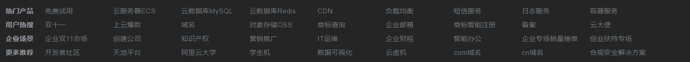

## 学生免费领取一个ECS

1. 进入学生机模块

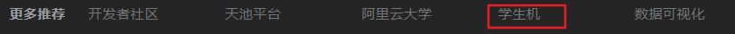

2. 免费领取ECS

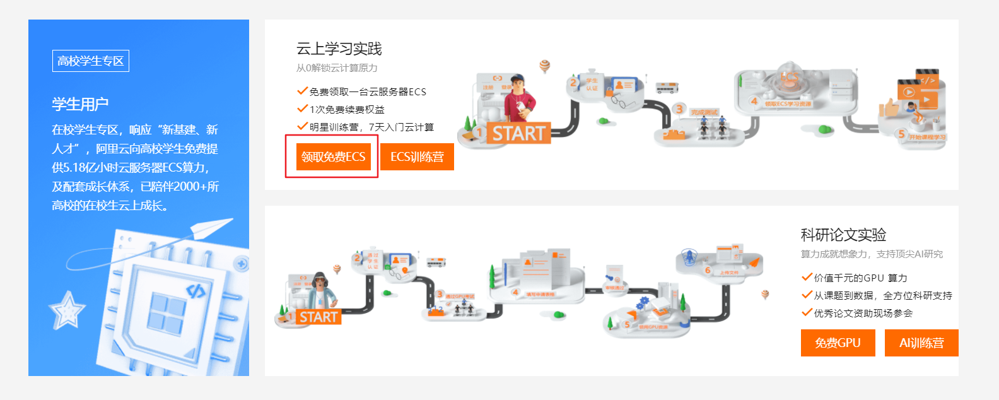

3. 完成测试后领取

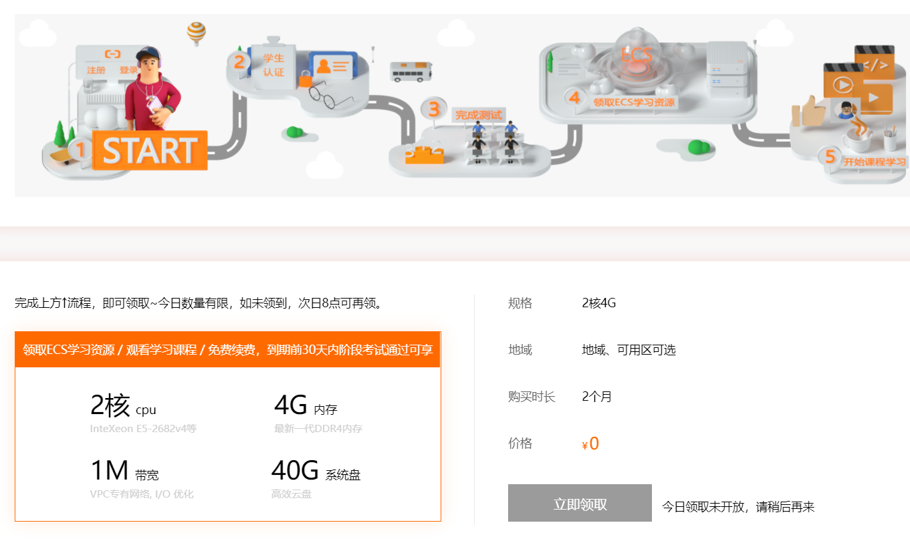


## 优惠活动模块

优惠活动模块网址：[https://www.aliyun.com/minisite/goods?userCode=0phtycgr](https://www.aliyun.com/minisite/goods?userCode=0phtycgr)

免费服务器使用额度耗尽后可以去优惠模块购买。

# XShell

## 下载XShell

1. 进入XShell下载官网：[[XShell官网](https://www.netsarang.com/zh/xshell-download/)](https://www.netsarang.com/zh/xshell-download/)


2. 进入免费授权页面

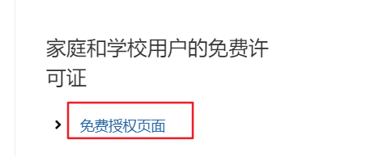

3. 填写个人信息

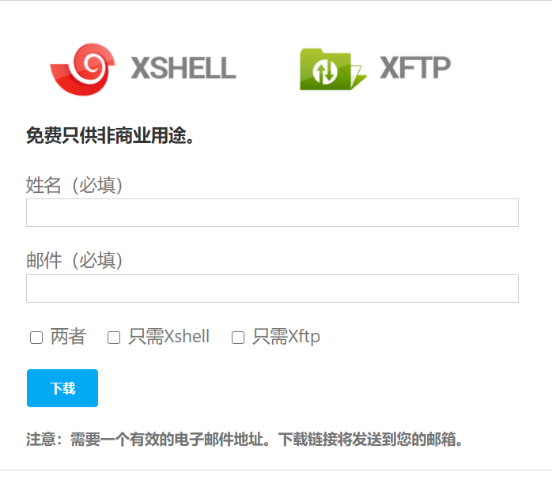

4. 点击邮件中的链接即可下载

注意有两封邮件，一封是安装XShell的，一封是安装XFtp的
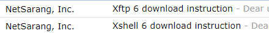

点击邮件中的链接就可以下载相应的程序了
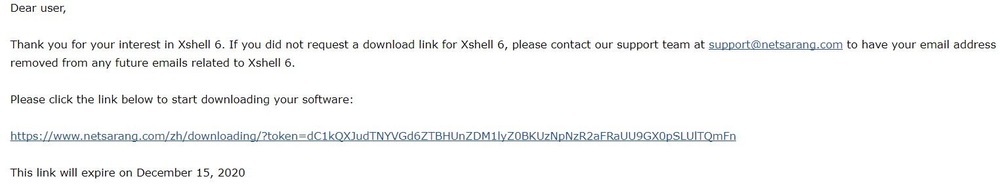

## XShell远程连接远程服务器

1. 打开XShell，新建一个会话

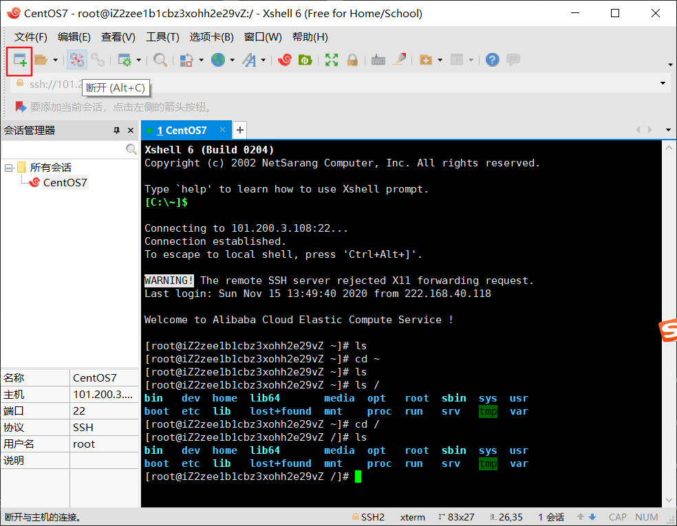

2. 主机号为云服务器的公网IP

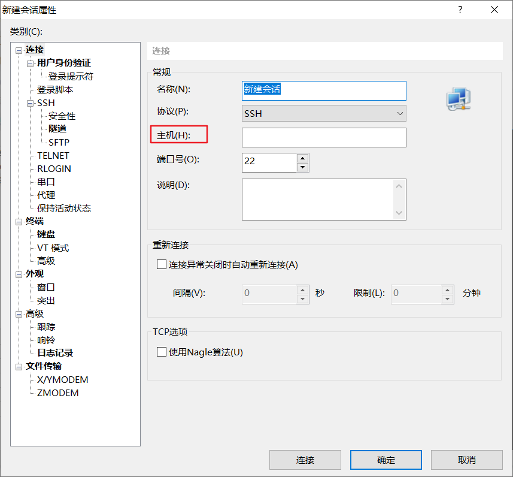

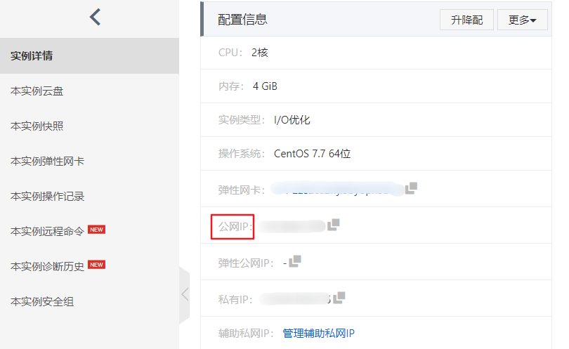

3. 接下来会要求输入用户名和密码。用户名为root，密码在服务器管理端设置

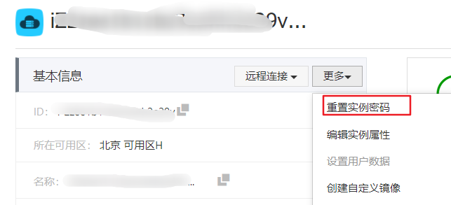


# 安装宝塔面板

1. 宝塔网址：[https://www.bt.cn/](https://www.bt.cn/)


2. 宝塔linux面板安装教程：[https://www.bt.cn/bbs/thread-19376-1-1.html](https://www.bt.cn/bbs/thread-19376-1-1.html)

3. 在按照宝塔前，先将服务器存一份快照

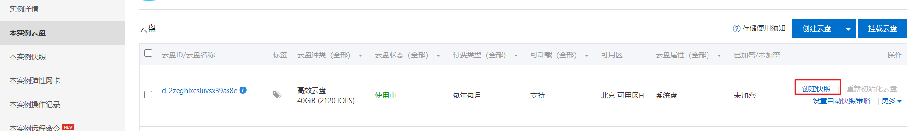

4. CentOS宝塔安装命令

```
yum install -y wget && wget -O install.sh http://download.bt.cn/install/install_6.0.sh && sh install.sh
```

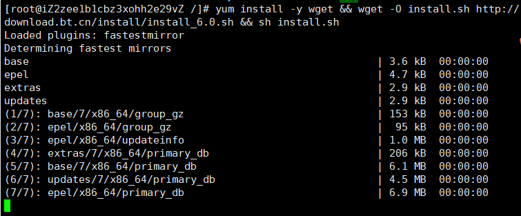


5. 安装成功后可获得宝塔面板的网址

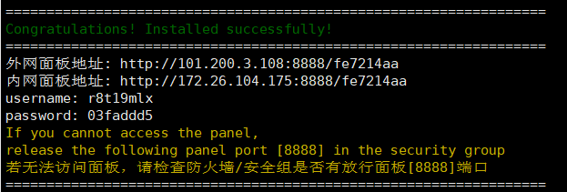

6. 宝塔面板

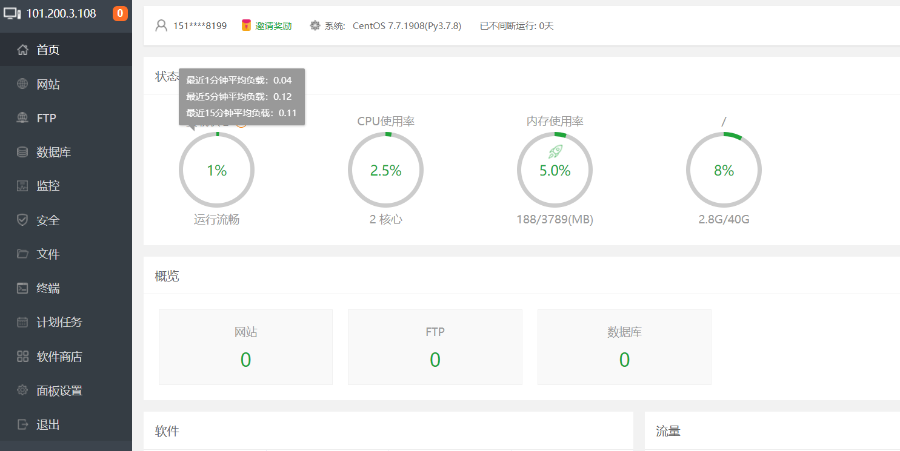

7. （可选）利用宝塔面板的应用商店**傻瓜式**安装环境

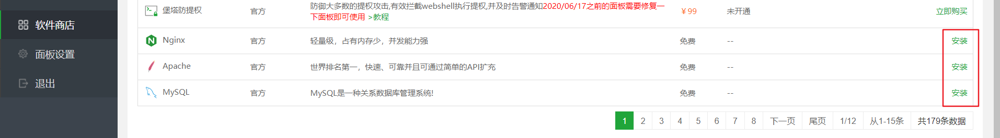


8. （可选）利用宝塔面板的安全配置防火墙过滤端口

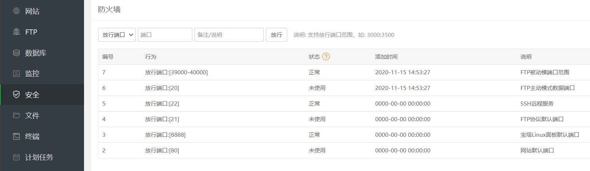

9. （可选）利用Xftp传输文件到远程服务器

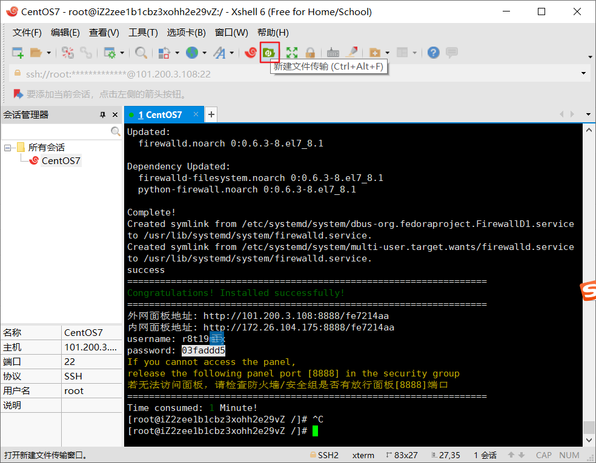

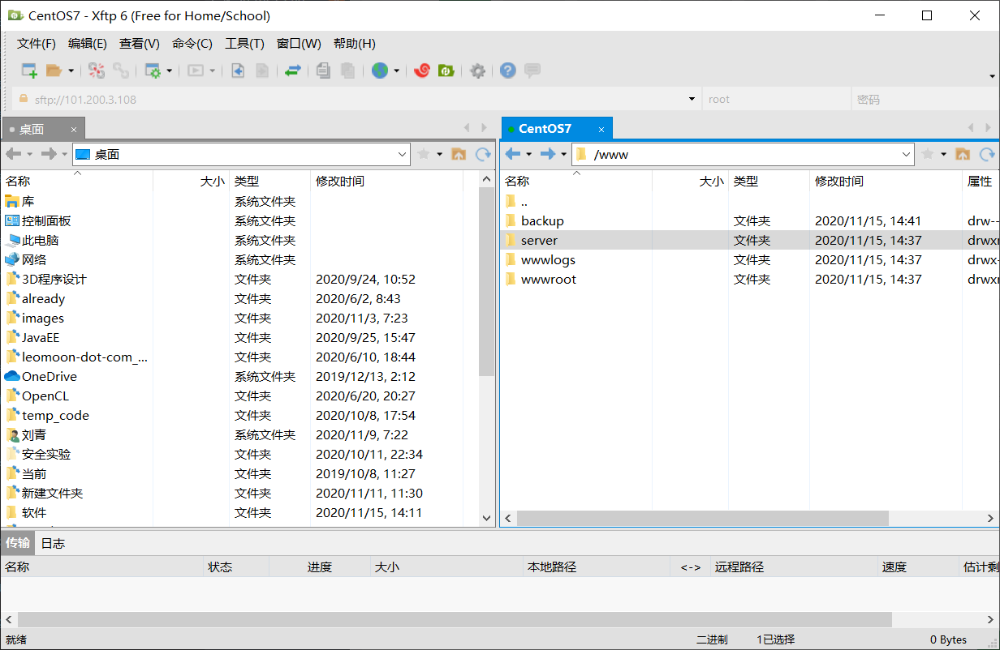


10. （可选）通过面板设置更改宝塔面板的一些设置

我将用户名和密码更改为自己更容易记的密码了。
