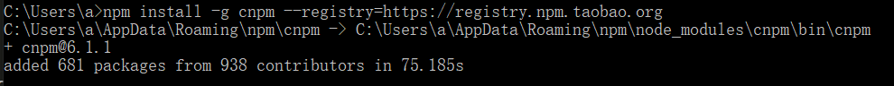
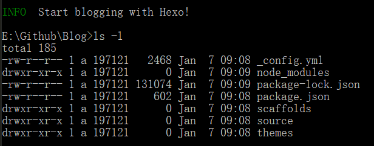
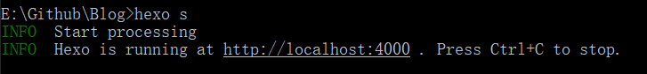
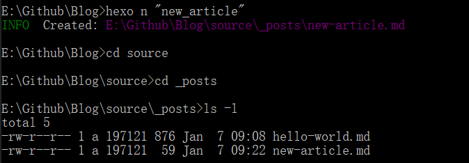
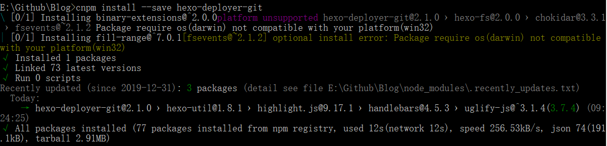
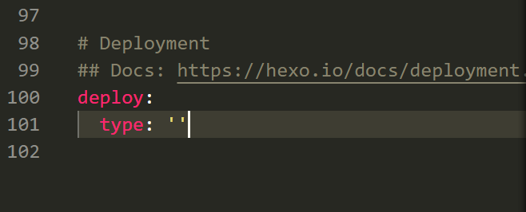
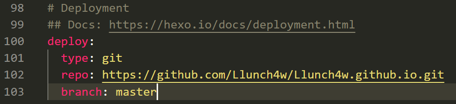
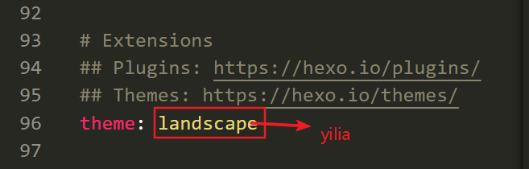
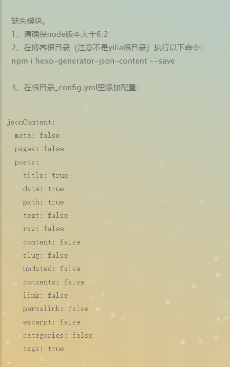
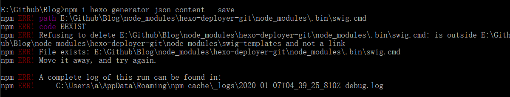

 hexo搭建，从0到1 
<!-- more -->
# 网站搭建
## 安装准备
**1. 安装nodeJS**   
从[nodeJS下载地址](https://nodejs.org/en/)下载安装包并安装  
检查安装是否成功
```
[Win + R]
cmd
node -v
npm -v
```

**2. 安装cnpm**  
```
npm install -g cnpm --registry=https://registry.npm.taobao.org
```
成功后显示


**3. 安装hexo**   
```
cnpm install -g hexo-cli
```
检查是否安装成功:
```
hexo -v
```

## 生成博客框架
**1. 建立项目文件夹**  
在E:\\github中新建Blog文件夹  

**2. 初始化**   
从cmd中进入Blog文件夹
```
cd e:\Github\Blog
```
执行命令
```
hexo init
```
成功后显示


**3. 启动博客**   
```
hexo s
```
成功后显示
   
在浏览器中输入以上网址即可本地访问   

## 操作
### 新建博文
执行命令
```
hexo n "new_article"
// 如果出现乱码问题的话可通过将md文件保存为utf-8格式进行解决
```
在项目文件夹下的source/_posts文件夹可看到这个新建的md文件
  

### 生成博文
回到项目主目录（E:\\github\Blog）下   
**1. 清理**   
```
hexo clean
```
**2. 重新生成**   
```
hexo g
```
**3. 重新启动**   
```
hexo s
```

### 部署博客
> 通过部署博客使得博客可以被公开访问   
> 将博客部署到github上   

**1. 安装插件**   
进入项目主目录   
执行命令
```
cnpm install --save hexo-deployer-git
```
显示如下

**2. 配置_config.yml文件**    
文件底部deploy字段原始值为

将其更改为
  

**2. 部署到远端**   
```
hexo d
```

**3. 远程访问博客**  
浏览器中输入
```
https://llunch4w.github.io
```

## 更换主题
使用的主题--[yilia](https://github.com/litten/hexo-theme-yilia)    
进入项目主目录  

将github上的项目克隆到themes文件夹下
```
git clone https://github.com/litten/hexo-theme-yilia.git themes/yilia
```

修改_config.yml文件
 

清理、生成、推到远端
```
hexo clean
hexo g
hexo d
```

## 遇到的问题

执行第二步时出错


**解决方案**   
```
cnpm i hexo-generator-json-content --save
```

hexo d部署失败时，可先将node_modules删除，再执行npm install命令

