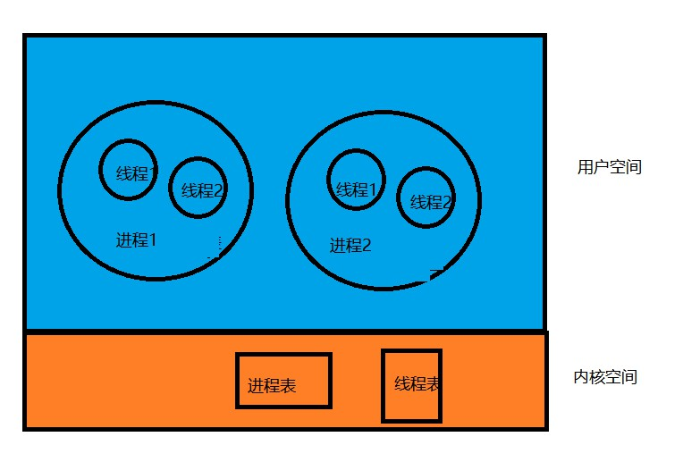

 ^ _ ^ 

<!-- more -->

# 用户线程和内核线程
**用户线程**：
- 用户程序实现，不依赖操作系统核心
- 应用程序提供创建、同步、调度和管理线程的函数来控制用户线程
- 不需要用户态/内核态的切换
- 内核对用户线程无感知，线程阻塞则进程阻塞


**内核线程**：
- 系统内核管理线程，内核保存线程的状态和上下文信息，线程的创建、同步、调度和管理由内核完成
- 线程阻塞不会引起进程阻塞




# Java线程的创建方式
## 1. 继承Thread类
```
public class Demo1 {
    static int i = 0;
    public static class NewThread extends Thread{
        public void run(){
            while(i < 100){
                System.out.println("NewThread:" + i++);
            }
        }
    }

    public static void main(String[] args) {
        new Demo1.NewThread().start();
        while(i < 100){
            System.out.println("main:" + i++);
        }
    }
}
```

## 2. 实现Runnable接口
```
public class Demo2 {
    static int i;
    class NewThread implements Runnable{
        public void run(){
            while(i < 100){
                System.out.println("NewThread：" + i++);
                try {
                    Thread.sleep(1);
                } catch (InterruptedException e) {
                    e.printStackTrace();
                }
            }
        }
    }

    @Test
    public void test(){
        try {
            new Thread(new NewThread()).start();
            while(i < 100){
                System.out.println("Main：" + i++);
                try {
                    Thread.sleep(1);
                } catch (InterruptedException e) {
                    e.printStackTrace();
                }
            }
        } catch (Exception e) {
            e.printStackTrace();
        }
    }
}
```

## 3. 通过ExecutorService和Callable<Class>
> 有时，我们需要在主线程中开启多个线程并发执行一个任务，然后收集各个线程执行返回的结果并将最终结果汇总起来，这时就要用到Callable接口。通过ExecutorService和Callable可以实现有返回值的线程

```
public class Demo3 {
    class MyCallable implements Callable<String>{
        private String name;
        public MyCallable(String name){
            this.name = name;
        }
        @Override
        public String call() throws Exception { // 线程实现逻辑
            return name;
        }
    }
    // 创建一个大小为5的线程池
    ExecutorService pool = Executors.newFixedThreadPool(5);
    // 创建一个有多个返回值的任务列表
    List<Future> list = new ArrayList<>();

    @Test
    public void test(){
        for (int i = 0; i < 5; i++) {
            // 创建一个有返回值的线程实例
            Callable<String> thread = new MyCallable(i + " ");
            // 提交线程，获取Future放入list中
            Future future = pool.submit(thread);
            list.add(future);
        }
        // 关闭线程池，等待线程执行结束
        pool.shutdown();
        // 遍历所有线程执行结果
        for (Future future : list) {
            try {
                System.out.println(future.get().toString());
            } catch (Exception e) {
                e.printStackTrace();
            }
        }
    }
}
```

## 4. 基于线程池
```
public class Demo4 {
    static int index = 0;

    @Test
    public void test(){
        ExecutorService threadPool = Executors.newFixedThreadPool(5);
        for (int i = 0; i < 5; i++) {
            threadPool.execute(new Runnable() {
                @Override
                public void run() {
                    while(index < 100){
                        System.out.println(Thread.currentThread().getName() + ":" + index++);
                    }
                }
            });
        }
    }
}
```

# 线程池的工作原理
**Java线程池的核心组件**
- 线程池管理器：用于创建并管理线程
- 工作线程：线程池中执行特定任务的线程
- 任务接口：用于定义工作线程的执行和调度策略
- 任务队列：存放待处理的任务

**ThreadPoolExecutor**
```
public ThreadPoolExecutor(int corePoolSize,  // 线程池中核心线程的容量
                        int maximumPoolSize, // 线程池容量
                        long keepAliveTime,  // 空闲线程的最长存活时间
                        TimeUit unit,        // 存活时间单位
                        BlockingQueue<Runnable> workQueue) // 任务队列
{
    this(corePoolSize,maxmiumPoolSize,keepAliveTime,unit,workQueue,
        Executors.defaultThreadFactory(),defaultHandler);
    // threadFactory:线程工厂
    // defaultHandler:线程池无法处理任务时的拒绝策略
}
```

**线程池的工作原理**
- 线程池刚被创建时，会向系统申请一个管理线程作为线程池管理器
- 在调用`execute()`函数添加一个任务时，线程执行步骤如下：
  - 线程池中有空闲线程，取出空闲线程对任务进行执行
  - 线程池中正在运行线程数量 < corePoolSize：创建一个核心线程并执行该任务
  - 线程池中正在运行线程数量 >= corePoolSize：任务加入BlockingQueue
  - 阻塞队列已满 && 线程池中正在运行线程数量 < maxmiumPoolSize：创建一个非核心线程并执行该任务
  - 阻塞队列已满 && 线程池中正在运行线程数量 >= maxmiumPoolSize：拒绝执行该任务
- 线程任务执行完成后，任务将从BlockingQueue中移除，线程池管理器中将从任务队列中再取出一个任务进行执行
- 在线程处于空闲状态的时间超过keepAliveTime时间时 && 正在运行的线程数量超过corePoolSize，该线程将会被认定为空闲线程并停止

**线程池的拒绝策略**
- 1. AbortPolicy：抛出异常，阻止线程运行
- 2. CallerRunsPolicy：如果被丢弃的线程任务未关闭，则执行该线程任务
- 3. 移除阻塞队列中最早的一个线程任务，并尝试提交当前任务
- 4. 丢弃当前线程任务不作任何处理

# 常用线程池
## 1. newCachedThreadPool
> 可缓存线程池

```
ExecutorService threadPool = Executors.newCachedThreadPool();
```

**执行策略**
- 处理新任务时，如果当前线程中有可重用线程，则重用它们
- 否则，创建一个新线程并将其添加到线程池中
- 线程池中的空闲线程存活时间超过设置的keepAliveTime后，该线程会被终止并从缓存中移除


## 2. newFixedThreadPool
> 固定大小线程池，用于创建一个固定线程数量的线程池，并将线程资源存放在队列中循环使用

```
ExecutorService threadPool = Executors.newFixedThreadPool(5);
```

## 3. newScheduledThreadPool
> 可定时调度线程池，可以在设定延迟时间后或者定期执行某个线程任务

```
ScheduledExecutorService threadPool = Executors.newScheduledThreadPool();
// 1. 创建一个延迟3s执行的线程
threadPool.schedule(new Runnable(){
    @Override
    public void run(){//...}
},3,TimeUnit.SECONDS);
// 2. 创建一个延迟1s且每3s执行一次的线程
threadPool.schedule(new Runnable(){
    @Override
    public void run(){//...}
},1,3,TimeUnit.SECONDS);
```

## 4. newSingleThreadExecutor
> 线程池会保证永远有且只有一个可用的线程，在该线程停止或发生异常时，newSingleThreadExecutor线程池会启动一个新的线程来代替该线程继续执行任务


## 5. newWorkStealingPool
> 创建持有足够线程的线程池来达到快速运算的目的，在内部通过使用多个队列来减少各个线程调度产生的竞争

