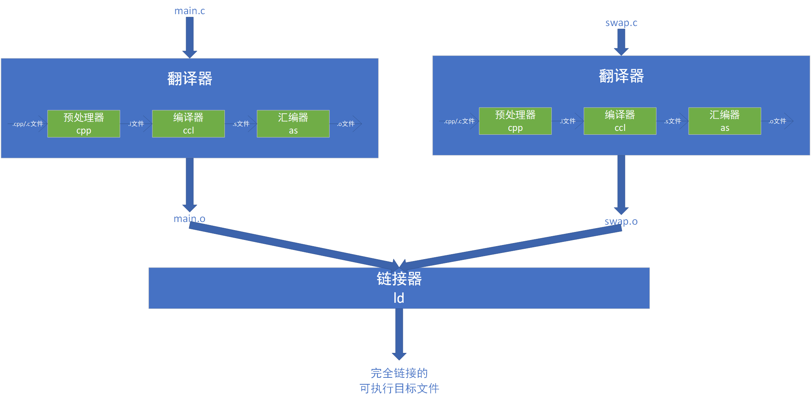
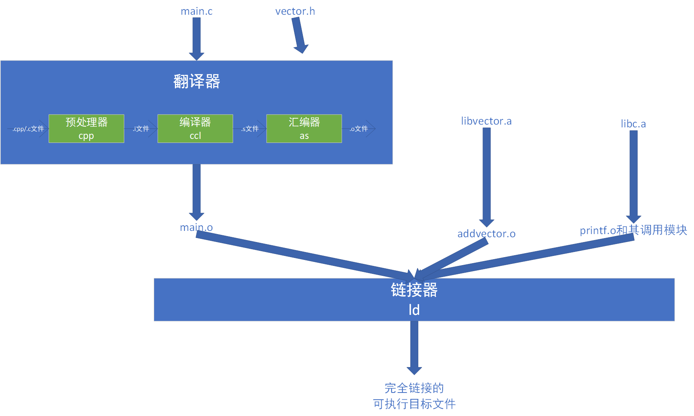
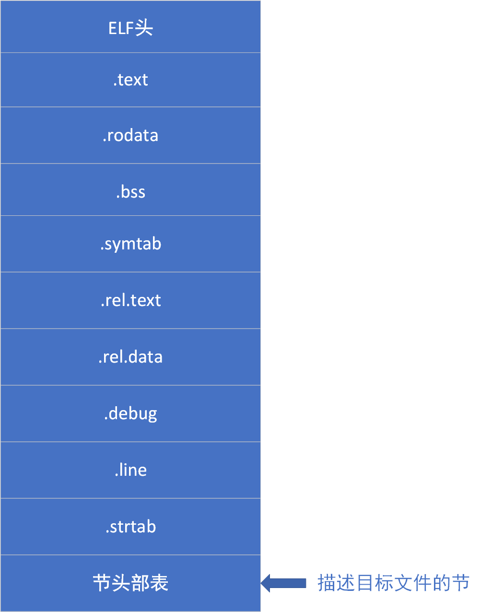

 ^ _ ^ 
<!-- more -->

# 链接简介
## 什么是链接（What）
`链接(linking)`是将各种代码和数据部分收集起来并合并成为一个单一文件的过程，这个文件可被加载（或被拷贝）到存储器并运行。

### 静态链接

`静态链接器`以一组可重定位目标文件和命令行参数作为输入，生成一个完全链接的可以加载和运行的可执行目标文件作为输出。
为了构造可执行文件，链接器必须完成两个主要任务：
- **符号解析**：目标文件定义和引用符号，符号解析的目的是将每个符号引用刚好与一个符号定义联系起来。
- **重定位**：编译器和汇编器生成从地址0开始的代码和数据节，链接器通过把每个符号定义与一个存储器位置联系起来，然后修改所有对这些符号的引用，使得他们指向这个存储器位置，从而重定位这些节。

#### 静态库
所有的编译系统都提供一种机制，将所有相关的目标模块打包成为一个单独的文件，称为`静态库`，它可以用做链接器的输入。当链接器构造一个输出的可执行文件时，它只拷贝静态库里被应用程序引用的目标模块，减少了可执行文件在磁盘和存储器中的大小。

- 在unix系统中，静态库以一种称为`存档`的特殊文件格式放在磁盘中。
- 存档文件是一组连接起来的可重定位目标文件的集合，有一个头部来描述各个成员目标文件的大小和位置。
- 存档文件名由后缀.a标识

#### 链接器使用静态库原理

### 动态链接

## 链接发生于什么时候（When）
1. 编译时，即源代码被翻译成机器代码时
2. 加载时，即程序被加载器加载到存储器并执行时
3. 运行时，运用程序运行时

## 链接由谁执行（Who）
在早期的计算机系统中，链接是手动执行的。在现代系统中，链接是由称为`链接器`的程序自动执行的。

# 链接工作原理
## 前提概念
### 目标文件
目标文件有三种形式：
- 可重定位目标文件：包含二进制代码和数据，其形式可以在编译时与其他可重定位文件合并起来，创建一个可执行目标文件
- 可执行目标文件：包含二进制代码和数据，其形式可以被执行拷贝到存储器并执行
- 共享目标文件：一种特殊类型的可重定位目标文件，可以在加载或者运行时被动态地加载到存储器并链接

编译器和汇编器生成可重定位目标文件（包括共享目标文件），链接器生成可执行目标文件。

### 可重定位目标文件
**典型的ELF可重定位目标文件格式**

- **ELF头**
  - 以一个16字节的序列开始，该序列描述了生成该文件的系统的字大小和字节顺序（大端/小端）
  - 剩下部分包含帮助链接器语法分析和解释目标文件的信息，如：ELF头大小、目标文件的类型（可重定位/可执行/可共享）、机器类型（如x86-64）、节头部表的文件偏移、节头部表中的条目大小和数量
- **节头部表**
  - 夹在ELF头和节头部表之间的都是节
  - 不同节的位置和大小都是由节头部表描述的，其中目标文件中每个节都有一个固定大小的条目
- **.text**：已编译程序的机器代码
- **.rodata**：只读数据
- **.data**：已初始化的全局C变量（局部C变量在运行时保存在栈中，既不出现在.data节中，也不存在于.bss节中）
- **.bss**：未初始化的全局C变量。在目标文件中这节不占据实际的空间，它仅仅是一个占位符。
- **.systab**：一个符号表，它存放在程序中定义和引用的函数和全局变量的信息。
- **.rel.text**：一个.text节中位置的列表，当链接器把这个目标文件和其他文件结合时，需要修改这些位置。一般而言，任何调用外部函数或者引用全局变量的指令都需要修改。
- **.rel.data**：被模块引用或定义的任何全局变量的重定位信息。一般而言，任何已初始化的全局变量，如果它的初始值是一个全局变量地址或者外部定义函数的地址，都需要被修改。
- **.debug**：一个调试符号表，其条目是程序中定义的局部变量和类型定义，程序中定义和引用的全局变量，以及原始的C源程序。只有以-g选项调用编译驱动程序时才会得到这张表。
- **.line**：原始C源程序的行号和.text节中机器指令之间的映射。只有以-g选项调用编译驱动程序时才会得到这张表。
- **.strtab**：一个字符串表，其内容包括.symtab和.debug节中的符号表，以及节头部中的节名字。字符串表就是以null结尾的字符串序列。

### 符号和符号表
